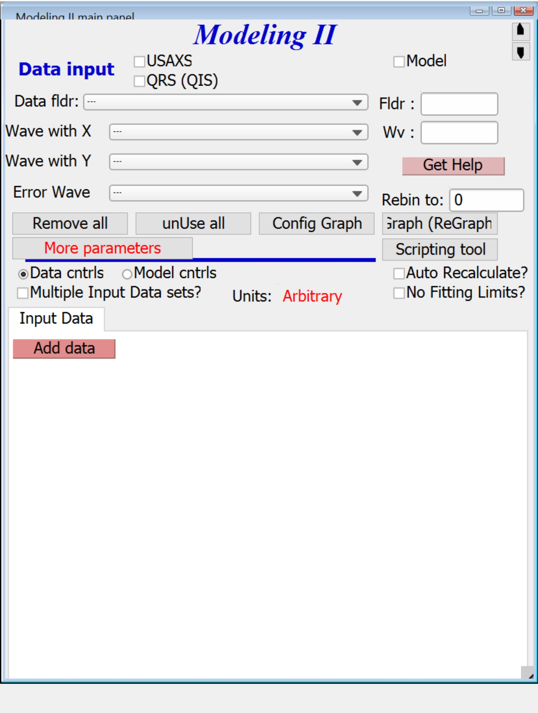
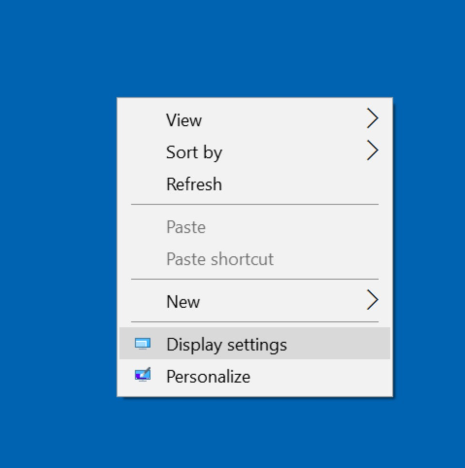
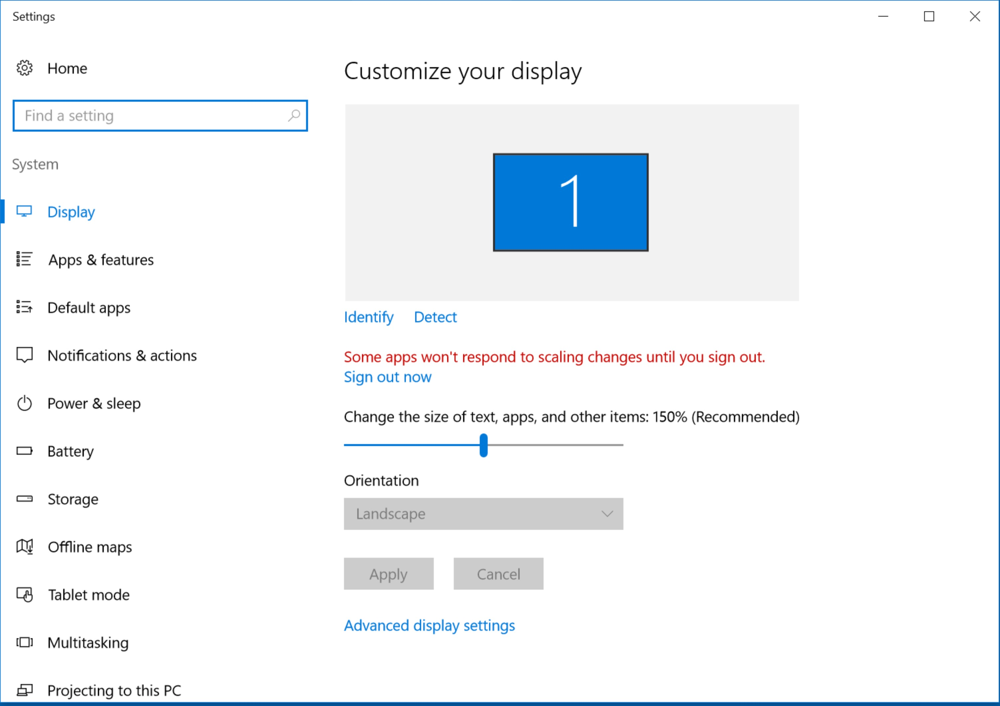
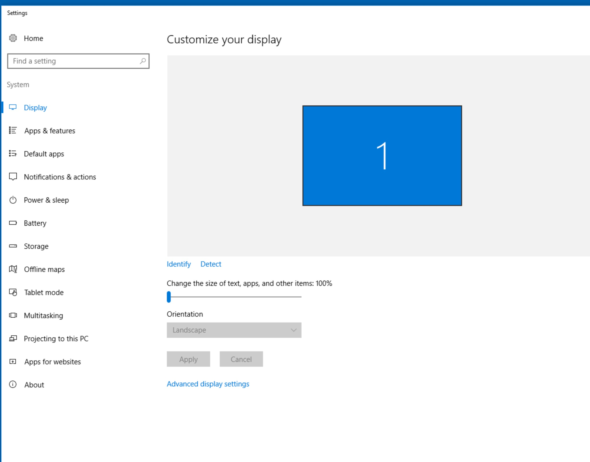
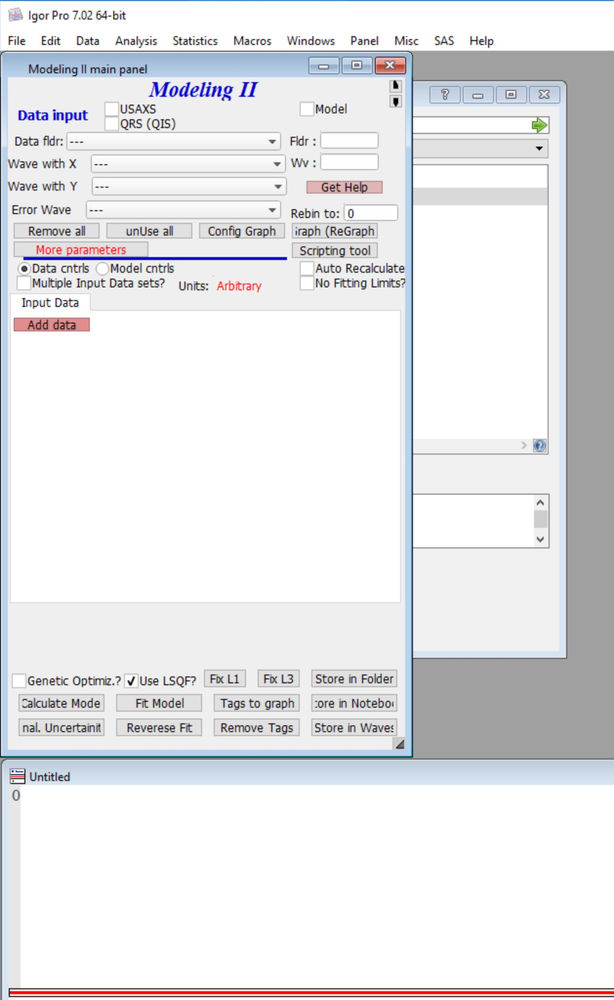
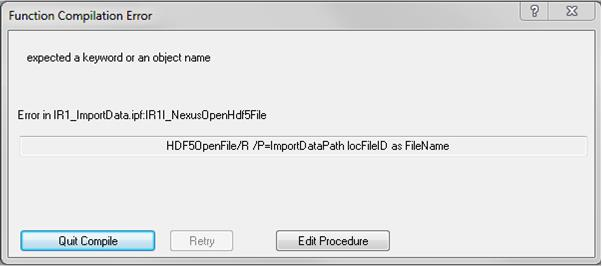

.. _commonIssues:
.. _GUIcontrolsMissing:

.. index::
    Common Display issues
    Missing controls on Panels
    Panel artifacts

Common Issues
=============

Screen Resolution
-----------------

Summary: For best performance select 100% DPI setting ("Change the size of text, apps, and other items" in Windows 10) with less pixels used for display. Ideal Irena/Nika display seems to be HD TV resolution (1920 x 1080) or similar. Vertically, Irena and Nika need up to ~830 pixels for some panels.

**Explanation**:

When using Windows 7, 8, or 10, typically with high resolution displays (aka 4k, UHD, etc.), users often choose to set display number of pixels to high number but since the text and icons become small to read, they increase DPI - or as Windows 10 names it "Change the size of text, apps, and other items". This tells applications to scale up (if more than 100%) the windows so they can still be readable even with large pixel displays. Igor Pro 7 (at least 7.03 and below) does not handle this well enough - it seems that it can only scale panels up by full 100% steps (100%, 200%, 300%,...).

This means, that under some combination of **display resolution** (number of pixels) *and* **DPI settings** user can have the bottoms of the panels cut off and controls  which should be there are missing. Unluckily, even after working with Weavemetrics on this the only solution I know about is to modify display settings. Note, that future (as of 4/28/2017) versions of Irena and Nika will present users with error when they estimate that screen settings are incorrect.

Here is example of panel which is **missing bottom controls** due to incorrect settings.

Here is how to get to the controls. Right click on the desktop (of the OS, not Igor Pro).

Here is what you should see (again, Windows 10; Windows 7 and 8 are slightly different and call the setting *DPI*). Note the slider is moved to higher than 100% setting.

Here is modified setting which is 100% now:

And here is the same Igor panel with this setting, note the opresence of the **bottom controls**:

You may need to change now the display pixel resolution (numbers of pixels setting) to less pixels so you can actually read the text. Or get larger display.

Note, that it should be possible to use higher DPI settings with enough pixels on the screen. Above example was done with HD TV display setting (1920x1080 pixels). My display is 15 inch UHD (aka 4k) display, capable of displaying up to 3840 x 2160 pixels. But at that resolution it is basically humanly impossible to read anything. It is likely that I could use 4k setting AND 200% DPI setting, but I have seen some artifacts. Instead of raising the DPI to 200% I chose less pixels (HD resolutions) and 100% DPI. This has similar/same result with respect to size of text and icons, but Igor Pro works...

.. _HDF5xopError:

.. index::
    HDF5 error
    Missing xop error
    HDF5OpenFile error

Error caused by missing HDF5 xop
--------------------------------

This error appears when Installer does not make proper link to Igor Pro included HDF5.xop or for some other reason this library is not loaded properly on Igor start. You will see something similar to:

Important here is that you see error on line containing HDF5Open... HDF5Close... etc. This is due to missing link/alias to the xop library or the library not being properly loaded. To learn more about Igor Extensions, run d in Igor command prompt: *DisplayHelpTopic "Igor Extensions"*

Here is how you fix this problem:

1.  If you just installed Irena/Nika/Indra, you need to **quit** Igor Pro and start it again; only creating New Experiment is not enough. These xop packages are loaded when Igor starts. So this HDF5.xop may not be loaded.

2. If that does not work, you need to manually create shortcuts (Windows) or alias (OSX) between following files and locations. Note: Use aliases (shortcuts, links) and do not simply copy the files, with aliases, if you upgrade Igor to new version in the future, HDF5 library will be upgraded also.  During Igor upgrade the alias/Link target will be upgraded by Igor installer. Note, *HDF5.xop* is 32 bit version of the executable package, *HDF5-64.xop* is 64 bit version of executable package, and *HDF5 Help.ihf* is help file.

3. (A) 32 bit versions of Igor Pro (Igor 6.37):

*  Applications(OSX) or Program Files(win)/Igor Pro 6 Folder/More Extensions/File Loaders/*HDF5.xop*    ---  alias/link to --- Documents/Wavemetrics/Igor Pro 6 User Files/Igor Extensions/ *place alias here...*

*  Applications(OSX) or Program Files(win)/Igor Pro 6 Folder/More Extensions/File Loaders/*HDF5 Help.ihf*    ---  alias/link to --- Documents/Wavemetrics/Igor Pro 6 User Files/Igor Extensions/ *place alias here...*

   (B) 64 bit version of Igor Pro (7.x or in the future 8.x)

*  Applications(OSX) or Program Files(win)/Igor Pro 7(or 8) Folder/More Extensions (64-bit)/File Loaders/*HDF5-64.xop*    ---  alias/link to --- Documents/Wavemetrics/Igor Pro 7(or 8) User Files/Igor Extensions (64-bit)/ *place alias here...*

*  Applications(OSX) or Program Files(win)/Igor Pro 7(or 8) Folder/More Extensions/File Loaders/*HDF5 Help.ihf*    ---  alias/link to --- Documents/Wavemetrics/Igor Pro 7(or 8) User Files/Igor Extensions/ *place alias here...*

Quit Igor Pro, restart and it should work now correctly.
