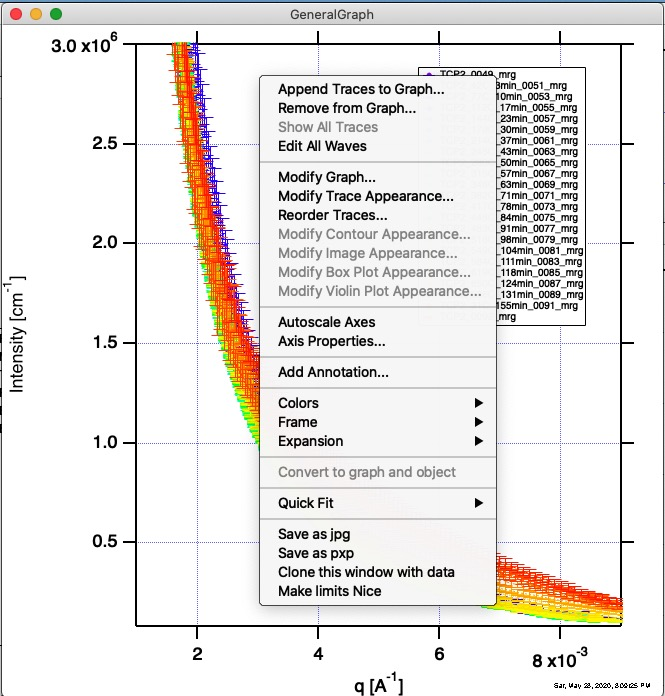
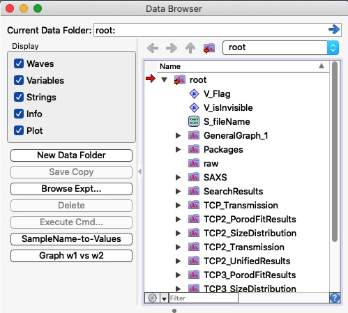
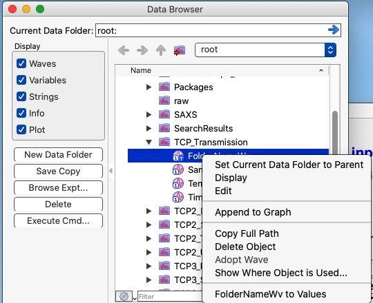
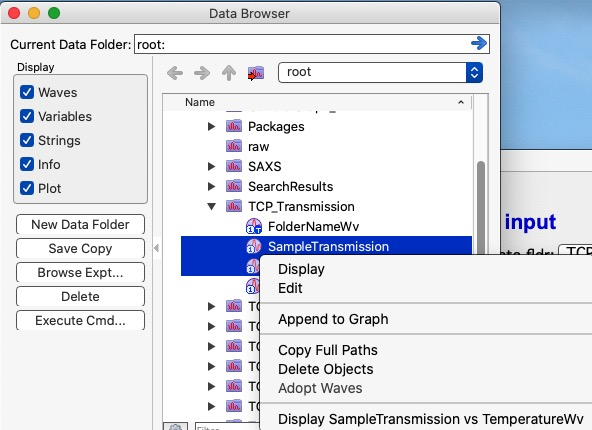

.. _igorModifications:

Igor Modifications
==================

In order to help users with production of graphs Irena & Nika adds some tools to Igor Pro. These modifications are available when either Irena or Nika are loaded.

.. index::
    Graph right click menu addition

Graph right click menu addition
-------------------------------

Irena & Nika adds few more options into right click menu on any graph. These are mostly suitable for saving current graph for future use.

The last three options in the right click menu in the figure are added by Irena & Nika code.

**Save as jpg** will open Save as dialog, user can select location and input name for jpg file which will be saved. This is medium resolution image file which is suitable for placing in documents. More options are available for users using Igor Pro "Save graphics" option, which is available in File menu when Graph is the top window. If you need to save image of this Graph in any other resolution or in other format (like tiff) you can use this "Save graphics" command.

**Save as pxp** will save current graph as Igor experiment (pxp) file. Code will open Save as Dialog, user can select location and input name for Igor packed (pxp) experiment file. This is equivalent to calling "Save graph copy..." from File menu when Graph is top window. This Igor function saves Igor experiment which contains all data needed to create the graph and the graph itself. The advantage of storing this version of the graph is, that if needed, user can open the pxp experiment and modify, how the graph looks like later. It is more useful than jpg (or other) image of the graph in long run.

**Clone this window with data** will duplicate the graph and make copy of data displayed in this graph. Duplicate graph is Igor function available in "Edit menu", "Duplicate graph" (ctrl/cmd D). This command creates exact copy (with new name) of the top graph. My code does more - it first duplicates the graph and then creates copies of all data in a new folder located in root folder. It then redirects the new graph copy to use these copies of the data. This is especially useful, when user wants to have a copy of graph which relies on temporary data, like most of "work" graphs of Irena. This will work for 1D graphs only (not image graphs) and may fail under some conditions.

**Make limits Nice** This will scale graph to closest "nice" limits - round to nearest (min down and max up) number with 1 significant digit. Axis with range of 0.0123 - 1892 will get scaled to 0.01 to 2000. For now this is set same for both log and linear axes. If this needs to be changed, provide feedback how. 

------

.. index::
    DataBrowser additions

DataBrowser additions
---------------------

Irena & Nika adds few more options to Igor DataBrowser. On Igor 8 these are added as additional buttons while on Igor 9 these are right click options. Igor 8 cannot add right click option to DataBrowser. Their function is the same.

**SampleName-to-Values** This is very specific function which can be applied to text wave. When users are using data names to save some important processing information - temperature, time, concentration etc, they would typically write names such as "Sample1_50C_102min_10pct". One can see, that this is lots of stuff packed into name string - Sample1 is sample name, 50C is temperature, 102min is some time and 10pct is 10% of something. Now, Irena tools like :ref:`Metadata Browser <MetadataBrowser>` or :ref:`Basic Fits+Simple Analysis <basic_fits>` will save results in a new folder located in root folder. If user cannot extract useful parameters during the processing by one of these two tools, they need to somehow get to it. The two tools listed above create text wave "DataFolder" automatically as means to identify, where any number came from. Plotting numbers against text wave is possible, but not very helpful. Using "SampleName-to-Values" function will process this "DataFolder" text wave. If it can identify any information in there, it will create numerical wave containing that identified information. As results, after using this function user may have waves called TemperatureWave, OrderWave, TimeWave, etc.
To use: Select text wave (likely called "DataFolder") in DataBrowser. Note: this tool requires user to select ONLY one TEXT wave. If more or less, or any other type are selected, tool will do nothing. This code will overwrite any existing waves of those standard names (TemperatureWave, OrderWave, TimeWave) which may already exist. For each line in DataFolder text wave these new waves have either number of a given parameter (if found) or will have nan (if not found). Therefore, these new waves have same number of points as any results stored in this folder and FolderName wave. These can now be used to plot results against temperature, concentration, time, etc.

**Graph w1 vs w2** This function will check, if two numerical waves are selected in Data Browser (exactly TWO and they must be numerical type!) and plots wave1 against wave2. Order is given by order displayed in DataBrowser. To swap the order (and plot wave2 agains wave1), hold down ctrl/cmd key while clicking on the button (or selecting the right click option in Igor 9).

Additional functions may be eventually added, if needed.

------
