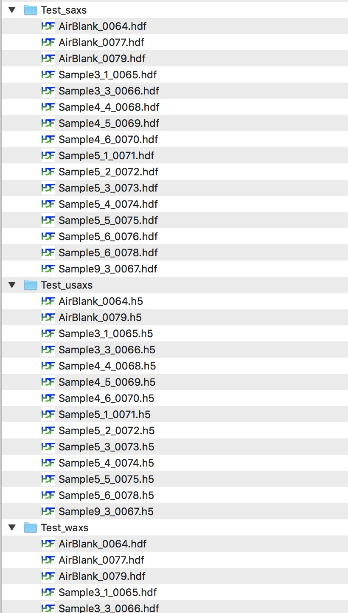

.. _reduce_data_panel:

.. index::
    Reduce USAXS data, Introduction

Reduce Flyscan data
===================

This chapter describes how to reduce USAXS data collected using "Flyscanning". This is the most common method of data colelction for the USAXS instrument and if you were NOT told you used step scanning method, you probably used Flyscanning.

*If you collected data using step scanning, see separate chapter.*

**Comments:**

When using Indra package to reduced data, it uses "USAXS" naming system for use with Irena macros. When you use Irena to analyze, plot, or even only export data, you need to select "USAXS" choice in the top of the panels.

**Make sure you save Igor experiment**
Igor is quite reliable and crashes rarely. But no software is crash proof and you really do not want to loose lot of your work and time. Therefore, do yourself a favor and save your Igor experiment, routinely.
**YOU WERE WARNED!!!!**

.. index::
    USAXS data arrangement

Data arrangement
----------------

When you collect data on USAXS instrument, your data are saved in folders related to yoru "spec" file name. Spec file is where instrument makes various records. The file name is created by adding MM_DD_ (month_day_) to the name wstaff provides, typically to user name. When you collect USAXS data, a folder with the same name with appended "_usaxs" is created. For SAXS data we create folder with the same name with "_saxs" and for  WAXS with "_waxs". See below in the figrue:

After you reduce data from USAXS instrument, you will have in your Igor experiment data arragend in data folders also - in this case you will have USAXS data in root\:USAXS\:Samplename.
To see inside of the current Igor experiment, use DataBrowser (ctrl-B or cmd-B).

.. index::
    USAXS data panel

Data reduction panel
--------------------

Select "Load USAXS macros" from "Macros" menu. This will create "USAXS" menu and also open "Read me" notebook. Note, that it will take some time to compile the code, depending on the speed of yoru computer. Select "Import and reduced USAXS data" from the "USAXS menu".

.. Figure:: media/DataReduction1.jpg
        :align: left
        :width: 800px
        :Figwidth: 820px

Explanation of control available here:

“\ *Select data path”* browse to the folder on the computer drive where the data to be imported reside.

“\ *Data path”* this shows the path selected above. Cannot be edited in this window, use button *Select data path*.

“\ *Data extension”* this is extension of Nexus file USAXS instrument wrote. Should be h5 unless something changed.

“\ *Match name (string)”* allow you to downselect (mask) which file names are displayed in the listbox below.

“\ *Select all”* and “\ *Deselect all”* allow you to quckily select or deselect all files in the list box. If you need to select only few files, hold down shift or cntrl as you are clicking on them.

“\ *List of available files”* lists all files in the current folder on the computer, unless masked by *Match name (string)* and possibly by *Data extension*. One or more files here can be selected for import. Use shift - click to select multiple files (on Windows) or cmd – click on Macs (to pick one file at time), shift-click to pick range of files. Double click on file runs "Test" and "Preview" commands on that file.

*"Match name"* enables to use string to select subset of files.

“\ *Data extension”* if extension is put in this filed (e.g., “dat”) only files with the “dat” extension will be shown in the *List of available files*.

*“Skip lines”* if there are known number of lines, which need to be skipped. Note, Igor will automatically read file structure and skip usually any text header, which needs to be skipped. Therefore this “skip lines” should not be usually necessary.

*“Test”* Test import of first selected file. Not really necessary, but very useful. Sets checkboxes for Column 1 to 6, how many columns were found in the file, etc.

*Red text indicating too many data points* - lot of data from SAXS instruments contains very high number of data points which are really useless for SAXS data analysis. Actually, they are bad, as they force code to fit too many noisy points. This warning comes when too many points are found. See below the controls for reduction of data points.

*“Preview”* Opens the first selected file in Igor notebook for preview. Kill notebook after use, it is not needed for anything else…

*“column 1 – 6”* and *Qvec Int err*\ ” This is checkbox area, in which user needs to select which column of data contains which SAS data. Assumption is, that SAS data are in the first 6 columns in the ASCII file. These checkboxes appear when “\ *Found columns”* number gets set. User can set it or it gets set during “\ *test*\ ”.

”\ *Select all”* or “\ *Deselect all”* modifies which files are selected in “\ *List of available files”*.

*“Qvec units”* select proper checkbox. Units will be converted to A\ :sup:`-1` if nm\ :sup:`-1` data are imported. Irena uses A\ :sup:`-1`.

“\ *Create errors”* if the data imported do not contain error bars, this will generate sqrt(Intensity) error bars. These can be further modified (multiplied) in Data manipulation tool.

“\ *Use file name as folder name”* **Strongly suggested to use**. Will cause the import tool to create for each imported data set new folder with name by the file name.

“\ *Use USAXS names”,* ”\ *Use qrs wave names”, "Use QIS (NIST) wv nms"* selects which naming structure is used during import of data. One of these selections is more or less necessary for multiple file import.

*"Auto overwrite"* Overwrites existing folders in same named data are imported second time.

**Following modifications of data are done in this order, if selected…**

*(Q units conversion to A)*

*“Scale imported data?”* if the data need to be scaled by some calibration factor… New input variable appears, if necessary.

*“Slit Smear imported data?”* if the data need to be slit smeared… New input variable appears, if necessary. This is useful when pinhole data need to be smeared for use with USAXS/USANS data. Use Slit length in Q units [A\ :sup:`-1`]. Even if you have data in nm\ :sup:`-1` since the conversion to A is done first. NOTE: if you provide dq data (q-resolution) these will be for slit smeared data convoluted with the SlitLength. If you do not provide these data, new dQ wave will be created with Slit length assigned to each point as resolution.

*"Remove Int<=0"* removes any negative (or equal 0) intensities during import.

*"Trim data"* opens two new input variables and enables to trim Q range of data being imported. 0 means no trimming in that "direction". Otherwise, input Qmin or Qmax as needed.

*"Reduce data points"* reduces number of points by averaging on log-scale. Suggested for data with large number of points at high Q (if more than 250 points is found, warning appears below "test" and "Preview" buttons. Note, this step creates new Q resolution wave - even though currently Irena is not using Q resolution data for anything.

*"Truncate start/end of long names"* - allows users to choose how to truncate long names (current limit is 26 characters which user can use). Important if the "important" part of the name is at the end...

*"Remove Str From Name ="* - allows users to remove part of the sample name to get the useful information into the limit of 26 characters which user can use. Important if the "important" part of the name is at the end...

Note: from version 2.51 I have added another row of checkboxes to include in the wave note of the Intensity Units. In the future this will be used by other Irena code:

*"Calibration Arbitrary"* *"Calibration cm2/cm3"* *"Calibration cm2/g"* - Irena always assumed standard cm2/cm3 calibration of the intensity data and then provided results on absolute scale. By selecting correct calibration method the tools (as of 2.53 Modeling II and Plotting tool I) will be aware of calibration string and provide proper units to output data. Of course, even if data are on absolute scale if you do not provide correct contrasts for analysis, results cannot be on absolute scale and Irena has no way of knowing it.

Single file import can be done by manually filling the following controls.

“\ *Select data folder”* and “\ *New data folder”* Using pull-down menu in *Select data folder* user can select existing data folder where to put the imported data. Using *New data folder* user can create folder in Igor for the data. Note, that “<filename>” will be replaced with the file name of the imported data file during import. This allows for creating data structure which uses folders during multiple file import.

“\ *Intensity wv name”*, “\ *Q wave name”*, and “\ *Error wave name”* – these can be filled with the names for data waves. Note, that “<filename>” will be replaced with the file name of the imported data file during import.

“\ ***Import”*** imports the selected data.

NOTE: If the data contain header of data (typically number of lines with special character, such as #, $, ... at the start of the line and some spaces before useful information, Irena ASCII importer will attach these notes into the wave note. It will, however, first remove all special characters and spaces from the beginning of each line. The code will search each line for first character, which is letter or number and then accept the rest of the line. It will remove any line-feed and/or carriage returns at the end of each line. It will separate lines in the wave note by using ";" character.

Some of the controls (checkboxes) do change some of the setting in other controls. Generally the proper order, how to select and modify control is from top to bottom.

.. index::
    Import data; ASCII WAXS or other

Importing ASCII WAXS data
--------------------------

.. image:: media/ImportData3.png
        :align: center
        :width: 380px

This tool is intended for other type of data, such as powder diffraction, which have x-axis, Intensity, Uncertainty and, optionally, x-resolution in ASCII file. Options here are bit more limited to only those, which seemed important for this purpose.

This was added for users of non-SAS data who had problems using the original ASCII imported since it was doing things not appropriate for heir data.

.. index::
    Import data; canSAS Nexus
