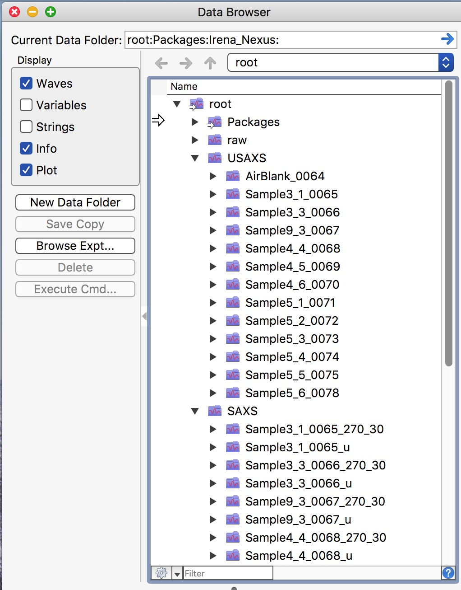

.. _merge_data_procedure:
.. _merge_data_panel:

.. index::
    Merge USAXS/SAXS/WAXS data
.. index::
    USAXS/SAXS/WAXS data merge

Merge USAXS/SAXS/WAXS data
--------------------------

When you reduce USAXS/SAXS/WAXS data, your data are saved in Igor folders related to your sample name.  USAXS data in root\:USAXS\:Samplename and SAXS data are in  root\:SAXS\:Samplename_u (or Samplename_270_30). To see inside of the current Igor experiment, use DataBrowser (ctrl-B or cmd-B). See below in the figure:

Next we need to merge USAXS and SAXS data together. We will use Irena package tool "Merge two datasets" :ref:`Merge two datasets <data_merge>`.

.. index::
    USAXS-SAXS data merge

Data Merging panel
==================

If needed, load Irena package by selecting "Load Irena SAS macros" from "Macros" menu. Select "Data Manipulation" from "SAS" menu, and from that submenu select "Merge two data sets".

.. Figure:: media/DataMerge2.jpg
        :align: left
        :width: 500px
        :Figwidth: 820px

This will load large panel:

.. Figure:: media/DataMerge3.jpg
        :align: left
        :width: 800px
        :Figwidth: 820px

To merge desmeared USAXS data with SAXS data, select as in the figure above. USAXS checkbox, DSM checkbox. Make sure you select root\:USAXS in the pull down menu. For second data set select QRS checkbox and root\:SAXS in the pul down menu. Note, that is you select DSM data for Data set 1, code should insert "_270" in the Data set 2 matchbox.

If you want to merge slit smeared data, set as below:

.. Figure:: media/DataMerge4.jpg
        :align: left
        :width: 400px
        :Figwidth: 820px

Note, that when you select "SMR colim?" checkbox for slit smeared data, the code will insert "_u" in the match field for second data set.

Now we need to test settings for various controls for merging. Make sure the "Test mode" at the top above the right graph is set, other controls we will now set as needed:

.. Figure:: media/DataMerge5.jpg
        :align: left
        :width: 600px
        :Figwidth: 820px

Double click on left column data set, pick some representative data set. This will add the data set into the graph in red color. Double click on same data set SAXS data in right column, this will add that data set in the black color in graph, plotted against right axis.

.. Figure:: media/DataMerge6.jpg
        :align: left
        :width: 800px
        :Figwidth: 820px

First we need to select proper overlap region. Note the "Merge method" selection at the top of the window. Optimize Overlap is the best method, suitable when data scatter strongly enough in both SAXS and USAXS instruments and should be used if possible. If necessary, use more advanced methods (read about them in :ref:`Merge two datasets <data_merge>` or talk with beamline staff). We will use this basic method here. Select overlap using the round cursor (on black data set) and square cursor on red data set. Note, that data at Q values lower than position of round cursor are truncated from black data and data at Q values higher than square cursor are truncated from red data. There must be sufficient overlap region - or use the other merge methods.

Next we need to pick which parameters will be optimized. Practically always we need to subtract *Data 1 background* and we need to get *Data 2 scaling* as selected by the two checkboxes on left top in the window. Sometimes we may need to also optimize the *Data 2 Q shift*.

To test the merge procedure, push button "Process data". You get Data overlayed with blue curve which is the merged data. If needed, move cursors around until data look OK.

.. Figure:: media/DataMerge7.jpg
        :align: left
        :width: 800px
        :Figwidth: 820px

Now you have few options. You can simply push button "Save data" (there are two, both are orange to show, that data were not saved). Or you can check checkbox "Merge mode" and Process data either individually (double click on a data set from left column, right column and data will be processed and optionally saved automatically) or Process data sequentially, when you select range of files in each column and code will merge them sequentially. Code selects first from left column and merges with first in right column, seconds with second etc. Note, they do not have to lineup on the same lines. You can make non continuous selection in each column. More in :ref:`Data Merge tool  <data_merge>` tool manual in Irena manual.

.. Figure:: media/DataMerge8.jpg
        :align: left
        :width: 800px
        :Figwidth: 820px

In the above picture I have merged Selected files together automatically by selecting them, setting top controls as you see above and pushing button "Process and save data".
