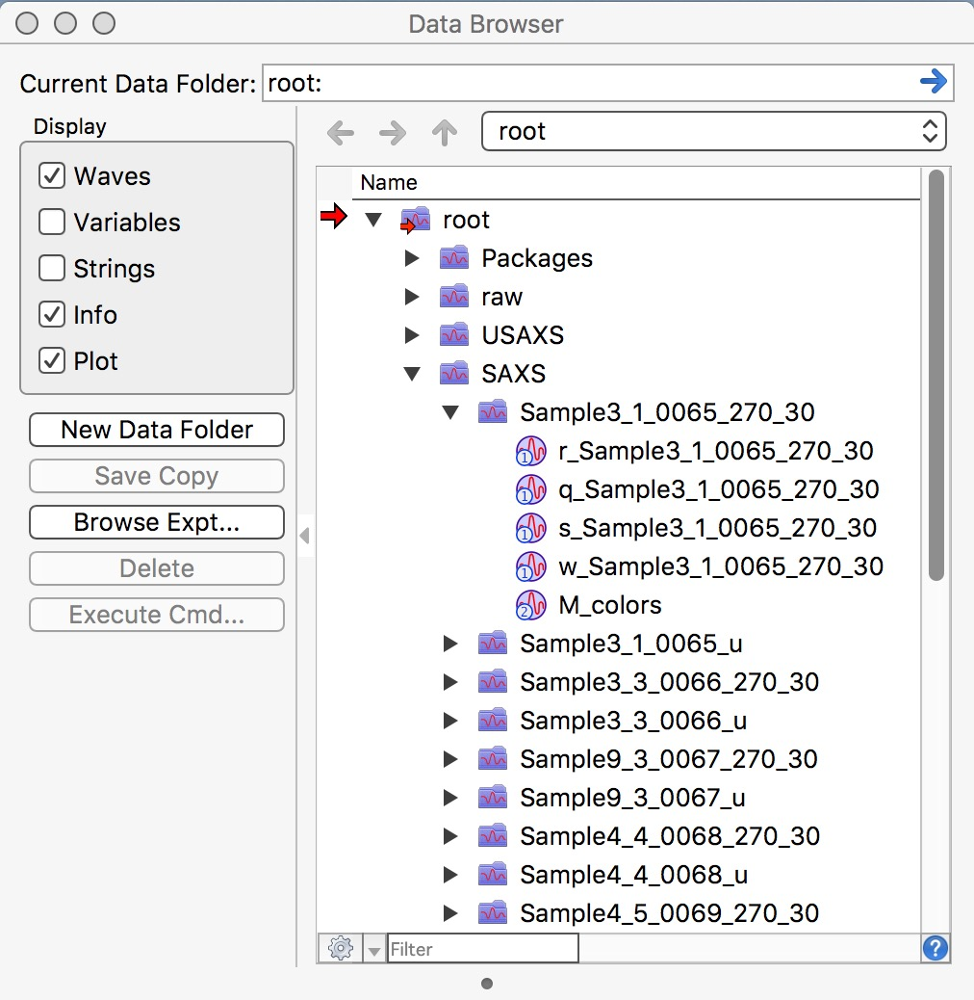

.. _reduce_SAXS_data_procedure:
.. _reduce_SAXS_data_panel:

.. index::
    Reduce SAXS data
.. index::
    SAXS data reduction

Reduce SAXS data
----------------

*Please note, that first step of data SAXS data reduction should be to reduce USAXS data. The presence of USAXS data provides needed information, such as slit length of the instrument. Your life will be much easier if you reduce USAXS data first.*

Collected data arrangement
==========================

When you collect data on 9IDC USAXS/SAXS/WAXS instrument, your data are saved in folders related to your "spec" file name. Spec file is where instrument makes various records. The file name is created by adding MM_DD_ (month_day_) to the name staff provides, typically to user name. When you collect USAXS data, a folder with the same name with appended "_usaxs" is created. For SAXS data we create folder with the same name with "_saxs" and for  WAXS with "_waxs". See below in the figure:

.. image:: media/USAXSComputerDataArrangement.jpg
        :align: center
        :width: 480px

Reduced SAXS data arrangement
=============================

After you reduce SAXS data, you will have in your Igor experiment data arranged in data folders also - in this case you will have SAXS data in root\:SAXS\:Samplename. These data use "QRS" naming :ref:`system <important.QRS>`.
To see inside of the current Igor experiment, use DataBrowser (ctrl-B or cmd-B).

**Please note, that in this picture you see for each sample data processed twice. Folders with data ending _270_30 are pinhole data and need to be merged later with Desmeared USAXS data. Data in folders ending _u are slit smeared SAXS data which are intended for merging with slit smeared USAXS data.**

.. index::
    SAXS data reduction, Configuration

SAXS data reduction
===================

Data reduction for this instrument is done using  :ref:`Nika package <Introduction_Nika>`. You need to have Nika package :ref:`installed <Installation>`.
Select "Load Nika 2D SAS macros" from "Macros" menu, or preferably, load "USAXS, Irena and Nika" which will load all there packages. This will create "SAS2D" menu. Note, that it will take some time to compile the code, depending on the speed of your computer. Select from "Instrument Configurations" menu in SAS2D first item : "9IDC or 15IDD USAXS-SAXS-WAXS". This will create panel which can be used to configure Nika package to use on our instrument.

.. Figure:: media/SAXSReductionConfig.jpg
        :align: left
        :width: 500px
        :Figwidth: 820px

Select (or keep selected) checkbox "SAXS" and follow the instructions in the red letters. Keep other checkboxes selected as they are by default, more info later... First step is to push button "Set default settings". This will create dialog where you need to navigate to location of your SAXS data (see above about the data arrangement) and you need to select *any* data file from your samples, assuming there was no change in geometry for the data in that folder (distances, energy, etc.). So select a file (see below) and click Open

.. Figure:: media/SAXSSelectNXDataFile.jpg
        :align: left
        :width: 500px
        :Figwidth: 820px

Nika will open selected file and read from this file all calibration values we have included in each of the files. Few more things will happen at the same time:

1.  All parameters will be read and inserted in proper Nika fields.
2.  Nika will scan for existing USAXS data and if it finds the data (it will pick random USAXS folder) it will look if there are desmeared data (DSM_Int etc.) or slit smeared data (SMR_Int). If there are desmeared data, it will switch off Slit smearing (uncheck the checkbox on the panel). If it find only slit smeared data, it will check this checkbox to generate appropriate (slit smeared) SAXS data. In any case, if it finds any USAXS data, it will insert proper slit length in the proper field.
3.  Nika will open the selected image and display it.
4.  Nika will set proper selection of checkboxes for calibration and insert proper names of lookup functions, which find/calculate for each sample thickness, transmission, and normalization values. Nika will create default Mask. 
5.  **IMPORTANT** - by default Nika is set to produce 120 Q bins, log-q spaced (reduction from about 500 points which it would have with max q resolution). This is correct for small-angle scattering where it reduces noise at high-q, but incorrect if you have diffraction peaks in this Q range and need to have high resolution. If that is the case, select "Max num points?" checkbox.
6.  Nika will display for user the tab, where user needs to find the correct "Blank" - aka: "Empty" - for the samples user wants to reduce.

Next step is to select the proper Blank - if needed, right click in the panel and select "Match Blank" or whatever else needed. Either double click on the file or select the file and click "Load Empty".

.. Figure:: media/SAXSBlankSelection.jpg
        :align: left
        :width: 500px
        :Figwidth: 820px

Blank file will be loaded and displayed. Please note, that user needs to select proper Blank/empty file for each range of samples. So do not forget to change it if necessary.

.. Figure:: media/SAXSSampleBlankLoaded.jpg
        :align: left
        :width: 700px
        :Figwidth: 820px

Here is example of Sample and Blank loaded and displayed side-by-side.

Next is simply - select sample or samples which should be processed and click on button "Process images". Nika will process all selected files. In the demo I have processed USAXS data with desmearing and Nika is therefore processing my SAXS data in pinhole collimation only. These will result in folders with names ending _270_30. Data with folders named with _u at the end are slit smeared.

.. Figure:: media/SAXSProcessedDataImg.jpg
        :align: left
        :width: 700px
        :Figwidth: 820px

OK, next step is to reduce WAXS data (if collected) and - or - merge USAXS and SAXS data together. See other chapters how to :ref:`switch configuration <switch_nika_configurations>` and :ref:`reduce WAXS <reduce_WAXS_data_procedure>`.
