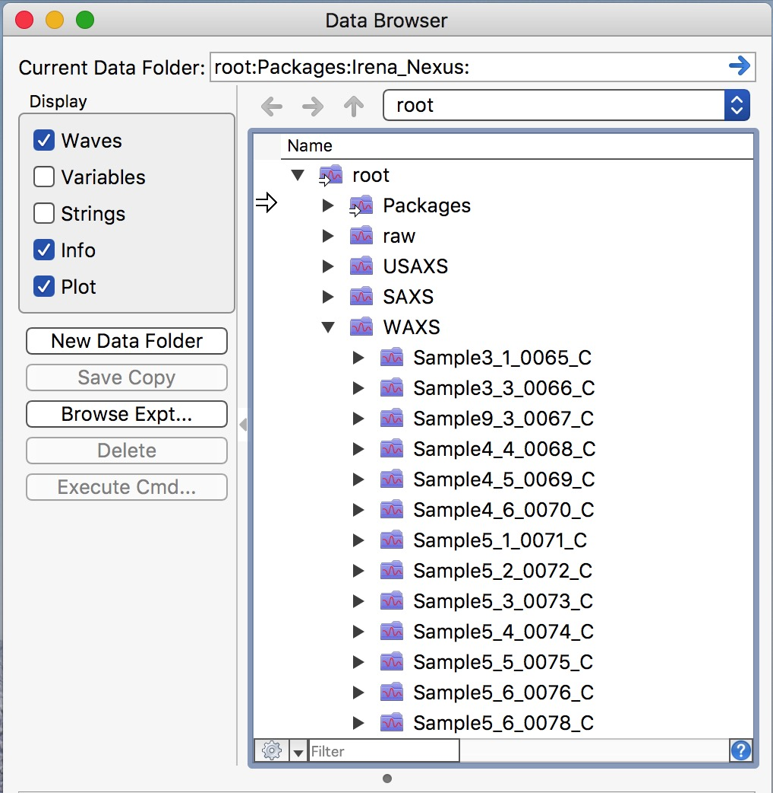

.. _reduce_WAXS_data_procedure:
.. _reduce_WAXS_data_panel:

.. index::
    Reduce WAXS data
.. index::
    WAXS data reduction

Reduce WAXS data procedure
==========================

When you collect data on USAXS instrument, your data are saved in folders related to your "spec" file name. Spec file is where instrument makes various records. The file name is created by adding MM_DD_ (month_day_) to the name staff provides, typically to user name. When you collect USAXS data, a folder with the same name with appended "_usaxs" is created. For SAXS data we create folder with the same name with "_saxs" and for  WAXS with "_waxs". See below in the figure:

.. image:: media/USAXSComputerDataArrangement.jpg
        :align: center
        :width: 480px

After you reduce data from USAXS instrument, you will have in your Igor experiment data arranged in data folders also - in this case you will have USAXS data in root\:WAXS\:Samplename.
To see inside of the current Igor experiment, use DataBrowser (ctrl-B or cmd-B).

.. image:: media/USAXSComputerDataArrangement.jpg
        :align: center
        :width: 480px

Reduced WAXS data arrangement
=============================

After you reduce WAXS data, you will have in your Igor experiment data arranged in data folders also - in this case you will have SAXS data in root\:WAXS\:Samplename. These data use "QRS" naming :ref:`system <important.QRS>`.
To see inside of the current Igor experiment, use DataBrowser (ctrl-B or cmd-B).

**Folders with data ending _C are pinhole data reduced with highest possible q resolution as necessary for WAXS.**

.. index::
    WAXS data reduction panel

WAXS data reduction
===================

Data reduction for this instrument is done using  :ref:`Nika package <Introduction_Nika>`. You need to have Nika package :ref:`installed <Installation>`.
Select "Load Nika 2D SAS macros" from "Macros" menu, or preferably, load "USAXS, Irena and Nika" which will load all there packages. This will create "SAS2D" menu. Note, that it will take some time to compile the code, depending on the speed of your computer. Select from "Instrument Configurations" menu in SAS2D first item : "9IDC or 15IDD USAXS-SAXS-WAXS". This will create panel which can be used to configure Nika package to use on our instrument.

.. Figure:: media/WAXSReductionConfig.jpg
        :align: left
        :width: 500px
        :Figwidth: 820px

Select (or keep selected) checkbox "WAXS" and follow the instructions in the red letters. Keep other checkboxes selected as they are by default, more info later... First step is to push button "Set default settings". This will create dialog where you need to navigate to location of your WAXS data (see above about the data arrangement) and you need to select *any* data file from your samples, assuming there was no change in geometry for the data in that folder (distances, energy, etc.). So select a file (see below) and click Open.

.. Figure:: media/WAXSSelectNXDataFile.jpg
        :align: left
        :width: 500px
        :Figwidth: 820px

Nika will open selected file and read from this file all calibration values we have included in each of the files. Few more things will happen at the same time:

1.  All parameters will be read and inserted in proper Nika fields.
2.  Nika will open the selected image and display it.
3.  Nika will set proper selection of checkboxes for calibration and insert proper names of lookup functions, which find/calculate for each sample thickness, transmission, and normalization values. Nika will create default Mask.
4.  **IMPORTANT** - by default Nika is set to use Q for x-axis. This is useful if you want to merge USAXS+SAXS+WAXS data together. If you want, you can use two-theta or d spacing for x-axis. Note, that for Diffraction tool in Irena this is not important (it converts any x-axis to two-theta) and for export to GSAS-II compatible file also (it also converts to two-theta).
5.  Nika will display for user the tab, where user needs to find the correct "Blank" - aka: "Empty" - for the samples user wants to reduce.

Next step is to select the proper Blank - if needed, right click in the panel and select "Match Blank" or whatever else needed. Either double click on the file or select the file and click "Load Empty".

.. Figure:: media/WAXSBlankSelection.jpg
        :align: left
        :width: 500px
        :Figwidth: 820px

Blank file will be loaded and displayed. Please note, that user needs to select proper Blank/empty file for each range of samples. So do not forget to change it if necessary.

.. Figure:: media/WAXSSampleBlankLoaded.jpg
        :align: left
        :width: 700px
        :Figwidth: 820px

Here is example of Sample and Blank loaded and displayed side-by-side.

Next is simply - select sample or samples which should be processed and click on button "Process images". Nika will process all selected files. .

.. Figure:: media/WAXSProcessedDataImg.jpg
        :align: left
        :width: 700px
        :Figwidth: 820px
