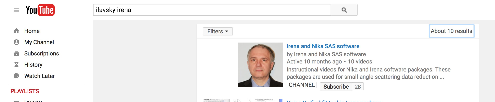
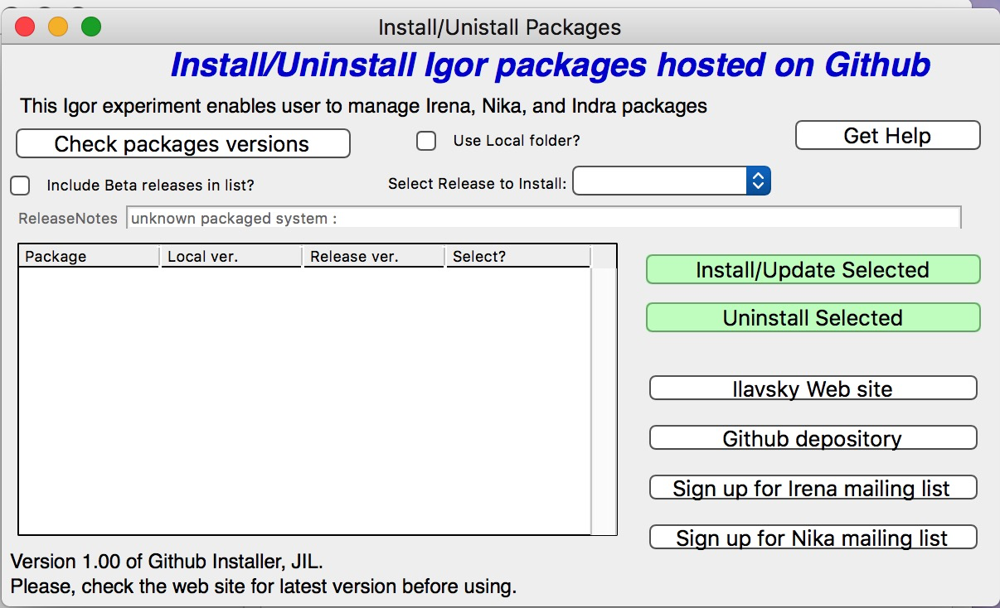
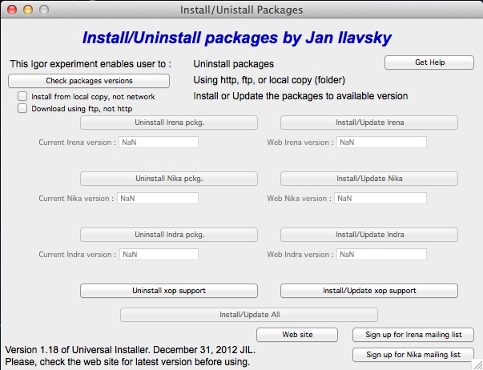

Installation
============

Availability of the code
------------------------

For long time my packages were available from APS web site, *Irena* from: http://usaxs.xray.aps.anl.gov/staff/ilavsky/irena.html

For long time my packages were available from APS web site, *Nika* from: http://usaxs.xray.aps.anl.gov/staff/ilavsky/nika.html

While this site is and will be available, future versions of the code will be available from Github:

https://github.com/jilavsky/SAXS_IgorCode

Github depository will also be used for installations for Igor Pro 7 and higher. Igor 6 cannot install from GitHub due to inability to download files using https which Github requires today.

Download latest GithubInstaller_IrenaNika_vX.YY.pxp package from :

http://usaxs.xray.aps.anl.gov/staff/ilavsky/irena.html

or

http://usaxs.xray.aps.anl.gov/staff/ilavsky/nika.html

Alternative download site is Github :

https://github.com/jilavsky/SAXS_IgorInstaller/tree/master/Igor_GitHub.

To test and use my code you can use demo version of Igor Pro - Igor pro will run on compuyter where it was not installed before for one month as full featured demo. To use this, find computer which did not have yet Igor Pro installed, install the latest version of Igor Pro 7 from https://www.wavemetrics.com, and you are set.

Youtube channel for Irena and Nika
----------------------------------

.. _YouTubeChannel:

I have Youtube channel for instructional movies. Search for example “Ilavsky Irena” on Youtube and you will see something like this:

The totally weird link to the channel is here:

https://www.youtube.com/channel/UCDTzjGr3mAbRi3O4DJG7xHA

This channel contains instructional movies how to install the package and how to use different tools. Please, watch it if you need help. It may help you

Courses
-------

Over the last few years I have had many courses at the APS and around the world either at institutions or at conferences. These, typically two-day courses, teach how to use Irena. Some news about these courses should be available on:

http://small-angle.aps.anl.gov

http://small-angle.aps.anl.gov/courses/Irena_Nika_courses_report.html

Instructions for installation
-----------------------------

To install the macros, please install first Igor Pro, version 7.x. *Irena* version 2.62 is the last one which works with Igor Pro 6 latest release (6.37) and is available for the aps web site. Any higher releases require  Igor 7, which was released July 2016.

Movies with instructions and explanation are available on my :ref:`YouTube channel <YouTubeChannel>`.

There are two main ways to install the macros:

**Igor 7 (32 or 64 bit versions)**

Download latest version of GitHub installer “GHInstaller\_IrenaNika\_vXYZ.pxp”, latest version should be available here: http://usaxs.xray.aps.anl.gov/staff/ilavsky/irena.html

Open the file (in Igor 7) and select “Install Packages” > “Open GitHub GUI”. GUI (left) and Instructions open.

Push “Check packages versions” to check which versions are available on the GitHub site. Read instructions for what to do and how to pick the right one. This installer enables users to install also defined beta versions and even the current “master” version. But be careful, there are no guarantees that the master is fully debugged. I may be working on it.

Here is explation of options:
  #. Release version. One or more release versions may be availabel in the listing of releases. Pick latest unless you for some reason need prior release. Release version should work and be tested.
  #. If you check "Include beta releases" you can pick from declared beta releases. If necessary, I may declare a release beta to distribute updated versions to smaller group of people. This relase should work but there may be changes modification which need testing.
  #. If you check "Include beta releases" you can also pick master - "master" is a current latest update committed to depository. My intention is to commit only code which works, but, well, it may be untested or being developed. Check wiki on Github page https://github.com/jilavsky/SAXS_IgorCode/wiki for release notes. It may give you an idea what has been changed.

Keep in mind that you need xop support for the bit versions (32bit or 64bit) versions of Igor you are using! Do not forget to install them.

**Igor 6.37 32bit version.**

Download the “Universal installer 1.32.pxp” (or the latest version) file from my APS web site. Optionally, if you have firewall issues or just want to have easier life, download ALSO the whole distribution of my packages as one zip file. Then use this Igor experiment and install using the buttons provided. Note, that if you have local copy (unzip the downloaded (large) zip file, then select “Use local copy” checkbox. Instructions are in the file itself. It usually works just fine, but sometimes ftp communication is either bad due to network issues or even prevented due to firewall, so then local copy is your only choice. Install the xop support!

**The hard way, when the other methods fail... Zip files.**

Get zip file for Irena package AND xops, appropriate for your platform from either APS (Igor 6.37) web site or GitHub (Igor 7.x). Place the files in the zip file, following the folders in the appropriate places in the Igor Pro Folder in User area. This location is easiest found by using in Igor Pro in help menu the item "Show Igor Pro User Files". Note that some of the files belong to Igor Procedures and some in User procedures, keep folder structure as is in the zip file, please...

**NOTE: If you had prior installation (before 6.10 version of Igor) : Update Igor Pro (free from any 6.xx version) to latest version and check for presence of obsolete version :**

Locate Igor Pro Files (again: Help menu in Igor, Show Igor Files) and remove any files related to Irena, Nika, and Indra from Igor Procedures and from User Procedures. This should be done automatically by the installers, but may not be possible if you are running, as lower privilege user installers may not be able to do this.

To load macros, **select “Load Irena SAS macros” from “Macros” menu** after starting Igor Pro. Whichever method you choose, the macros should work the same.

Please, learn more about full capabilities of the Igor Pro. It is very powerful graphing and data evaluation package. It may be necessary for you to handle data import and handling, data export and some graphing. Further, the macros heavily rely on the data folder structure, so it is important to learn enough to realize the use of this feature…

Please read these comments
--------------------------

Few suggestions first:

1. Learn enough Igor, that Igor problems do not prevent you from getting   results. Igor tour and 1-2 hours playing with it should be sufficient

2. Read this manual full or in pieces and test what is shown on your own   computer

3. Use folder structure, or things will become way too messy for these tools to be useful

4. Read supporting literature (especially papers about Unified fit, Reflectivity and other methods) if you want to use these methods.

**Comment on pausing work with the macros:**

At any time user can end working with the macros by closing associated graphs and panels. There is also command which closes all open windows and panels of this package.
