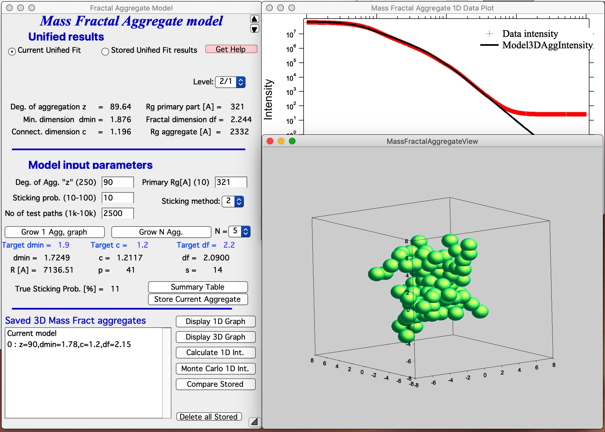
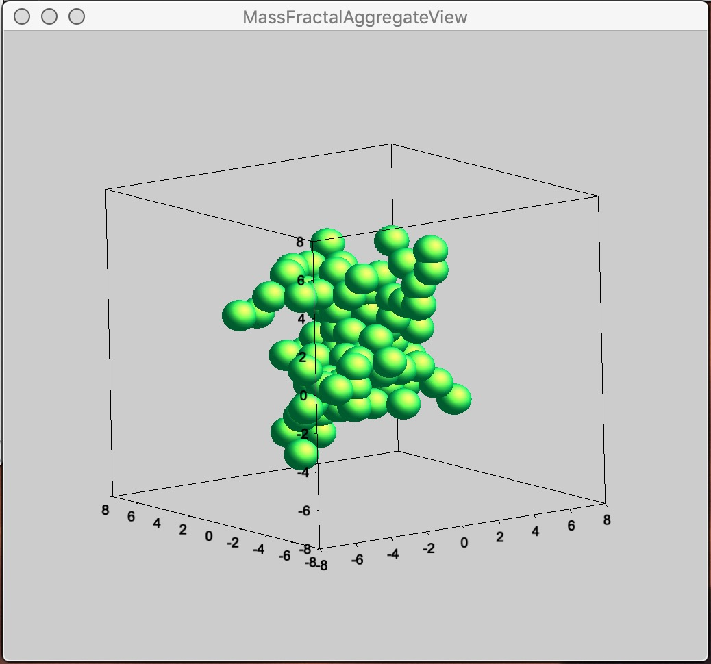

.. _MassFractalAggregateModel:

.. index::
   Mass Fractal Aggregate

Mass Fractal Aggregate model
============================

**This tool generates 3D model RANDOM representation (voxelgram) of Mass fractal aggregate. For details on the science behind it see paper : A. Mulderig et.al., Quantification of Branching in fumed silica, J. of Aerosol Science 109 (2017) 28-37,**   http://dx.doi.org/10.1016/j.jaerosci.2017.04.001

This tool is applicable **ONLY to mass fractals** It is critical users understand its limitations and the meaning (and reliability of) mass fractal aggregate parameters as used in the tool. These are listed below.

This is "visualization tool" - it is NOT fitting of data. Data are first fitted by Unified fit and, *assuming users have mass fractal*, fractal parameters describing the Mass Fractal system they have are calculated. Users then can use this tool to *RANDOMLY* generate a mass fractal aggregate. That is user generates using Monte Carlo method each time one of *MANY* possible shapes of this mass fractal. If the mass fractal shape has same or similar fractal parameters  properties it is assumed that it looks like what is inside the sample. So, this is NOT fitting, it is random shape generation and user need to vary *model growth parameters* until model with suitably similar mass fractal parameters is grown. Once proper growth parameters are found, user can grow number of representative shapes.

*Keep in mind, that this is really random process and same growth parameters will result in wide ranging models. One needs to run many times and see, how the results vary. Store results which are close to your target data, you may never recreate them.*

*Some parts of the code generate randomly errors or failures. I will be trying to find a solution fo those which are errors, some are simply results of random growth. In any case, solution is to run model again. There are some specific conditions which seem to fail all the time. Select different parameters.*

TODO: I plan to add some kind of scripting tool to enable easier model generation. This is monkey work. 

.. _MassFractalAggregateModel.Parameters:

Mass Fractal model parameters
-----------------------------

Following manuscript: http://dx.doi.org/10.1016/j.jaerosci.2017.04.001

Mass Fractal aggregate has following parameters:

* R - aggregate size
* d\ :sub:`f` - Mass fractal dimension of the aggregate
* p - short circuit path length
* s - connective path length
* d\ :sub:`min` - minimum dimension of the aggregate
* c - connectivity dimension of the aggregate
* s - connective path length of the aggregate

Each of these terms can be inter-related with each other by:

.. math::

    R=\frac{R_g}{d_p}=z^{1/d_f}=p^{1/d_{min}}=s^{1/c}

Where:

* Rg is the Radius of gyration of the second (Large) level - represents the size of the mass fractal aggregate.
* d\ :sub:`p` is Sauter mean diameter of a sphere of similar surface to volume ratio as the scattering primary particle (first, smaller level).

The value z which is one of the inputs of the 3D aggregate model, d\ :sub:`min`, and c are calculated by Unified fit tool in "Analyze results". The value of d\ :sub:`f` is power law slope of the second (larger) level when Mass fractal is represented by two Unified levels.

\*\*\*\*\*\*

Here is example of data provided by one of the authors of the method and associated Unified fit with two levels. This is mass fractal system, there we have primary particle size (approx. 320A Rg), mass fractal with dimension of ~2.23 and large Rg of about 2332 A.

.. image:: media/3DAggregate0.jpg
   :align: center
   :width: 420px

Now, when we have the Unified fit results above, we can either run directly the *Mass Fractal Aggregate* tool, or first save the results of Unified fit in a folder where the data came from (*Store in Data Folder*). Important is, that we have needed numbers which will guide our modeling. Here is the main panel::

*Let me describe the content of this panel:*
In the top part are options to use results from Unified fit using modified version of :ref:`standard data selection tools <DataSelection>` . This is simply lookup tool, user can as well pick the needed numbers from *Analyze Results* in *Unified fit*. Data can be selected from Stored Unified Fit results or - as in the picture above - from current Unified fit working directory, using whatever values are in the current Unified Fit tool. This is result of the last Unified fit fit or manual change...   By default we assume, that levels 2/1 represent the Mass Fractal, but it can be changed by using the popup "Level" as needed. NOTE: The values are updated after user selects or reselects the Level choices, so if the numbers are stale, just reselect that popup display and values will be updated. Based on these selections, the code extracts needed parameters and presents them in table - and the most useful ones are repeated below the "Grow Aggregate" in blue color. These are your target values, what your aggregate should have to represent the Mass fractal scattering. *The most interesting are z = degree of aggregation and d\ :sub:`f`.*

The parameters user uses to control growth are:
-----------------------------------------------

* Degree of aggregation "z" - this is how many particles will be in the aggregate.
* Sticking probability - this is probability of sticking in the Monte Carlo method - when a new particle arrives nearby any existing aggregate particle, how likely it is to stick. Value varies from 10 to 100%.
* Sticking method. There are three values here 1, 2 and 3. Sticking method describes how close must a new particles arrive to existing ones to be allowed to stick. These distances relate to which neighbor it needs to be within the system which is simple cubic lattice, which is used to move particles around. 1 is really nearest neighbor in one direction only (x or y or z direction only), 2 is neighbors include also in plane neighbors (xy, xz, etc), and 3 are neighbors also in body direction (including xyz neighbor). Value of 3 allows particle to stick if it is relatively far from any aggregate particle (distance of sqrt(3)), value of 2 means it has to be closer (distance of sqrt(2)) and 1 means it has to arrive really close (distance of 1).

Using different combinations of *sticking probability* and *Sticking method* results in different structures. And of course, as any proper Monte Carlo method, results are random... User needs to test various combinations to find a combination which creates aggregates which have parameters which match parameters of his/her scattering.

*Note: lower Sticking probability and larger z values significantly increase run time.* Watch history area where progress is presented and final parameters are listed also.

*This MAY BE SLOW* Push Button “\ **Grow Aggregate, do 1D and 3D graphs**\ ” and this will create the aggregate and display it in Gizmo as well as calculate 1D intensity data and overlay them over the data from source folder. Below is result which run on my high-end Macbook Pro for about 15 seconds:

This is relatively pretty good result, it is unlikely that all parameters will be matched exactly - or even very close.  I have d\ :sub:`f` of about 2.15 (and need 2.2); c about 1.2 (and need 1.2); and d\ :sub:`min` about 1.78 (and need 1.9). I think this is a winner for this model. Also note, that the fit in teh 1D intensity vs Q is reasonably good.

Button “\ **Summary Table**\ ” displays Notebook with model summaries - and adds in there current results summary, see below. This can be used to follow how results depend on model input parameters adn amke notes -se my own note below the result.

Button “\ **Store Current Aggregate**\ ” stores the current aggregate result (including the 3D aggregate data) in separate folder, where they can then be found, displayed etc. It also adds results into the Table as the button "Summary Table". For stored 3D aggregates see list in Listbox below, I just added there the current result. Description in the table describes what parameetrs were used to create that mass fractal.

Button “\ **Display 1D graph**\ ” Pulls Int/Q data from folder where parameters came from and creates a new graph ("Mass Fractal Aggregate 1D Data Plot"). Note, does not append any model data, for that you need to push buttons *Calculate 1D Int.* and/or *Monte Carlo 1D Int.*

Button “\ **Display 3D graph**\ ” Displays in the Listbox selected Mass Fractal result in Gizmo. If nothing is selected, current result in working directory (if exists) is presented.

Button “\ **Calculate 1D Int.**\ ” Calculates 1D intensity of the Aggregate based on its parameters and appends the calculated intensity of the aggregate to "Mass Fractal Aggregate 1D Data Plot". Model data are matched to measured data using area under the curve over middle part of the q range, where curves are likely to overlap. Keep in mind, this model predicts SHAPE of the 1D curve, not absolute intensity, of course...

.. image:: media/3DAggregate8.jpg
   :align: center
   :width: 380px

Button “\ **Monte Carlo 1D Int.**\ ” Calculates 1D intensity of the Aggregate using Monte Carlo method and appends the calculated intensity of the aggregate to "Mass Fractal Aggregate 1D Data Plot". This is not working very well and takes a long time. Also, for numerical reasons and really poor sampling, the results are noisy and not very representative of higher Q values, see graph below - the blue curve is calculation using Monte Carlo calculation of PDF and conversion into Intensity vs Q. It is kind of close and really nice it proves the model matches the data, but not very helpful. I suggest users to ignore it for now...

