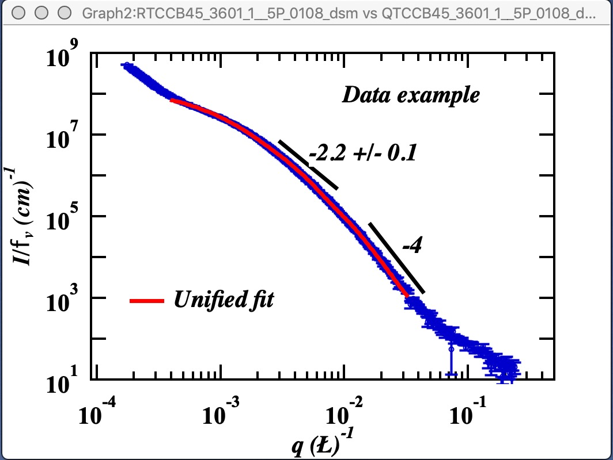

.. _MassFractalAggregateModel:

.. index::
   Mass Fractal Aggregate

Mass Fractal Aggregate model
============================

**This tool generates 3D model RANDOM representation (voxelgram) of Mass fractal aggregate. For details on the science behind it see paper : A. Mulderig et.al., Quantification of Branching in fumed silica, J. of Aerosol Science 109 (2017) 28-37,**   http://dx.doi.org/10.1016/j.jaerosci.2017.04.001

This tool is applicable **ONLY to mass fractals** It is critical users understand its limitations and the meaning (and reliability of) mass fractal aggregate parameters as used in the tool. These are listed below.

This is "visualization tool" - it is NOT fitting of data. Data are first fitted by Unified fit and, *assuming users have mass fractal*, fractal parameters describing the Mass Fractal system they have are calculated. Users then can use this tool to *RANDOMLY* generate a mass fractal aggregate. That is user generates using Monte Carlo method each time one of *MANY* possible shapes of this mass fractal. If the mass fractal shape has same or similar fractal parameters  properties it is assumed that it looks like what is inside the sample. So, this is NOT fitting, it is random shape generation and user need to vary *model growth parameters* until model with suitably similar mass fractal parameters is grown. Once proper growth parameters are found, user can grow number of representative shapes.

.. _MassFractalAggregateModel.Parameters:

Mass Fractal model parameters
-----------------------------

Following manuscript: http://dx.doi.org/10.1016/j.jaerosci.2017.04.001

Mass Fractal aggregate has following parameters:

* R - aggregate size
* d\ :sub:`f` - Mass fractal dimension of the aggregate
* p - short circuit path length
* s - connective path length
* d\ :sub:`min` - minimum dimension of the aggregate
* c - connectivity dimension of the aggregate
* s - connective path length of the aggregate

Each of these terms can be inter-related with each other by:

.. math::

    R=\frac{R_g}{d_p}=z^{1/d_f}=p^{1/d_{min}}=s^{1/c}

Where:

* Rg is the Radius of gyration of the second (Large) level - represents the size of the mass fractal aggregate.
* d\ :sub:`p` is Sauter mean diameter of a sphere of similar surface to volume ratio as the scattering primary particle (first, smaller level).

The value z which is one of the inputs of the 3D aggregate model, d\ :sub:`min`, and c are calculated by Unified fit tool in "Analyze results". The value of d\ :sub:`f` is power law slope of the second (larger) level when Mass fractal is represented by two Unified levels.

\*\*\*\*\*\*

Here is example of Unified fit with two levels - if this is mass fractal system, there we have primary particle size (approx. 22A Rg), mass fractal dimension of ~2.44 and large Rg of about 223 A.

This is the main screen:

.. image:: media/3DAggregate1.jpg
   :align: center
   :height: 580px

In the top part are  options to use results from Unified fit using modified version of :ref:`standard data selection tools <DataSelection>` . This is simply lookup tool, user can as well pick the needed numbers from *Analyze Results* in *Unified fit*. Data can be selected, in the case in the figure above we are using whatever values are in the current Unified Fit tool working directory and assume, that levels 2/1 represent the Mass Fractal. Based on this the code extracted needed parameters. The most interesting are z = degree of aggregation and d\ :sub:`f`.

Now, the parameters user uses to control growth are:

* Degree of aggregation "z" - this is how many particles will be in the aggregate.
* Sticking probability - this is how likely is when a new particle arrives nearby any particle which is already part of the aggregate to stick. Value varies from 10 to 100%.
* Sticking method. There are three values here 1, 2 and 3. Sticking method describes how close must a new particles arrive to existing ones to be allowed to stick. Value of 3 allows particle to stick if it is relatively far (sqrt(3)), value of 2 means it has to be closer (sqrt(2)) and 1 means it has to arrive really close (1). These distances relate to which neighbor it needs to be within the system which is simple cubic lattice.: 1 is neighbor in one direction (x or y or z direction only), 2 is neighbor also in xy, xz, etc - in plane neighbor, and 3 is neighbor in volume (xyz neighbor).

Using different combinations of sticking probability and Sticking method results in different structures. User needs to test various combinations to find ones which create particles which match his/her scattering.

*Note: lower Sticking probability and larger z values significantly increase run time.* Watch history area where progress is presented and final parameters are listed also.

*This MAY BE SLOW* Push Button “\ **Grow Aggregate**\ ” and this will create aggregate and display it in Gizmo. Below is result which run on my high-end Macbook Pro for about 15 seconds:

This is not very good result, but also not too far. I have d\ :sub:`f` of about 2.15 (and need 2.4) c about 1.5 (and need 1.4) and d\ :sub:`min` about 1.44 (and need 1.7).

Button “\ **Summary Table**\ ” displays Notebook with model summaries - and adds in there current results summary, see below. This can be used to follow how results depend on model input parameters.

Button “\ **Store Current Aggregate**\ ” stores the current aggregate result (including the 3D aggregate data) in separate folder, where they can then be found, displayed etc. See list in Listbox below, I just added there the current result:

.. image:: media/3DAggregate4.jpg
   :align: center
   :width: 380px

Button “\ **Display 3D graph**\ ” Displays in the Listbox selected 3D results in Gizmo. If nothing is selected, current result in working directory (if exists) is presented.

Button “\ **Calcualte 1D Int.**\ ” Calcualtes 1D intensity of the Aggregate based on its parameters. If Unified fit log-log plot exists, it will add it there, if not, it creates it own graph. *NOTE: DOES NOT WORK YET* More functionality needs to be added...
