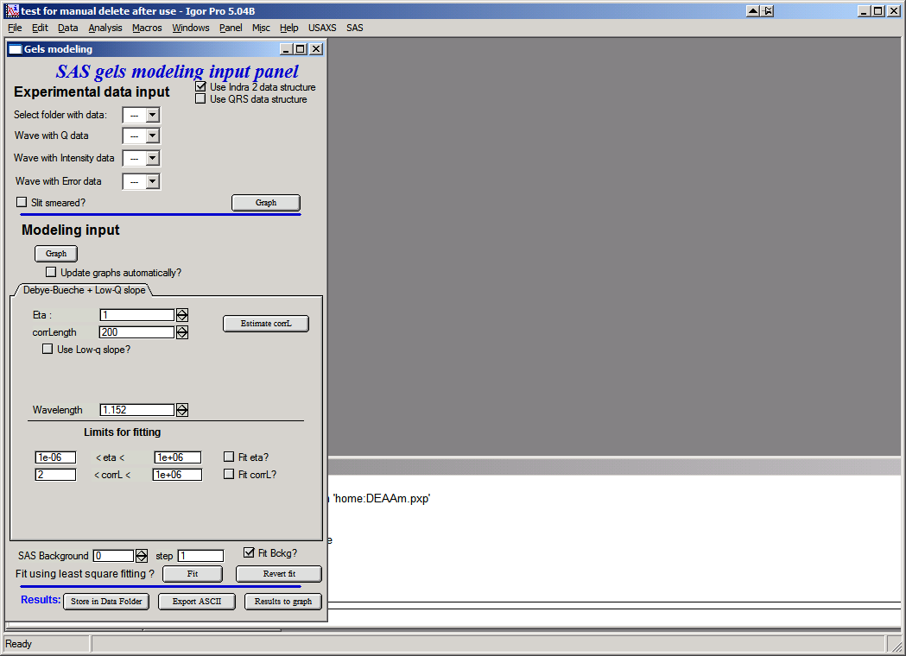

.. _MassFractalAggregateModel:

.. index::
   Mass Fractal Aggregate

Mass Fractal Aggregate model
============================

**This tool generates 3D model RANDOM representation (voxelgram) of Mass fractal aggregate. For details on the science behind it see paper : A. Mulderig et.al., Quantification of Branching in fumed silica, J. of Aerosol Science 109 (2017) 28-37, http://dx.doi.org/10.1016/j.jaerosci.2017.04.001 **

This model is applicable **ONLY to mass fractals.** It is critical users understand its limitations and mass fractal aggregate parameters as used in the tool. These are listed below.

This is "visualization tool" - data are first analyzed by Unified fit and, *assuming users have mass fractal*, they can use this tool to generate one of MANY possible shapes of this mass fractal, which will have same or similar fractal properties. Also, this is NOT fitting, it is random shape generation and user need to vary model growth parameters until model with suitably similar mass fractal parameters is grown. Once proper growth parameters are found, user can grow number of representative shapes.

.. _MassFractalAggregateModel.Parameters:

Mass Fractal model parameters
-----------------------------

Following manuscript: http://dx.doi.org/10.1016/j.jaerosci.2017.04.001

Mass Fractal aggregate has following parameters:

* R - aggregate size
* df - Mass fractal dimension of the aggregate
* p - short circuit path length
* s - connective path length
* dmin - minimum dimension of the aggregate
* c - connectivity dimension of the aggregate
* s - connective path length of the aggregate

Each of these terms can be inter-related with each other by:

.. math::

    R=\frac{R_g}{d_p}=z^{1/d_f}=p^{1/d_{min}}=s^{1/c}

Where:
* Rg is the Radius of gyration of the second (Large) level - represents the size of the mass fractal aggregate.
* dp is Sauter mean diameter of a sphere of similar surface to volume ratio as the scattering primary particle (first, smaller level).

The value z which is one of the inputs of the 3D aggregate model, dmin, and c are calculated by Unified fit tool in "Analyze results". The value fo df is power law slope of the second (larger) level when Mass fractal is represented by two Unified levels.

\*\*\*\*\*\*

This is the main screen:

In the top part are :ref:`standard data selection tools <DataSelection>` . Data can be selected, user can use either pin-hole type data (or desmeared USAXS data) or slit smeared data. Results are the same, the model is slit smeared with slit length if slit smeared data are used.

This is how the screen looks like with data selected. Note three graphs:

Top is log-log, middle is I \* q\ :sup:`4` vs q, and bottom is 1/sqrt(Intensity) vs q\ :sup:`2`. Data selection for fitting purposes is in the top graph…The other two are only for informational purposes.

Controls:

Top button “\ **Graph**\ ” loads data into the tool and creates the graphs.

Lower Button “\ **Graph**\ ” will calculate model and place result in the graphs.
