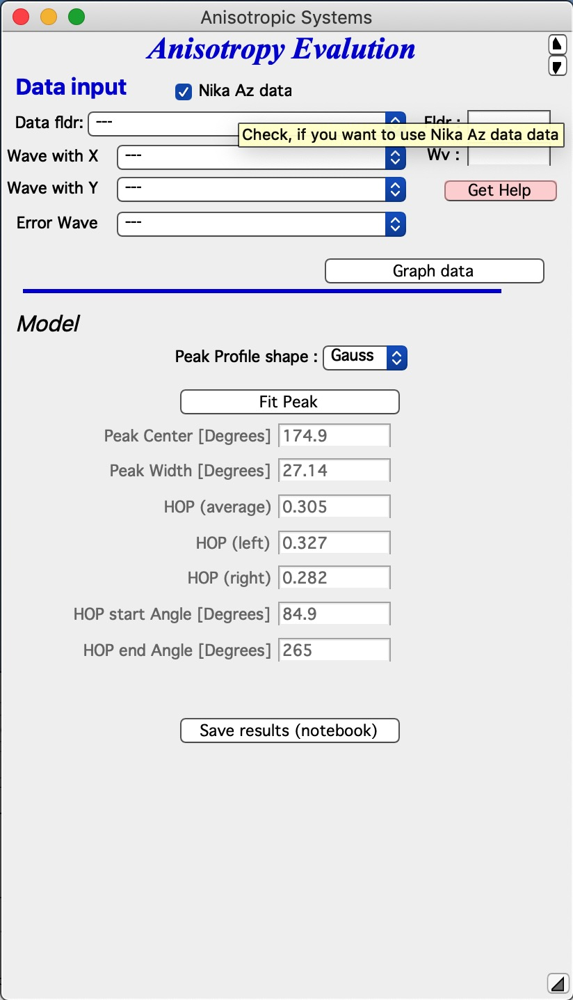
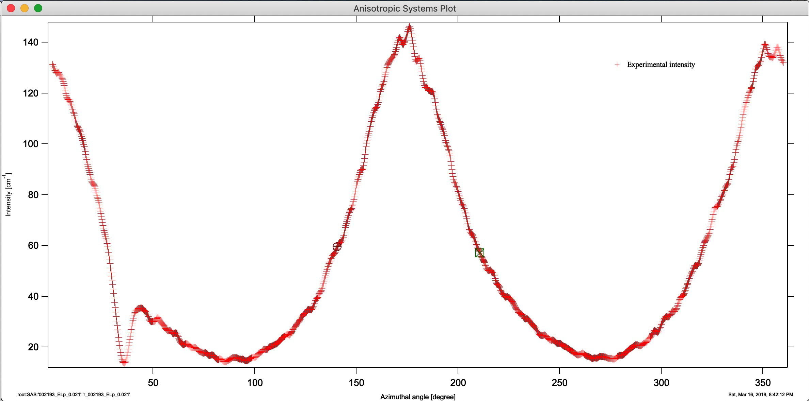
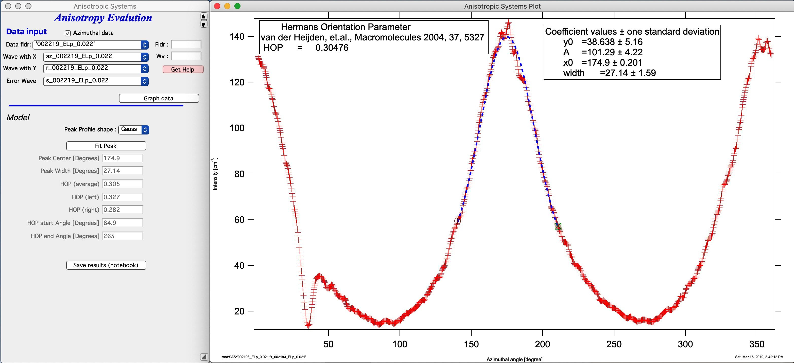

.. _AnisotropyAnalysis:

.. index::
   Anisotropy Analysis
   Hermans Orientational parameter

Anisotropy Analysis - HOP
=========================

**This tool analysis anisotropy of oriented peak using Nika generated intensity vs azimuthal angle (r-wave vs az-wave) acording for formula 8 in : P. C. van der Heijden, L. Rubatat, O. Diat, Macromolecules 2004, 37, 5327., https://pubs.acs.org/doi/10.1021/ma035642w **

For more info check  L.E. Alexander, R.J. Roe, etc.

In order to have suitable input data for this tool, you need to run Nika with Area detector data and generate intensity profile as function of azimuthal angle. It is strongly suggested, that you properly calibrate and background subtract the data or the results of these calculations will be wrong.

Main GUI
--------

This is the main screen:

In the top part are :ref:`standard data selection tools <DataSelection>` . Data can be selected using standard Irena selection system. You can use Nika generated pair of r_dataName and az_dataName (uncertainty wave is optional) when checkbox "Nika Az data" is checked or arbitrary named data if it is unchecked. Note, that you MUST provide data for azimuthal angle **in degrees**. Select data and push “\ **Graph data**\ ”  button. Graph of data is generated:

Select the peak area with cursors - set cursors below half intensity point on each side of the peak. The maximum peak must be reasonably far from 0/360 degrees. In other words, you cannot have the peak split *exactly* by 0/360 degrees value. Internally data are extended to either side, if needed, so you can be relatively close to 0 or 360, but you need to have enough of the peak in view to get reasonable peak position fit. Select suitable Peak profile shape (Gauss or Lorenzian) and push button "Fit Peak". Code will run through complete analysis and fill the table with results:

Results are in the table as well as in the graph itself.

Button “\ **Save results (notebook)**\ ”  :ref:`Results notebook <ResultsNotebook>` will save results with graph in Irena Results Notebook. You can save this notebook as rtf file and use it in any word processor.

There are no other data to save or export and this tool cannot be scripted for now. Other tools and options can be added in this tool, if you know about any, let me know.
