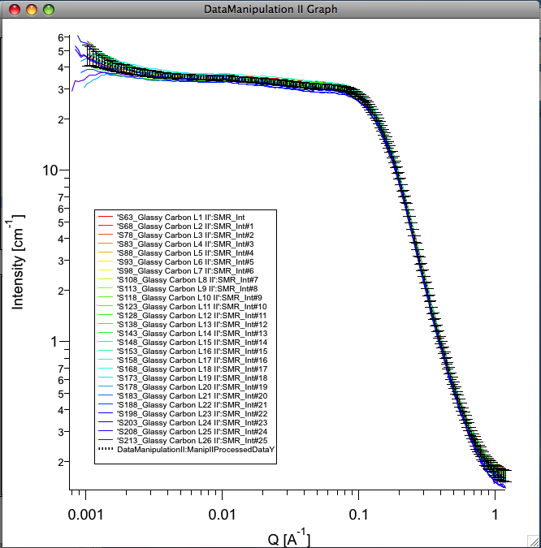
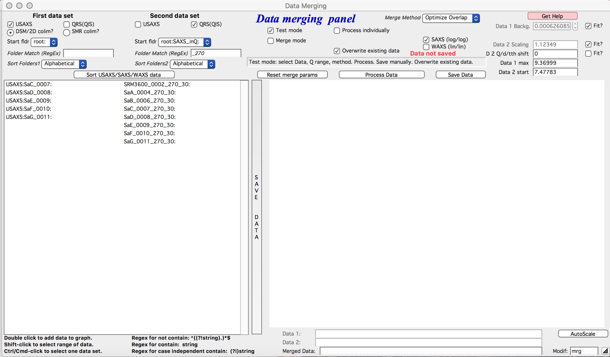
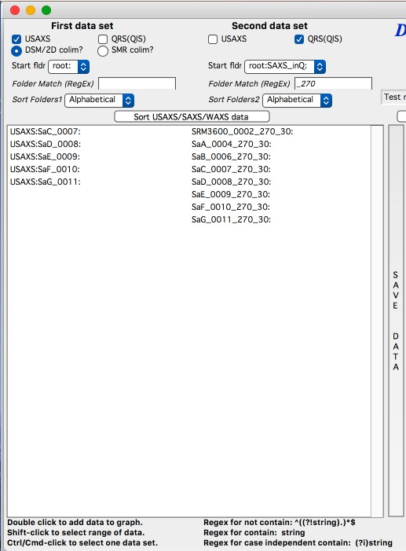
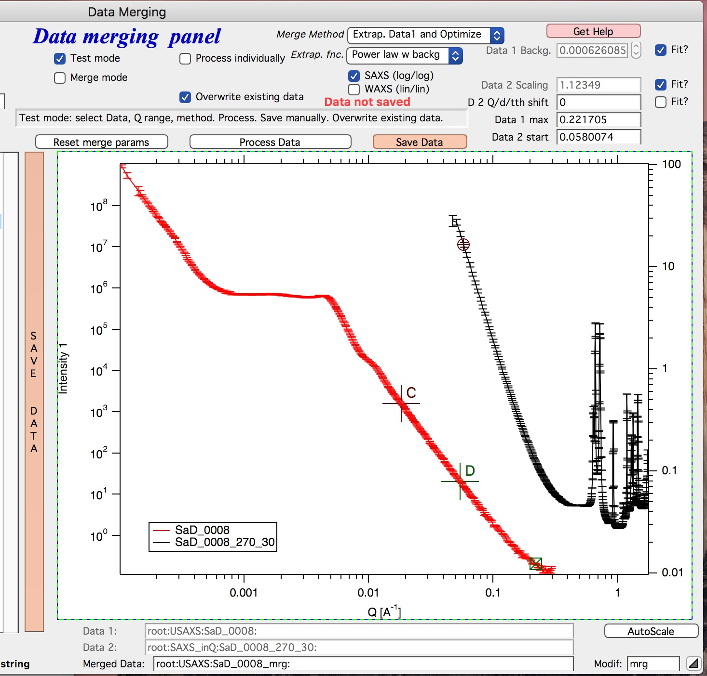
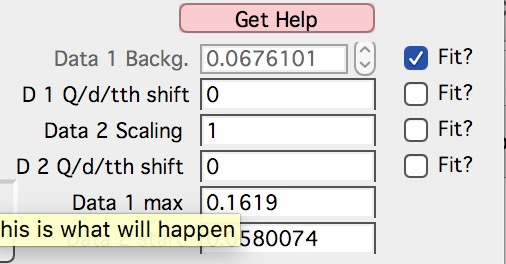

.. index:: Data Manipulation I

.. _data_manipulation_1:

Data manipulation tools
=======================

List of Tools
----------------

1.  :ref:`Data Manipulation 1 - one or two data sets <data_manipulation_1>`
2.  :ref:`Data Manipualtion 2 - many data sets <data_manipulation_2>`
3.  :ref:`Data Merge - two data segments <data_merge>`

Data manipulation I
-------------------

.. Figure:: media/DataManipulation1.png
           :align: left
           :width: 280px
           :figwidth: 300px

This tool allows the user to modify data in many ways. It can work on one or two data sets at the same time. The data sets may or may not contain errors.

The tool allows the following data manipulations:

1. Modify data – multiply the intensity and errors by constant, subtract    background, and shift in Q

2. Merge data sets - attach data sets together as when attaching sectors    from different camera lengths on pinhole cameras. The data can be scaled together manually or automatically by using area under the curves in range selected by cursors

3. Sum together data

4. Subtract data set one from another

5. Re-bin intensity and errors to new Q

6. Convert data to D-spacing or Two-theta angle, Intensity, error.

7. Smooth data in linear or logarithmic scales or using spline smoothing with variable smoothing constant.

**Panel description**

In the top part are :ref:`standard data selection tools <DataSelection>`. In the top part user can select *First set data input* and \ *Second set data input*.

Select data naming convention used – Indra 2 (Folder names for sample names and then DSM\_Int, DSM\_Qvec, and DSM\_Error), “qrs” (suggested use of folder names for sample names [but not necessary], q\_sampleName for q vector, r\_sampleName for intensity and s\_sampleName for error. Or do not check any checkbox and all folders and waves will be listed (allows for ANY naming convention to be used).

The pick *Data folder*. Subset of folder will be listed in specific naming conventions.

*Waves with data* may or may not be automatically selected, depending on naming convention.

You do not have to select error wave, but it is strongly suggested to create one during data import, if better error wave does not exist!!!

*Add data and graph* after selecting one or two data sets (use data set 1 as single set, please) click this button – data are recorded for use by the tool and graph is created.

*Reset Modify* resets the tool

*Autoscale* When two data sets are used and range of data (overlapping data) is selected using cursors, this will calculate area under both curves and use the ratio of these areas to scale data set 2 to data set 1. Will write the result into the *Modify data 2*, *Multiply int by*. There it can be later modified by user.

*Modify data* areas. Scaling factors, background subtraction, etc.

*Rem Q<Csr(A)* remove data with Qs smaller than Q for the data point on which is cursor A (rounded cursor) set. Note, this gets the data set name from the wave on which the cursor is positioned. Place cursor on right data set you want to modify.

*Rem Csr(A)* removes ONE point, on which the cursor resides at this moment.

*Rem Q>Csr(B)* removes points with Qs larger than Q of the point with cursor B (squared) for the data set on which the cursor B is. Note, this may not be the same data set as where the cursor A is!

*Combine data* joins data by simply writing two data sets into one data set and arranging them from smallest Q to largest Q. No rebinning for Qs is done. Therefore it is likely in overlap region may be more points than appropriate. Suggestions for use are below in the section titled "Various uses for this tool.".

*Data1 – Data2 ; Data2 – Data1 ; Data1 + Data2 ; Data1 / Data2; (Data1 – Data2)/Data2* These do the math described here on the intensity data (and properly propagate the errors). This is done after rebinning data 2 to Q points of Data 1. This is done by interpolation of logarithm of intensity and then conversion back to intensity.

*Data 1 using Qvec2* Does ONLY rebinning of Data set 1 to Q vector of data set 2 (and propagates errors, if available).

*Data 1 ; Data 2* Passes data 1 or 2 only to allow use of smoothing on data without any math being done.

*“Reduce No of points by”* Takes Data 1 and reduces number of points by number selected (2 = ½ points left).

*“Log Reduce to”* Takes Data 1 and reduces number of points using approximately logarithmic reduction. Generally, at low-q more points are left while at high q more points are summed. Note, this reduction is by averaging points on log-scale and assigning them new, average, q, intensity, and error (all simple averages). This is done by first creating new log-Q scaling and then going through data and summing in each newly created q bin (borders being linear half distance between preceding and subsequent points) all of the Q, intensity and errors (if exist)… Bins with no values in them are then dropped… This has side effects: you cannot create more points then exists, you cannot increase point density (no interpolation is done) and the new Q scale may not be exactly logarithmic. Also, you are not guarantee to have the right number of points you requested, as some may have been dropped, if locally the density of new points was higher than density of old points…

This tool can be very useful, when large number of points exists at high Q with very little information content. Especially when input data have very high number of points, some of the tools will run very slow or not run at all for memory limitations. This data reduction may be the right choice…

*“Data 1 convert to d”* Takes Data 1 and creates d-spacing x-axis for the data.

*“Data 1 convert to 2-theta”* Takes Data 1 and creates two-theta x-axis for the data. Asks for user provided wavelength.

Results of above mathematical functions can be also smoothed by checking *Smooth* checkboxes and selecting appropriate *Smoothing window*.

*Smooth (log)* smooth logarithm of intensity and then converts back to intensity

*Smooth (lin)* smooth directly intensity

*Smooth window* number of points accounted in “running average” smoothing used here…

*Smooth spline* uses spline interpolation (with slider on right setting the spline smooth parameter). Use carefully – and test right setting of the slider. You need to push “go” first time, after that (when smoothing parameter is changed and mouse is let go) the data are redrawn automatically.

**Output area**

*Int. Units* this tool can be used to calibrate data (subtract background, scale by transmission or calibration constant,...). Change the units of Intensity and rest of *Irena* will know, what units you have and behave properly.

*Pick new data folder* pull down menu allows selection of existing folder in Igor experiment

*New data folder* modify, write in data folder name (fullname, staring from root:…., use the above pull down to preselect). If the folder does not exist, it will be created

*New intensity name, New Q wave name, New Error wave name* names for output waves. Please fill in appropriately for your naming convention.

**Various uses of this tool**

1. Merging segments from various sources. Import segments and then load in as Data set 1 the set which is calibrated, as set 2 next one and using automated method (select data overlap by cursors) scale them together. Remove extra points, reduce number of points in overlap area (if necessary) and subtract backgrounds, if necessary. The *Combine data*. Smooth if desired.

2. Subtraction of one data set from another. Load the data sets in, scale and modify if necessary. Do the proper math. Smooth if necessary.

3. Smoothing data. Select only data set 1 data, pas it through math part (modify, if necessary) and select smoothing method desired.

Please, make sure you fill in properly the names of waves for output data. There is nothing I can do here to catch typos and mistakes…

.. index:: Data Manipulation II

.. _data_manipulation_2:

Data manipulation II
--------------------

This tool serves for modification of many data sets at once. In can average waves (all selected or every N waves), Normalize data, Subtract dataset from all selected waves, and - possibly combined with the other tools also scale the data. But this tool can be modified to do other things. If you have any ideas, let me know.

**Introduction**

This tool is combination of data selection method used in Data Mining tool, which enables user to select folders with data. These data can be processed (averaged all or in "chunks" of N at a time for now), plotted and saved. Further one can use this subtract one data set from all selected data sets.

It is relatively simple tool at this moment… User selects by one of few methods number of data sets and these then are processed.

**Averaging** – first data set found during processing X (Q for SAS data) values are used for result X vales. At this time there is not way of reordering the data, so this is kind of random which X wave is picked. Then for all data sets the Y is linearly interpolated for each X value and average and standard deviation (or standard error of mean) are calculated. It is not necessary to have the same number of points – and it is even not necessary to have same X (Q) range, but if the X range is different, Igor will extrapolate the closes existing values as fixed number. That is likely going to make such situation really bad. But anyway, the code will not fail.

What is not done yet: As written now, the code simply dumps any errors provided and uses only the standard deviation on the Y values. If I get smarter, I can try to propagate the errors also.

**Average every N waves** -same as average above, but averages first N waves, names the output folder by taking the wave name of the first data set and saves the data there. The continues with next N waves etc. If the last set has less than N data sets, it will average that smaller number. Saves automatically and uses name of the first folder of data in the set, attaches the "Append to name" ending.

**Subtract data** – subtract one data set (may be background data?) from selected other data. Check “Subtract data” checkbox and select what data type etc. in the usual data selection controls which appear. You do not need error wave for this, but you can have it. In order to save the data new folders must be created and to make sure the names are unique, there is “Append to name” field. Add string (may be “\_sub” is good choice?) and then select other controls (like plotting options) and process the data. No scaling is available at this time, you need to scale the data to be subtracted first in Data manipulation 1, if needed…

**Normalize data** – normalize data sets to fixed value of area under the Intensity vs Q. Used mostly in BioSAXS when normalization of data sets is critical and in specific Q range the assumption can be made that the intensity should be same for all samples.

**Scale data** – this step can be combined with the others and enables scaling by fixed number, for example by scaling factor to put on absolute scale.

**GUI and controls**

The control panel is on right, Panel with two list boxes for user controls on the left.

At the top of the control panel is standard suite of data selection control. User should select folder in which are waves which user may want to do something with. In my case I selected a folder containing some Indra (USAXS) data I want to sum together.

Please note, that for lack of better choice, this “Test Folder” name will be used as template for output suggestion – basically, I will add “\_manII” to its name. You can modify later.

**Which data**

In this area user should try to select as best as possible the data to be used.

*Start folder* – Lists folders in the current experiment, any folder below this one in the folder hierarchy will be searched. Therefore, user can select only part of the data to be searched and considered.

*Folder (RegEx)* – Regular expression string which can be used to match to folder names. Uses more or less standard system, basically I suggest considering this: "" matches any folder name, K matches any folder containing K in the name (Regex is case sensitive). In the example, I wanted to match all folders which contained S4 in the name. Note, do not add “” to this string.

*X data, Y data, Error data* – you can use either full name (like the Indra data “SMR\_Int”, etc.) or you can use RegEx to create more complicated matches part of the name. For QRS data, for example, you can use (?i)q, (?i)r, and (?i)s. While this does not guarantee the right triplet is used if more than one proper triplet is found in the folder. Things get messy if many qrs waves are in the same folder. This tool just cannot manage that. If you have weird system, send me example and I can try to fix it.

*Preview selection* – runs data checking code and finds the folders with data. Just the folders. They are listed in the bottom listbox in the panel on right.

*Enable Manual selection* – if selected, user can manually select only subset of folders in the listbox on right (bottom). Use buttons *Select All* and *Deselect All* - as well ctrl and shift – left mouse button to select ranges of data.

Now the Processing controls:

Above example is for *Average Waves*, and you can choose to create statistics (either standard deviation for each point or standard deviation of mean). As noted above, at this moment this is purely statistics on Y values, Errors are not considered.

Here is example for Subtract data:

with the second tab:

**Output options**

Note the "Append to name" varies based on tool used. When the folder and data names are inaccessible to users it means that output is multiple data sets and therefore the names will be created on fly using the "Append to name" string. You can modify as needed.

*Display result?* and *Display Source data?*

Will cause that a graph with results and source data will be presented when *Process data is pushed.*

Example of plot with data with average.

*New Folder name and X, Y, Err names* - folder needs to be with path (keep it short), separated by `:` No need to add ‘ ‘ to names with spaces, the code will fix it. If a name is too long (more than 30 characters) it will be cut short. Wave names are simple strings, can contain spaces, but no special characters. No +, -, and other weird symbols.

Other controls below control how the output graph looks like.

If the results look good and you like them, use *Save data* button, which will store the data in the folder and under names in the above controls.

**Average every N waves controls**

Here are specifics... Save button is disabled, as the data must be saved automatically, control names of the data by changing the "Append to name" field.

Data can be processed all or manually selected.

Note that plotting is bit challenging in this case, so do not expect perfect results of the plots. Basically seems like logic to plot both Source data and results is failing as the code cannot distinguish between them and format them differently.

**Subtract data controls**

Select “\ *Subtract data”* checkbox to get the data selection controls.

Use of other controls is same as listed above.

Set “\ *Append to name*\ ” string to something meaningful (and not too
long).

**Errors and Post processing tabs**

Added around Irena version 2.5x, these tabs are processed after the processing and provide more options to modify the data.

The errors tabs can be used if the input data do not have proper uncertainties, have none to start with or processing makes the original not practical. You can create Errors (Uncertainties) with two different
methods.

Post processing enables you to further modify data after they were processed through the system - Scale them (e.g., put on absolute scale), Reduce number of points (log-q rebin the data) and set Intensity units to appropriate unit - cm\ :sup:`2`/cm:sup:`3`, cm\ :sup:`2`/g, or arbitrary, so *Irena* is aware of the data units.

.. index:: Merge 2 data sets

.. _data_merge:

Data merging
------------

This tool is used to merge to segments of data covering overlapping q, two-theta, or d ranges. The tool can handle SAXS as well as WAXS data. This is common situation for 9ID USAXS/SAXS/WAXS instrument, which collects data with three different geometries sequentially. Each data set for the same sample is reduced individually and then user has three individual segments of data, which can be combined together to create one new data set covering all of the q range.

It should be pointed out, that this is generally **BAD IDEA** . Data from segments collected at different distances or using different detectors will invariably have different resolutions, uncertainties, etc. Better data analysis software should allow to analyze data consisting of multiple independent segments, where the differences in resolution and uncertainties calculations can be handled better. **You have been warned. Proceed at your own peril.**

This tool can help to merge two data sets at time. It is designed to efficiently scale second data set, subtract background from the first data set, and optionally q-shift any ONE of the two data sets - and merge the data together as easily and as efficiently as possible. It can do it manually by selecting each data set individually or sequentially, by selecting sets of data sets and processing all at once. It can also fit Data 1 set of data with function dependence (power law, power law with background or Porod with background) and use the fit results to create smooth version fo the data. This significantly improves fit between the two segments when Data 1 high-q area is very noisy.

Please note, that the function of this tool is pretty limited. More functionality is available in the Data manipulation I and Data manipulation II. I do not plan to add other “missions” to this tool, use the other tools for anything, which is more advanced.

**Introduction**

Data requirements: To merge two data sets you need to have data of one of the two naming structures:

USAXS data: Inside root:USAXS: folder, name of the folder represents the sample name and the data are named SMR\_Int/SMR\_Qvec/SMR\_Error or DSM\_Int/DSM\_Qvec/DSM\_Error. Optionally you can have SMR/DSM\_dQ which is Q resolution wave. These data are, if present, properly passed through the calculations.

QRS data: Folder name represents the sample name and inside this folder you have three or four waves: Q\_SampleName, R\_SampleName (Intensity), S\_SampleName (Intensity uncertainty), optionally W\_SampleName (Q resolution). You can also have data Irena & Nika consider QRS also : consisting of d\_SampleName, R\_SampleName (Intensity), S\_SampleName or t\_SampleName, R\_SampleName (Intensity), S\_SampleName. The difference is that wave starting with t contains (x-axis) expressed in two-theta (in degrees) and wave starting with d contains d-spacings. No other naming system is NOT supported at this time and if needed, will need to be added into the system (request it, justify and send examples…).

**What can be done**:

*Optional Step - when "Merge method" is "Extrap. Data1 and Optimize"* : User can fit "First data set" end of data (high-q range for this set) with one of few functions. Code will then use the fitted parameters to replace the noisy fitted data with the smooth functional dependence. This helps with data which are noisy and where regular method of Optimizing overlap does not work too well...

*Main Step* :User selects the overlapping range of Qs for the data. The data are trimmed at these Qs! Code has 4 parameters of merging, up to 3 can be optimized at the same time :

1.  Data 1 background - Data 1, low-q data, assumed to be the optionally absolutely calibrated, are assumed to have potentially flat background at high-q.
2.  Data 2 scaling - Data 2, high-q data, need to be scaled to Data 1 with scaling factor.
3.  Data 1 or 2 q-shift - Data 1 or 2 can have q (d or t) shifted if to compensate for any misalignment between the segments. Typically this means user or staff failed to properly calibrate the instrument and it is strongly suggested to fix the calibration and reduce the data again to fix this misfit.  Allowed q/d/t shift is limited to be at most ½ of the q value for the first point on the second segment. This may not work as well for d type data which are kind of unique case anyway.

Each parameter can be individually selected for optimization - or if known, can be inserted manually in the field. Keep in mind, that it is users job to set the value back to 0 or 1 if they decide not to use this parameter.

These parameters are optimized using Igor Optimize function to minimize the misfit between the intensity points in the overlapping q range.

Note, that Data manipulation I tool uses similar code. The Data manipulation tool I creates new folder/waves with names modified by adding **“\_comb**\ ” at their end. This tool adds **“\_mrg**\ ” at the end. User can change the term added to folder name in the lower right corner field on the panel.

Below is the GUI panel itself. ***Please NOTE : This tools is one large panel and requires 1280x800 screen size. It will NOT run on smaller screen sizes. ***

The GUI is bit uncharacteristically one large panel with left part being Data selection and right side being processing and data view selection.

**Data selection**

At the top are controls for Data 1 (low-q, calibrated data) and Data 2 (high-q, to be scaled) data sets.

**USAXS, QRS(QIS) checkboxes** – which data naming system you are using?

**DSM/2D colim? - SMR colim? checkboxes** – specific selection for USAXS data. If Slit smeared data are used (SMR_Int etc), use SMR checkbox, if desmeared data are used (DSM_Int etc.) use DSM checkbox. Note, that his also inserts "_u" or "_270" in Folder match string for Second data set. This is helping USAXS users select proper data for merging.

**Start folder** – select folder, where the data start. Pick the highest folder you can (do not leave on root:), some of the features require that the names in the listbox are single folder name only. Some features will work fine even when the names are full or partial path to data. But it also is likely unreadable anyway. So pick the highest folder you can.

**Folder match string (RegEx)** : Use this field to mask as well the data names as possible. Here are some suggestions:

If you want to show only sample names with some string (e.g., “Jong”) in it, simply type in this field the string itself (without quotes). Note: unless you type in some modifiers, this field is case sensitive.

If you want to show only sample names, which do NOT contain some string (e.g., “Jong”), type in this field following string (without quotes) : “^((?!Jong).)\*$” Again, this is case sensitive.

If you want to be more creative, see notes below the listbox with some cheatsheet instructions. If you want more, you will need to become expert on Regular expressions. Google can help, I cannot...

**Sort Folders** : This enables to sort the folder names using many different options. Hopefully, one is appropriate for your needs. If not, let me know and send me example of data, may be I can add it.

**Sort USAXS/SAXS/WAXS data** button : On the APS 9ID USAXS the data are collected sequentially using relatively customary naming system and in this case it is possible for the code to identify (mostly) which Data 1 (USAXS) and Data 2 (SAXS or WAXS) belong together. This button will locate such pairs of data sets, reorder the listbox to show those at the top and select those, so these can be easily processed in batch.

If USAXS/SAXS/WAXS data collection is done correctly, all three segments belonging to the same sample will have same "order" number - that is the "_0000" number which instrument attaches to user sample name. Note, that in Nika during reduction appends to the name segment designation similar to "_C" for circular average, "_u" for USAXS slit smeared data and "_270_30" for SAXS pinhole data. Sorting should manage this and still align to the same lines appropriate names. User needs to check.

Please check the “History area” in Igor pro (ctrl-J or cmd-J will get you command line and history area). The code will make record here on the matched and not matched data sets.

*It is unlikely data from any other source, than APS USAXS instrument, would work with this button. It is highly unlikely!*

***Data selections Listbox - operations***

This is important, please read carefully:

1. To add data set, double click on it. Note, that the speed of double click seems to be important (likely computer specific setting, I have no control of this in Igor) and this requires bit testing and experience.

2. To select a range of data you need to use modifier keys.

To select separate individual cells, hold down CMD or Ctrl key and click on the cells. You can add any number of cells in any order. Second click on the cell will unselect it.

To select continuous range of cells, click on the first one and then hold down shift key and click on the end of the range you want to select. You can select one column or two columns of cells like here:

.. image:: media/DataManipulation17.png
           :align: center
           :width: 330px

However, what if you need this?

In this case you do this: click at the corner of first area (e.g. left top cell), hold down shift and click on the other end (bottom cell) in this column. This will select range of cells in that column of data. Then left shift go and held down the CMD/Ctrl key and click at the top cell of the other column (right top cell), change back to holding shift key and click at the last corner cell (in this case lower right cell).

This may be important, see processing/operations…

**Operations and processing**

Please note, that there is red colored vertical button between the data selection and graph which can save data or process and save data when appropriate. If the data loaded in the tool are not saved, the button is read, when the are, it changes color to grey. There is pair of buttons at the top - "Process data" and "Save Data" which are each doing separately appropriate functions.

The tool has two main modes of operation

1.  **Test mode**  when user loads in two data sets and selects the proper range of Qs where data overlap, sets all other parameters and conditions, can push many times the "Process data" button to test settings etc. If user decides to save data, there is "Save data" button for this. This is basic setup mode for selecting proper settings.
2.  **Merge mode** which enables user to process - with settings selected using test mode - process many data sets quickly and efficiently.

**Merge Method description**

There are currently two Merge methods. Some has been already described above, but here are the details.

1. **Optimized Overlap** This is the main part of the Data Merging tool. This is done always and is default method of this tool. If you push button "Reset merge params" this method is selected. If data have sufficiently good quality for both data sets over sufficient q/point range, this is preferred method. In this case the code will take the overlapping region in data and optimize values of all selected Parameters (Data 1 Backg., Data 2 Scaling, Data 1 or 2 Q shift). Any number of parameters can be selected. Value of the others, if known, can be put in by users manually. Default is to fit Data 1 Background and Data 2 scaling. Data 1 and 2 Q shift is assumed to be 0.
2. **Extrap. Data1 and Optimize** This is optional part of the process. If selected, Data 1 is first fitted with function selected in "Extrap fnc." popup (below the "Merge method popup") - options are Porod (Intensity = Backgr. + Const * Q\ :sup:`-4`), "Power Law" (Intensity = Const * Q\ :sup:`-P`) or "Power law w Backg" (Intensity = Backgr. + Const * Q\ :sup:`-P`). Range of data used for fitting is selected by cursors C and D, which are placed in the graph when needed. The look like cross and have letters next to them:

User needs to select proper range of data where the appropriate "Extrap. fnc."" is suitable. These data are then fitted and resulting parameters are being used to generate new, smooth data points calculated from the functions for original Q values. These are generated for Data1 points between the cursor C and Cursor B (rectangular) which designated high-q range of Data 1 which is used for overlap optimization and for merged data. This is important - the code replaces original (noisy) data with smooth functional data. It leaves original uncertainties on the points. See step wise description bit later for use details.

Other checkbox/controls functions:

**Process** **individually** checkbox – in this case user can pick (double click) on a Data 1 cell, then on Data 2 cell in the listbox. Code will automatically merge the data and show results. Depending on the checkbox “\ **Save immediately”** selection the merged data are either immediately saved (when “\ **Save immediately**\ ” is checked) or this saving is left to user (use the vertical button “Save data” between the Listbox and graph or "Save data" button above the graph, same function in this case).

**Process as sequence** checkbox – when checked, the code assumes that there are two ranges of data selected in the Listbox – same number of Data 1 and Data 2. It will assign first Data 1 selection to the first Data 2 selection, merge them and save them. The go on next selection (second Data 1 is merged with second Data 2 selected) etc.

**Overwrite existing data** checkbox – if selected the tool will overwrite any prior data in the location where it is directed to save the merged data. I suspect this is what most people will want. If NOT selected, the code will create new, unique, target folder each time and user can create potentially huge number of garbage containing folders with test data which are useless. Keep this in mind.

**Here are values / checkboxes for optimization **

The top 3 values show the values used for scaling/merging procedures. Note the space between the Data 1 Background and Data 2 scaling. If your Data 1 data are QRS data (NOT USAXS data) then there will be option to "D 1 Q/d/tth shift". This allows at that moment to shift Data 1 in Q/d/tth. Only one of the segments can be shifted via optimization. User can punch in numbers manually, but it is likely impossible to suggest at all!!!!

 User can either check the "Fit?" checkbox next to them and have them Optimized each time or uncheck it and input proper value - if known. In the case above the Background and Scaling are fitted, Q shift is set to 0. This should be default use case.

The **Data 1 Q max** is the end of the Q range (high Q of the low-q data segment). Defaults to point before last on Data 1 set. You can either change this value by typing in or by dragging the cursor B (rectangle) to new place.

**Data 2 Q start** is the start of the Q range used for Data 2 (lowest considered Q for high-q segment). Defaults to the second point on the Data 2 and cannot be set lower due to mathematical reasons of the code doing optimization.

**Graph content:**

Red are Data 1 plotted against left axis, Black are Data 2 plotted against right axis and Blue are Merged data. Cursors A (round one, on Black Data 2) and B (rectangular one, on red Data 1) are used to select overlap region which will be used for optimization. Points on Data 2 left of cursor A and on Data 1 right of cursor B are removed. Cursors C and D (crosses with letter designation) are present only when Method "Extrap. Data1 and Optimize" is selected and on Data 1. They are used to select range of data used to fit the function. Also, data points between cursor C and B are replaced during processing with calculated values from the result of the fit.

**Folder strings:**

These show full path to the Data 1 and Data 2. These two cannot be changed by user. "Modif" field bottom left can be used to set what modifier is used to create folder name for merged data - see below.

Merged Data path+folder name is generated based on Data 1 path and depends on the type of data used (USAXS vs QRS). This one user can actually type into and assuming the path makes sense (the names are valid and it can be used as Igor Path), the path will be created and data saved there. Note, if you type in path which contains data already, those may be overwritten. The checkbox “\ **Overwrite existing data**\ ” really controls how the new path name is auto-created and does not control (for now) saving data. So if you are typing in path yourself, be careful to type in unique path or expect data to be potentially overwritten.

**Sequence processing and data selection**

As noted above, when **Process as sequence** checkbox is checked, the code assumes that there are two ranges of data selected in the Listbox – same number of Data 1 and Data 2. It will assign first Data 1 selection to the first Data 2 selection, merge them and save them. The go on next selection (second Data 1 is merged with second Data 2 selected) etc.

Note, that you MUST provide the right order in the listbox. That is why it is critical to find correct sorting routine. The pairs do not have to be on the same line, but they have to in the right order from the top of the selection for Data 1 and Data 2.

This WILL WORK:

In this case the first Data 1 (320nm\_1pct) will be merged with first Data 2 (320nm\_1pct), then second pair (10pct) etc. Note, that I could not select the data further since the 320nm\_Blank has no matching Data 2 set and broke the sequence.

Saving data - wave note change:

My code uses wave notes to store additional information. After merging the data, the code adds following information (example):

Data from merged=root\:USAXS\:'07\_18\_Jan':S118\_Jong\_320nm\_40pct:;Data
merged with=root\:SAXS\:Jong\_320nm\_40pct\_4001\_usx:;

If these data would be already merged and these keys would already exist, new content is added, separated by “,” to these keys, so there would be multiple folder names in these fields in order these segments were added. Somehow I do not think this will cause much confusion.

**Quick walk through procedure**

Here is quick walk through data merging using the "Extrap. Data1 and Optimize" with example images. In this case we have two segmens of measurement which overlap very poorly as the scattering intensity in Data 1 (USAXS) is low at high-q. This will not work well with regular merge routine. Scaling and background subtraction in this case are very dependent on range of data selected for optimization - which suggests this is not reliable result. In this case I selected "Extrap. Data1 and Optimize" and using cursors C and D selected q range where data follow power law scattering and, in this case, where background is negligible. See next figure:

I have selected "Power law" as Extrapolation function. I selected reasonable overlap q range - this is matter of try and test. I selected to fit Data 1 Background and Data 2 scaling. I am in test mode, I can push "Process data" button and see results.

If I zoom in the data and look at them in detail, it should be clear what happened

As you can see, original noisy Data 1 points (red data) are replaced between cursor C and B with smooth power law data (with original error bars). Those data are then merged with the Data 2 which are nearly perfectly scaled to Data 1, even though the overlap region is quite small (there are only 6 points of each data in the overlap region). Since the Data 1 are here approximated with lots more data points to create data for overlap, the robustness of this merging is much higher than when 6 noisy points are used. Also, since the cursor D is at lower q value than even cursor A, merging data are calculated from more, less noise, more robust points. Assuming the Power law is correct approximation of data in the selected range between cursor C and B, this is better way of merging data.

Now I can push "Save Data" button and actually, in this case, use same setting for all of the data I have in the set, since they are all very similar.
