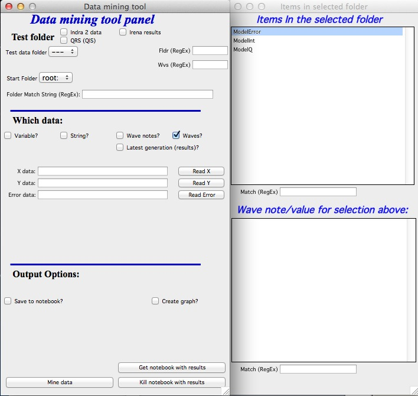

.. _data_mining:

.. index:: Data mining

Data mining tool
=================

This tool allows finding and tabulating various data from folders within Igor. At this moment it is just about functional and will be developed further.

The data can be stored in either variables, strings, wave notes or they can be waves with data themselves. Depending on input type, the data can be output into graphs or notebook (for waves), or in notebook or in new waves (for strings, variables and data from wave notes).

**Use**

There are few peculiarities, this tool behaves little bit different than the others… See below:

In the top part you need to select data type to be searched and example folder, in which are data types you want to “mine”. Therefore, you need to be able to find at least one folder with data you are looking for.

When you select such folder, new panel with list of particular items from this folder appears. The top lists waves/strings/variables as appropriate; bottom lists the wave note (for waves) or the value of the string or variable.

**Mining the waves:**

You can select (or input manually) wave names – one, two or three – in the fields. To select highlight the wave in the panel and then push button “Read X” (Y or Error). You can also use \* as wildcard. Then you can either output into notebook (and print which folders contain – or do not contain these waves) or you can plot the waves into graph (plots X against Y) with few controls (colors, axis type).

**Mining the strings/variables/wave notes**

Select string or variable name in the list in the right panel and push button “add to list”. The item will be added.

To select wave note, select both wave and item in the wave note and pus button “add to list”. Item will be added. At this time you have to Clear the whole list, if you want to remove something.

Output can be done to notebook (can be messy very fast…) or to new waves. Create new folder for the waves. After search, these waves will be created, if possible converted to number waves and new table will be created.
