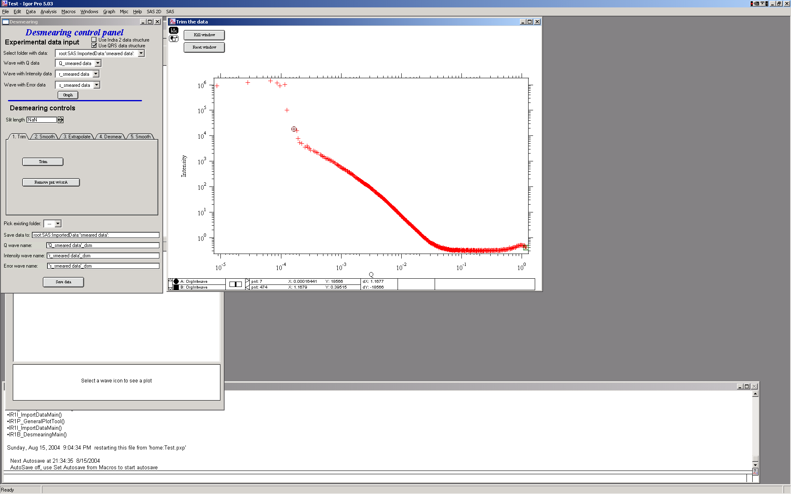
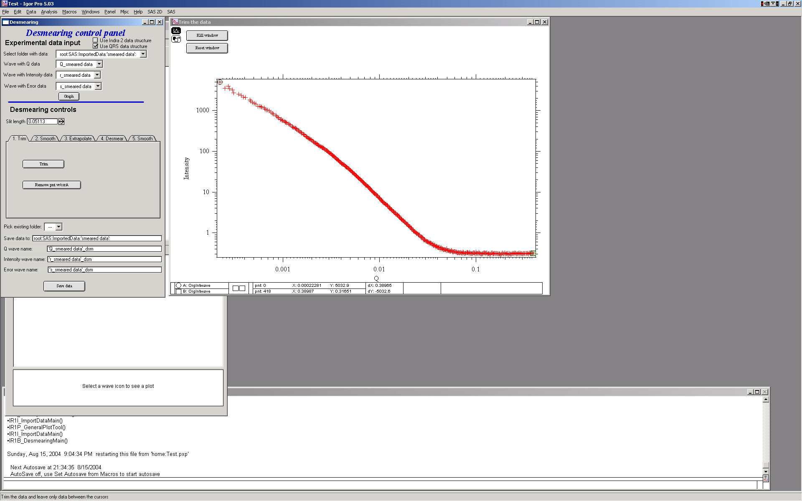
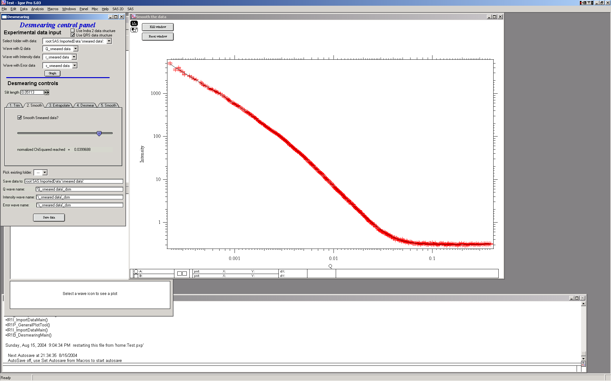
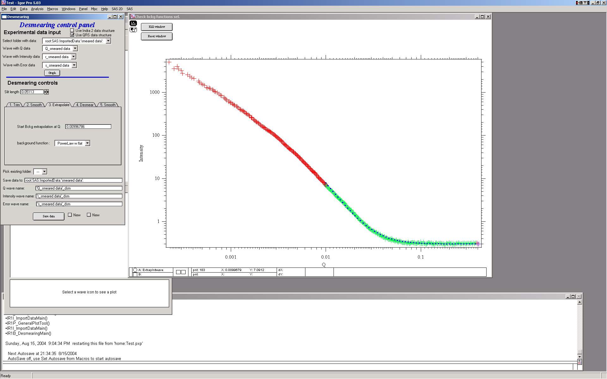
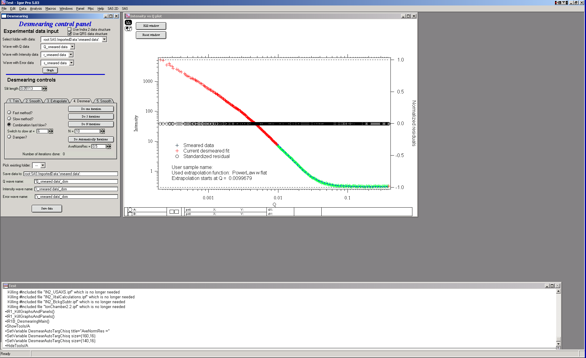
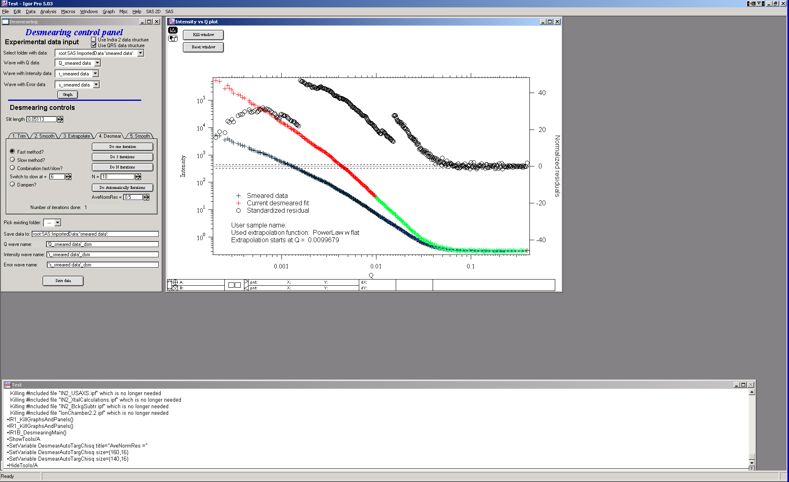
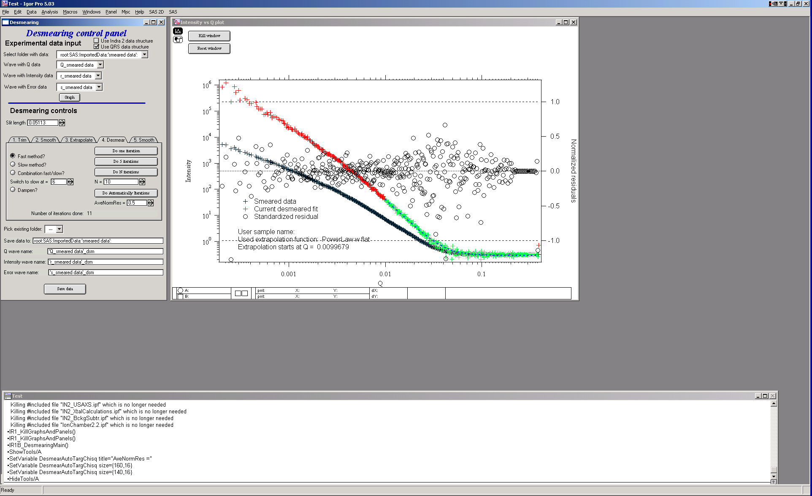
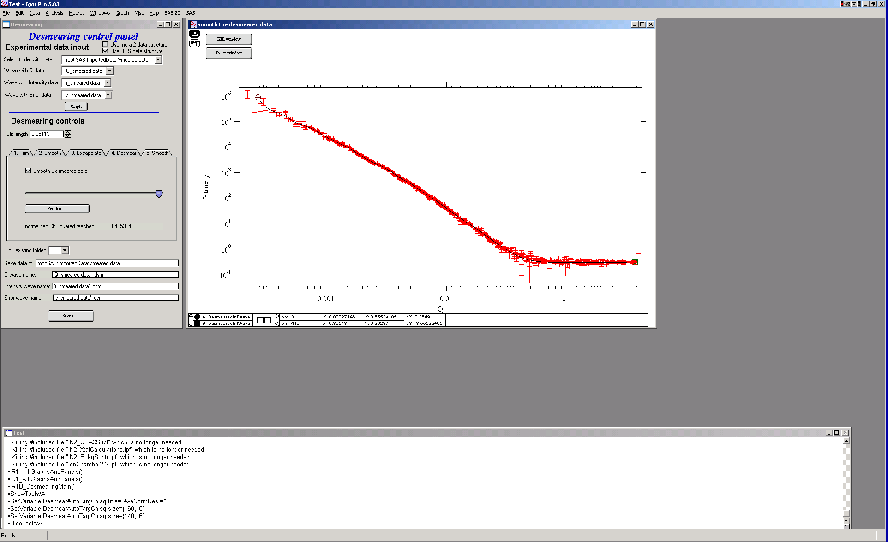

Desmearing
==========

Desmearing routine built in this package is using Lake method (reference), which has been originally programmed by Pete Jemian and then coded in Igor by me. There were some minor improvements over the years, but generally this method has proven itself many times to be robust and reliable. We have verified the function of this method by collecting data from the same sample using both slit-smeared and 2D collimated USAXS. We have verified this method repeatedly and every time the desmearing was blamed for artifacts and unexpected results, we have found another reason for problems. That said, desmearing is always going to increase noise on the data… Note, that the routine will correctly handle data with absolute intensity calibration.

3/10/09 Change in desmearing tool. Per request the tool now allows both
slit length (in direction perpendicular to the q direction) and slit
width (in direction parallel with q direction). Further, the slit can
now have shape of trapezoid, similar to what GNOM allows for instrument
geometry. PLEASE NOTE: for historical reasons the parameters for Irena
desmearing are ½ of the GNOM parameters.

This is the graph:

2\* slit length – 2\*slitLengthL

^^^^^^^^^^^^^^^^^^^^^^^^^^^^^

^^ ^^

^^ ^^

^^ ^^

^^^^^^^^^^^^^^^^^^^^^^^^^^^^^^^^^^^^^^^^^^^^^^^^^

2\* slit length + 2 \* slitLengthL

same geometry applies for slit width.

Once more, if you have parameters used for GNOM, you have to divide the
numbers by ½.

The GUI changes should be easy. Please note, that :

1. If you set slit length or slit width to 0, you assume infinitely high
   resolution in that direction.

2. If you set “L” parameter to 0, you assume the shape is rectangular in
   that direction, not trapezoidal.

**Theory behind the Desmearing Procedure** : See the Lake paper.

**Example of the Desmearing Procedure**

I have included a file with an example data set with slit smeared data (smeared data.dat) where the slit length SlitLength=0.05113. You can import the data this in your experiment using Data import tool…

Comment – if you need to go back in the routine, anytime you  can click on previous tab and return to that place… All from tabs to the right is forgotten and routine restarts on the tab, where you click. It is also possible to skip the smoothing tabs without any penalty – note, that if the smoothing parameters are set (the checkboxes are checked) the data WILL BE smoothed, even when you do not click on the tab…

This is GUI and graph after loading data. Only thing needed is to fill
in the slit length.

The tool is controlled by the tabs. The order which needs to be followed
is the tabs from left to right. For each data set to be desmeared, this
procedure must be followed, selecting in sequence the tabs from left to
right.

1. First step – trim useable data – small and high Q data… Use cursors
to select data range. And then push button “Trim”. You can also remove
any spurious point with the other button and cursor A (the rounded one)

2. Next step – it is possible to smooth data using spline smoothing, but
only if necessary. I strongly discourage this… However, the screen is
next:

Note the slider and checkbox – the checkbox switches on the smoothing,
in that case the slider appears. The slider controls the internal
smoothing parameter - more to the right, more smoothing…

As I said, I discourage this, so let’s remove this in next step.

3. Extrapolating.

In order to properly desmear, I need to smear and that means I need data
for at least 1 slit length BEYOND the last point. Therefore we need to
extrapolate the data using one of selection of mathematical functions.
Most useable one is “Power law with flat” and “powerlaw” or “flat”.
These data suits best the Powerlaw with flat…

Note the colors: red are the original data, green are the original data
used for evaluation of extrapolation parameters and the dotted blue line
is the extrapolated data.

4. Desmearing

The desmearing can be done in steps – one at a time, 5 at a time,
selected number of iterations at once (when you already know how many
iterations are going to be needed), automatically (iterates until
average normalized residual < preset value) or any combination. Also,
there are two modes of conversion for Lake method: aka “slow” and
“fast”. The fast method is overall the best method to use, the “slow”
method iterates much slower and can result in negative number for
intensity.. Combination methods – “Combination”, and “Dampen” attempt to
use “fast” method (as main) and reduce formation of noise characteristic
for this method. In both cases normalized residual for each data point
is during each iteration compared. For combination method, if the data
point is already estimated to within the user selected precision of
input data (normalized residual < User input value) the point is further
dersmeared by “slow” method. For dampened method, if the point is
estimated to normalized residual < 0.5 it is not desmeared anymore at
all…

This should reduce some of the noise created at high-q data during
larger number of iterations while keeping the fast convergence of the
“fast” method.

Let’s select the “Fast nethod” here, for simplicity.

Do one iteration:

Explanation: Red/green data are current desmeared data (see above about
extrapolation). Crosses are original data and circles are normalized
residuals.

Desmearing should continue until the plot of the residuals becomes
featureless with scatter distributed randomly about z=0 (where z is the
standardized residual). Convergence is achieved when the residuals do
not readjust to a significant extent between consecutive desmearing
iterations. Acceptable convergence is always at the judgement of the
person doing the desmearing.

For many data sets, 10-20 iterations are sufficient. Other data sets
(those with more structure in the scattering curve) may require as many
as 50 iterations or more to satisfy the convergence criteria of the
user. For this example data set, this is about where one may end – 10
iterations and most of the circles are within +/- 1. There are some
points at low Q which may need more iterations, due to the use of the
combination method. (The fast method would have resolved this with fewer
iterations.)

5. Final smoothing

Here one can smooth data… This is probably a better place to smooth, if
necessary at all.

6. Save data

Use the bottom part of the GUI panel to save data in folder of your
choice. The folder, if it does not exist will be created.
