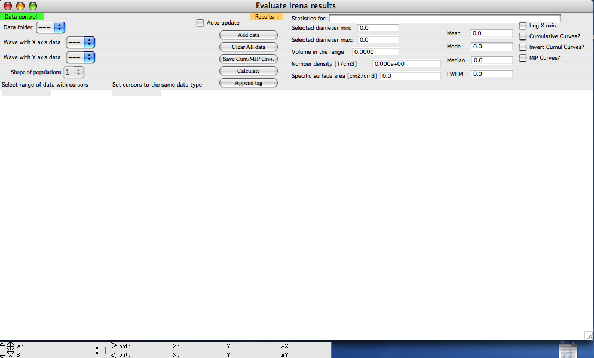
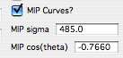
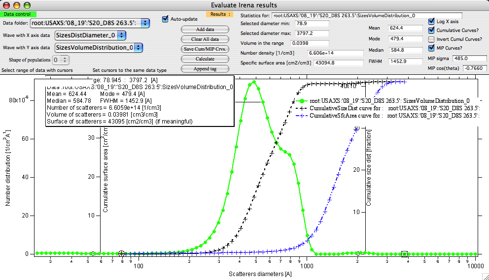
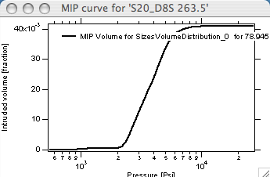
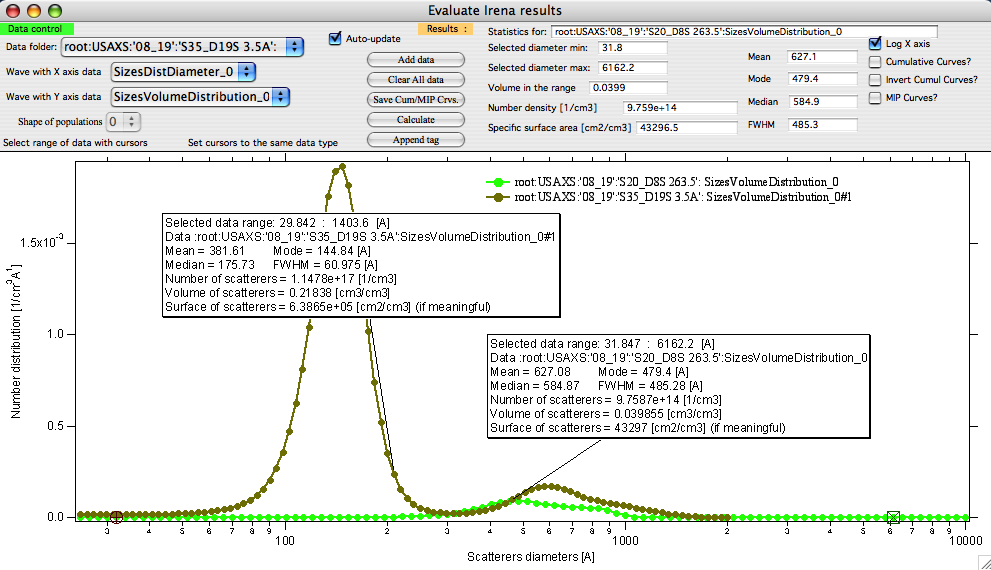

Evaluate size distributions
===========================

This is tool to obtain various details about size distributions – such
as results from Size distribution, Modeling I and Modeling II tools.
User can obtain mean/mode/median size in range selected by cursors,
volume, surface and number of particles (per cm\ :sup:`3`) and generate
cumulative distributions and even mercury intrusion (MIP) curve
(intruded volume with respect to pressure in Psi).

Number of size distributions can be included at one time in the graph,
but the graph will become crowded very soon…

**Description**

Select “Evaluate size distributions” from the SAS menu.

This tool has all controls in the Control bar at the top of the graph
window. For MIP data a new window will be opened. It is also important
to follow the history area, as this tool prints important information
into there so the user is informed about specific needs or events…

Data selection controls are top left corner. This tool should know all
results data from Irena for which it makes sense to be used. If any data
type is missing, please let me know and I will add it.

Select data folder and if more than one of useable data types is in that
folder, select appropriate data types. You will see only folders, which
contain at least one useable data type. You may have to select both X
axis data and Y axis data. Very little checking is done on sensibility
of the selection here, so be careful.

The usually grayed popup “\ *Shape of populations*\ ” will be explained
below…

Next are buttons with following functions:

“\ *Auto-update*\ ” checkbox – if selected all data are recalculated
when cursors are moved. Note, that cursors have to be on the same data
set , or the results all will be NaNs.

“\ *Add data*\ ” – when data set is selected this button adds the data
set into the graph

“\ *Clear all data*\ ” – will remove all data from graph and clear it.

“\ *Save Cumul/MIP curves*\ ” – will save new data into the data folder
with the original data. Saves the new curves, which exist at that time.
Both cumulative size distributions and/or MIP curves. These data can be
exported by using the Data export tool.

“\ *Calculate*\ ” – if the “\ *Auto-update*\ ” checkbox is not selected,
this forces recalculations. Again – if the cursors are not in the graph
or not on the same wave, no numbers are calculated!

”\ *Append tag*\ ” – appends descriptive tag to the graph, so more
different data sets can be compared together.

Now the results part:

“\ *Statistics for*:” … is string with the name of data on which the
cursors are and for which the data are calculated.

“\ *Selected diameter min*\ ” and “\ *max*\ ” – diameters of current
cursor positions so you know where the data are calculated

“\ *Volume in the range*\ ” – fractional volume of scatterers in the
range between cursors. Calculated with correct formula for volume of
give form factor used.

NOTE: for distributions from Modeling I and II it is impossible to
decide for the code, where which formula for volume should be used. So
if one combines different shapes, there is practically now way one can
correctly calculate all of these numbers. Therefore the code will make
available the popup “Shape of distributions:” and one can select which
shape should be used for the calculations. This is meaningful if the
populations are reasonably separate and one knows where which shape
dominates. This is problem when one is converting between distributions
– so if one is using volume distribution, the volume is correct at all
times as there is not conversion needed, but the number of particles may
be wrong. If one is using number distribution then number of particles
is right but the volume may be wrong. Specific surface area is likely
affected all the time, unless one has the right shape. Simply – be
careful when using Modeling results with more than one shape of
scatterers.

User is informed about need to select right shape by printout in the
history area:

***“These data may contain mixture of shapes for different populations.
Please select the right population number to evaluate”***

This is not problem when individual distributions are saved together
with the total distribution and evaluated. In such case the code will
select correct shape for volume calculations and conversions…

“\ *Number density*\ ” is number of particles per cm\ :sup:`3` for data
between cursors.

“\ *Specific surfaced area*\ ” is specific surface area between the
cursors.

“\ *Mean*\ ”, “\ *mode*\ ”, “\ *median*\ ” are values evaluated for
GIVEN DISTRIBUTION between cursors – evaluated numerically. Note, that
of course these will be different for number and volume distributions.

“\ *FWHM*\ ” is full width at half-maximum value evaluated numerically.
This is ONLY meaningful, if the data resemble one single peak. There
will always be number there, but it may be not useful if the data are
not one single peak.

Last column of checkboxes:

“\ *Log X*\ ” sets diameter axis (x axis) to log scale.

“\ *Cumulative curves*\ ” forces calculation of cumulative curves

“\ *Invert Cumul. Curves*\ ” forces the 0 to be at large sizes. There
are some cases when this is useful…

“\ *MIP curves?”* – if selected MIP curves are calculated and new window
with them opens. Few other controls appear also:

These are two parameters used for MIP calculations. These are generally
used values, user can change them if he/she wishes. Sigma is in dynes/cm
and cos (theta) is unit less, theta is wetting angle between the
material and the mercury…

**Example**

The green data are original data, cursors select the range, which is
being evaluated, black curve is Cumulative size distribution volume (it
has its own axis on right) and blue is cumulative specific surfaced area
(has axis mid left). Tag contains summary of results. Since the MIP
curves checkbox was selected, MIP graph was created:

If user chooses to save the new data now, both Cumulative curves as well
as MIP curves are going to be saved in the original data folder for
export or future use.

Example of comparison of two data sets and use of tags to display
results for both:

**New data created**

If the user chooses to save the cumulative and/or MIP curves, new data
are created in the folder with original size distributions from which
these were created. These are named:

MIPVolume\_XX

MIPPressure\_XX

CumulativeSizeDist\_XX

CumulativeSfcArea\_Dist\_XX

CumulativeDistDiametersDist\_XX

With XX being index to guarantee uniqueness.

The index choice is quite complicated and may result in confusion… So
here is explanation:

1. First the index of the original data is tested – if Original Data
       were “SizesVolumeDistribution\_2”, then the code will test of the
       index 2 is available. If yes, it will save the data and print
       result in the history area.

2. If this index is not available, Message is displayed for user and
       index is increased. User needs to make sure he/she makes note of
       the right index and keeps notes on this… I have not found more
       sensible system yet.

When saving data user is informed by printout in the history are what
data were created and what generation they were saved in.

Example:

Saved Cumulative data to CumulativeSizeDist\_02 /
CumulativeSfcArea\_Dist\_02 / CumulativeDistDiametersDist\_02 in folder
root:USAXS:'08\_19':'S20\_D8S 263.5':

Saved MIP data to MIPVolume\_01 / MIPPressure\_01 in folder
root:USAXS:'08\_19':'S20\_D8S 263.5':

Note, the waves contain descriptive wave notes which can be exported
with the ASCII data as header or searched through the Data miner tool.
