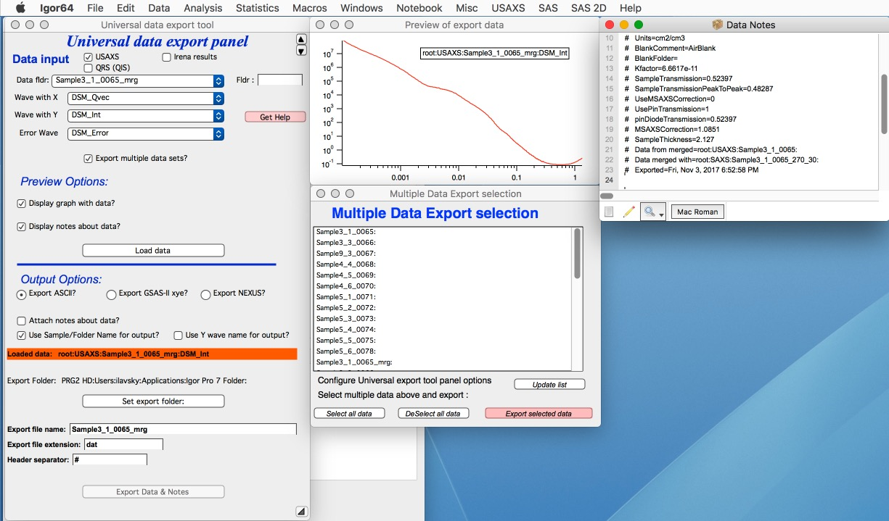
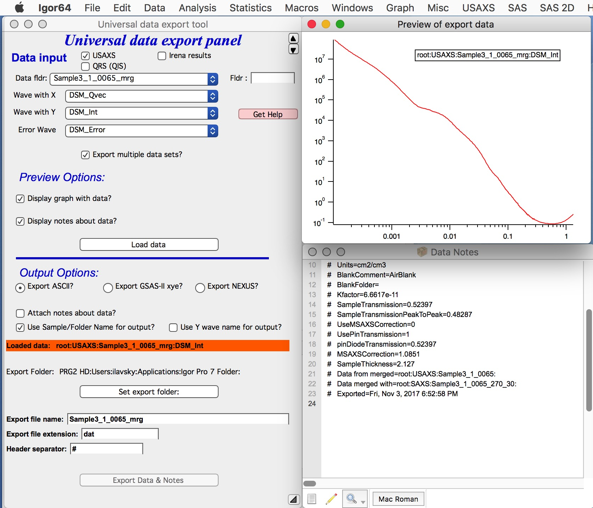
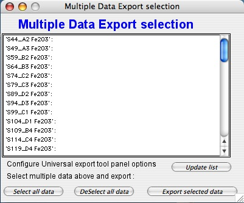
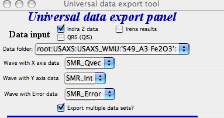

.. _export_data:

.. index:: Export data

Export data
-----------

Irena produces large number of data sets, which can sometimes be exported when created, but more often not. While the most convenient use of the data is within Igor experiment by plotting or processing further, many users may want to use another programs. And then it is imperative to export them as ASCII or Nexus (NXcanSAS) files. This is the tool for that…

*There are two options you have :*

* Export data GUI tool - this one lets you export one or more data sets as various data types
* Export all Intensity - Q - Uncertainty - (dQ, resolution) as one NXcanSAS file.

Export all data as NXcanSAS
===========================

This tool is intended to provide quick and fast way of exporting all data as one NXcanSAS hdf5 file for use in other software packages. The purpose is to give users using Igor data reduction tools Nika and Indra (USAXS) to export quickly and efficiently all data for use in tools like sasView. Actually, I tested sasView (5.04) and can confirm, that it can be used with these files.

*What this tool does?* This is very simple script which has very little user interaction. When run, it will scan current Igor experiment for data types "USAXS" and "QRS". It picks location fo current Igor experiment, for example Desktop. It reads name of current Igor experiment, for example "MyDataReduction". It then creates a new file in the same location (here Desktop) with name "MyDataReduction_nxcansas.h5" and writes there all USAXS and QRS data types from current experiment. If this output file already exists, it will ask user if user wants to stop or overwrite the file.

*Resolution handling* : Igor code creates in most cases Q resolution wave dQ, which is available with the data. It is not used in Irena except if user really wants in Modeling package. This dQ wave may not properly pass through various data manipulation tools - it is difficult to pass it through all Data manipulations or Data merging. Here is what happens in specific cases:

* QRS data - if dQ exists, it is written in NXcanSAS file. sasView can handle pinhole smearing well and for QRS data we can assume data are pinhole.
* USAXS data - desmeared - dQ is set to 0 values and sasView will ignore the dQ values. In my testing sasView produced artifacts at lowest Q values of USAXS range. Irena has some tricks internally to (at least partially) prevent this. In this case, users are better served with dQ=0.
* USAXS data - *slit smeared* - in this case we write two dQ arrays in NXcanSAS file. One is set to slit length and called "dQl" and one is set to instrument calculated resolutions dQ and called "dQw". If dQ=0 due to any data manipulations, dQw=0, but dQl = slit length. This is critical since sasView reads these two resolutions and uses dQl to smear properly data by the slit length.

If you plan to use sasView for data analysis, this simple export script is very convenient way of extracting all data in current experiment and passing them correctly in sasView.

Export data GUI
===============

This GUI tool allows users to export one or more sets of data - USAXS data, QWRS data, or Irena results data (model results) as one or more ASCII or NXcanSAS files. It is very flexible and convenient, if you need only some data exported. It is also the only way to get (easily) out if Igor Size distributions or other modeling results.

   :align: center
   :width: 480px

Above are standard set of controls. Select data in the top part of the panel. Than decide – do you want to see graph of the data? Do you want to see any associated notes (Irena writes a lot of stuff in the wave notes)?

Push button “Load data”

Note the “Export multiple data sets?” checkbox. It opens the Multiple Data Export selection panel. This panel enables exporting of many data sets at once. The correct use of this option is to export one data set manually (sets all parameters and export paths), test one data set and then use the Multiple Data set option…. See comments later.

Now we have graph and list of notes. Note, that no attempt is made to create sensible graph. You may have to modify the graph manually if needed.

Next select Output options:

**Select what type of data you want to export. Choices are:**
  1.  ASCII data
  2.  GSAS-II compatible (ASCII) xye data
  3.  Nexus (HDF5) data using Nexus NXcanSAS definition

***File type descriptions:***

**ASCII data** are data exported as ASCII (=text) with header information (see below for header separator) in columnar format, columns are separated by tabs (white space). Exported can be anything - Q/Int/Uncertainty, Size distribution, Model fits,... Anything X-Y-(E) data can be exported this way - and imported in other packages. No conversions are done - what units and data type is selected, that is exported. This is most flexible and compatible export tool.
*NOTE* If you export slit smeared USAXS data - make sure you record slit length and keep that in your notebook. I tested sasView 5.04 and it seems to work just fine, if you provide slit length as dQl value in resolution tab for model.

*For standard Q/d/2Theta - Intensity - ... :*
The first column is Q (or d, or twoTheta), second is intensity, third is uncertainty to intensity, and fourth is q (d, or 2-Theta) resolution.

Now, more details : *Q* is [1/A], d is in [A], 2-Theta in degrees. *Intensity* may be on absolute scale - or may not, depending on what user does in Nika or what the data were imported. *Uncertainty* to intensity - this depends on user setting in Nika, where there are three different methods for uncertainty calculation. This is pain as there is no clear ideal uncertainty calculation method. Users should always assume these uncertainties are “estimated” values. But no one can do any better anyway… *Q* (d, twoTheta) resolution is convolution of pixel size, beam size (if set in Nika) and Nika’s binning of Q points (unless you use max number of points). It has Q units and is used to smear models in packages which can do so. It is rarely used - sasView can use that and Irena Modeling can use it also.  Luckily, it is rarely needed. So this one you can most likely ignore.
*If you use Indra (USAXS) data reduction* the uncertainty is estimated value using quite complicated formula in Indra and q-resolution is calculated from number of parameters of the USAXS instrument. You can trust those values quite well.

**XYE GSAS-II compatible** are ASCII data specially formated so GSAS-II package can load them in. The tool will take Qvector - or - d spacing - or - Two theta + Intensity and Uncertainty data and export them with header in manner which is compatible with "xye" imported in GSAS-II and likely other powder diffraction/WAXS packages. Any input data care converted to TwoTheta-Intensity-Unceertainty and exported with proper header. Note that this is really useful ONLY for powder diffraction (WAXS) data reduced by Nika package, it is not useful for SAXS or USAXS!

**Nexus** exports Nexus NXcanSAS data. This is HDF5 contained with data written in such way, that they are easily exchangeable among different software packages. This is future of SAS data formats. Irena can import such data if needed back - with all metadata properly passing through export and import. Since metadata names and keywords are defined in standard, all including units should be exchanged easily... *NOTE* If you export slit smeared USAXS data - the tool will write in NXcanSAS file two resolutions sets of data. One is called dQl and is set to be slit length. Second is called dQw and is set to dQ values from Indra/Nika data reduction. If you use data manipulations/merging dQw may be set to 0 as it may be impossible to pass through the data manipulations/merging. Either way, I tested sasView 5.04 and it reads correctly both dQl and dQw and smears model properly. And automatically.

**Other controls**

*Attach notes* about data will attach the wave note into the ASCII file. Note, at the bottom of the panel is field where one can insert the separator character (including spaces) if different than default is desired.

*Use folder names for output* - if you are using folder names as names for samples, this is sensible…

*Use Y wave name for output* - if your Y wave name is sample name (e.g., qrs data this type). rarely useful.

*Set export folder* set where to store data. Cannot create folder, create first, then set here. The folder is displayed din red box above the button.

*Export file name* modify, if default is not good enough

*Export file extension* set to .dat for ASCII, .xye for GSAS-II data, and to .h5 for Nexus. For ASCII can be modified as needed. Leave the other as they are.

*Header separator* - useful for ASCII only, change if different is desired. Include spaces, if these are desired!!!

***"Export Data & Notes"*** button does the job. If the data in the target location exist, you will be asked if you want to overwrite them. It may be easier to delete files from the target location instead of overwriting, if you need to overwrite many.

Multiple data set export option:

There are few items one needs to know about this tool.

1. If you make changes to the main panel, the list of folders in this panel may get stale. Use button “Update list” to update it.

2. There is logic in listing the data which is actually quite complicated… Here are some comments:

a. The tool started to search for data from parent folder of data selected in the main panel. In the current selection :

The tool start searching from root:USAXS:USAXS\_WMU: - if you cannot find your data, select different starting folder in the main panel and update the list. This is to reduce clutter and help users with giant experiments…

For **Irena results** The tool will search for not only the same data type as selected in the main panel, but also same generation! Therefore, if you have in some folders saved multiple results from same tool (you have waves with results like: SizesVolumeDistribution\_0, but in some also SizesVolumeDistribution\_1, SizesVolumeDistribution\_2, etc…) the tool will search only for generation (“\_0”, “\_1”,…) selected in the main panel. It just gets really messy to create different logic.
