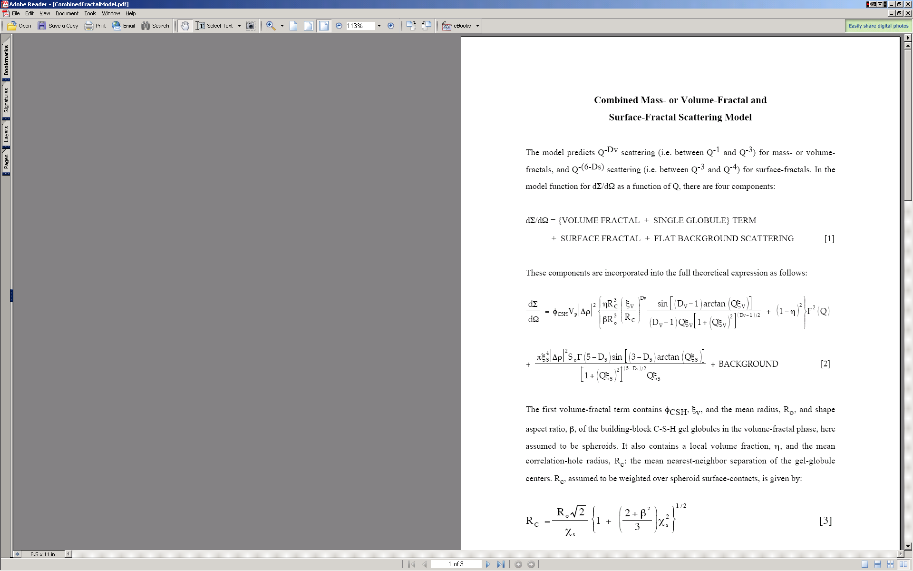
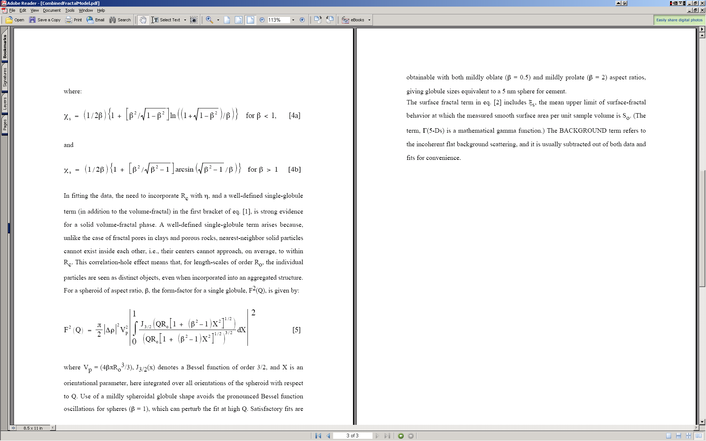
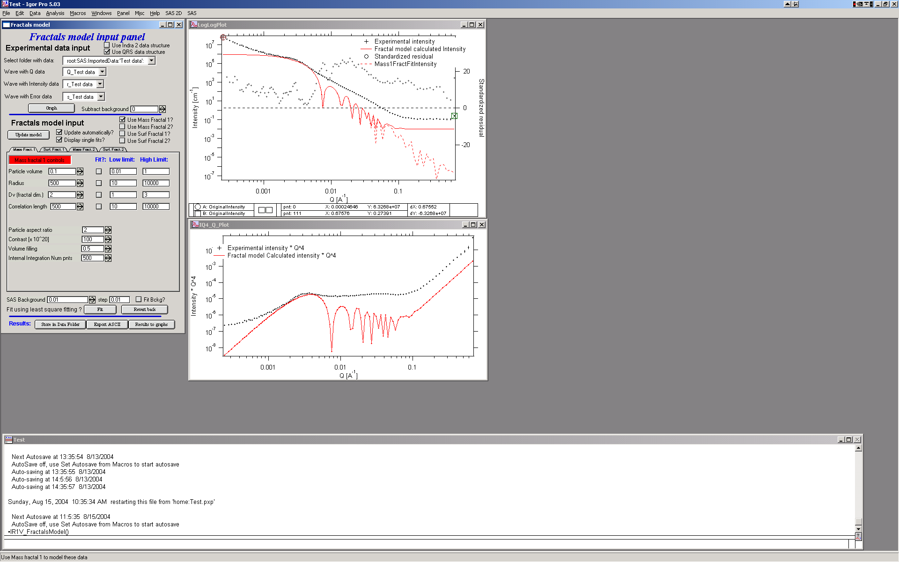
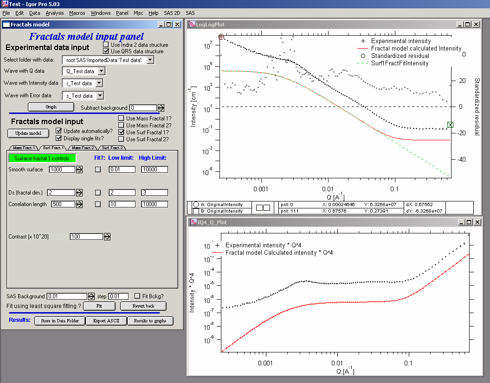
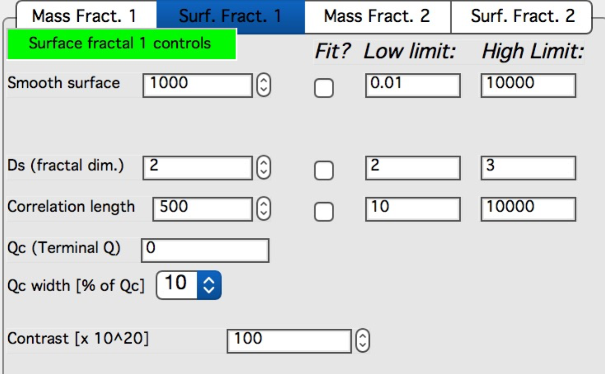

.. _model.Fractal:

Fractal model
=============

.. index:: model; Fractal

This model has been developed by Andrew J. Allen from NIST (Andrew.allen@nist.gov). The model allows to combine two volume and two mass fractals in much similar way as the Unified model does. The parameters from this model have advantage of being more “fractal-related” than the values from Unified. There is short pdf file included in the distribution, which served as basis for my design of this tool. Note, that this tool is actually port of Andrew's original Fortran code into Igor, my code was verified to give same results as this Fortran code.

Note, that this write up was written for studies of cement and therefore some of the terms are material-specifically called.

**Model description**

**Use**

I do not have included real fractal data, but for purpose of GUI description and function description, the included data should be sufficient.

Start the tool from SAS menu under “Fractal model”. GUI panel similar to all other tools appears, select “Use QRS data structure” and pick the data set available. The push “Graph” button to create graphs.

Note, that the “Subtract background” variable next to data selection allows to subtract known FIXED large background. The “SAS Background” at the bottom is similar term, but this one can be fitted during the fitting routine.

**Select “Use mass fractal 1” for starters and other checkboxes as in image below:**

Note, that you can combine ANY combination of the two mass fractals and two surface fractals.

Comments on Mass fractal parameters:

Most parameters should be closely related to the ones mentioned above in description of the method.

**Particle volume** – volume of particles

**Particle radius** – size of the particle

**Dv** - fractal dimension

**Correlation length** – distance between the particles

**Particle aspect ratio** – 1 if particles are basically spheres, larger than 1 – elongated particles, lower than 1 prolated particles. Particles are always spheroids.

**Contrast** – contrast…

**Volume filling** – see above

**Internal integration Num pnts** – internal parameter. Number of point in the numerical integral which I use to calculate orientational average of the particle form factor. Small number of points (especially at high aspect ratios) can cause artifacts. Large number of points increases significantly calculation time. My suggestion is to lower the number of points to find a good starting conditions and for final fitting may be increase, or to recalculate for testing results with higher (double) number of points at the end – if no change is observed, the number of points is selected correctly.

Suggestions: check solution for particle aspect ratio 2 and 0.5, keep integral integration num of point reasonably high (over 100 for sure, likely around 500) and change it only if you seem to see artifacts. Keep volume filling between about 0.4 and 0.6.

**Now select “Use Surf Fractal 1” and deselect the mass fractal:**

Bottom picture shows updated Surface Fractal panel.

Comments on surface fractal parameters:

Again, for meaning check the description above.

**Smooth surface** – limits of smooth surface as described above

**Ds** – fractal dimension

**Correlation length** – correlation length as described in the theory

**Qc (Terminal Q)** – Q value at which scattering reaches smooth surface and turns into Porod’s scattering (Int ~ Q\ :sup:`-4`).

**Qc width [% of Qc]** – smoothing parameter for the turn over in the function used to enforce the Qc. Typically 10%, can be 5, 10, 15, 20, and 25%.

**Contrast** - contrast…

Method of finding the solution is same as with Unified fit – first manually find good starting conditions and then select appropriate range of data with cursors and use fitting (select appropriate parameters to fit) to optimize data using least square fitting…
