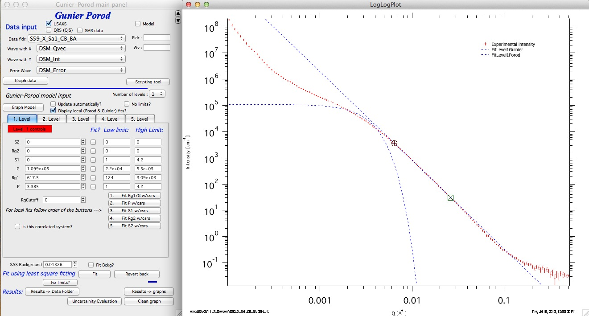
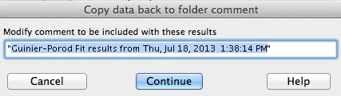

Guinier-Porod
=============

**Introduction**

This model was developed by Boualem Hammouda (NIST) and published in "A new Guinier–Porod model", J. Appl. Cryst. (2010). 43, 716–719. In many ways it is similar to Unified fit model, but there are important differences. I strongly encourage users to read the basic papers on the theories - both Unified fit & Guinier-Porod. If you have difficulties getting the manuscripts, let me know and I'll pass you the pdf copies.

Next text is dumbed down version of explanation of differences, more or less ... for dummies version. It is imperative to read and understand the theories behind these theories - they are not simple for sure. Do not complain you get different results form Unified vs Guinier-Porod. It shows lack of understanding of the theories - so get reading the manuscripts again, please...

**Simple description of Unified-Guinier-Porod differences**

Unified fit models scattering as system, of "levels" composed of Guinier and power law (Porod) areas (in simple case).

Guinier-Porod models scattering as system of levels composed of Guinier and Porod (power law) areas (in simple case).

They are NOT same, though.

In Guinier-Porod model each level represent ONLY one particulate system. For particle with one dimension we have one Guinier area and one power law area. By assuming this is one system of particles adhering to Guinier and Porod law some relationships between volume and surface area are known. This reduces number of parameters. For particles with more dimensions (e.g., rod with two major dimensions) we can have two Gunier areas and two power law slopes, for particles with three different dimensions, the code has only two Guinier areas (assumes the third dimension is so large that its Rg cannot be seen - which is acceptable assumption usually) and three power law slopes. There is ONLY one parameter related to "volume" of these particles, parameter G.

See pictures copied from the Hammouda manuscript for particle with one dimension (sphere) and two major dimensions (cylinder):

The important to note here is, that one "level" in Gunier-Porod model can describe particle with multiple main dimensions - it has 6 parameters!

Basically each "Level" in Guinier-Porod model can be better described as form factor for particulate system. To describe similar scattering in Unified fit one would need multiple levels, connected with proper use of R\ :sub:`g`\ cuttoff. Even though each level in UF has less parameters that GP level, complex system in Unified fit needs many more parameters - which means that chances getting physically unreasonable solution are much higher.

From above it seems the Gunier-Porod model is better - less parameters, more compact description...

However, there is a problem here. For systems, which do not adhere to Guinier-Porod model assumptions, cannot be modeled by the Guinier-Porod model at all. For example, these would be hierarchical fractal systems, particulate systems with broad size distribution, etc. For example, it is possible to use Unified fit and from Gunier/Porod areas mismatch calculate log-normal size distribution - this is impossible in Guinier-Porod model.

Another words, as far as I can say, Guinier-Porod model is superior in limited number of cases where the scattering system satisfies its assumptions well - such as relatively monodispersed particulate systems. In other cases Unified fit may be the more generally applicable model. Even though it may be more challenging to use.

**How to use Guinier-Porod model**

Parameter description

Note, that my experience from development of this tool is that getting fit with Guinier-Porod is much more challenging, especially for USAXS *slit smeared* data. So I had to write much more involved & careful procedures for fitting local parameters. This tool follows as much as possible the use of the Unified fit.

**NOTE: It is imperative to do local fits in order described on the panel or else those fits results go crazy**

**Main panel:**

Main panel contains, as usually at the top part data selection controls. These are same as for the other Irena tools, so I am not going to explain them here. Just select the data naming system you are using, select data and then push button "*Graph data*".

Note, that this tool can be scripted by use of the Scripting tool, which can be opened by the button "*Scripting tool*".

\*\*\*\*\*\*\*\*\*\*

Next controls above the tab area for Levels themselves:

*"Number of levels"* popup menu selects how many levels one is going to use. Read later that correct procedure is to build one level, then add second, third,... I would be really shocked if more than 3 levels were ever needed...

*"Graph model"* button, this button forces recalculation of model based on current parameters for GP model.

"*Update automatically*" checkbox forces automatic recalculation after any change in this panel. Basically always pushes the "Graph model" button. Useable on fast computers, on slow ones may be annoying.

"*Display Local Fits"* Forces display of local Guinier and power law slope fits. Useful to check if the local fits seem reasonable. Note, that these local fits are calculated ONLY when local fits are done, so do not expect them there always.

"*No limits*" This checkbox removes limits from fitting. This seems to be useful as some of the parameters (like G) keep changing over many decades in this model.

Tabbed area with input Guinier-Porod model parameters, will be described later.

Below tabbed area we have Background (self explanatory I assume).

**Buttons**:

"*Fit*" Least square fitting of the GP parameters, selected by their checkboxes, between the data selected by cursors.

"*Revert back*" If the least square fitting fails, this returns in the parameters from time before the last fit.

"*Fix limits*" This button will reset limits around current values for the parameters. Easiest way to fix limits if you get "reached fitting limit" message after the fit.

"*Results ->Data Folder*" Copies the current results into the data folder so they can be later exported, plotted, their wave note checked for parameters etc. Simply creates what Irena calls "results".

"*Results ->Graphs*" Adds tags into the graph with parameters listing. Easy way of creating annotated graph with results.

"*Clean graph*" Remove the tags from the graph.

"*Uncertainty evaluation*" Evaluation of uncertainty same as available in Unified fit and Modeling II.

**Model Parameters** (tabbed area):

Here is displayed set of parameters for one Gunier-Porod level. It is ordered from at the top of list S2 which effects data at low-Q to last parameter P which effects data at high-Q. The local fitting or parameters selection itself needs to be done in order of the buttons, not from the top to bottom. The layout of this panel may be redone later, if it is clearer how users will understand/use this tool. I think this is confusing, but it is still more logical than the other options...

So listed are parameters P, Rg1, G, S1, Rg2, S2 which are parameters for GP model itself.

Compared to the GP model as described in the manual we have few more parameters I feel are important. RgCutOff which has the same function as in Unified fit - it terminates the scattering of the level in case it is hierarchical (large feature) structure built from smaller particles represented by other level. What is RgCutOff gets really complex question for non spherical particles, so this is mostly for advanced users...

"*Is this correlated system*" - I have added option to use also *Interferences* structure factor, same as in Unified fit. Again, use of this type of structure factor for anything else than spheres may be totally inappropriate scientifically.

**Fitting procedure**

Here is example of relatively simple data, which can be fitted by UF two
level model:

.. image:: media/GunierPorod4.png
   :align: center
   :width: 100%

Let's walk through the procedure...

1. Select "*Number of levels"* as 1. Select with cursors range of data, where the Guinier area is and push button "*1. Fit Rg1/G w/csrs*". DO not worry about checkbox "Fit?", starting parameters, or limits. All is handled automatically. Note that "*Display local (Porod & Guinier) fits?*" checkbox is set automatically for you.

We get Guinier fit which should make some sense. Move cursors to higher Qs above the Guinier area where Power-law (Porods law) should apply. Hit button "*2. Fit P w/csrs*".:

Fit looks good. Now we can push the button "*Graph Model*" (or simply check the checkbox "*Update automatically"*) and we should see current GP model:

Now we can add some background (0.03 is good guess reading high-Q value from the graph), select range of data where Guinier area and power law slope influence the data (including high Q where background has impact). Check the checkboxes "*Fit?*" for G, P, Rg1, and background. Then do the fit (with the "*Fit*" button).

If we reach the limits, we can push the button "*Fix limits?*" and run again - or we can check "*No limits?* checkbox to remove fitting limits altogether. GP fits seems to be Ok with no limits...

Next we need to add S1 area as the data do have power law slope following from the Guinier area. We can select the low q power law slope and use button "*3. Fit S1 w/csrs*".

I disabled here the automatic updates to make this clearer... So now we are adding the slope S1. With the slope around 1.6 we are looking at particle somewhere between rod (S1=1) and disk (S1=2)... We should now select data from the point where rounded cursor ("A") is now and high-q, add checkbox "*Fit"* for S1 and fit the whole range of data.

Here is current fit. This is good fit and most of what the data allow... With more data we could continue, do local fit to Rg2 and possibly to S2 area - if we had really data for this.

But we see the low-q power law slope. Something else is likely there. Depends on the system, but these are USAXS data and they "see" sizes over micron large and so these may be some large particle surface, bubbles, simply surface of the sample etc. We can model this with second level of GP. In this case the second level will not have even the Rg1 as we see just the power law slope. On Unified fit we would remove the Guinier area from model by setting G=0 and Rg=1e10, but here we cannot set G to 0 as it is the only "volume" parameter (all the intensity of a level is given purely by one G value). So I built in another trick. One can set Rg1=1e6 and then use G and P to match this power law slope...

Add level 2 in the system (popup menu "*Number of levels*") and click on tab of level 2. Set Rg2 to 1e6. This is important as it switches internally the calculations to handle case when only power law slope exists... Use now button "*2. Fit P w/csrs"*.

Note that the G and P have changed. For fitting purposes of he level 2 one needs now to fit G and P, but NOT Rg1. That will be fixed to 1e6 since we cannot see it. If the Rg1 would be smaller than 1e6 it would be assumed to exist as in regular level.

Now I select the whole range of data. For level 2 I fit P and G, for level 1 I fit P, Rg1, G, S1, and I also fit background. I can disable fitting limits for simplicity; it will not cause problems in this case.

Above is the best - justified purely by scattering - model for these data.

One can modify it more by adding some physics into it - like power law slope of 5 at low Q makes typically no sense, slope steeper than 4 is unusual and surely very rare on low-q data... Since the data there are of limited range to guarantee reliably power law fit anyway, we can therefore force P=4 for level 2 (Porod). The quality of the fit will decrease a bit, but the result will be more physically justifiable. We might also know that the level 1 particle has another main dimension (may be 400nm?) and so we might be able to put that in. Even though it is not justifiable based on SAXS data, it may help to make the results more physically appropriate, if we have good justification for it. Here is what we would get...

When we are done, we can store the results in the data folder using button "*Results->Data Folder*". Remember to set meaningful title in the dialog:

The tool will save, as does the Unified fit and other tools, "Results" waves with Intensity and Q vector: "*GuinierPorodFitIntensity\_N*", "*GuinierPorodFitQvector\_N*", where N is "order" number. Every time you save new results, this order number will increase - so keep the number of saved results to sensible number and make notes... Both of these waves have in their wave notes all the GP parameters. These can be exported through ASCII exporter, they can be plotted, you can extract values through "Data mining" tool, etc. Also, if you decide to load the data from this folder again into the GP tool, you get a choice and can recover the current parameters:

