Important Information
=====================

The code uses for all size related parameters Angstroems (10:sup:`-10`
m) or for Q vector (A:sup:`-1`). In the case of scattering contrast,
number distribution and any other volume contents centimeters
(10:sup:`-2` m).

Output of the size is *usually* in particle diameters, but Modeling II
is using radii as default (and diameters optionally), but read the
graphs, the output may not be always the same. Output graph legend or
panel text should be always correct.

Slit smeared (USAXS) data
-------------------------

Fitting slit smeared data is major *Irena* **advantage**. It is nearly
**ALWAYS** better to fit slit smeared data than to desmear the data and
then fit them. However, up to version 2.58 *Irena* had limEitations when
fitting smeared data: due to need to smear data and the way it is
handled by *Irena* routine, the modeled range of data (the high-\ *q*
selected for modeling, fitting) had to be larger than slit length.
Typical slit length of the USAXS instrument is 0.02-0.03 A\ :sup:`-1`,
so the high-\ *q* range needed to be at least 0.05 A\ :sup:`-1`. This
meant, that it was not possible to select for modeling data from
small-qs to only 0.02 A\ :sup:`-1` ONLY.

For version 2.58 and higher this is fixed by adding additional Q points
(up to 100 new points) to extend the data to 2\* slit length and after
the model is calculated and slit smeared, the data are truncated back to
original user range. This is done automatically, behind user back – but
note, that it can cost cpu and therefore increase time per calculation
of the model. Therefore, it may be worthwhile to simply select high
enough Qmax for fitting anyway.

Per point smeared data by Q resolution
---------------------------------------

New in version 2.58 and only for Modeling II at this time,

Kill all Irena panels and graphs
--------------------------------

This menu item allows closing all Irena related windows – panels and
graphs – to be closed at once. Very convenient…

Open Irena pdf manual
---------------------

In most cases this should open Irena manual in default pdf reader. If
you are reading this, you probably managed. Better is to access manual on te web site: http://saxs-igorcodedocs.readthedocs.io/en/latest/index.html

Open Form factor description
--------------------------------------

This should open pdf file with form factors description – including
simplified code and graphs. These are form factors in the “central bank”
of the Irena, available for use in packages, which use them.

Check for updates
-----------------

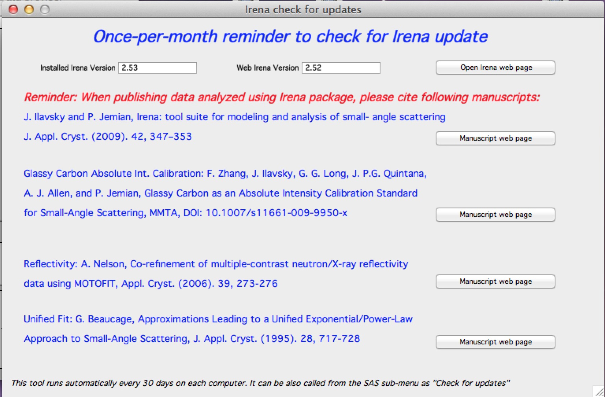

From version 2.52 I have added once-per month check for updates, which
on ANY computer runs every 30 days. It checks installed versions of the
packages and web available versions. It also reminds you about need to
cite manuscripts related to the Irena and tools implemented in Irena.
Please, cite those manuscripts as necessary.

You can get this panel opened any time from SAS>Help, About,...>Check
for updates

The buttons open appropriate web pages in your web browser.

Location of items in SAS menu
------------------------------

The location of items in SAS menu keeps changing. Here is current
(version 2.62) location to help you find what you need…:

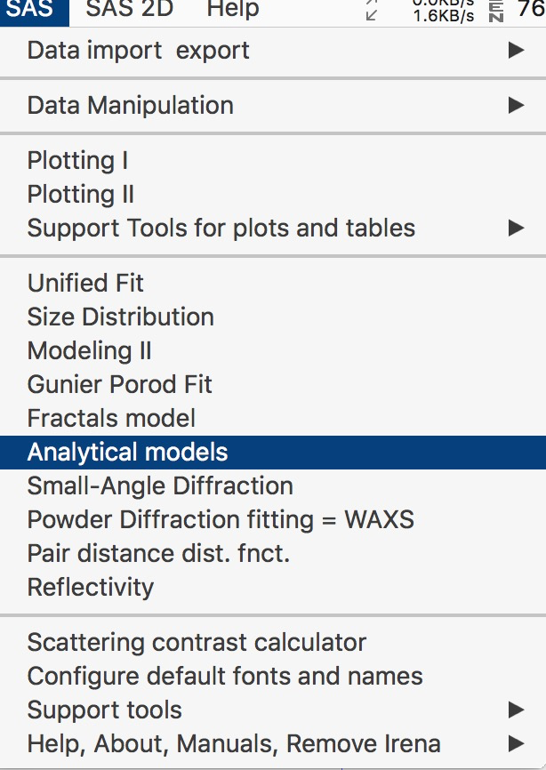

Submenus:

Data Import & Export:

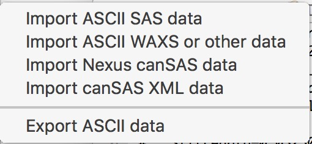

Support tools for plots:

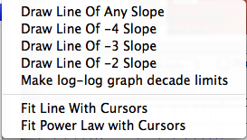

Data Manipualtion:

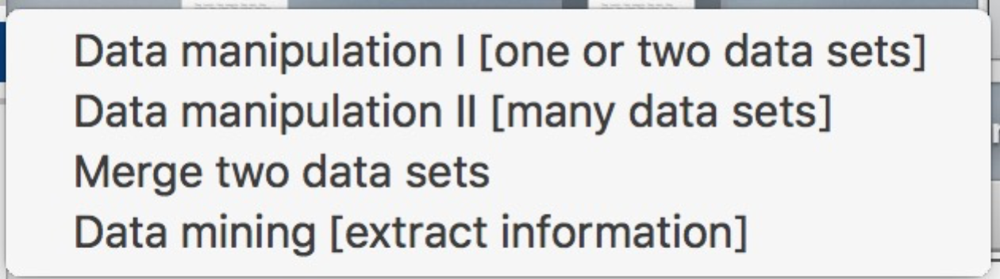

Support and older tools:

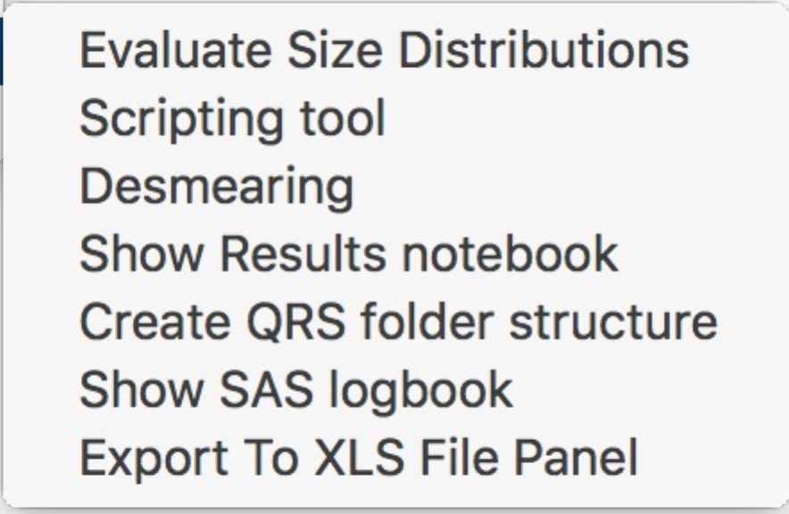

About, Manuals, Remove Irena, help

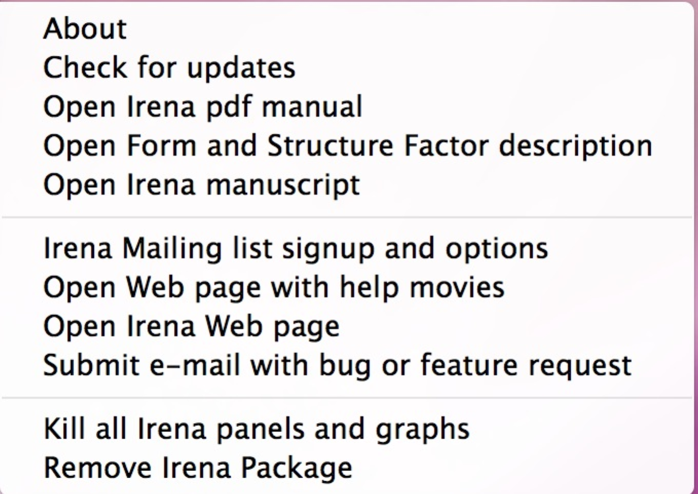

GUI controls and common controls
---------------------------------

Manual, Manuscript, Mailing list, About...
------------------------------------------

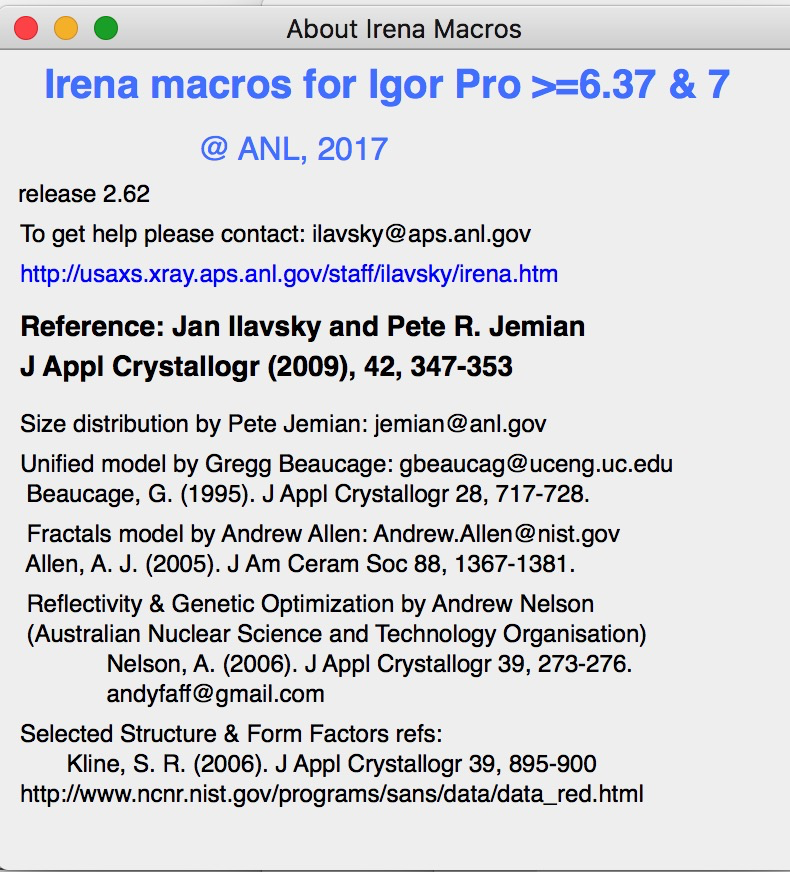

From the Last menu Item you can get "About" panel stating current
version and Igor versions, which it has been tested on.

Download and open Manual, request manuscript, sign up for mailing list
and do few other operations you may find useful. Including "offloading"
Irena package from the experiment, so it does not slow down the
operations when you want to do something else. Or when you want to send
file to someone who may not have Irena installed, remove Irena package
so he/she does not get errors on load when Igor tries to load Irena
unsuccessfully.

Configure default fonts and names
---------------------------------

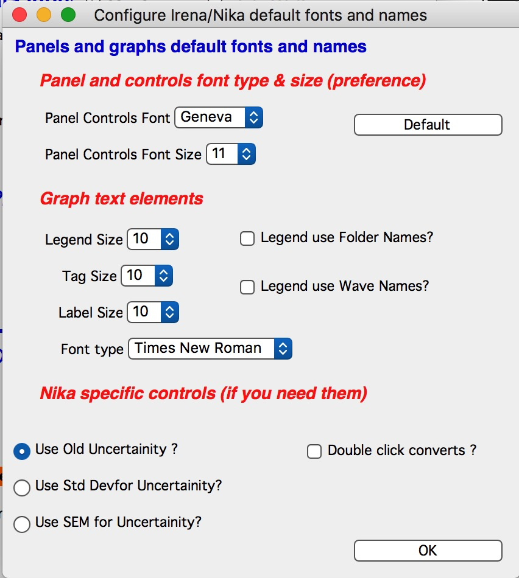

“Configure default fonts and names” in the SAS menu will create panel
with some controls common for all tools, like font type & size and how
legend names are handled. NOTE: Panel controls are applied immediately
to all existing panels, graph controls are applied ONLY to the newly
created graphs (and only those which were upgraded to this behavior).

**Panels font and font sizes**

These controls enable user to customize font used on control panels
therefore this enables customization for a given platform. This is
necessary as more and more control is provided on each platform to user
and therefore default fonts and font sizes may not be appropriate any
more for the panels I design. These settings are actually saved on a
given machine as well as the experiment. This has some interesting
features, so please, read carefully:

When these controls are run (and user is forced to run them if the Irena
is loaded and preferences are not found), they save preferences in
special folder Igor maintains for users. At the same time, the settings
are applied to the current experiment.

When this experiment is opened on another computer, the preferences from
that computer are not reloaded, so the experiment will use preferences
from the original computer. When the “Configure GUI and Graph defaults”
is run, it will reload the computer defaults and apply them to the given
experiment. Then user can change the fonts and font sizes as they wish.
The new settings are saved on the computer – and within the experiment.

*Note*, that Panel font and font size are platform specific, so same
experiment may present differently looking panels on Mac and PC. Also,
from version 2.62 this panel is common for Irena and Nika packages, so
not everything you see in Irena applies.

*Note*, not all controls actually follow these settings, I have been
changing some buttons to specific font and font size and those are not
affected by these settings.

If there are any issues with the behavior, please, let me know and I’ll
see if I can make it more logical.

Note the difference in Configure GUI and Graph defaults panels when
different fonts are used. Left is using Geneva font size 9, right is
using Monaco size 12, both on Mac platform. You can mess up the panels
really well by wrong choices!

Defaults button returns the panel font choices to platform specific
default state (Mac: Geneva size 9 and PC Tahoma size 12). Note, that
there is no guarantee that these were your choices before. But these
should be reasonable choices for most setups.

**Graph controls**

I am slowly adding in various parts of the whole package calls to these
commonly stored values. This allows user to configure fonts for various
screen sizes. This seems necessary to allow use of Mac/Win platforms
with vastly different screen sizes and resolutions.

Not all packages follow these controls yet, if you see issues in package
of your choice, let me know and I will try to address them ASAP. Time is
limited resource.

Data selection
---------------

Data selection part of the panels is served by common package (mostly)
and has more or less similar behavior – with modifications appropriate
for each package. The purpose of these controls is to provide as much
help to user to select appropriate data as possible. This is not easy
task… Sometimes even it is not clear what the right help is.

There are few checkboxes for data types, up to 4 popups with Data
Folder, Wave with X, Y and error data. If Model input is appropriate,
Qmin, Qmax, number of points and log/lin binning inputs are displayed.

**How the control works:**

**Type of data:**

**Indra 2 data** data from Indra package (DSM\_Int, etc.). Assumes data
are in root:USAXS folder (or any subfolder) only.

**QRS data** data with q\_name, r\_name (intensity) and optionally
s\_name (error). Alternatively, to help users using NIST SANS data
analysis package the option recognizes also "qis" system ("name\_q",
"name\_i", "name\_s") and presents the data with this naming system as
well.

**Model** No data, tool will create q data using user input and
intensity/error data will be set to 0. Then passed intot he tool so one
can model with no measured data present. Available ONLY when appropriate

**Irena results** should know results from Irena package (all different
types). When appropriate will be available. Note, that in any folder may
be number of different results available.

**User type** currently not used, but allows definition of any other
naming structure to be used in the future. Note this can be named
differently at any time and can provide access to any doublet or triplet
of wave types, if it can be defined.

**No type of data selected** In this case the tool will present choice
of all folder in the experiment and for data waves all of the wave in
the particular folder. This method will work always, but may be quite
challenging to use.

**Basic control logic**

When particular type of data is selected, the tool should go and find
all of the folders containing at least one of the type of data.

**Indra 2 data** at least one of M\_DSM\_Int (M\_DSM\_Qvec,
M\_DSM\_Error), DSM\_Int, M\_SMR\_Int, SMR\_Int triplets.

**QRS data** triplet of waves starting with q, r, s with the rest of
name the same. Note, this is the most cpu challenging data type, so it
will take the longest.

**Irena results** any of the results from Irena package. If any is
missing, let me know, please…

**Model** no input data, input data will be created.

**User** not used at this time. Can be used in the future for any data
types, which can be defined.

**Nothing** all folders, all waves available

These folders are presented in the “Data folder” for user selection.
When user selects the folder, rest of Wave popups will be populated by
first valid set, which is in the order prescribed by internal logic.

If other data set is needed, select different data in the “Wave with X
axis data” popup. This will attempt to fill the next ones with
appropriate data. This may not be unique, so the first match will be
filled in.

Then if still necessary, fill in the other two popups.

Note, that it is possible, that depending on tool you can select only
two data waves (X and Y), some tools may require also error wave.

**Folder/Wave name masking :**

Starting with *Irena* 2.53 I have enabled use of "weird" characters in
names - (){}%#^$?\|&@ can now be used as part of the name... This
modified option to mask Folder name and/or Wave name with string to make
smaller selection in the popups. There are two new fields now – and yes,
it is possible the new string fields get hidden below controls for
Folder and Q wave selection. There is not enough space, select “---“ in
that popup to get to these new controls.

Since version 2.53 these controls allow user to only string to match the
names to select folder/waves to be displayed. Prior version enabled use
of Regex, but since now control characters for Regex are part of the
name and hence possibly part of the match string, it is now impossible
to use Regex and one has to use simple string. DO NOT add \* if you want
to match part of the name, simply using string "test" will match any
name which has anywhere in it test as string.

Little useful trick: Regular expression which means “not matching string
xyz” is ^((?!xyz).)\*$ - yes, it is weird, but works. Replace xyz by
string of characters contained in data which you do not want to have
displayed and they will disappear from the list.

Here is how to use it:

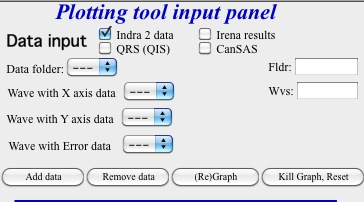

This is how the default state looks – empty field for “Fldr” and “Wvs”.
If there is empty string, all folders and waves of that specific type
will be presented.

See here, we have 4 samples measured and we have now 4 folders
available.

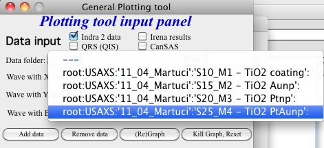

Here is setting when I want to match Aunp string to be in each of the
names:

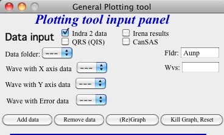

and here is what is presented as result of the above choice:

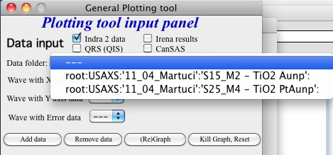

Little help:

Typical use is to show only data with specific match string, to display
only selections, which contain "abcd" in the name just put the abcd
letters in the field. No \* are necessary.

If you want to use two strings which a name must contain, use this :
String1.\*string2. Keep in mind that String1 must occur before String2
in the name to be matched. And yes, between them is “.\*” without any
spaces.

Match strings are tool-specific, so each tool has its own specific set
of match strings.

Using Irena on small displays
-----------------------------

Irena generates ***a lot of*** windows, panels, graphs, notebooks... It
really needs large display, 1024x768 is realistically too small for
useful work, but generally all panels are scaled to this size. But for
whatever reason users insist on using tiny screens. So here is the first
warning:

****DO NOT DO IT. GET LARGE ENOUGH DISPLAY. THEY ARE CHEAP NOW...****

But this warning simply never works. So finally I was able to solve
moving the content (not all, but most) up/down on panels:

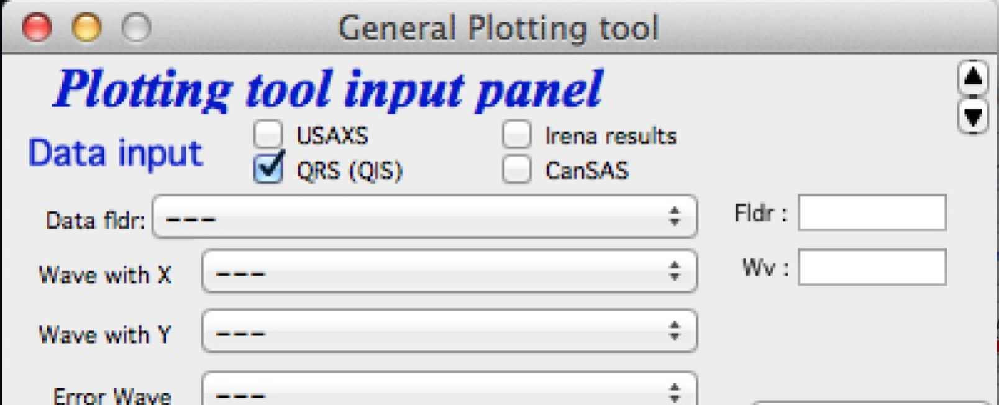

Note the two arrows at the top right corner of some panels,
like here on plotting tool panel.

These are "arrows" which move the content of the panel up/down, so if
your screen is simply too small vertically (usual problem), you can move
the controls in the screen itself.

So here is the same area, but content was now moved bit higher, so one
can reach to the bottom controls:

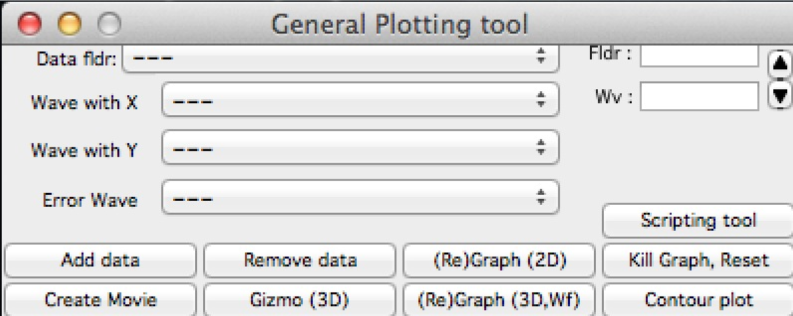

If you have a large display, you can zoom panels by dragging lower right
corner - note mark:

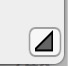

You can scale panels up or down, but they will not scale to smaller size than original size.

Using Irena on high resolution displays
---------------------------------------
Igor has problems handling high resolution displays - 4k displays and similar - on Windows. Some users will set the resolutionrelatively high (may be 2.5 horizontally) but in order to be able to read the text on the screen they scale the font higher. SOme combinations of resolutions and fontscaling result in panels which are incorreclty populated with controls. If thi shappens, the only solution is to chaneg reoltuion (typically to less points) and reduce the font scaling. Unluckily, this is the only solutionprovided by Wavemetrics to me.

Use of XOP
----------

Igor Pro enables use of external C-code to speed up some high cpu
intensive operations. Note, that these binary pieces of code and
bit-specific, so there is specific version for Igor 32bit and specific
for Igor 64bit versions. They need to be properly located in Igor folder
structure. Currently various optional xop program are available:

1. Two by Andrew Nelson
   http://motofit.sourceforge.net/wiki/index.php/Main_Page – one for
   calculation of reflectivity (abeles.xop) and one for genetic
   optimization (GenCurvefit.xop). Both are compulsory (for
   functionality of Reflectivity and Genetic optimization) and need to
   be placed in “Igor extensions” folder. Both speed up the calculations
   by factor of up to 40 compared to now removed Igor code. They need to
   be kept updated, so please, update with every new Irena update as
   they do not have version numbers.

2. XML loader (also by Andrew Nelson) necessary to load XML (CanSAS)
   file formats. You can download this general use XML xop from :
   http://www.igorexchange.com/project/XMLutils

3. Version 2.53 added first form factor (Parallelepiped) which is
   available ONLY xop library maintained by NIST reactor. Version 2.54
   and higher can take advantage of speed improvements for some other
   form factor also (cylinder, spheroid).NIST colleagues (Steven Kline
   namely) were nice enough to provide me with updated versions of their
   xops and I suggest you use the ones available with my package.

Genetic optimization
--------------------

Genetic optimization method is form of fitting from SAS data. It has
been developed for optimization of reflectivity data but is very useful
for cases where least square fitting may not find global minimum. It has
been programmed for Igor by Andrew Nelson, who is also author of
internal code for reflectivity tool.

Note that this code uses some version of Monte Carlo method. Therefore
limits are \_very\_ important. When Genetic optimization method is used
user will be presented with dialog to check the limits. For this method
is really important that the calculations do not fail for any
combination of parameters and that the range of probed parameters is
sensible.
