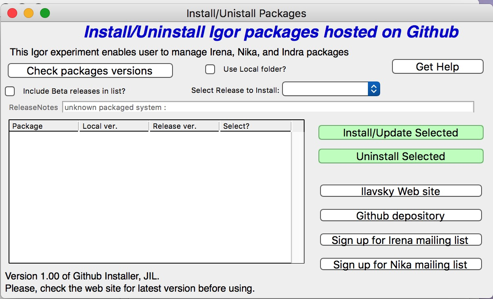
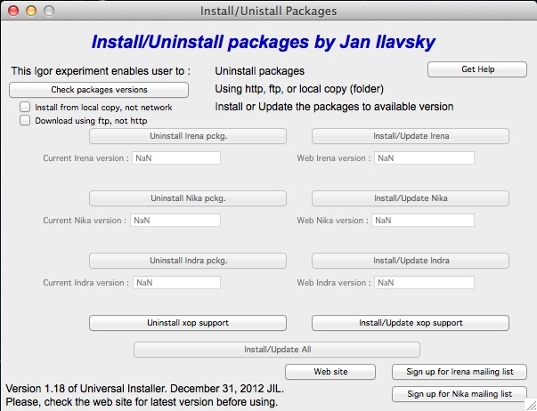

Introduction
============

Jan Ilavsky and Peter R. Jemian, *“Irena: tool suite for modeling and
analysis of small-angle scattering”*, Journal of Applied
Crystallography, vol. 42 (2009). Please e-mail me, if you need copy.

Manual |release| for Irena version 2.62 for Igor 7.x

|today|

**Jan Ilavsky**

**Acknowledgement of authors for selected included methods:**

  #.  Least Squares Modeling & other methods – Jan Ilavsky
  #.  Size distribution – Pete R. Jemian (Maximum entropy/regularization)
  #.  Unified model – Greg Beaucage
  #.  Gunier-Porod model - Bualem Hammouda
  #.  Pair Distance Dist. Function – Jan Ilavsky, Pete Jemian (regularization)
  #.  Fractals model – Andrew J. Allen
  #.  Reflectivity (aka Parrat’s code) – Andrew Nelson
  #.  Desmearing – Pete R. Jemian
  #.  Ciccariello-Benedetti model - S. Ciccariello

Disclaimer:

These macros represent a collaborative work in progress and it is very
likely that not all features are finished at any given time. Therefore,
some features may not work fully or at all. Please note, while I try my
best to verify the results, no guarantees can be made as to the
reliability of these results. Please, verify results in some other way.
Please report any bugs to me, I will do my best to fix them ASAP. I
provide limited support for users of these macros. Limited means that my
time available for this support is limited. If you need help, e-mail
Igor file to me with data so I can work on your data.

ilavsky@aps.anl.gov

Description
-----------

The “\ *Irena*\ ” package is a suite of Igor Pro (Wavemetrics, version Igor 7.x) macros for the evaluation of small-angle scattering
data. It has been designed to use seamlessly data from APS USAXS
instrument (currently beamline 9ID, Advanced Photon Source, Argonne,
IL); reduced using “Indra” package. Further it can work easily with any
SAS data, which have scattering vector (q), Intensity, and (optional)
Intensity uncertainty (“error”). Latest releases can, in specific cases
(only) use also q resolution. It can easily use “qrs” (or "qis", NIST)
naming system. It easily integrates with 2D (area detector) SAXS/WAXS
data reduction package “Nika” which uses the qrs naming system. Its use
for most other data is made easy by a customized import tool, which
should be able to handle most “column-type” ASCII data from various SAS
instruments.

*Irena* contains following parts:

#. **Size distribution** – using Maximum Entropy, Total Non-negative
   least square (TNNLS) & Regularization methods for evaluation of
   small-angle scattering from scatterers represented by number of
   different form factors.
#. **Modeling** (II) of SAS from up to 10 model "populations" (either
   Size distribution, Unified level, or diffraction peaks each) to up to
   10 different data sets… VERY powerful tool. Number of form factors
   and structure factors.
#. **Unified fit model** for fitting SAS data using up to 5 levels of
   combinations of Guinier and power law dependencies.
#. **Gunier-Porod model** for fitting of SAS data using up to 5 "levels"
#. **Pair distance distribution function** (PDDF, p(r)).
#. **Fractal model** – combination of 2 mass and 2 surface fractals.
#. **Analytical models –** tool with option for:

    *  *Debye-Bueche model* for scattering from gels
    *  *Treubner\_Strey model* for small-angle diffraction
    *  *Cicarriello-Benedetti model* for layer on smooth surfaces

#.  **Small-angle diffraction** tool to model diffraction in small-angle
    scattering area
#.  **Powder diffraction fitting (WAXS)** to fit peak positions for
    powder diffraction like data.
#.  **X-ray & neutron reflectivity** calculations using Parrat’s
    recursive method
#.  **Scattering contrast calculator** including anomalous effects
#.  **Data import tools**. Allows importing ASCII, HDF5 canSAS Nexus, or
    canSAS XML files. For ASCII SAS data need to be written in columns, separated by white space, tab or other separators. Allows creating
    user-friendly logical folder structure within Igor experiment.
#.  **Data export tool** – exports into ASCII, HDF5 canSAS Nexus, or
    canSAS XML files. For ASCII the data are written in columns, separated
    by white space, tab or other separators.
#.  **Desmearing** for finite-slit length smeared data
#.  **Data manipulation tool**. Allows merging, smoothing, adding
    together and subtracting of SAS data sets. These data sets do not
    have to necessarily use the same naming convention.
#.  **Two plotting tools**. This tool allows to generate various SAS
    plots (Porod, Guinier, Kratky, Zimm…) and do some basic fitting.
    Further the tool allows to save plot styles with various formatting
    parameters and then fast reapply these on other data sets,
    generating exactly same plots useable for publications. Plotting
    tool I can generate two types of 3D graphs - wire graph and "Gizmo"
    graph. It can also generate movies from the data.
#.  **Data “mining” tool** – allows searching for results
    (variables/strings/waves …) in the folders of Igor experiment with
    flexible output options.
#.  **Scripting tool**. Tool to run (Size distribution and Unified fit
    for now) tools on multiple data sets at once.
#.  Tool to create folder structure for unstructured QRS data. And few
    other tools…

Methods use as similar as reasonably possible. This should simplify
learning curve for the users…

Name “\ *Irena”* of this package, for those really interested, is the
name of my wife. All my packages have female names, for example
“\ *Nika*\ ” is the nickname of my daughter (Veronika), etc. As choice
of names is more or less arbitrary, I felt that selecting the name of my
wife for this large and important package will be one way to give her
credit for all the time I spent working on this package and not with my
family.

Availability of the code
------------------------

For long time my packages were available from APS web site, *Irena* from
: http://usaxs.xray.aps.anl.gov/staff/ilavsky/irena.html

While this site is and will be available, future versions of the code
will be available from GitHub:

https://github.com/jilavsky/SAXS_IgorCode

Github depository will also be used for installations for Igor Pro 7 and
higher. Igor 6 cannot install from GitHub due to inability to do https.

Instructions available on Youtube channel
-----------------------------------------

I have Youtube channel for instructional movies. Search for example
“Ilavsky Irena” on Youtube and you will see something like this:

.. figure:: media/introduction0.png
   :width: 700px

   Youtube channel for Irena and Nika packages

The totally weird link to the channel is here:

https://www.youtube.com/channel/UCDTzjGr3mAbRi3O4DJG7xHA

This channel contains instructional movies how to install the package
and how to use different tools. Please, watch it if you need help. It
may help you

Courses
-------

Over the last few years I have had many courses at the APS and around
the world either at institutions or at conferences. These, typically
two-day courses, teach how to use Irena. Some news about these courses
should be available on:

http://small-angle.aps.anl.gov

http://small-angle.aps.anl.gov/courses/Irena_Nika_courses_report.html

Instructions on installation
----------------------------

To install the macros, please install first Igor Pro, version 7.x. *Irena* version 2.62 is the last one which works with Igor Pro 6 latest release (6.37). Any higher releases require  Igor 7, which was released July 2016.

Movies with instructions and explanation are availabel on my Youbube channel:

https://www.youtube.com/channel/UCDTzjGr3mAbRi3O4DJG7xHA

There are two main ways to install the macros:

**Igor 7 (32 or 64 bit versions)**

Download latest version of GitHub installer “
GHInstaller\_IrenaNika\_vXYZ.pxp”, latest version should be available here:
http://usaxs.xray.aps.anl.gov/staff/ilavsky/irena.html

Open the file (in Igor 7) and select “Install Packages” > “Open GitHub GUI”. GUI (left) and Instructions open.

Push “Check packages versions” to check which versions are available on
the GitHub site. Read instructions for what to do and how to pick the
right one. This installer enables users to install also defined beta
versions and even the current “master” version. But be careful, there
are no guarantees that the master is fully debugged. I may be working on it.

Here is explation of options:
  #. Release version. One or more release versions may be availabel in the listing of releases. Pick latest unless you for some reason need prior release. Release version should work and be tested.
  #. If you check "Include beta releases" you can pick from declared beta releases. If necessary, I may declare a release beta to distribute updated versions to smaller group of people. This relase should work but there may be changes modification which need testing.
  #. If you check "Include beta releases" you can also pick master - "master" is a current latest update committed to depository. My intention is to commit only code which works, but, well, it may be untested or being developed. Check wiki on Github page https://github.com/jilavsky/SAXS_IgorCode/wiki for release notes. It may give you an idea what has been changed.

Keep in mind that you need xop support for the bit versions (32bit or
64bit) versions of Igor you are using! Do not forget to install them.

**Igor 6.37 32bit version.**

Download the “Universal installer 1.32.pxp” (or the latest
version) file from my APS web site. Optionally, if you have firewall
issues or just want to have easier life, download ALSO the whole
distribution of my packages as one zip file. Then use this Igor
experiment and install using the buttons provided. Note, that if you
have local copy (unzip the downloaded (large) zip file, then select “Use
local copy” checkbox. Instructions are in the file itself. It usually
works just fine, but sometimes ftp communication is either bad due to
network issues or even prevented due to firewall, so then local copy is
your only choice. Install the xop support!

**The hard way, when the other methods fail... Zip files.**

Get zip file for Irena package AND xops, appropriate for your platform
from either APS (Igor 6.37) web site or GitHub (Igor 7.x). Place the files in the zip file, following the folders in the appropriate places in the Igor Pro Folder in User area. This location is easiest found by using in Igor Pro in help menu the item "Show Igor Pro User Files". Note that some of the files belong to Igor Procedures and some in User procedures, keep folder structure as is in the zip file, please...

**NOTE: If you had prior installation (before 6.10 version of Igor) :
Update Igor Pro (free from any 6.xx version) to latest version and check
for presence of obsolete version :**

Locate Igor Pro Files (again: Help menu in Igor, Show Igor Files) and
remove any files related to Irena, Nika, and Indra from Igor Procedures
and from User Procedures. This should be done automatically by the
installers, but may not be possible if you are running, as lower
privilege user installers may not be able to do this.

To load macros, **select “Load Irena SAS macros” from “Macros” menu**
after starting Igor Pro. Whichever method you choose, the macros should
work the same.

Please, learn more about full capabilities of the Igor Pro. It is very
powerful graphing and data evaluation package. It may be necessary for
you to handle data import and handling, data export and some graphing.
Further, the macros heavily rely on the data folder structure, so it is
important to learn enough to realize the use of this feature…

Please read these comments
--------------------------

Few suggestions first:

1. Learn enough Igor, that Igor problems do not prevent you from getting
   results. Igor tour and 1-2 hours playing with it should be sufficient

2. Read this manual full or in pieces and test what is shown on your own
   computer

3. Use folder structure, or things will become way too messy for these
   tools to be useful

4. Read supporting literature (especially papers about Unified fit,
   Reflectivity and other methods) if you want to use these methods.

**Comment on ending the macros:**

At any time user can end working with the macros by closing associated
graphs and panels. There is also command which closes all open windows
and panels of this package.

Getting help
~~~~~~~~~~~~

Main web site is here:
http://usaxs.xray.aps.anl.gov/staff/ilavsky/irena.html
Latest version of manuals should be available here: http://saxs-igorcodedocs.readthedocs.io/en/latest/index.html
Youtube channel with mnovies is here:
https://www.youtube.com/channel/UCDTzjGr3mAbRi3O4DJG7xHA
If you want to send me e-mail, there is command in Irena menu for that. Send me proper description and include Igor experiment with which you have problem.
