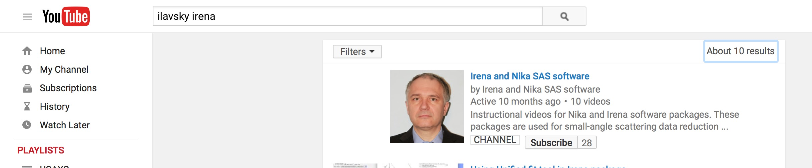

Introduction
============

Jan Ilavsky and Peter R. Jemian, *“Irena: tool suite for modeling and
analysis of small-angle scattering”*, Journal of Applied
Crystallography, vol. 42 (2009). Please e-mail me, if you need copy.

| Version 2.62 for Igor 7.x

***Jan Ilavsky***

**Included Methods – authors:**

    Least Squares Modeling & other methods – Jan Ilavsky

    Size distribution – Pete R. Jemian (Maximum entropy/regularization)

    Unified model – Greg Beaucage

    Gunier-Porod model Bualem Hammouda

    Pair Distance Dist. Function – Jan Ilavsky, Pete Jemian
    (regularization)

    Fractals model – Andrew J. Allen

    Reflectivity (aka Parrat’s code) – Andrew Nelson

    Desmearing – Pete R. Jemian

    Ciccariello-Benedetti model S. Ciccariello

Disclaimer:

These macros represent a collaborative work in progress and it is very
likely that not all features are finished at any given time. Therefore,
some features may not work fully or at all. Please note, while I try my
best to verify the results, no guarantees can be made as to the
reliability of these results. Please, verify results in some other way.
Please report any bugs to me, I will do my best to fix them ASAP. I
provide limited support for users of these macros. Limited means that my
time available for this support is limited. If you need help, e-mail
Igor file to me with data so I can work on your data.

ilavsky@aps.anl.gov

Description
-----------

The “\ *Irena*\ ” package is a suite of Igor Pro (Wavemetrics, version Igor 7.x) macros for the evaluation of small-angle scattering
data. It has been designed to use seamlessly data from APS USAXS
instrument (currently beamline 9ID, Advanced Photon Source, Argonne,
IL); reduced using “Indra” package. Further it can work easily with any
SAS data, which have scattering vector (q), Intensity, and (optional)
Intensity uncertainty (“error”). Latest releases can, in specific cases
(only) use also q resolution. It can easily use “qrs” (or "qis", NIST)
naming system. It easily integrates with 2D (area detector) SAXS/WAXS
data reduction package “Nika” which uses the qrs naming system. Its use
for most other data is made easy by a customized import tool, which
should be able to handle most “column-type” ASCII data from various SAS
instruments.

The package contains following parts:

1. **Size distribution** – using Maximum Entropy, Total Non-negative
   least square (TNNLS) & Regularization methods for evaluation of
   small-angle scattering from scatterers represented by number of
   different form factors.

2. **Modeling** (II) of SAS from up to 10 model "populations" (either
   Size distribution, Unified level, or diffraction peaks each) to up to
   10 different data sets… VERY powerful tool. Number of form factors
   and structure factors.

3. **Unified fit model** for fitting SAS data using up to 5 levels of
   combinations of Guinier and power law dependencies.

4. **Gunier-Porod model** for fitting of SAS data using up to 5 "levels"

5. **Pair distance distribution function** (PDDF, p(r)).

6. **Fractal model** – combination of 2 mass and 2 surface fractals.

7. **Analytical models –** tool with option for:

      **Debye-Bueche model** for scattering from gels

      **Treubner\_Strey model** for small-angle diffraction

      **Cicarriello-Benedetti model** for layer on smooth surfaces

8.  **Small-angle diffraction** tool to model diffraction in small-angle
    scattering area

9.  **Powder diffraction fitting (WAXS)** to fit peak positions for
    powder diffraction like data.

10. **X-ray & neutron reflectivity** calculations using Parrat’s
    recursive method

11. **Scattering contrast calculator** including anomalous effects

12. **Data import tools**. Allows importing ASCII, HDF5 canSAS Nexus, or
    canSAS XML files, where SAS data are written in columns, separated
    by white space, tab or other separators. Allows creating
    user-friendly logical folder structure within Igor experiment.

13. **Desmearing** for finite-slit length smeared data

14. **Data manipulation tool**. Allows merging, smoothing, adding
    together and subtracting of SAS data sets. These data sets do not
    have to necessarily use the same naming convention.

15. **Two plotting tools**. This tool allows to generate various SAS
    plots (Porod, Guinier, Kratky, Zimm…) and do some basic fitting.
    Further the tool allows to save plot styles with various formatting
    parameters and then fast reapply these on other data sets,
    generating exactly same plots useable for publications. Plotting
    tool I can generate two types of 3D graphs - wire graph and "Gizmo"
    graph. It can also generate movies from the data.

16. **Data “mining” tool** – allows searching for results
    (variables/strings/waves …) in the folders of Igor experiment with
    flexible output options.

17. **Data export tool** – exports into ASCII various types of data.

18. **Scripting tool**. Tool to run (Size distribution and Unified fit
    for now) tools on multiple data sets at once.

19. Tool to create folder structure for unstructured QRS data. And few
    other tools…

Methods use as similar as reasonably possible. This should simplify
learning curve for the users…

Name “\ *Irena”* of this package, for those really interested, is the
name of my wife. All my packages have female names, for example
“\ *Nika*\ ” is the nickname of my daughter (Veronika), etc. As choice
of names is more or less arbitrary, I felt that selecting the name of my
wife for this large and important package will be one way to give her
credit for all the time I spent working on this package and not with my
family.

Availability of the code
------------------------

For long time my packages were available from APS web site, *Irena* from
: http://usaxs.xray.aps.anl.gov/staff/ilavsky/irena.html

While this site is and will be available, future versions of the code
will be available from GitHub:

https://github.com/jilavsky/SAXS_IgorCode

Github depository will also be used for installations for Igor Pro 7 and
higher. Igor 6 cannot install from GitHub due to inability to do https.

Instructions available on Youtube channel
-----------------------------------------

I have Youtube channel for instructional movies. Search for example
“Ilavsky Irena” on Youtube and you will see something like this:

.. _my-figure:

   Youtube channel for Irena and Nika packages

The totally weird link to the channel is here:

https://www.youtube.com/channel/UCDTzjGr3mAbRi3O4DJG7xHA

This channel contains instructional movies how to install the package
and how to use different tools. Please, watch it if you need help. It
may help you

Courses available on various places in the World
------------------------------------------------

Over the last few years I have had many courses at the APS and around
the world either at institutions or at conferences. These, typically
two-day courses, teach how to use Irena. Some news about these courses
should be available on:

http://small-angle.aps.anl.gov

http://small-angle.aps.anl.gov/courses/Irena_Nika_courses_report.html
