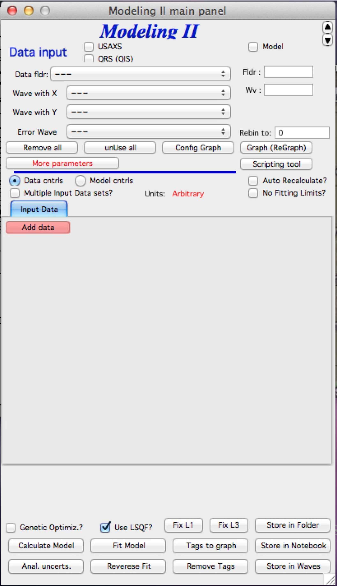
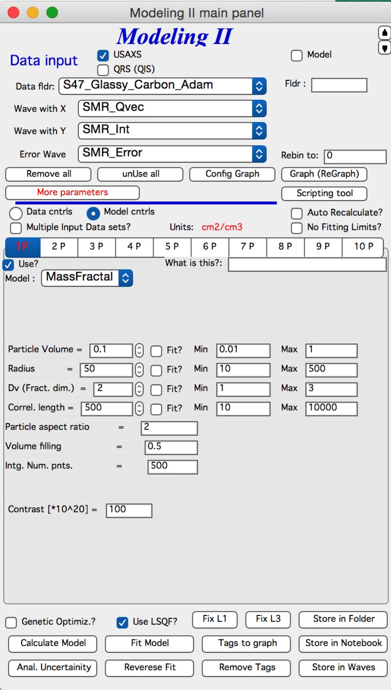
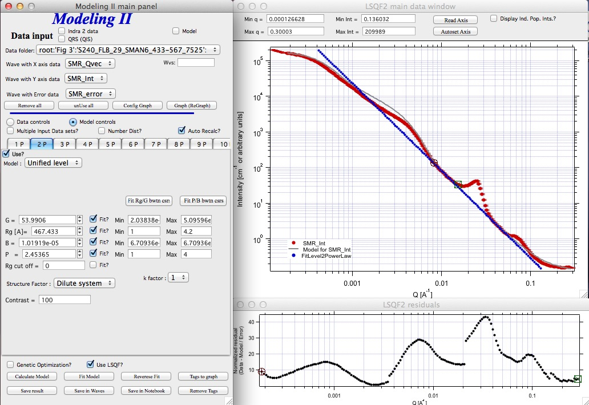

Modeling II
===========

This tool is replacement of original, long deprecated Modeling I which was removed in version 2.58.

**Use of this tool**

This tool is : **advanced; complicated; challenging to use – but really powerful**

The use of this tool is recommended to everyone who is trying to model small angle scattering and would consider Modeling I tool. While it is more challenging, it is much more capable.

This tool will do all the Modeling I does and much more. There is
penalty for the much more…

**Features**

#. **Multiple input data sets at the same time**. Up to 10 input data sets can be loaded at the same time and fitting/modeling can be done to one or more data sets at any time.

#. **Up to 10 populations of scatterers** can be combined. Any population can be arbitrarily “switched on and off”. Any population also can be one of : **"Size distribution", “Unified level”, “Surface fractal”, “Mass Fractal”, or "Diffraction peak"**; allowing to model really complex small-angle scattering data.

#. Each population can have **different contrast** for each data set.  Note, that this means up to 60 contrasts potentially.

#. **Form factor parameters can be fitted**. That does not mean the data must allow them to be fitted, but the tool will allow any form factor parameter to be fitted.

#. **Structure Factors – library of 5 structure factors** to be used. See Structure factor description in the “Form factor and Structure factor description” pdf file.

#. **Optimized for speed** - much faster fitting when “semi-auto” R distribution is selected for complicated form factors.

#. **Input of “model” data** when no real data are loaded, but only q-data are created to model SAS from microstructure without the need for measured data.

**Logging during use of this tool** – This tool similarly to other Irena tools logs state of the parameters before and after each fitting. The purpose is to enable at least some recovery, if fitting goes to never-never land and user accidentally looses the “recovery” option by using revert fit (by hitting the fit button second time etc…). The notebook can be pulled up by using menu SAS -> Other tools -> Show SAS Logbook. This logbook is mess of information, but all necessary information to recover should be there. It is not formatted in any particularly meaningful way, though. As output use the “Save in notebook” option discussed later in this chapter.

Theory behind this tool
-----------------------

Actually, theory is the same as for Modeling I from chapter 7 – up to 10 "populations" or models can be used : each can be either "Size Distribution of scatterers", "Unified level", or "Diffraction peak"; For the Size distribution and Unified level the SAS from them can be calculated in dilute limit or after applying one of 5 available structure factors. For comments on used size distribution shapes (log-normal, LSW) please refer to chapter 7.3. It is important and useful to understand.

As of *Irena* version 2.40 this tool can also use “Unified level” for any population. **NOTE:** this is kind of simplified Unified level and the tool will complain (once every 24 hours) if you try to use more than one Unified level. It is not impossible, but it is strongly discouraged. If you need more Unified levels, you need “Unified fit” tool. There are various rules and relationships, which can be enforced in that tool. The reason for Unified level here is to enable one combine scattering from particulate system with the scattering from fractal system formed by these particles. Typical use is to describe low-q power law slope, which is mass fractal of primary particles, which then can be modeled correctly.

As of *Irena* version 2.43 this tool enables also use of "Diffraction peak" for any population. **NOTE:** this is simplified version of Diffraction tool and for now there is no way to include relationships between the peaks (to provide for specific structures) as the Diffraction tool allows. Fort more details on the terms, peak profiles etc. read the Diffraction tool chapter.

Since *Irena* version 2.53 the tool is aware of the units of Intensity (either in the wave note or set by user) and - ***for the Size distribution models*** - its GUI is changing depending on these units. What was originally called "Volume" of scatterers for size distribution is now:

-  "*Scale*" if data are on arbitrary scale. This value has no direct physical meaning, except it may be relative measure of volume between samples if the data are properly normalized.

-  "*Fraction*" if data are on cm2/cm3 scale. This is what originally was "Volume" as this were the default “units” the tool assumed. However, note this is what in the dilute limit we call volume fraction c, but for higher volume fractions this approximation (made commonly!) is wrong, in calculations this represents really c(1-c)!!! If you get this value >0.25 something is really wrong here and you do not have physically meaningful model or correct data. This Fraction should never get higher than 0.25, see graph below:

-  "*Volume [cm3/g]*" if data are on cm2/g scale. This is if the SAS data are calibrated per gram of sample.

**What is size distribution**

The size distribution is modeled as small angle scattering (SAS) using basic SAS formula:

.. image:: media/Modeling3.png
      :align: center
      :width: 380px

where Δρ is contrast, F(Q,r) is scattering form factor, V(r) is the particle volume, N is the total number of scattering particles, Π(r) is the probability of occurrence of scatterer at size of r. This formula is, of course, replaced by summation formula with limited number of bins in radii. Therefore the formula coded in is following:

.. image:: media/Modeling4.png
      :align: center
      :width: 380px

This formula has been coded very many times… Following are comments, which address specific parts of this formula.

Three different distribution models are available – Gauss (Normal), Log-Normal, and LSW (Lifshitz-Slyozov-Wagner used in precipitation theory involving Ostwald Ripening).

Automatic selection of radius distributions – ranges needed, bin widths etc. – with user selectable precision and number of steps. For details seem Irena manuscript which goes to details on this subject.

Number of form and structure factors are available. Note, that it is relatively easy to add other shapes in the code, so if anyone needs (really needs) another shape, let me know… Note, that calculation speed of different form factors varies significantly depending on calculations needed to calculate involved integrals.

**Structure factors**

The code includes number of Structure factors to account for interaction among the particles for non-dilute systems, which can be independently switched on or off for each population of the scatterers. **User should be aware of the crudeness of any of these calculations.**

The code used for calculations involves correcting intensity from a population of scatterers using this formula:

Intensity\ :sub:`with interfernce`\ (Q, R) =Intensity\ :sub:`without interference` \* Structure factor

Description and details on the structure factors (5 at this time I believe) are in the pdf file "Form and Structure description" which can be opened from the Irena menu.

**Remember**: these method accounts in very crude way ONLY for interaction for particles in the particular population. If there are interactions among particles from different populations – which is very likely – these calculations have NO WAY to account for it.

**Important Information**

The code uses for all size related parameters Angstroems (10\ :sup:`-10` m) or for Q vector (A\ :sup:`-1`). In the case of scattering contrast, number distribution and any other volume contents centimeters (10\ :sup:`-2` m).

This code uses either **Diameter** or **Radii** for scatterer size.

**Distribution** :math:`\Psi (r)` and :math:`V(r) \Psi (r)` **and distribution of r.**

The code can work with distribution defined as for number distribution :math:`N * \Psi (r)`, where integral over :math:`\Psi (r)` for all r is 1 and N is total number of scatterers or for volume distribution :math:`V_{tot} * \Psi (r)`, where integral over this term is equal total volume of scatterers. Internally, the code actually always works with number distributions :math:`N * \Psi (r)`, which, in the second case is calculated from the total volume of scatterers.

There are currently 3 different distributions built in the code, which
can be used independently for any of up to 5 scatterers populations:
Gauss (normal), Log-Normal, LSW.

Gauss and Log-Normal distribution definitions were adopted from NIST
engineering statistics handbook,
`www.itl.nist.gov/div898/handbook/eda <http://www.itl.nist.gov/div898/handbook/eda>`__
. See http://www.itl.nist.gov/div898/handbook/eda/section3/eda366.htm

Standard complicated log-normal distribution is defined as follows
(Allen, A.J., Krueger, S., Skandan, G., Long, G.G., Hahn, H., Kerch,
H.M., Parker, J.C. and Ali, M.N. (1996). *J. Am. Ceram. Soc.* **79**,
1201-1212., Filliben, J.J. (2006). *Exploratory Data Analysis*, in
*NIST/SEMATECH e-Handbook of Statistical Methods*, edited by C. Croarkin
and P. Tobias, p. 1.3.6.6.9, available online at
*http://www.itl.nist.gov/div898/handbook/*. Gaithersburg, MD: NIST.):

.. math::

   \psi_{\begin{matrix}
   j, \\
   j = 1..4 \\
   \end{matrix}}\left( D \right) = \ \frac{\phi_{\text{jtotal}}}{\left\{ 2\pi\left( \frac{D_{\text{jmed}} - D_{\text{jmin}}}{D_{\text{jmode}} - D_{\text{jmin}}} \right) \right\}^{0.5}}\left( \frac{1}{D - D_{\text{jmin}}} \right)\exp\left\{ \frac{{- \left\lbrack \ln\left( \frac{D - D_{\text{jmin}}}{D_{\text{jmed}} - D_{\text{jmin}}} \right) \right\rbrack}^{2}}{2ln\left( \frac{D_{\text{jmed}} - D_{\text{jmin}}}{D_{\text{jmode}} - D_{\text{jmin}}} \right)} \right\}

The NIST definition is modified to be more elegant and parameters used
by Irena package are as follows:

"Min" = Dmin

"Mean" = (Dmed - Dmin)

"Sdev" = sigma = ln((Dmed-Dmin)/(Dmode-Dmin))

The LSW distribution has been accepted from a source by J. Nasser, A. K.
Kuruvilla, and J. E. Smith Jr. These authors in their manuscript on the
web
(www.space.gc.ca/science/space\_science/paper\_reports/spacebound97/materials\_sciece/….)
refer to distribution by Lifshitz, Slyozlov, and Wagner:

.. image:: media/Modeling5.png
      :align: center
      :width: 380px

This is the particle size distribution predicted by LSW in their theory
of Ostwald Ripening.

Each distribution in this type of problems needs an appropriate
selection of radial bins. Appropriate selection is actually problem –
too many bins cause too long calculation times, narrow range of radii
causes some significant volume of scatterers to be neglected, etc. In
this code I take a different approach, which is important to explain
properly:

For each distribution I create cumulative distribution (if exists using
formula, if not numerically). Using user input value I select range of
radii in which the value for cumulative distribution is between this
value and (1-this value). This causes, that only the tails, for which
the cumulative probability is below the user selected value are
neglected, giving user full control of the precision in which we/she
wants to model the data. Then radial bins are calculated, so their
spacing for cumulative probability is the same. This causes that the
bins have varying width – are narrowest around the areas, where
probability function changes fast and wider in the tails. This should
provide the best possible method for using the binning method, I hope…

All of the code handles bins of varying width…

**F(Q,r) problem – applicable ONLY to integrated spheroid**

For the case of **integrated spheroids ONLY** - *rarely addressed
problem is related to usual method of calculation of F(Q,r), independent
of selected particle shape. In usual method of modeling – using bins
this problem is usually neglected. Standard method is to take for radius
the center point of the bin, and calculate F(Q,r) for this point.
However, this may be very incorrect - the F(Q,r) is a strong function of
Q\*r (with period of pi). Through the Q range and size range studied,
the number of periods in pi within the bin width \* Q varies strongly.
Taking just center of the bin for calculating F(Q,r) results in nearly
random selection of the r for this calculation and can result in
significant error. Calculated value may be very far from average F(Q,r)
value, which we should properly used.*

*In case of data from USAXS instrument we at least have no problem with definition of Q – the Q resolution is very high, otherwise we would have to worry about the Q variation within the Q point - smearing*

*Anyway, to avoid problems with the oscillatory behavior of the F(Qr) the code takes at least 3 – and maximum 61 F(Qr) values within the bin in radius (at least start, middle and end of the radius bin point), linearly distributed in the bin, multiply them by appropriate V(r) and then average the result. The number of points within the bin is obtained as floor(3+abs((10\*(QRMax-QRMin)/pi))), with maximum being 61.*

*This causes significant increase in the calculation time… Keep this in
mind*.

--- end of part valid ONLY for spheroids

The above does not apply for other shapes – globs by definition do not
exhibit this problem and I have not included this complication for other
shapes. The standard spheroids also do not have this included – if you
want to use this integration method, use even for spheres “integrated
spheroid” and aspect ratio 1.

SINGLE input data set - size distribution
-----------------------------------------

NOTE: This part of the manual is from pre-2.43 version of Irena. It
relates ONLY to Size distribution type of "population" in Modeling II.
Please, use this to learn about the specific related to size
distribution use and the types of parameters. Next chapter will describe
use of Unified fit and Diffraction peaks. It is not easy to find nice
case example data to produce one chapter together. Also, it may be
really confusing to mix and match these models.

Start tool from SAS menu. At this time it is titled “Modeling II”.

**GUI description**

Note in following image, that the tool has somehow different GUI. The
lower 2/3 of panel change depending on selection of radio-buttons “Data
controls” and “Model controls”. See image below. Also, if only one data
set will be used, make sure the checkbox below “Data controls” is
unchecked (only one tab “Input Data” is visible).

Note, that there are few buttons just under the Data input popup
controls: “\ **Remove all**\ ”, “\ **unUseAll**\ ” “\ **Config
Graph**\ ” and “\ **Graph(reGraph)**\ ”. These are tools to control
global behavior or resent the tool.

“\ **Remove all**\ ” button removes all input data from the tool.

“\ **unUseAll**\ ” button sets all of the input data sets to not to be
used. (useful only with multiple data input)

“\ **Config Graph**\ ” opens control screen for graph controls (font
size etc.). These values are common for all tools (once I propagate them
through whole package).

“\ **Graph (reGraph)**\ ” button creates the graph or forces redraw of
the graph.

Note one more checkbox which is worth mentioning here… It is little bit
lower, on the right hand side and is called “Auto recalc?”. If checked
the model will be recalculated with every change of any parameter
(except Form factor parameters, which cannot trigger this). Use only on
fast computers and simple enough model, or it can be tedious..

“\ **More parameters**\ ” button opens another panel with choices of
Intensity units (if need to be set manually), choice if size for size
distributions is diameters of radii (default radii), and if the size
distribution is Number distribution of Volume distribution.

NOTE: In version 2.62 I have added ability to make smaller steps for the
parameters of the models, when changed by clicking on the little arrows
up/down on the right hand size of the field. By default when you click
the arrow a new step is set for next click, which is about 5% of the
current value. This makes sure what one can make sensibly large step for
any value. But 5% may be sometimes too much and so I added ability to
hold down modifier key – any one of ctrl/cmd/alt/shift. If you hold the
modifier down and click on the arrow, next step will be set to 0.5%.
Note, that the first step is still large, but following will be small,
and if a modifier key is held down during clicking, you will be making
small steps. Should be valid for all Model parameters (size
distribution/peak, unified fit/…).

**Data controls**

The data available in the test.pxp file distributed with the Irena
package are in *qrs* structure, so select “QRS data” and pick the ‘Test
data”.

To load data into the tool use the red button “Add data” on the left top
corner of the Input Data tab.

Description of parameters on the Input data tab:

Checkbox “\ **Use?”** allows to select if this data set is used in the
tool. This is really useful when multiple data sets are used.

Checkbox “\ **Slit smeared**\ ” if slit smeared data re used, select.
Note, that if checked field for slit length will appear.

**“Data”** field. This field contains path to data within Igor
experiment. Cannot be edited.

**“User name”** user editable name for the data. Will be used in the
graph – needed to make sense in case of use of multiple input data. If
empty, default name will be used (not very informative).

**“Scale data by”** field – user can scale data here. For example some
data may need to recalibrated, converted to 1/cm or whatever. Ideally
should not need to be used.

Radio buttons “\ **User errors”**, “\ **SQRT errors”**, and “\ **User %
errors”** – what type of errors to use for this particular data set?
User errors are provided by wave with error data, SQRt errors are square
root of intensity and when % error is used, the error is set to 1 % of
intensity.

**Scale errors by:”** allows scaling errors by factor. Errors are
produced using method selected above and then scaled by the factor user
provides here.

“\ **Qmin**\ ” and “\ **Qmax**\ ” – selection on fitting interval of
data – can be typed in or using the button “\ **Q from cursors”** can be
read from cursor position. Only data within this interval will be used
for fitting.

**“Bckg”** Background for this data set. Can be fitted (“**Fit?**\ ”
checkbox will open fields for Min and Max limits for fitting…

Further controls are likely going to appear…

**Model controls**

Model controls become available by selecting “\ **Model controls”**
radio button above the tabs.

Note the checkbox “\ **Number Dist?”** – if checked the distribution
will be considered to be number distribution, if unchecked (default) the
distribution is volume distribution.

Controls for any population appear when “\ **Use?**\ ” checkbox is
selected… see below:

Description of controls:

"**Model :**" Select what model to use for this population. "Size dist."
chooses size distribution, other options are "Unified Level", “Surface
Fractal”, “Mass Fractal”, or "Diffraction peak". These are described in
subsequent chapter.

"**What is this :**" User string for naming that population. Something
like: “BC precipitates”, “voids”,… Something useful for plotting
purposes as it was simply getting too difficult to navigate through with
only population number.

“\ **R dist auto?**\ ” distribution of radii selected automatically for
given distribution. As in the older LSQF (chapter 9) the R distribution
here is selected in such way, that densest points in R are at the middle
of the distribution (around maximum) and then they spread with large and
larger steps.

“\ **R dist semi-auto**\ ” same as above, except the R distribution is
not being changed during fitting. Therefore one needs to be close to
final solution when starting fitting. But this way the fitting can be
MUCH faster for complicated form factors. Since the R points and
q-points do not change during fitting, G matrix (which is cashed
internally for each population and data set) is calculated ONLY once.
Major time saver…

“\ **R dist manual?**\ ” Manually input min/max R for each distribution.
Opens control fields needed for input.

“\ **Num pnts”** Number of points in R distribution. Use sensible
numbers. Large numbers will take a lot of time.

“\ **R dist neglect tails”** same meaning as in LSQF (chapter 9).
Basically what fraction of volume of size distribution can be neglected.
Allows truncation at small/large sizes - defines Rmin and Rmax for
automatic/semi-automatic R distribution method.

“\ **Log R dist?”** – select to have R points logarithmically
distributed. If unchecked, linearly distributed bins in R will be
created.

“\ **Form Factor”** – select form factor from list of available form
factors. May open another control screen for parameters of the form
factors. To get this controls screen again, re-select the form factor
and the screen will pop up.

This is example of screen for Spheroid. Note, that there is one
parameter for this Form factor (aspect ratio). This parameter can be
fitted in this tool. By selecting “\ **Fit?**\ ” checkbox, low an high
limits fields will appear.

“\ **Distribution type**\ ” select “lognormal”, “Gauss” or “LSW”.
Definitions are in LSQF (chapter 9). Parameters for these distributions
are now separate, so one can go among them and the parameters will not
be reused/lost from previous use of that particular distribution type…

**“Volume”** – volume of scatterers in this population. “\ **Fit?”**
checkbox allows fitting. Fields for min/maxc values will appear. When
volume is changed manually by typing in this field, min and max are
automatically set to 1/5 and 5x the typed value. Therefore, it is
important to first set the value and then, if necessary change the
limits. Not the other way around!!!

**LogNormal parameters**

See details in the chapter 9.3 for details… Formula:

P (x) = exp(-1\*( ln( (x-MinSize) / meanSize) )^2 / (2\*SDeviation^2) )
/ (SDeviation\*sqrt(2\*pi)\*(x-MinSize))

“\ **Min size”,** “\ **Mean”** , “\ **Std Dev.”**

**Gauss**

Has just two parameters: “\ **Mean size”** and “\ **Width”**.

**LSW**

Just one parameter: “\ **Position”**. For details see chapter 9.3.

**Schulz-Zimm**

Schulz-Zimm distribution was added by modifying code from Scatter 3, see
reference: Stephan Furster and Christian Burger, Scattering Functions of
Polymeric Core-Shell Structures and Excluded Volume Chains,
Macromolecules 1998, 31 (879-881). Here is the code. Irena presents user
with parameters ***width*** and ***MeanPos***:

b = 1/(\ *width*/(2\**MeanPos*))^2

a = b / *MeanPos*

if(b<70)

y=( (a^(b+1))/gamma(b+1) \* x^b / exp(a\*x) )

else //do it in logs to avoid large numbers

y=exp( (b+1)\*ln(a)- gammln(b+1) + B\*ln(x) - (a\*x) )

endif

**“Structure factor”** Popup allows selection of one of included
structure factors (see pdf file with description). The structure factors
have their own screens and parameters can be fitted. See below for case
example:

Note, that due to quirk in Igor way of controlling updates you need to
hit enter twice to automatically recalculate the curve (when checkbox on
main panel is selected)…

**“Contrast”** field – input contrast. Only one contrast in case of
single input data set.

**Last few buttons**

Under the tab area there are few more control buttons.

“\ **Calculate model”** calculates Intensity for current model.

“\ **Fit model”** Runs fitting with currently selected parameters to
fit.

“\ **Reverse fit”** recover parameters stored before the current fit
run.

**“Save result”** Saves result into the folder. It feature is not fully
finished yet. This is difficult to know what is expected in case of
multiple data input…

“\ **Save in Waves”** Saves results into new folder in form meant for
creating tables with results. In this case new folder (user is presented
with dialog to create new name) is created and for each internal
variable/string is created new wave. This creates large number of waves
– most useless… But user then can create table of selected waves with
important results – for example sample name, volume of pop1, mean
diameter of pop1 etc.

“\ **Save in notebook”** Creates Igor Notebook (formatted) and pastes in
this notebook summary of current state of the tool in more or less human
readable form. This includes copy of the graphs and somehow reasonably
formatted listing of parameters.

Comment: If user decides to do NOLY modeling with no real input data -
by using “model” checkbox when adding data in the tool – there is no
real “output” place where to put the modeled data for future use.
Starting from release 2.41 dialog is presented to user and user can
input name of new folder, which will be created, and the model data will
be saved there.

"Unified level", “Surface Fractal”, “Mass Fractal”, and "Diffraction peak"
--------------------------------------------------------------------------

Select Model: “Unified level”, “Surface Fractal”, “Mass Fractal”, or
"Diffraction peak". Note, that different controls appear in the panel.

****NOTE: ****

These implementations of "Unified level" and "Diffraction peak" have
contrast in it, so Unified parameters G and B and Diffraction peak
parameter "Prefactor" are multiplied by contrast when used in
calculations. This is different from Unified fit and Small-angle
Diffraction tools, which do not know about any contrasts. This is
important for modeling of data where user has multiple input data sets
and each has different contrast for the population represented by the
Unified level. Such as Anomalous data or combined X-ray and neutron data
etc. Be aware, that B, G, and Prefactor will be different for modeling
by Modeling II and Unified fit or Small-angle Diffraction tools. Also,
note, that the Unified fit data analysis tools DO NOT work with Unified
fit results from Modeling II.

Note also, that "Peak Intg. intensity" in "Diffraction peak" model is
calculated WITHOUT contrast included.

While the choices above are open for discussion, logically these are the
only and right choice as for fitting for multiple data sets only one G,
B, and "Peak Intg. Intensity" can be calculated.

NOTE: for real details on the parameters used in the Fractals panels
(above), please refer to the chapter on Fractals tool. It really makes
no sense to reproduce it twice in the same manual.

\*\*\*\*\*\*\*\*\*\*\*\*\*\*\*\*\*\*\*\*\*\*\*\*\*\*\*\*

Here is fitting example when complicated data set is fitted with two
Unified levels and two peaks. This is complicated system and data are
not attached. Also, these data are slit smeared so the fitting is bit
more complicated. This case is used mainly as example of GUI and tool
capabilities.

Bellow are data, the data were identified to be composed of two types of
components :

1. Low Q scattering of some size distribution of highly asymmetric
particles with two Guinier areas ~ 0.0003 and 0.004 A\ :sup:`-1`
connected by power law slope. This system may be fitable by size
distribution but it was found easier to fit by two-levels Unified fit.

2. Two diffraction peaks Q ~ 0.025 and 0.07 A\ :sup:`-1`

Unified fit with two levels

Selecting in 1P Model as "Unified level" we get appropriate controls:

Next we can select with cursors the are where Guinier dominates in graph
and use button "Fit Rg/G btwn csrs" to fit Rg and G: Here is the result:

Note the blue curve that is the Guiner fit to the data. Next we select
power law area at higher Q and fit the P/B:

Note that the slope P is close to 2 so this looks like plane-like object
and that the scattering needs to be terminated at Rg of the next
(smaller) Guinier area. Select 2P as Unified level and fit the Guinier
area there also:

The Rg of the 2P is about 467A, so we can now transfer this number to
RgCO of the 1P and then we can also fit the B/P to higher Q values power
law slope:

Note, that on the "Data controls" set of tabs in the "Data 1" tab I have
already set the background to about 0.12 and also checked "Fit?"
checkbox there.

Next we need to add the diffraction peaks, 3P will be the first peak:

Note, I have played with these data already and found "SkewedNormal"
shape to be the best. I checked here the "Display Ind. Pop. Ints?" at
the top of the main graph here as that helps for you to see the peak.

And next we will set the 4P as diffraction peak:

Note the changes in the bottom window, which displays "normalized
residuals".

Next we can fit the parameters and then push the "Tags to graph" button

.. image:: media/Modeling25.png
            :align: center
            :width: 780px

This is the best result with this model I was able to get.

You can also now store the results in Notebook for export to Word
processor or as record of yoru results. Of course you should save your
results in folder with "Save results".

Here is the Notebook record of these results

\*\*\*\*\*\*\*\*\*\*\*\*\*\*\*\*\*\*\*\*\*\*\*\*\*\*\*\*\*\*\*\*\*\*\*\*\*\*\*\*\*\*\*\*\*\*\*\*

Results saved on Fri, Dec 30, 2011 4:24:57 PM

Single data set used:

FolderName\_set1 = root:'Fig 3':'S240\_FLB\_29\_SMAN6\_433-567\_7525':

IntensityDataName\_set1 = SMR\_Int

QvecDataName\_set1 = SMR\_Qvec

ErrorDataName\_set1 = SMR\_error

UserDataSetName\_set1 = SMR\_Int

DataScalingFactor\_set1 = 1

ErrorScalingFactor\_set1 = 1

Qmin\_set1 = 0.00018493

Qmax\_set1 = 0.28792

Background\_set1 = 0.11996

LSQF2 main data window

Normalized residuals

Size distributions

**Model data for 4 population(s) used to obtain above results**

**Summary results for population 1**

This population was Unified level

Contrast = 100

Unified level Rg = 3918.3

Unified level G = 1895.1

Unified level B = 7.2701e-05

Unified level P = 2.1052

Unified level RGCo = 467

Unified level K = 1

Structure factor description and parameters

StructureFactor = Dilute system

**Summary results for population 2**

This population was Unified level

Contrast = 100

Unified level Rg = 443.92

Unified level G = 35.799

Unified level B = 6.6989e-06

Unified level P = 2.5453

Unified level RGCo = 0

Unified level K = 1

Structure factor description and parameters

StructureFactor = Dilute system

**Summary results for population 3**

This population was Diffraction Peak

Contrast = 1

Peak profile shape = SkewedNormal

Peak D position [A] = 202.16

Peak Q position [A^-1] = 0.031081

Peak FWHM (Q) = 0.011906

Peak Integral Intensity = 0.29125

Prefactor = 0.29117

Position = 0.021975

Width 0.0041395

**Summary results for population 4**

This population was Diffraction Peak

Contrast = 1

Peak profile shape = Gauss

Peak D position [A] = 66.395

Peak Q position [A^-1] = 0.094634

Peak FWHM (Q) = 0.040201

Peak Integral Intensity = 0.011818

Prefactor = 0.36884

Position = 0.071014

Width = 0.015045

\*\*\*\*\*\*\*\*\*\*\*\*\*\*\*\*\*\*\*\*\*\*\*\*\*\*\*\*\*\*\*\*\*\*\*\*\*\*\*\*\*\*\*\*\*\*\*\*\*

Fitting data with one input data set
------------------------------------

Select “data controls” radio button. Select data (‘Test Data’) and push
red button “Add data”

Name the data “Alumina powder” in the “User name” field.

Let’s also select the background immediately here. Set cursor (square)
to area of flat background (around point 100) and read value of
intensity there from the reader below the graph. It should be around
0.12 or so. Type 0.11 into the “Bckg” field and check the “Fit?”
checkbox. Note that the Min and max fields appeared and are set to 0.1
and 10x the value of our estimate. Uncheck the “Fit?” checkbox so the
background is NOT fitted, when we run this next time…

Now, let’s go to “Model controls”. Check the radio button “Model
controls”. Check the checkbox “Auto recalc”. Make sure the
“Interferences” checkbox is unchecked. Make sure that “Use?” checkbox
for Pop 1 is checked and for all the others is unchecked.

The model (default values) is going to be calculated.

Let’s decide, that this population will be the larger stuff, dominating
the data. This means the Guinier knee at around 0.003 A\ :sup:`-1`.
Also, since these data are not calibrated (powder sample), we can leave
contrast to default value of 100. But if data would be meaningfully
calibrated, correct contrast needs to be used here…

Let’s change values little bit to get better estimate of parameters…
Reasonable starting point is may be with Min size ~ 100, Mean ~ 450, and
Std. dev ~ 0.5 :

Now we need to select fitting range for this population… Check the “Data
controls” Use cursors to select in the graph input data between point 30
and 73 and push button “Q from cursors”. This will set the Q min and Q
max values.

.. image:: media/Modeling33.png
            :align: center
            :width: 780px

Make sure the background “Fit?” checkbox is unchecked here…

Now, let’s select parameters to fit. Background is not appropriate for
this subset of data. Select “Model controls” again. Check “Fit?” for
Volume, Min size, Mean and Std Dev. Values for fitting limits should be
set to relatively wide range.

Now push button “Fit model” at the bottom of the panel. The model should
fit after few iterations…

Now we will add other population (smaller particles). Uncheck all “Fit?”
checkboxes on this Pop tab.

Select Pop 2. tab. Check “Use?” checkbox here. To see whole q-range, go
back to “Data controls” and change Qmin and Q max to smaller/larger
values (0.0015 and 0.5). Now come back to “Data controls” and let’s see,
where the population 2 should be. Easiest achieved by unchecking “Use?”
for population 1 and then the model in the graph is only for population
2. We want to use this population to describe data at around 0.05. So we
need to move the mean to smaller sizes… This can be achieved by setting
Mean to around 80 and reducing volume to about 0.01. Now check again
“Use?” for population 1.

Check “Fit?” for Population 2 volume and Mean and fit the data by
“FitModel” button.

Now we need to do final fitting of all meaningful parameters at once…
There are now 3 places, where we need to select what will be fitted –
but potentially could be even more… So let me review where the fitting
parameters can be:

1. Data Controls – fitting of background

2. Model controls - Population tabs – fitting of distribution parameters
   (and volume, potentially interference parameters) – here we have two
   of these to check.

3. Model controls – Form factor panels - Potentially we could have for
   each population form factor parameters fitted, these need to be
   selected by reselecting again on each Population tab the form factor,
   which brings up (if appropriate) the appropriate panel..

**Good luck finding all of the parameters… You need it.**

Anyway, select background, Volume for each f the populations, Mean size,
and Std deviation. Try to fit to the data from 0.0015A\ :sup:`-1` to 0.5
A\ :sup:`-1`\ … With little bit of luck (and a lot of calculations) you
should get result similar to one below:

Uncertainity evaluation
-----------------------

This script enables to analyze uncertainties of parameters of the
Modeling II, same method as Unified fit (chapter 6.6). There are two
different types of analysis one can imagine:

1. Effect of input data uncertainties on the results. This analysis is
done by running same fitting analysis (with all parameters fitted) on
variations of data. These variations are created by adding Gaussian
noise on input data. The Gaussian noise is scaled to have same standard
deviation as input data uncertainties ("errors"). Analysis on these
randomly modified data is run multiple times and statistical analysis on
the results for each parameter is performed.

2. Stability of each parameter separately. This is bit more complicated
- analyzed parameter is fixed, step wise, in range of values user
specifies. Other user-selected parameters are fitted and chi-square
values are recorded. After the analysis, this dependence is analyzed and
based on statistical analysis (number of fitted points and free
parameters) the uncertainty of the parameter is estimated.

Here is example of results:

\*\*\*\*\*\*\*\*\*\*

Effect of data uncertainties on variability of parameters

root:SAS:ImportedData:S4\_0055\_sub:

Run 20 fittings using data modified by random Gauss noise within
"Errors". Note, that adding noise on data increases chi-square
significnatly.

To get following statistical results

Chi-square values : average +/- st. dev. = 180 +/- 19

Volume\_pop1 : average +/- st. dev. = 0.114 +/- 0.006

Volume\_pop2 : average +/- st. dev. = 0.0862 +/- 0.0019

GMeanSize\_pop1 : average +/- st. dev. = 6.9 +/- 0.5

GMeanSize\_pop2 : average +/- st. dev. = 26.0 +/- 6.9

GWidth\_pop2 : average +/- st. dev. = 51.8 +/- 3.9

StructureParam1\_pop1 : average +/- st. dev. = 9.6 +/- 0.4

StructureParam2\_pop1 : average +/- st. dev. = 0.212 +/- 0.018

Background\_set1 : average +/- st. dev. = 0.00267 +/- 0.00064

\*\*\*\*\*\*\*\*\*\*\*\*

Moldeling II Evaluation of parameter GMeanSize\_pop2

Method used to evaluate parameter stability: Sequential, fix param

Minimum chi-squared found = 2.6829 for GMeanSize\_pop2 = 28.363

Range of GMeanSize\_pop2 in which the chi-squared < 1.2623\*2.6829 is
from 22.704 to 33.271

\*\*\*\*\*\*\*\*\*\*\*\*\*\*\*\*\*\*\*\*\*\*\*\*\*\*\*\*\*\*\*\*\*\*\*\*\*\*\*\*\*\*\*\*\*\*\*\*\*\*

"Simplistic presentation" for publications : >>>> GMeanSize\_pop2 = 28.4
+/- 5.3

\*\*\*\*\*\*\*\*\*\*\*\*\*\*\*\*\*\*\*\*\*\*\*\*\*\*\*\*\*\*\*\*\*\*\*\*\*\*\*\*\*\*\*\*\*\*\*\*\*\*

NOTE: you need to make sure the fitting limits are set widely enough as
the fit may abruptly stop when these are violated. The Help in the panel
provides many more details.

Fitting data with multiple input data set
------------------------------------------

Assumption of this chapter is, that you can already fit data with one
data set (10.4). Only differences caused by adding other data sets are
pointed out here. Not everything can work easily though - scripting does
not work and analysis of the parameters uncertainties has not been
tested yet.

**Changes in Data controls**

When “\ **Data controls**\ ” AND “\ **Multiple Input Data Sets?**\ ” are
selected, up to 10 input data sets can be loaded at the same time in the
tool. Each Data set has all of the controls as the first one, including
separate background. Note, that if the background is to be fitted,
checkbox needs to be selected on its tab.

If “\ **Different contrasts for data sets**\ ” is selected, separate
contrast needs to be input for every population and every population.
This can be excessive number of contrasts. It is typically suitable for
anomalous SAXS data evaluation.

Note, that the selection of number/volume distribution is used for all
of the populations at the same type. You cannot mix number and volume
distributions at the same time.

Note, that you can use one or more of the input data sets at the same
time. If you unselect the “\ **Use?**\ ” checkbox on any data tab, all
parameters stay in the tab. Therefore you can mix-and-match data any
time from any of the 10 populations.

**Changes in Model controls**

All controls stay the same. Contrast field will change reflecting
selections: if “\ **Different contrast for data sets**\ ” is not
selected only one Contrast will appear, if it is selected, “\ **Contrast
data X**\ ” will appear, if Data X are set to be used. This appears on
EVERY population tab. You need to go and check the contrasts for every
population.

**General comment**

*Please, remember, that with more data sets, this will be much slower. Setting up parameters for this complicated fitting space can be intimidating and very much complicated. You need to go through all of the used tabs in both Data controls and Model controls.*
