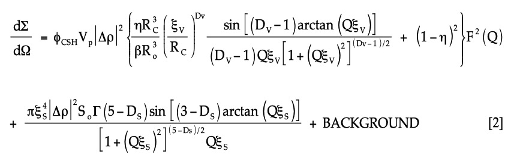
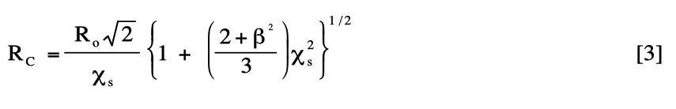
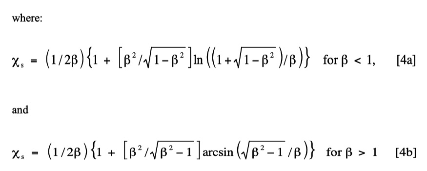
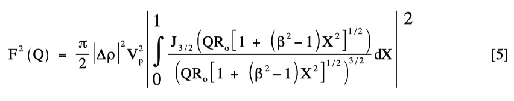

.. _model.models:

.. index::
    model description; Modeling

Model description
==================

Here we describe math behind different models of scattering available in Modeling package. As noted in the page for Modeling package itself, any population can be arbitrarily “switched on and off”. Any population also can be one of : **"Size distribution", “Unified level”, “Surface fractal”, “Mass Fractal”, or "Diffraction peak"**; allowing to model really complex small-angle scattering data. These population models are described here.

Size distribution
-----------------

Parameters of Size distribution are described on main page for Modeling package. Important here is, that this size distribution can utilize any of the Form factors and Structure factors available in Irena. See here: :ref:`Form and Structure factors <FormStructureFactors>`. For more details on GUI and assumptions, as well as distribution shapes see :ref:`Size distribution <SizeDistributionDescription>`.

Unified Fit
-----------

Unified fit is using formula explained in Unified fit model, :ref:`Unified Fit <unified-fit>`.

Diffraction Peaks
-----------------

Diffraction peaks are suing peaks shapes from Small-Angle Diffraction tool, these are listed here :ref:`Diffraction Peaks<PeaksShapes>`

.. _MassAndSurfaceFractals:

Surface and Mass Fractal
------------------------

This model was developed for analysis of cement fractal systems, see : https://www.nature.com/articles/nmat1871, for more details see :ref:`Fractal model<model.Fractal>`. Siumilarly top Unified fit, if you can use dedicated Fractals model tool, use that one. It is simpler to use.

Summary of theory is presented here as well as in page for dedicated model tool. The model predicts :math:`Q^{-Dv}`scattering (i.e. between Q -1 and Q -3 ) for mass- or volume fractals, and :math:`Q^{6-Ds}`scattering (i.e. between Q -3 and Q -4 ) for surface-fractals. In the model function for dΣ/dΩ as a function of Q, there are four components:

dΣ/dΩ = {VOLUME FRACTAL + SINGLE GLOBULE} TERM + SURFACE FRACTAL + FLAT BACKGROUND SCATTERING

These components are incorporated into the full theoretical expression as follows:

The first volume-fractal term contains :math:`\Phi_{CSH}` , :math:`\xi_{v}`, and the mean radius, R\ :sub:`o`\ , and shape aspect ratio, β, of the building-block C-S-H gel globules in the volume-fractal phase, here assumed to be spheroids. It also contains a local volume fraction, η, and the mean correlation-hole radius, R\ :sub:`c`\, the mean nearest-neighbor separation of the gel-globule centers. R\ :sub:`c`\, assumed to be weighted over spheroid surface-contacts, is given by:

In fitting the data, the need to incorporate R\ :sub:`c`\ with η, and a well-defined single-globule term (in addition to the volume-fractal) in the first bracket of eq. [1], is strong evidence for a solid volume-fractal phase. A well-defined single-globule term arises because, unlike the case of fractal pores in clays and porous rocks, nearest-neighbor solid particles cannot exist inside each other, i.e., their centers cannot approach, on average, to within R\ :sub:`c`\. This correlation-hole effect means that, for length-scales of order R\ :sub:`o`\, the individual particles are seen as distinct objects, even when incorporated into an aggregated structure. For a spheroid of aspect ratio, β, the form-factor for a single globule, F\ :sup:`2`\ (Q), is given by:

where V\ :sub:`p`\ = (4βπR\ :sub:`o`\/3), J\ :sub:`3/2` \(x) denotes a Bessel function of order 3/2, and X is an orientational parameter, here integrated over all orientations of the spheroid with respect to Q. Use of a mildly spheroidal globule shape avoids the pronounced Bessel function oscillations for spheres (β = 1), which can perturb the fit at high Q. Satisfactory fits are obtainable with both mildly oblate (β = 0.5) and mildly prolate (β = 2) aspect ratios, giving globule sizes equivalent to a 5 nm sphere for cement.
The surface fractal term in eq. [2] includes ξ\ :sub:`s`\, the mean upper limit of surface-fractal behavior at which the measured smooth surface area per unit sample volume is S\ :sub:`o`\. (The term, Γ(5-Ds) is a mathematical gamma function.)

The BACKGROUND term refers to the incoherent flat background scattering, and it is usually subtracted out of both data and fits for convenience.
