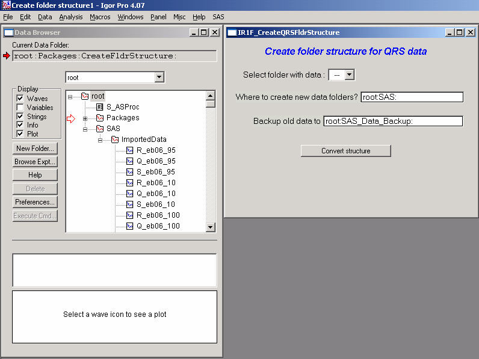
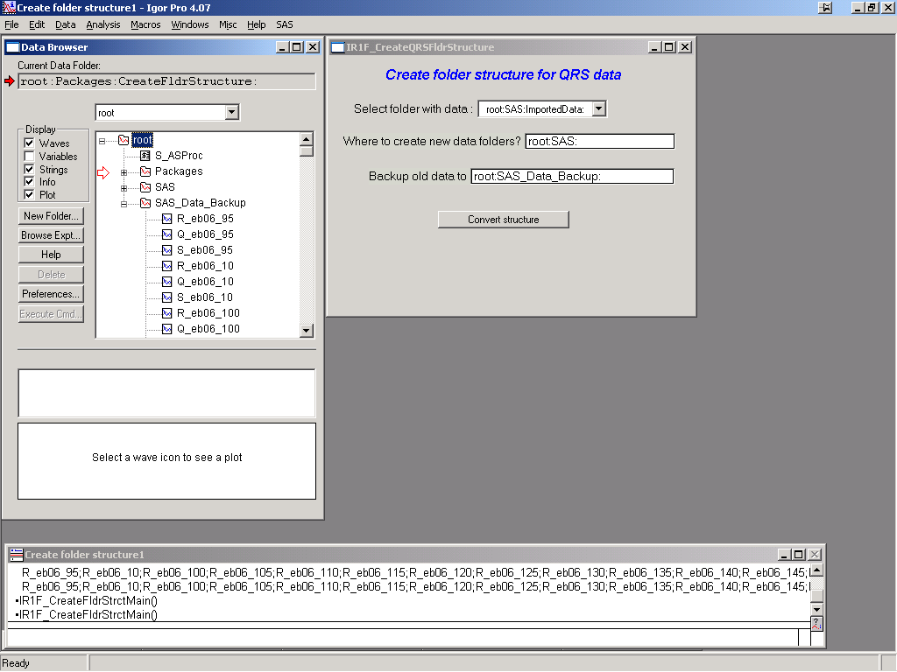

Other Tools
===========

QRS data folder creation tool
-----------------------------

**Introduction**

Many users may have QRS named data in unstructured way – that is all data placed in one folder, very often “root” folder. This is not very convenient place for the data, since the Irena macros make heavy use of the folder structure. To help the users, I made little simple tool, which should in most cases create successfully folder structure for this type of data.

Start the tool from “SAS” “Create QRS folder structure”.

Note that all my imported data are in “root:SAS:ImportedData:” folder. They can be in any folder in the Igor experiment. Note few controls in the panel just created.

“\ *Select folder with data”* this popup will list ONLY folders containing triplets of QRS named data. Select folder, which contains data you want to convert. In case of this example the “root:SAS:ImportedData:” folder

*“Where to create new data folder?”* Input full folder name to folder, in which you want to create new folders with the separated data

*“Backup old data to”* input full folder name where you want to put backup copy of old data. If empty, backup will not be created.

Select appropriate folder with data and push button “Convert structure”. Result can be seen above – folder “Imported data” is now empty and new folders which are named by sample names (using the name from QRS naming structure) were created. Each contains QRS named triplet of waves.

Note, that copy of original data is now in root:SAS\_Data\_Backup folder:

Few comments.

This tool is relatively simple and does not do much checking. It will not be able to remove waves, which are part of any graph (or for other reasons Igor refuses to remove them). It will create new copies of these data, it just cannot remove the waves in use.

The folders with data are never overwritten, if folder of the particular name exists, index starting from 0 will be attached to the name.

Do not backup into the same place where the data are coming from. Make separate backup into separate folder.

Data, for which the code does not find properly named QRS triplet of waves are not touched.

There is no checking for wave length or other validity, all what is used is the names of the waves.

The code does not know about any “name extensions”, so data named “R\_myName\_BkgSub” are treated as separate data from original data “R\_myName”…

I assume, that your names are legal and valid. The code may fail on liberal names (names with spaces and other weird characters). I need to test that later. This should not be a problem, since most users with the data needing this treatment should have standard (non-liberal) names, or the code used to create these should not work..

Logging feature
----------------

This feature is not finished and works only for standard models. It is planned update for future to make sure these records are useful…

User can see the notebook by selecting second item in the SAS menu “Show SAS logbook”. This area is at this time under development, but this is current status of what is written in this logbook:

This is log results of SAS fitting with modeling macros Irena.

1/5/02, 5:47 PM

\*\*\*\*\*\*\*\*\*\*\*\*\*\*\*\*\*\*\*\*\*\*\*\*\*\*\*\*\*\*\*\*\*\*\*\*\*\*\*\*\*\*\*\*\*\*\*

\*\*\*\*\*\*\*\*\*\*\*\*\*\*\*\*\*\*\*\*\*\*\*\*\*\*\*\*\*\*\*\*\*\*\*\*\*\*\*\*\*\*\*\*\*\*\*

\*\*\*\*\*\*\*\*\*\*\*\*\*\*\*\*\*\*\*\*\*\*\*\*\*\*\*\*\*\*\*\*\*\*\*\*\*\*\*\*\*\*\*\*\*\*\*

Parameters before starting Fitting on the data from:
root:USAXS:'S5\_Al2O3 1um':

Number of modelled distributions: 1

SAS background = 0.15, was fitted? = 0 (yes=1/no=0)

\*\*\*\*\*\*\*\*\*\*\* Distribution 1

Particle shape: sphere

Distribution type: LogNormal

Contrast 120

Volume 0.09 , fitted? = 0

Location 250 , fitted? = 1

Scale 300.1 , fitted? = 1

Shape 0.5 , fitted? = 0

Mean 575.21

Median 550.12

Mode 483.83

FWHM 291.36

\*\*\*\*\*\*\*\*\*\*\*\*\*\*\*\*\*\*\*\*\*\*\*\*\*\*\*\*\*\*\*\*\*\*\*\*\*\*\*\*\*\*\*\*\*\*\*

Results of the Fitting on the data from: root:USAXS:'S5\_Al2O3 1um':

Number of fitted distributions: 1

Fitting results:

SAS background = 0.15, was fitted? = 0 (yes=1/no=0)

\*\*\*\*\*\*\*\*\*\*\* Distribution 1

Particle shape: sphere

Distribution type: LogNormal

Contrast 120

Volume 0.09 , fitted? = 0

Location 278.88 , fitted? = 1

Scale 278.32 , fitted? = 1

Shape 0.5 , fitted? = 0

Mean 575.21

Median 550.12

Mode 483.83

FWHM 291.36

Fit has been reached with following parameters

Chi-Squared 910.31

Points selected for fitting 28 to 109

The record will get significantly more complex in the future and, if
using more populations of scatterers, also longer…

Final Comments
==============

This manual is apparently never ever finished… Real apologies to
everyone for this, but it seems to be impossible to keep up with changes
and modifications.
