.. _Plotting_Tool_1:

.. index::
    Plotting tool I

Plotting tools
==============

List of Tools
----------------

1.  :ref:`Plotting tool I <plotting_tool_I>`
2.  :ref:`Plotting tool II <Plotting_tool_2>`
3.  :ref:`Multi Data Plotting tool <Plotting_tool_3>`

.. _plotting_tool_I:

-----

.. Figure:: media/Plotting1.png
   :align: left
   :width: 280px
   :figwidth: 300px

**Introduction**

This plotting tool is designed to be able to produce publication ready plots of variaous types of 1D data : SAXS/SANS and WAXS data, any of Irena results, and practically anything which one should display in XY type plot. It can also perform simple fits. The tool creates usual XY plot as default, but can also create few types of 3D plots - Contour plot, Waterfall plot and Gizmo plot. It can also create movies of either 2D plot and 3D plots.

The tool allows creation of plot user styles, which can be applied quickly and reproducibly to numerous sets of data. New data types can be automatically created. Please note, that the formatting is saved ONLY if it is done through my custom made panels designed for this purpose.

The tasks, which can be done:

1. Load data and plot them, new data types (e.g., Y \* X^4) are    automatically created if necessary.

2. Modify data (Multiply Intensity, remove points, subtract background,…)

3. Do simple fitting (Porod, Guinier,…)

4. Plot data in 2D Contour plot

5. Plot data in 3D plots - Waterfall plot (quick but simplistic) or Gizmo plot (slow but powerful)

6. Create movies of 2D plot or 3D plots.

7. Create plot user styles, import and export them from current Igor    experiment for future use

This tool can also display “results” – size distributions, Unified fits etc.

Plotting tool I
---------------

Select “Plotting I” from SAS menu.

In the top part are :ref:`standard data selection tools <DataSelection>`. This package can also be scripted by :ref:`scripting tool <scripting_tool>`. Select data in usual way and push button “Add data”. You can add multiple data sets. You cannot have the same data set twice, code will complain and refuse to do so. You can add data anytime later also.

Apply Graph style available in the popup “Graph style” or select the data type to plot on both axes. The needed data are created, if they do not exist.

Use checkboxes and more controls in “Change graph details” (opens new panel with more space) to modify graph as needed.

Example: Selected data and applied included log-log style:

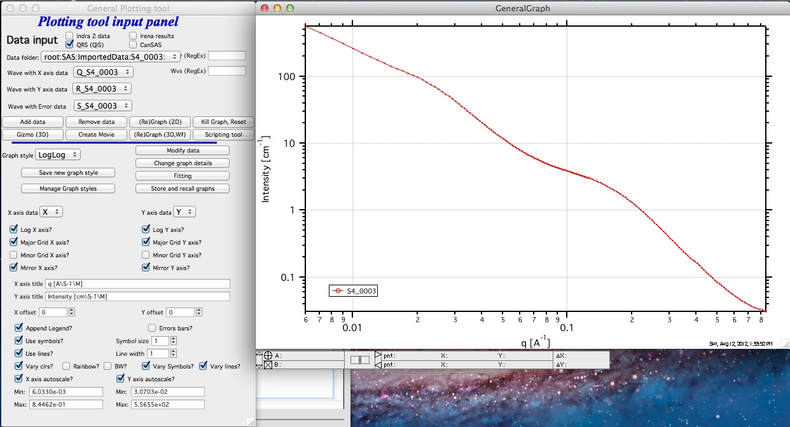

Note few items: In the axes names you need to use Igor formatting for subscripts, superscripts, Greek letters etc.

Setting limits on the axis can be done manually or using function which can be called using zoom function in Igor. Select area of the graph you want to zoom to and right-click. Select “ZoomAndSetLimits” from the menu. This will zoom the graph as well as set limits in this tool.

Scripting
~~~~~~~~~

It is possible to script the Plotting tool I to add multiple data sets into the tool without doing it manually:

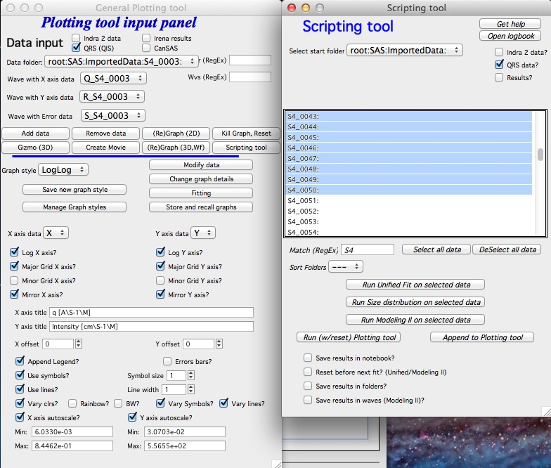

You can use the scripting tool to either rest Plotting tool and add the files or just add files to existing files already in the plotting tool using one of the two buttons:

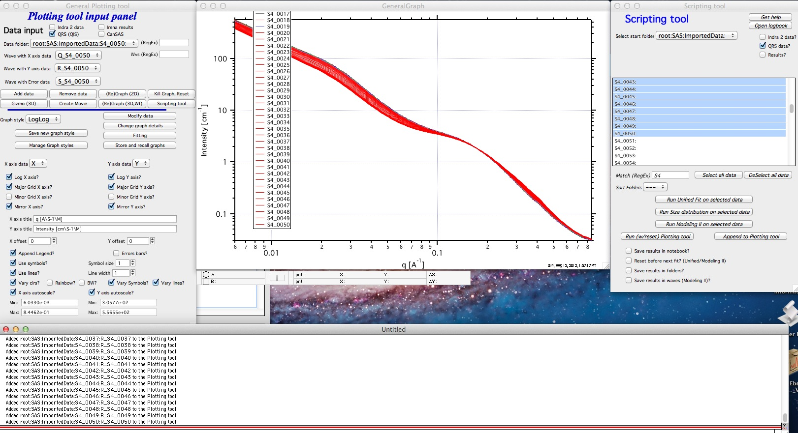

The plot of these data (time series of SAXS data) is not very informative in any presentation... Therefore now we have few 3D options...

Contour plot
~~~~~~~~~~~~

From version 2.52 this tool can create Contour plot. Load series of data in the tool (best through Scripting tool) and then push button "*Contour plot*". Contour plot is created:

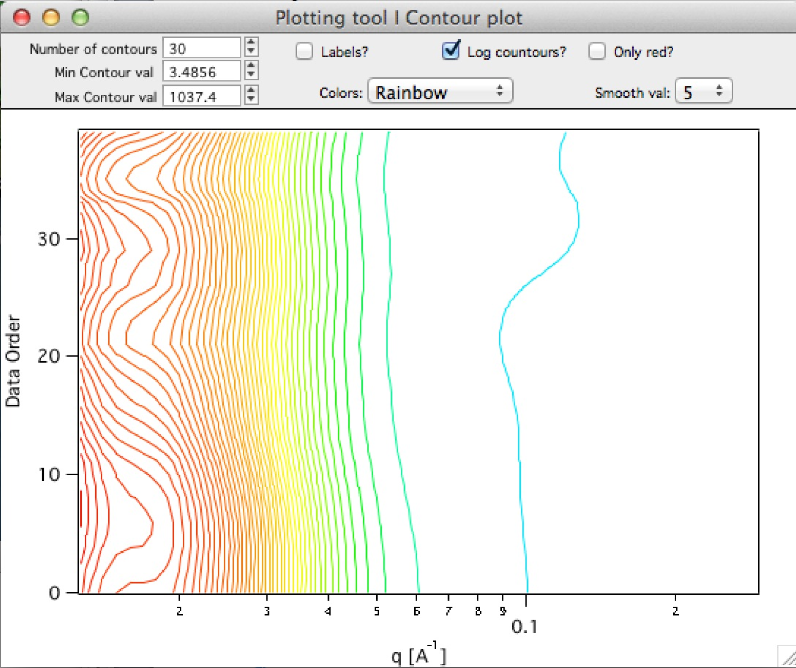

Associated controls allow some modifications of the way the data are displayed. Note, there are MANY more option in Igor, these are just the ones I felt are useful for the presentation of data Irena typically presents. If you need more options, let me know what options you need...

Basic options are: Min/Max Contour with number of Contours. Display Labels (numbers on contours showing their values), spread the contours on log scale, choice of colors and smoothing of the contours.

Note, that Contour plot is regular XY plot for Igor, so to change labels, ranges and other properties of this plot can also be done by using standard Igor tools.

Waterfall 3D graph
~~~~~~~~~~~~~~~~~~

Using the button "(Re)Graph (3D, Wf)" you can create Waterfall graph. It is fast and kind of very simplistic.

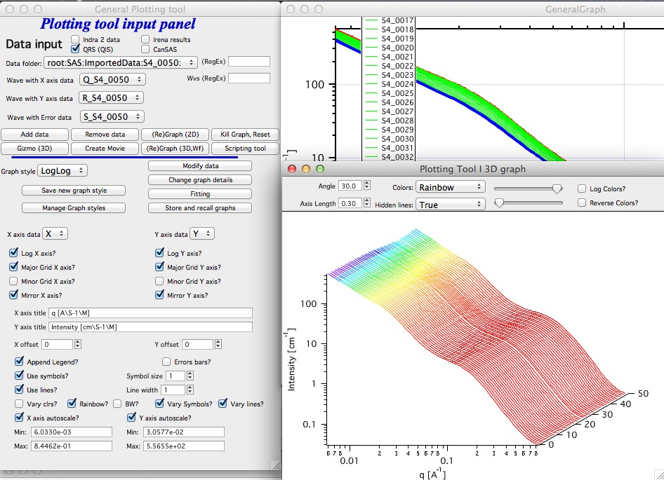

There are some controls at the top which enable small changes to presentation of this graph...

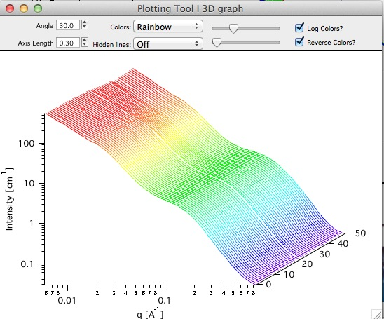

But not that much...

Gizmo 3D graph
~~~~~~~~~~~~~~

Using Gizmo in Igor is much more advanced and this tool is under development starting from version 2.48. More functionality is likely going to be added but it is currently useable.

To start, push button "Gizmo (3D)", at least 3 data sets are necessary...

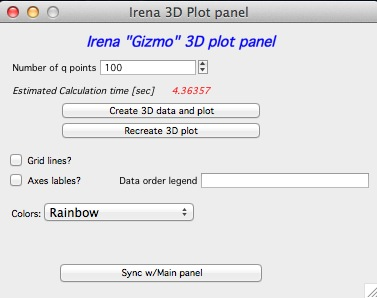

To use Gizmo one needs to resample the data to create smooth plane data on grid pattern. Therefore we need to resample q scale. Note that if the main panel has "Log X" selected, log(q) will be used for this tool. Also if the main tool has "Log Y axis" selected, log of Intensity will be used. This may be correct for SAXS data, but not for Size distribution for example. If main tool has these Log choices unselected, straight data will be used.

Note that this calculation may take a lot of time, especially when input data have a lot of points. Therefore there is Estimated Calculation time - which is kind of approximate for my Macbook Pro, your times will vary. But it tells you if it takes short time or lot of time. Better feedback ("get coffee" may be provided in the future.

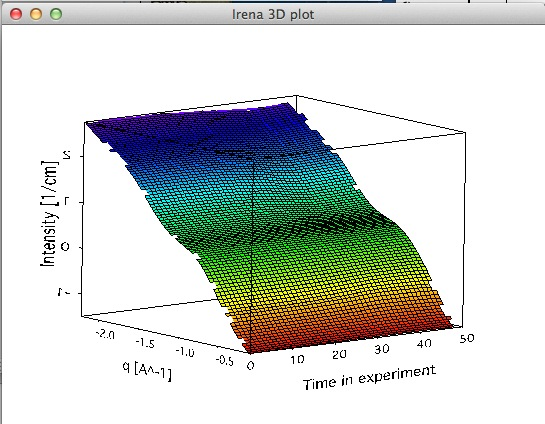

The button "Create 3D data set and plot" will - as indicated - create the 3D data and plot them. The button "Recreate 3D plot" will use existing data (it exist) to recreate the 3D plot. It will be much faster, but the data may be stale.

Choices of Grid lines and Axes labels = legend are left to user. Note, that the x axis and z axis are taken from the main plot panel while the "data order" legend is in this panel. Color scale is common with Waterfall 3D graph. Other controls may appear in the future.

Since this tool does not know about the main panel, if there are changes to the main panel you need to push button "Sync w/main panel" to update the Gizmo plot

Note, that Gizmo has manytools associated with it in the menu as the controls for it are kind of awkward at this time. Major upgrade is planned for Igor 7.

You can create movies of rotation of the Gizmo plot, control its visual look, etc. More controls is likely to appear in the future, but final version of this tool is likely for Igor 7.

Fitting
~~~~~~~

Use button “Fitting” to pull up panel with fitting range, checkbox “Use errors” if these are available. Select function to fit. Use cursors to select range of data to fit.

Note, that various number of parameters appears below for starting guesses for parameters. You can try to push button “Guess fit parameters”. This will try to guess starting parameters for fitting, since these are necessary for various fits. It may or may not work well. Good guess is VERY important for least square fitting. Example:

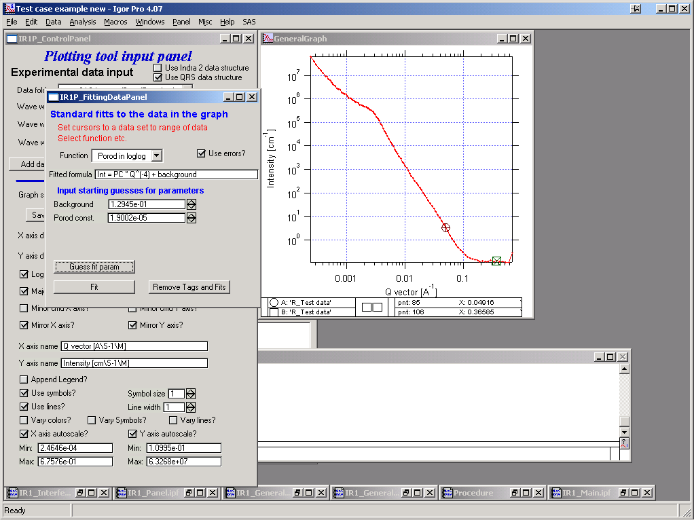

The try to fitting:

Results are printed in graph:

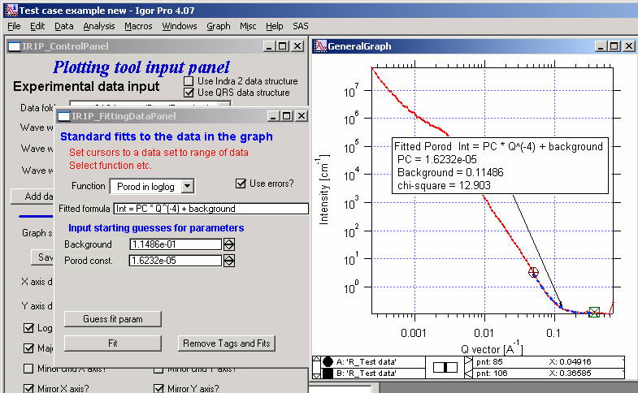

To remove the results from the graph and clean it up, use button “Remove Tags and Fits”.

Remove a data set from the graphing tool
~~~~~~~~~~~~~~~~~~~~~~~~~~~~~~~~~~~~~~~~

To restart the tool and cleanup the data from graph push button “Kill graph, reset”, to remove one data set at a time from the tool, use button “Remove data”.

Creating user style
~~~~~~~~~~~~~~~~~~~

When you have graph which you like to use many times, click button “Save new graph style”. The new style will be created after user provides name. The name is checked for uniqueness and for name appropriateness, so the new name may be slight modification of the name provided. You can rename the style using “Manage Graph details” button.

NOTE: from version 2.38 I have added predefined common styles (Guinier, Porod, Zimm,…) into the menu. These could have been defined by any user if needed. Note, that at this moment it is difficult to do those linearized fits which call for fitting in log scale (fitting log or ln of Intensity vs log or ln of Q for example) because the tool displays data on log scale when the plot calls for it. That is kind of problem, as in order to use line fitting in Igor I would have to create log or ln of the Intensity (or Q). This is mess logically (display Intensity on log/ln scale or create log/ln of intensity and display on linear scale?). I am trying to image out how to do this so it is easy to use for users and logical. I may actually do separate tool for these fits, as adding this into Plotting Tool I seems to make it much more cumbersome to use. User input would be really welcome here!

Import & Export of styles
~~~~~~~~~~~~~~~~~~~~~~~~~

Use “Manage Graph details” button.

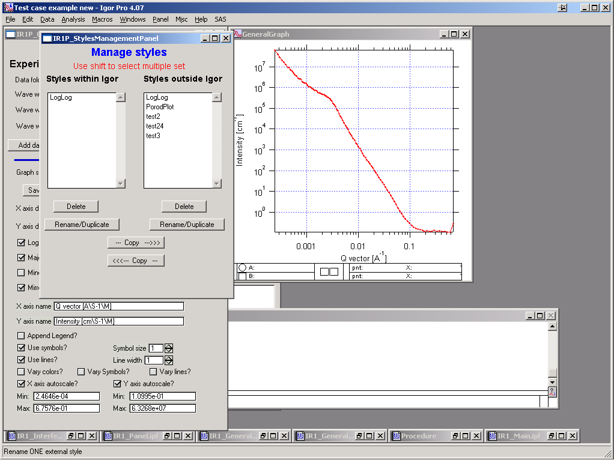

The panel shows two main lists. Left shows user styles available in Igor and right shows styles outside Igor. Buttons under each window allow manipulation with the styles, the buttons “\-\-\- Copy \- >” or “<\- Copy \-\-\-“ can be used to copy styles between the Igor experiment and hard drive
storage space.

When done, kill the panel.

Modifying the data
~~~~~~~~~~~~~~~~~~

Click button “Modify data” and new panel will show up.

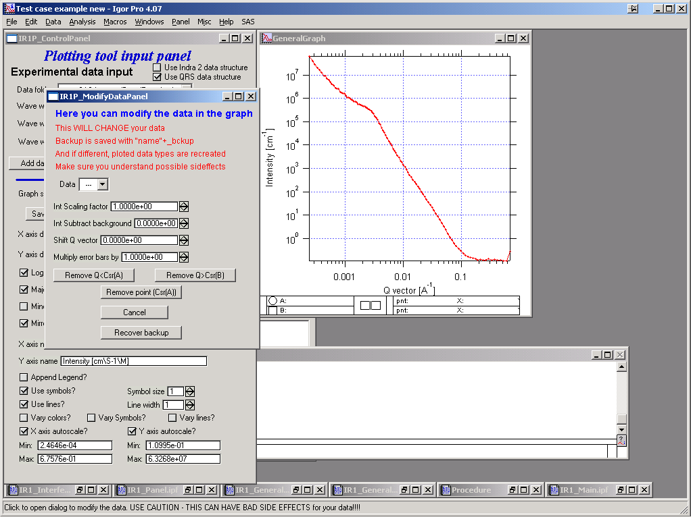

**Important information:**

When this tool is used **FIRST** time on a data set, it creates a backup copy of the data. Anytime later, this can be recovered. If that is done, **ALL** changes done to the data will be removed.

Select data to modify, modify using buttons and numbers. For removing data smaller than particular Q or removing just one data point, user rounded cursor (called A in Igor) and for removing data larger than particular Q use cursor B (squared).

Use button Cancel to reset the corrections to default values seen above. Note, that this resets instance of running this tool, to reset data to original data you may have to recover backup of the data…

Note, that the length of the name of wave is limited to 30 characters, including the "q\_" etc. at the beginning.

Storing graphs for future use, exporting images
~~~~~~~~~~~~~~~~~~~~~~~~~~~~~~~~~~~~~~~~~~~~~~~~

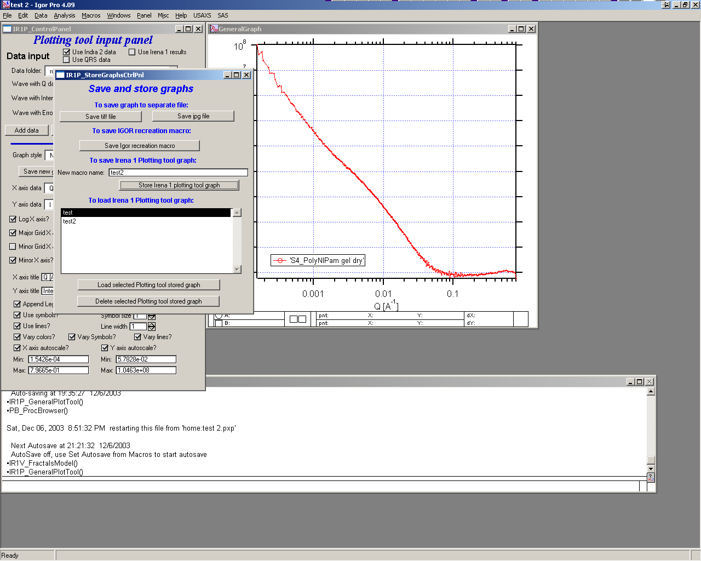

To get a control panel controlling the features for storing graph, exporting graph and recalling stored graph, push button on main screen “Store and recall graph”. This pulls up the above control graph.

Controls description:

The two top buttons allow user to save current graph as tiff or jpg files. The dialog for naming them is provided after pushing the button.

To save Igor recreation macro, push the next button. It does not work yet… I need to image out how to do this.

Next is name for Irena own recreation macro, which you can store. This macro is in form of string and stored in “root:Packages:StoredGraphs:".

The advantage of using this macro compared to Igor Pro recreation macros is the fact, that after recovery of graph through this macro the Plotting tool can still control all features. That is not true for Igor recreation macros.

“Store Irena plotting tool graph” button will store the current graph in the above-mentioned place as a string. The strings are listed in the listBox below.

Selected stored graph in the listBox can be either restored – or deleted, using the buttons below.

More…

In version 2.62 I added ability to add linked d-spacing axis to the top of the graph. In the “More…” dialog is place for more useful tools. First tool there is adding TransformAxis to the top of the graph, which displays d-spacing. Note, that this is not very convenient for recreating and so it is removed when you make any change which forces recreating the graph. Keep that in mind, it is bit inconvenient.

Below is the panel and example of result in a graph.

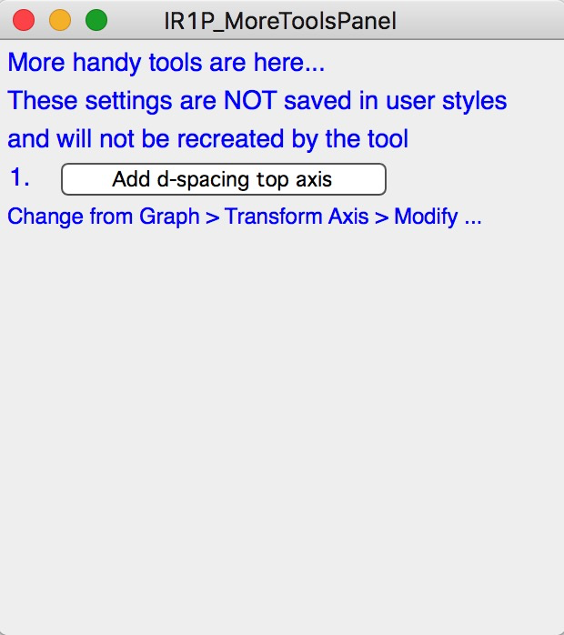
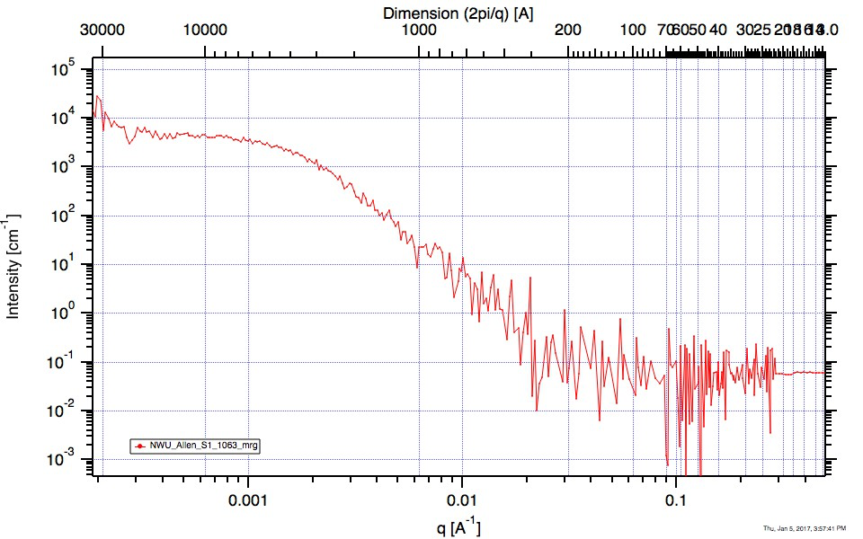

Movie making
~~~~~~~~~~~~~

To present time series of data from version 2.48 this tool can create movies. Use button "Create movie" and ne panel is created:

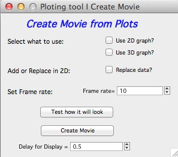

You can create sequence of 2D graphs or 3D graphs, in 2d graphs you can either add the data in between the frames or replace the data in between the frames. Few other controls allow you to control how the movie is going to look like. The 3D graph here is the Waterfall graph described above, Gizmo has its own movie creation tool provided by Wavemetrics.

-----

.. _Plotting_tool_2:

.. index::
    Plotting tool II

Plotting tool II
----------------

This is modification of plotting tool developed by Dale Schaefer. This tool control ANY top graph. It can, therefore, be used more flexibly – but has some limitations… This tool is likely to be developed more in the future.

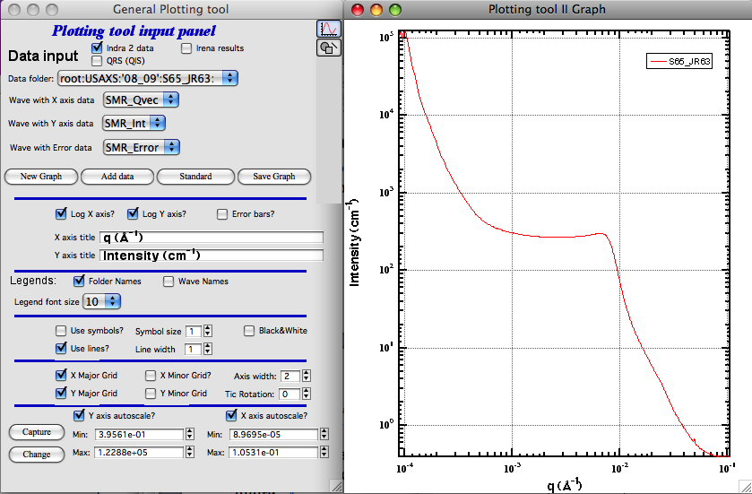

The GUI contains selected controls and any change in this GUI is applied to the top graph. Note, that compared to Plotting tool I, which at each modification reapplies all formatting to the graph it controls, this tool applies only the control which has been changed. Therefore, this tool is basically ONLY different GUI to Igor controls – combined with convenient Irena data selection tools.

-----

.. _Plotting_tool_3:

.. index::
    Multi Sample Plotting tool

Multi Sample Plotting tool
--------------------------

This is tool developed to be able to plot many Irena/Indra/Nika data types quickly and easily. Many plots can be created quickly, with lots of data included in each graph. Also, controls can be individually applied to any graph. The tool can plot X-Y (optionally error) such as data (Q/Int/Err) or results (Size distribution, PDDF,...), but also different SAXS linearization plots - Guinier, Kratky, Porod and few others used mostly in bioSAXS.

.. Figure:: media/MultiDataPlot1.jpg
        :align: left
        :width: 800px
        :Figwidth: 720px

**Data Selection**

Left side of the panel is Data selection. This Data selection set of widgets is common to many tools now, so it is important to understand it well...

*Data type* Irena recognizes few data types.

* USAXS data type = this is naming system for data generated by APS USAXS instrument. Ignore, unless you have data from this instrument. If you have our data, you should know enough to use this.
* QRS data type = this is the default data naming system for SAXS/WAXS data in Irena and Nika. For details see here :ref:`QRS data type <important.QRS>`.
* Irena results = any fit and modeling results generated by Irena. Most tools will save some type of data - size distribution, fits, pddf, diffraction peaks,... All of these data types can be seen as "Irena results"
* Any = if all checkboxes are unchecked, user can define Regular expressing, which will tell irena which wave is x, y, and optionally error. Keep in mind, that the first wave matching the regular expression will be picked. This may require some testing or help from me, if you want to use it.

*Start Fldr.* Here you can select at which location in data tree code will start looking for the data. Pick suitable place, for example root\:SAXS may be a good start. Picking suitable start where to look for data makes the code run faster.

*Folder Match (RegEx)* this allows users to look for only some of the folders. A short summary on regular expressions is at the bottom of the page, below the Listbox with folder. Google it, understanding regular expressions will be very helpful.

*Invert?* this checkbox inverts the Regular expression meaning. So if you insert in the "Folder Match" field string 00034, only data which have in name 00034 will show. If you check this checkbox, selection is inverted and all files which do NOT contain this string in the name will show.

*Sort Folders* This sorts the folders using one of many methods implemented. As result, this will group folders in order which may be helpful for processing. For example, some tools create list of results in the order the samples were processed. Having proper order helps plotting results after the analysis properly.

*HOW TO USE* Pick a good starting folder. If you select root\:SAXS\: folder, it will list all data inside this one folder inside their subfolders, if any. If I have 7 folders inside this folder, each with 45 measurements for each sample, I will see 7\*45. That is a lot of names to deal with. But if I choose for example root\:SAXS\:Sbuf1_00033\: as starting folder, only 45 data sets which I want to see will be shown.

Learn to use the "Folder Match" and Sorting folders, it helps a lot!

**Adding data**

One data set can be added to graph by double clicking on the name. Note, that any data set can be in a graph only once, so if you try to add it second time, code will do nothing. 
