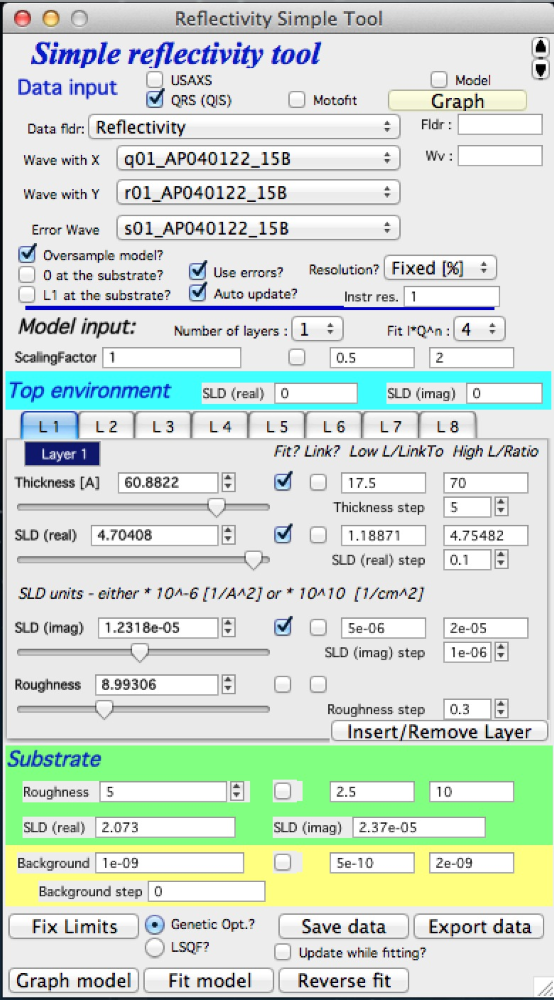
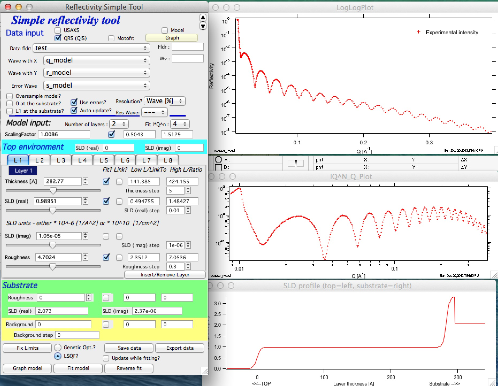
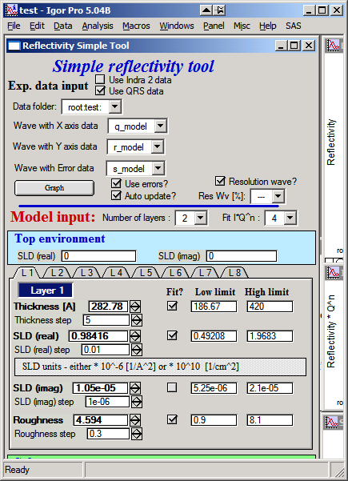
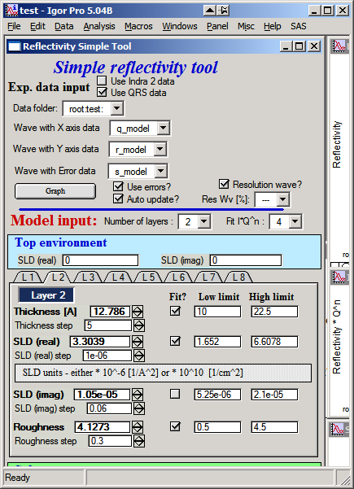
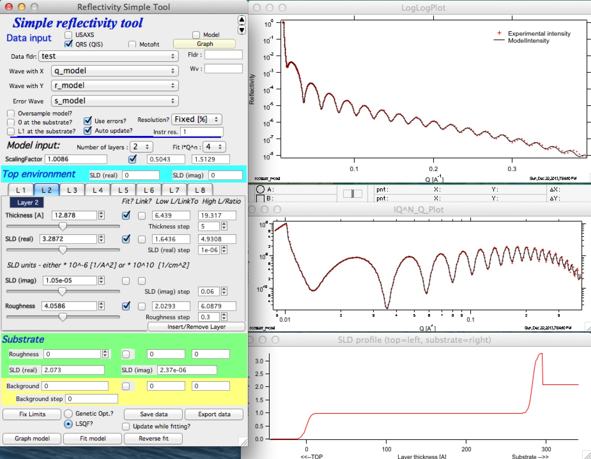

Reflectivity
============

This is relatively simple tool to model and fit X-ray and neutron reflectivity for up to 8 layers using recursive Parratt’s code (L. G. Parratt, *Phys Rev*, **95**\ (2), 359-369, 1954), as implemented for example in older code called “Parratt”. The code itself was provided by Andrew Nelson (Andrew_Nelson@users.sourceforge.net ). I have implemented only the GUI in manner similar to the rest of the Irena code. I will provide basic support for this package. Please note, that Andy has made more complex and capable version of his package “Mottofit” available for free download to other Igor users through http://motofit.sourceforge.net/ under GNU license. If you need more complex fitting, than my code allows, please use Andy’s powerful code. You may, however, have to learn little bit more of Igor.

**Use of xop to speedup the calculations**

The code uses optional abeles.xop and GenCurveFit.xop. These are both optional – but the increase in speed (especially abeles.xop) is major (factor of 5-10x). These xops can be downloaded from Andrew Nelson’s web site (listed above).

**Explanation**

For testing purposes, I have included 3 column reflectivity data in Irena folder (…Wavemetrics/Igor Pro/User procedures/Irena) in the file called reflectivity.txt. Please load the data through Data loading tool as qrs data.

The select “Reflectivity” from the SAS menu:

**Following are the parts of the panel**:

1. The top part – data selection part is similar to the other tools in Irena – select type of data, data folder with the data, and wave names containing q, reflectivity and error. Push Graph to generate graphs. If you have resolution as single value, uncheck the “Resolution?” checkbox and insert value in the field, if you have resolution wave (q resolution), select it’s wave name here. NOTE: this wave must be in the same folder as the data are. Also, for now there are no checks on wave length, so make sure this wave has same number of points as data waves have.

2. Note that there are few controls : "*Oversample model?*" if selected model is calculated for 5x as many points as input data have. "*0 at the substrate*" if selected thickness is calculated starting at the substrate, not at the top as usually. "*L1 at the substrate*" if selected, the first layer is at the substrate.

3. Select number of layers, input scattering length density (SLD) for the top environment (usually air, so 0 is fine, but if this experiment was done for example under water, than this would be different). The tabs contain controls for each layer – thickness in A, SLD (real and imaginary) in units as displayed on the panel and roughness.

4. Substrate values – roughness and SLD

5. Measurement (aka flat) background.

6. Control buttons

When data are selected, following graphs appear:

Note, that the top graph is log-log plot of reflectivity vs Q, medium is reflectivity \* Q^n (n=0 to 4 as selected in the panel) and bottom is reflectivity profile. The fitting (see later) is done in the space reflectivity \* Q^n to improve mathematical stability and convergence of the problem. The controls (selection of data range) however, MUST be done in the top graph (the log-log plot).

Now, I have very good values for these particular data (thanks to Dale Schaefer for providing the data and solution!!), see the tabs below:

Input these values and SLD for substrate of (real part) 2.073 and imaginary part 2.37e-6. The resolution is 1%, so uncheck the “resolution wave (if checked)” and input 1%.

Then push button “Graph model” you should get really good match to data:

I suggest you play now with parameters to find out, how sensitive the problem is.

**Details**

Resolution wave - this is q resolution - has number of options... Either Fixed value in % (e.g., 1% of q for each point), wave with % value for each point, wave with delta q for each point and wave with (delta q)\ :sup:`2` for each point.

*Oversample model* - allow user to calculate model with more points (5x more) then input data. Useful, when you have "sparse" data - typically neutron reflectivity.

*0 at the substrate* - selects to start with the thickness at the substrate, default is at the top of the system (typically air).

*L1 at the substrate* - from where you count the layers. Deafult is from top, option is from substrate.

*Use errors* - use the errors... The code may have problems fitting without uncertainties (aka: errors).

*Auto update* - recalculate when any parameter changes. Needed for use of sliders. Do not check on really slow computers.

Scale data using scaling factor to hit 1 at Q=0.

If you set the system to "Auto update" you can use sliders to see how the reflectivity changes.

You can fit the parameters using Least Square fitting, but more likely you want to use Genetic optimization. Note, however, that for Genetic optimization the low and high limits for parameters must be "reachable". The Gen. Opt. tests all of the parameter range to find optimum solution.

You can insert/remove layer using the button, if you need to add/remove layer from the current system.

You can link parameters together. If you know one of the parameters is N x parameter from other layer, you can link them and fit them together.

*Fit model/reverse fit*: Select range of data to fit in the top graph and push the Fit model button. Fitting is done in the Intensity \* Q^n as selected in the panel. Use power of 4 is suggested, if lower values are used, the fitting tends to neglect the high-q data. If fit fails but reaches some solution, you can recover to previous data by pushing “reverse fit” button. Very handy…

*Save data* – copies model data into data folder so they can be used in the future. If you try to load data from folder containing already reflectivity data, you will have option to reload previous solution into the tool. This allows very quick re graphing of the stored solution.

*Export data* saves ASCII file outside Igor for use in other packages. Obsolete and not maintained. Better - save data in folder ("Save data") and then use ASCII data export to save data where you need them.

Do not ask me to add more layers, use Motofit (http://motofit.sourceforge.net/wiki/index.php/Main\_Page) for anything, which is more complicated than what Irena Reflectivity can do.

When publishing data processed with this tool cite Motofit manuscript: A. Nelson, Co-refinement of multiple-contrast neutron/X-ray reflectivity data using MOTOFIT, Appl. Cryst. (2006). 39, 273-276; as this tool uses internally the code by Andrew Nelson.
