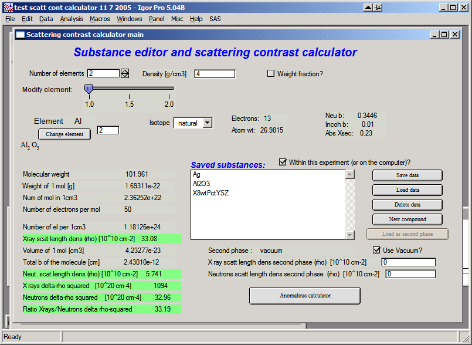
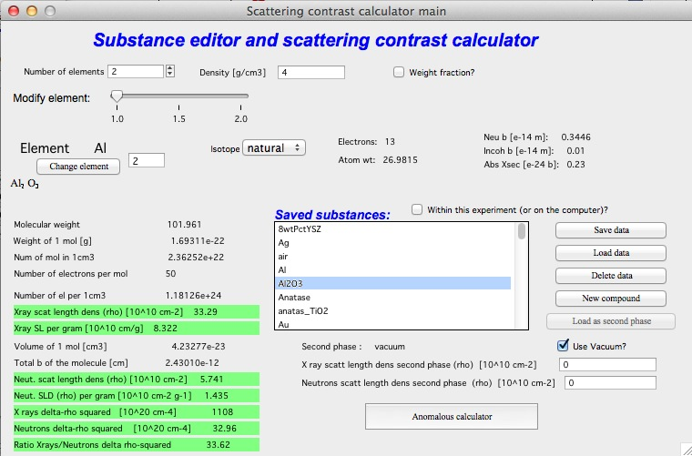
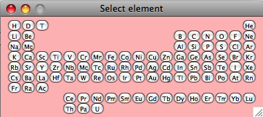
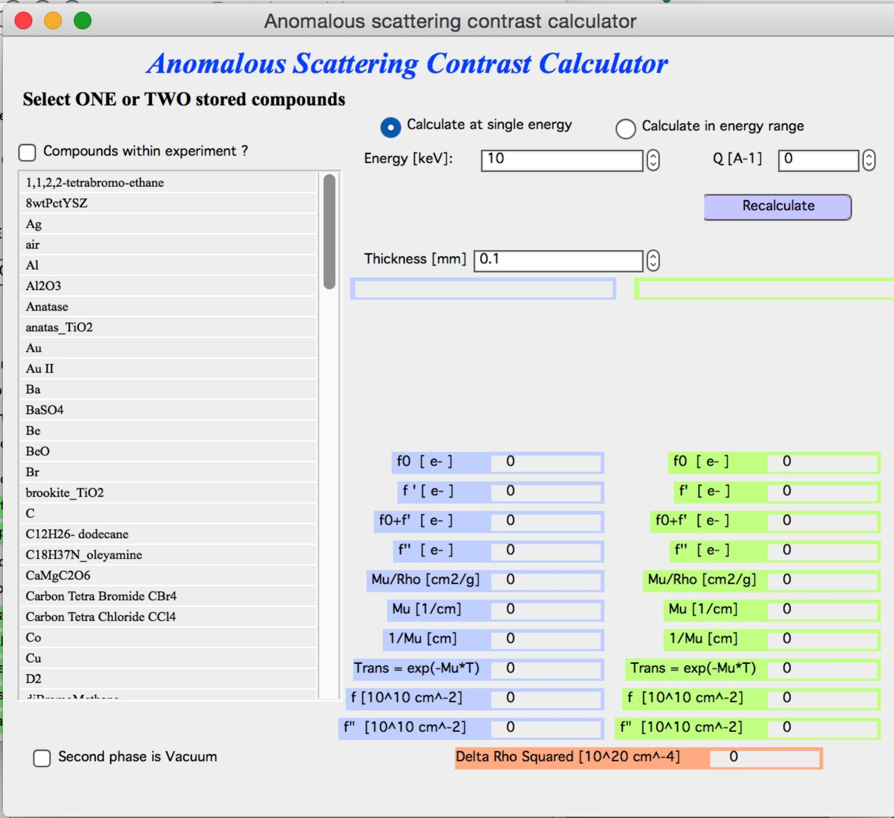
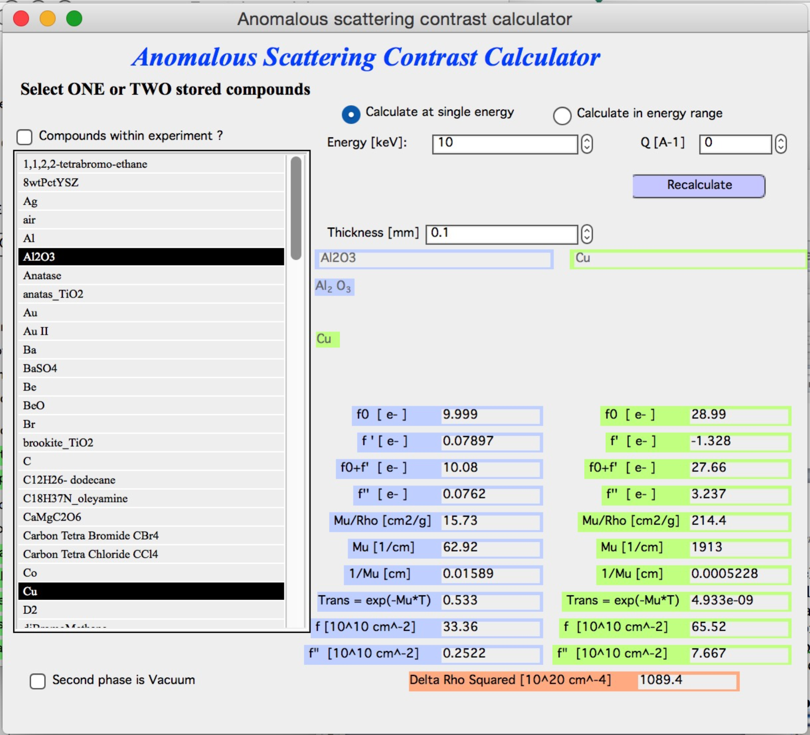
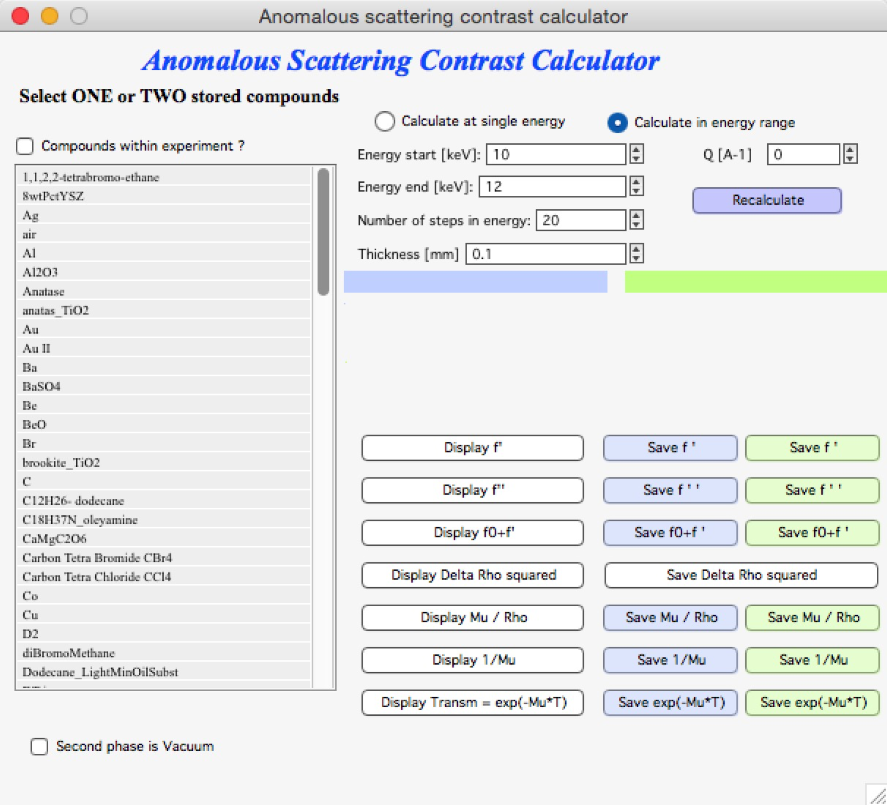
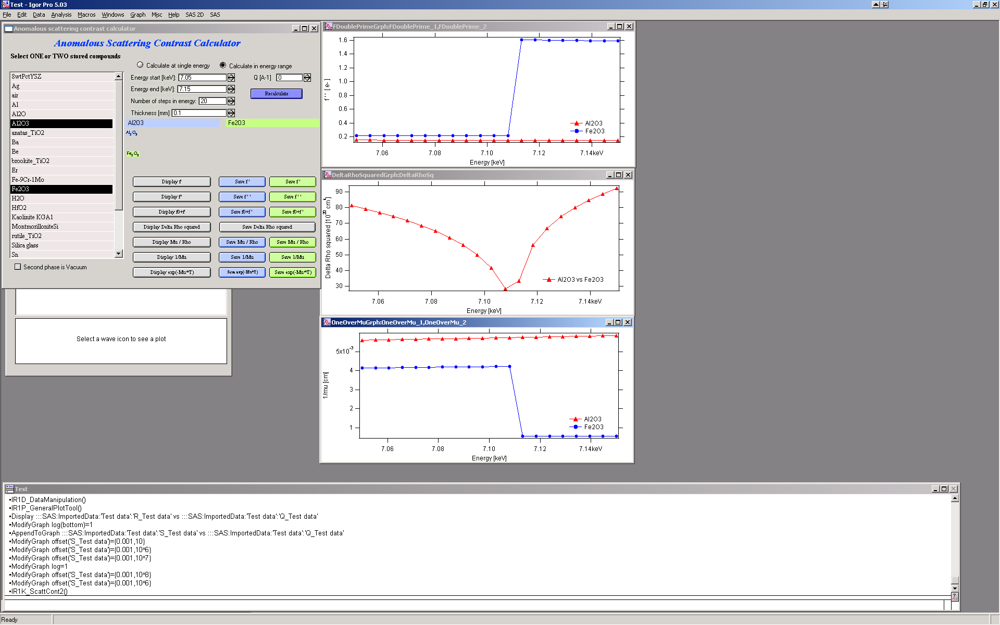
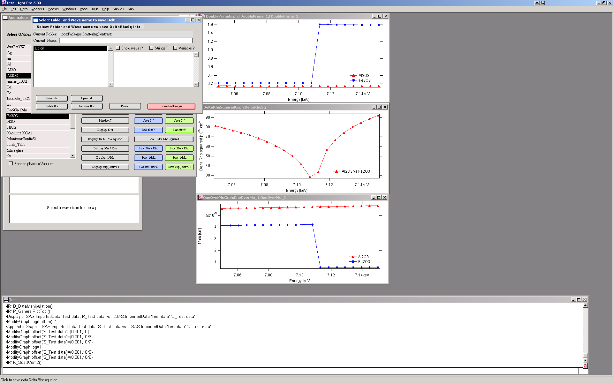

Scattering contrast calculator
==============================

**Introduction**

Calculating scattering contrast for various compounds is annoying
“monkey” work, which can be easily left to computers. The tool in
“Irena” at this time allows one to calculate the X-ray and neutron
scattering contrast for compounds with up to 24 atoms, with known
density, with known atomic fractions and **with no energy dependence**.
Energy-dependent anomalous scattering effects (for X-rays) may also be
considered by an additional level of this tool (see button marked
:ref:`"Anomalous calculator" <Anomalous_Calculator>`  in lower right corner).

Basic calculator
----------------

Select from menu “SAS” item “Scattering contrast calculator”:

This is the interface. At the top, select number of atoms in the
material, set its density and check the check box if you want neutron
data displayed. Let’s select 2 atoms, may be Al\ :sub:`2`\ O\ :sub:`3`
(Corundum) with density of 4 and see neutron results. This is the
picture after this selection

Use slider to select each element and check it’s properties – amount in
molecule, Isotope etc. Input is done through Periodic system table (push
Change element button). To continue, close the table…

Most of the fields is filled automatically with data from internal
databases of this tool. In the lowest part of the tool are results and
intermediate calculations of this tool – so one can obtain various
numbers, which needed to be calculated.

**Matrix**

To calculate delta-rho squared …
(ρ:sub:`matrix`\ −rho\ :sub:`scatterer`)\ :sup:`2` ... we need to set
scattering length density of matrix. This can be done in numerous ways:

1. Write the numbers directly in the fields provided

2. Calculate the matrix scattering length densities and use “Set as
   matrix” button

3. Save matrix data using “Save data” button and then load them as
   matrix “Load matrix data”

In each case the values for “delta-rho squared” should be recalculated.
Note, that if checkbox “Use vacuum as matrix” is checked, vacuum is used
as matrix and no selection for matrix is available…

**Saving data**

This tool has “saving” feature, which allows to save the compound parameters in such way, that it can be used in the future. **The data can be saved either INSIDE the current Igor experiment or OUTSIDE Igor experiment.** Compounds saved outside are available to any Igor experiment on that particular computer**. But experiment moved to another computer will not have these compounds saved…

To select where compounds are saved, use checkbox “Within this
experiment(or on the computer)?

Use buttons “Save data” to save current compound, modify name as
necessary – keep in mind to keep the “” around the name and use
characters allowed as file names. Limit name to 27 characters or so (Mac
name limitation).

Use buttons “Load data” to load data in the tool and “Load matrix data”
to load data as matrix ONLY…

Comment: Due to rounding related to saving the data in ASCII file, there
will be rounding error when using “Load matrix data” in the “delta-rho
squared” calculations…

Button “New compound” will clear all settings in the tool to start
creation of the new compound.

**New comments on saving the data:** From this release the compound data
are saved with in the same place where the Irena macros are stored. This
is to allow users of limited privileges to run and operate. See above
comments on macros installation.

.. _Anomalous_Calculator:

Anomalous calculator
--------------------

The package includes Cromer-Liberman code for calculating
energy-dependent (anomaouls) effects. The button “Anomalous calculator”
on the “Substance editor and Scattering contrast calculator” calls up
new window…

Use of this tool:

Select one or two compounds created and SAVED in previous (regular
scattering contrast calculator). If you select only one, use vacuum as
second phase (checkbox below the selection of compounds). Then select,
if you want to calculate values at one energy or in energy range. Note,
that calculating values for large number of points may take quite a long
time.

To select two compounds hold shift. Then input right thickness and click
“Recalculate”. Fill in the Q if you need values at higher Q values (for
small-angle scattering assume Q=0)…

**For single energy following appears:**

Note, that table on right got filled with all relevant numbers –
f’ and f” , Mu, and related values for each compound
separately. Note, that f’ and f” are here with two different units as
output – in electrons per molecule unit and in 10\ :sup:`10`
cm\ :sup:`-2`. Lowest number is delta-rho squared between the two
compounds at this energy…

NOTE : line “Trans – exp(-Mu\*T) is calculated transmission of your
materials, with the thickness in the Thickness field and energy where
this calculation was done. The thickness is same for each material. This
can be easily used to pre-calculate necessary thickness of the sample
before experiments. If you change the thickness, these transmission
values get automatically recalculated.

**For range of energies:**

Fill in the range of energies, number of steps you want to calculate
(equidistantly spaced between min and max energies) and other
parameters. The push “Recalculate”.

The buttons “Display” create graphs of appropriate parameter, see for
example below:

Buttons “Save …” save the wave with the data into Igor folder of users
choice. The dialog should be easy to use and allows user to create new
folder, select name for new data etc. Note, the data are saved as waves
with so called “x-scaling”. To learn more read Igor manual.

