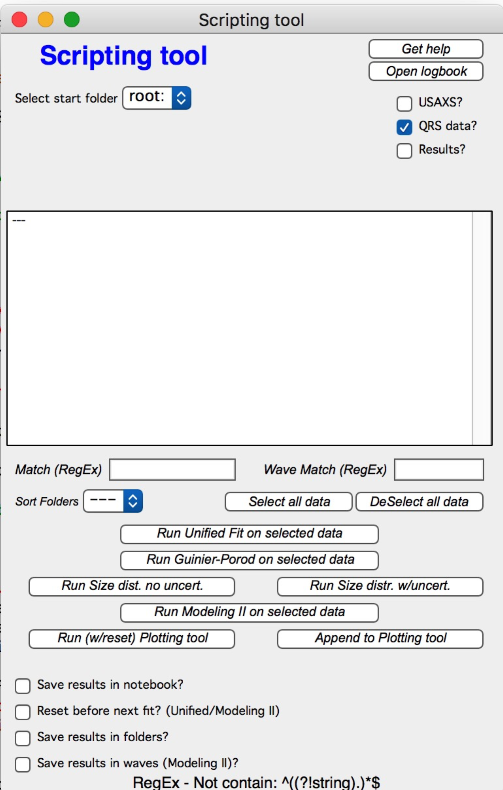
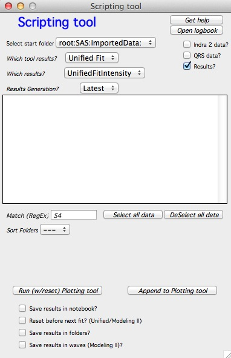

.. _scripting_tool:

.. index:: Scripting tool

Scripting tool
==============

This tool enables scripting of (for now) four packages – **Unified fit, Guinier-Porod, Size Distribution, Modeling II and Plotting tool I** – to enable automatic processing of large data sets. During the automatic processing the error messages and most of the user dialogs generated by these packages are suppressed.

**What this tool does:**

For Data analysis tools for each of selected data folders it does following:

1. Select the data folder and load the data in, create graph (pushes    “Graph” button)

2. Sets cursors to the same Q value as previously set

3. Pushes “Fit” button

4. Saves data per selection in the control panel

Limitations: The data selection must be unique for every data set. This requires one data set per folder for qrs data structure. For USAXS data (“Indra2”) the data used will be type selected during testing – for example SMR\_\* or DSM\_\*, or M\_SMR\_\* etc. These data must exist in all folders. If needed, I can try to update the system and make more options. Send me e-mail if you need more functionality.

For Plotting tool I :

1. Reset or no reset the tool

2. Add data sets into the Plotting tool in order listed in the panel (can be controlled by order choices)

3. Push button "Plot"

**Use of the Scripting tool**

Open the tool, which you want to script and make a fit on representative data set. Make sure the data range selection (if any) using cursors is correct for all data sets in consideration. Use appropriate data type.

Open the main window - left is with SAXS data selected, right is with Irena results selected:

Select starting folder and from the list of folders here select the ones you want to process. Select type of data to be processed… Note, that if you select "Results" you can use only Plotting tool I. The controls hopefully make sense - which tool results, which type of results (e.g., volume or number size distribution?) and which generation. remember, each tool can create multiple "generations" of results - each push of "save" button creates new one (\_1, \_2,...). Latest picks highest number found.

Note, that the order here will be from top to bottom. Change the order by using "Sort Folders" popup. Let me know if more ordering should be done.

The buttons at the top:  “Get help” creates panel with short help for this tool.

“Open logbook” opens one of two logbooks… If this tool was used to create its own notebook for results, this one will open. This notebook contains selected results and also graphs. If this notebook does not exist, standard internal logbook will be opened. This one contains similar data, but no graphs.

**Select options:**

1. *Save results in notebook* – will create notebook in which graph and summary of results for each data sets will be printed.

2. *Reset before next run* – valid for Unified. Will reset to original values from test case after each fit. This is useful when the changes are not progressive but more or less random and previous result could be worse starting point that the test case. If not selected, the last result is used as starting model for next sample.

3. *Save results in folders* – will copy usual results waves in the original data folders so they can be plotted or looked at again.

Note:

Without “Save results in notebook” and/or “Save results in folders” there will be no output from the procedure and you will not learn anything…

**To run:**

Select representative case example (and test extreme cases) and run the tool on this example data. Make sure all parameters are set correctly. This includes:

Proper selection of fit checkboxes and limits on Unified…

Proper error weighing and background value in Size distribution.

Proper range of data selection with cursors (if applicable) for both
tools.

When ready push button “Run …. on selected data”
