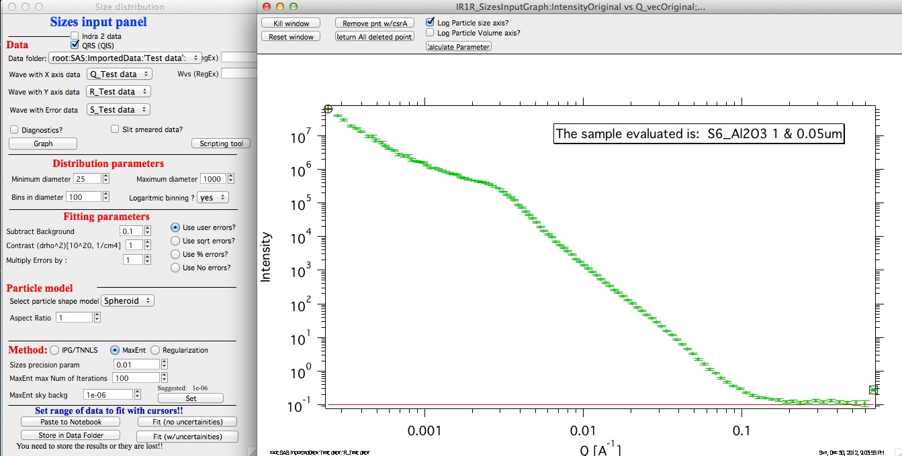
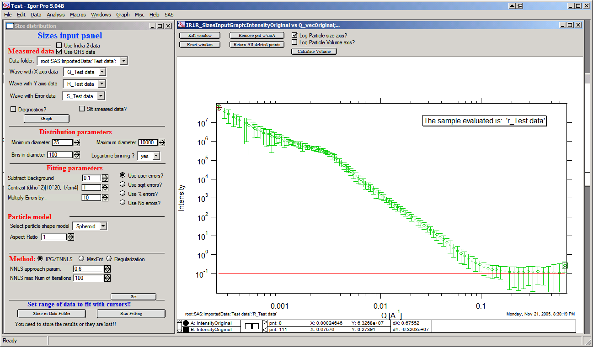
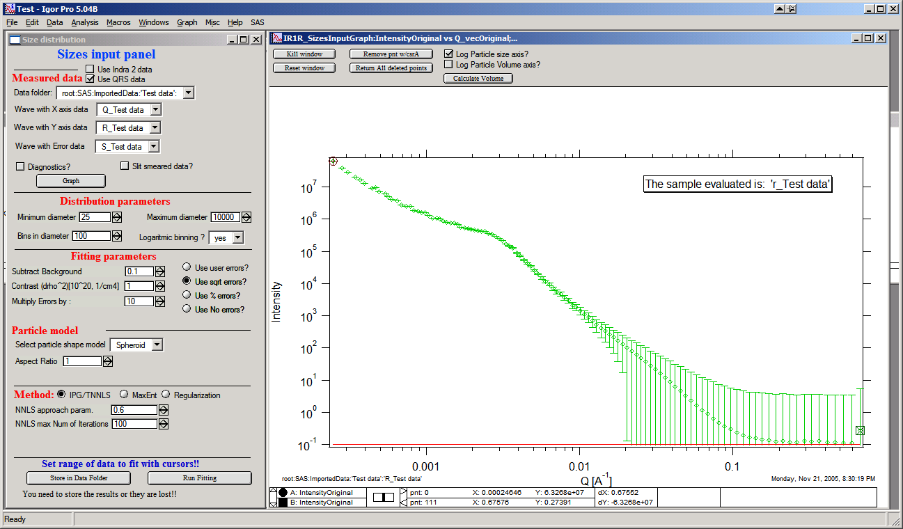
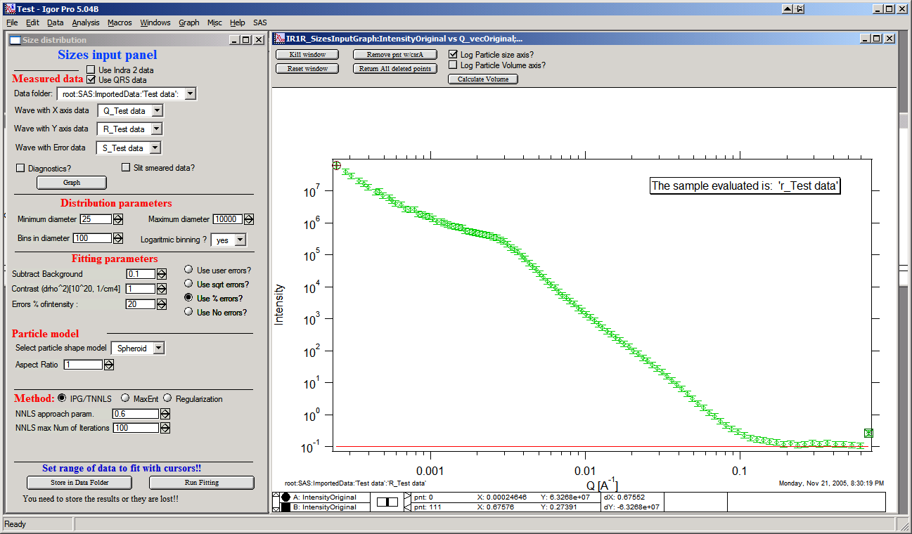
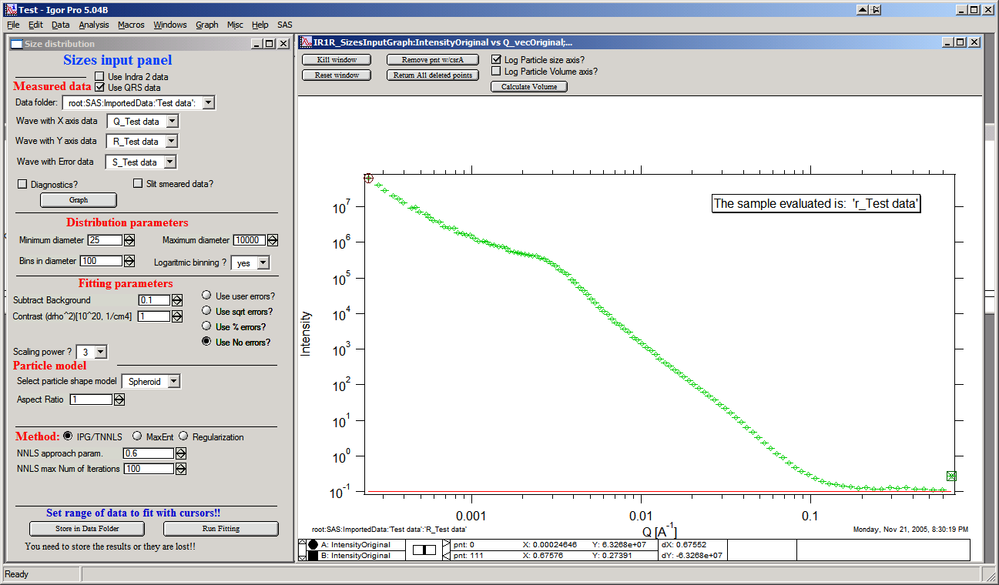
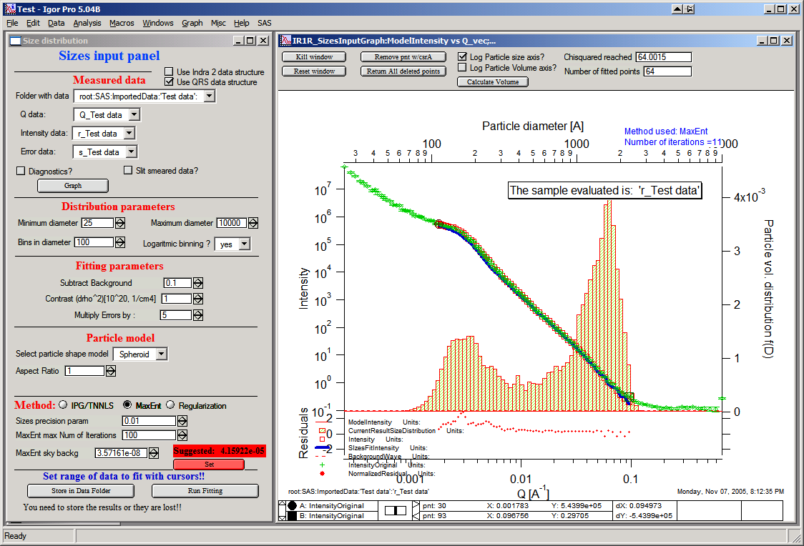
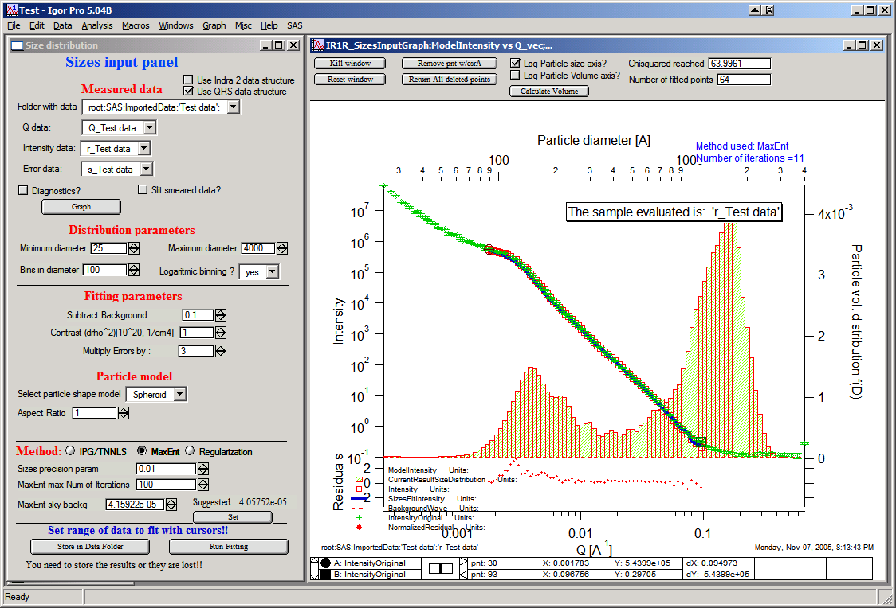
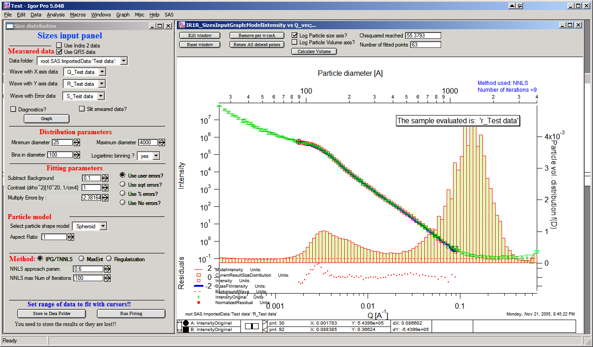
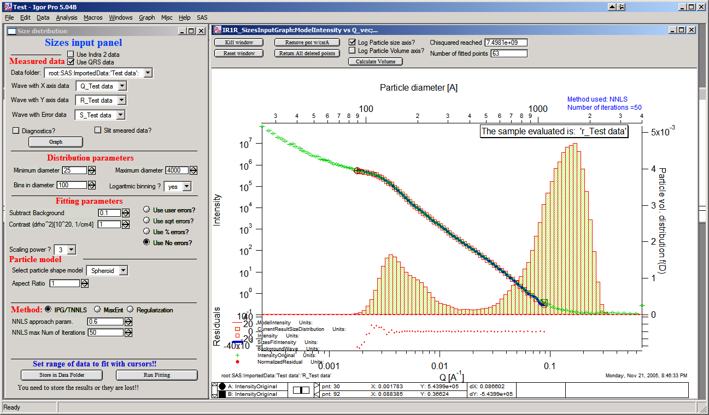

.. _model.size-distribution:

.. index::
   model; size distribution
   size distributions; model SAS data

Size Distribution
====================

There are three methods to computer a size distribution from the measured SAS data:

* :ref:`model.maxent`
* :ref:`model.regularization`
* :ref:`model.tnnls`

Basic description of methods
----------------------------

.. _model.maxent:

Maximum entropy method
~~~~~~~~~~~~~~~~~~~~~~

.. index::
   model; MaxEnt
   model; Maximum entropy method

Maximum entropy (MaxEnt) and regularization (maximizes smoothness) are two separate methods for obtaining size distributions from small-angle scattering data. Yet, we describe them together here since they share many common components. Both are versions of a constrained optimization of parameters which solve the scattering equation.

.. math::

  I\left( Q \right) = \left| \Delta\varrho \right|^{2}\int{\left| F\left( Q,r \right) \right|^{2}V\left( r \right)N_p\left( r \right)\text{d}r}

The difference in these two methods is in the applied constraint and it is this constraint which most heavily influences the differences between the two methods in the form of the result.

The maximum entropy method was developed by Jennifer Potton et al., and supplied in the code package MAXE.FOR. Pete Jemian (jemian@anl.gov) has had his hands all over this code and in a few places, made some rather significant additions, resulting in the code package sizes.c. Most significant is the addition of the regularization method which is likely to succeed an finding a solution in many cases when the MaxEnt method fails to converge upon a solution. Please contact him with any questions regarding the implementation of these methods. (Point of fact, *both* are actually regularization methods.)

    J.A. Potton, G.J. Daniell, and B.D. Rainford; Inst Phys Conf
    Ser, #81, Chap. 3, (1986) 81-86

    --- J Appl Cryst, 21 (1988) 663-668

    --- J Appl Cryst, 21 (1988) 891-897.

    J. Skilling and R.K. Bryan; Mon Not R Astr Soc, 211 (1984)
    111-124.

    Ian D. Culverwell and G.P. Clarke; Inst Phys Conf Ser, #81,
    Chap. 3 (1986) 87-96.

Literature citation for Maximum Entropy code in Irena macros bvy Pete Jemian

Pete R. Jemian, Julia R. Weertman, Gabrielle G. Long, and Richard D. Spal; Characterization of 9Cr-1MoVNb Steel by Anomalous Small-Angle X-ray Scattering, *Acta Metall Mater 39* (1991) 2477-2487.

Here :math:`N_p(r)` is described as a histogram size distribution where a fixed number of bins are defined over a given range of diameter with either constant diameter bins or constant proportional diameter bins. Solution of the histogram size distribution to the scattering equation 9.1 above is obtained by fitting the scattering calculated from trial distributions to the measured data and then revising the amplitudes of the trial histogram distribution based upon the applied constraints. The trial histogram size distribution is not forced to adhere to a particular functional form, such as Gaussian or log-normal. However, in the current formulation, all sizes of the scatterer are expected to have the same scattering contrast and morphology (shape, degree of interaction, aspect ratio, orientation, etc.).

In both MaxEnt and regularization methods, the measured data must be represented by the calculated data so that the goodness of fit criteria (sum of squared standardized residuals) is close to the number of measured data points used in the analysis, subject to an additional constraint. This imposes a high standard for the reported errors on the scattering intensity. The reported errors are expected to be estimates which are comparable to one standard deviation of the true intensity and that the difference between the measured intensity and the true intensity is within one standard deviation of 67% of the time and randomly distributed such that a summation over these differences has zero mean and unit RMS. If these conditions are not met, it is likely that artifacts in the derived size distribution will result. Often it is necessary to scale the reported errors by a factor to achieve converge of the MaxEnt method.

As a point of fact, both MaxEnt and regularization are regularized methods of solution to the scattering equation above. They both seek solutions of the functional, Ξ,

.. math::

    \Xi = \chi - \alpha S

where :math:`\chi^2` describes the goodness of fit, *S* is the applied constraint, and :math:`\alpha` is a Lagrange mutiplier used to ensure that the solution fits the measured data to some extent.

For MaxEnt, the additional contraint is that the configurational entropy of the size distribution must be maximized. Rather than be bothered by what this means when compared with the thermodynamic entropy, you are asked to consider that this constraint enforces the principle that all histograms in the size distribution must have a positive amplitude. To make the calculation of the entropy, an additional reference level must be defined. Typically, this reference level (a.k.a., Sky Background, starting guess, *a priori* information) is about 0.01 of the maximum level of the final size distribution. One does not need to fine-tune this parameter and should never be concerned with adjustments less than one order of magnitude. Too high and this parameter will cause the solution to have upward tails at both low and high ends of the distribution. Too low and additional scatter will appear in the distribution. The MaxEnt constraint imposes no correlation on the amplitudes of adjacent bins in the calculated histogram size distribution.

.. _model.regularization:

Regularization method
~~~~~~~~~~~~~~~~~~~~~

.. index::
   model; Regularization method

The regularization method implemented here maximizes the smoothness of the calculated histogram size distribution by minimizing the sum of the squared curvature deviations. The particular mathematics used here do not prevent the use of negative values for the amplitudes of the histogram size distribution and this is a noted behavior which must be considered to avoid. Often, it is possible to avoid the negative bins in the size distribution by adjusting the fitting range, the bins in the histogram size distribution, or the background.

NOTE: since version 1.50 I modified the code to provide ONLY positive solutions. It is heavy-handed code change and likely not really mathematically correct. It may change a bit in the future.

.. _model.tnnls:

Total non-negative least square method
~~~~~~~~~~~~~~~~~~~~~~~~~~~~~~~~~~~~~~

.. index::
   model; TNNLS
   model; Total non-negative least square method

This is implementation of the “Interior point method for totally nonnegative least square method”. I have found reference and method description for this method on line: Michael Merrit and Yin Zhang, Technical report TR04-08, Department of Computational and Applied Mathematics, Rice University, Houston, Texas, 77005, USA. This publication was from May 2004, I have found it on the web posted in December 2004, http://www.caam.rice.edu/caam/trs/2004/TR04-08.pdf

Basically, this is very interesting method, in which one starts with reliably positive solution, calculates gradients using least square method to better solution and makes step towards this solution. The size of the step is limited in such manner, that the solution (histogram bin content) cannot be made negative. If the step would make it negative, the size of the step is limited in such manner, that the non-negativity is guaranteed.

The problem of this method is, that there does not seem to be any simple way of incorporating errors in the calculation. Generic method which was suggested to me resulted in instability of the code. So, contrary to MaxEnt method (which inherently uses errors), in this method the errors are used only to identify sufficiently good solution.

Also this method seems to have major problem with the poor conditioning of the SAS problem – natural log-q and log-I behavior of the SAS data. Therefore, it basically requires, that fitting is done in different “weighing” of the data – for example I\*Q\ :sup:`4` vs Q etc…

Uncertainties - since version 2.50 I have added code, which can generate uncertainties, by running multiple fits to data modified by adding Gaussian noise scaled to have standard deviation equal to the data uncertainties.

Trust regions – in version 2.57 I have added color indications about which sizes in the resulting size distribution can be trusted and which are uncertain. These calculations are pretty simplistic for now – based on Q\ :sub:`min` and Q\ :sub:`max` used for fitting, one can convert these to sizes (using d ~ 2\*pi/Q). Only sizes of particles, which are within the measured range of Qs can be really trusted. Since SAXS sees also “outside” the fitted range to some degree, with less trust one can expect slightly larger or smaller particles to be characterized approximately, and as one gets far from the fitted Q range with sizes, trust in the results should be very small. This is indicated on the trust indicator – green center part shows trusted range, yellow transition suspect range, and red ranges are simply untrustworthy. The tool will produce something, but with no bounds by data, this will be pure speculation with no real value. This color bar can be removed using checkbox at the top bar of the graph.

Compare following two graphs, in which the Q fitting setting is vastly different:

.. image:: media/SizeDistribution1.png
   :align: left
   :width: 100%

.. image:: media/SizeDistribution2.png
      :align: left
      :width: 100%

Use of Size Distribution
------------------------

This program uses one complex interface – a complex graph and panel for data input and manipulation. To start, select “Size distribution” from “SAS” menu…

On the panel, which gets created, starting from top are :ref:`standard data selection tools <DataSelection>`.  This package can also be scripted by :ref:`scripting tool <scripting_tool>`

1. select the “Use QRS checkbox” (assuming you are using QRS named data as explained above).

2. Select data folder with data (see image below)

3. Select wave with Q vector, other should be selected automatically (if not select right waves). Note, that it is now not necessary to input error wave. See below…

4. “Graph”

New graph gets created.

Leave the “Slit smeared data” set to no and “Slit length” set to NaN. If using the Indra data structure (USAXS data reduction), these fields are preselected in the proper form and should not have to be changed. If the data are from different instrument (as here) and are slit smeared the macro can be still used. Providing user selects correctly slit smeared data and inputs slit length in units of Q. I expect this case to be highly unlikely…

Next we need to setup some parameters.

**Distribution parameters**:

Minimum diameter & Maximum diameter – both are in A. These are limits of fitted distribution. Set minimum to 25 and maximum to 10000

Bins in diameter – into how many bins you want to divide the range of diameters. 100 is a good number – more points may be really slow on slower computers.

Logaritmic binning – if yes, the bins are binned logarithmically – i.e., the bins at small sizes are smaller and at large sizes are larger, giving save width bins when plotted on axis logarithmically. This is very useful setting for the wide ranges of sizes measured using USAXS instrument. If no is selected here, the bins are all same width. Leave in yes for now…

**Fitting parameters**

Background this is flat background to be subtracted from data. The red line in the graph shows current value. Set correctly for this case to 0.1 or so

Contrast (delta rho squared) – if this is properly inserted, the data are calibrated… Leave to 1 since the contrast is not known.

**Error handling**

There are four ways to handle now errors in this tool. The method is selected by four checkboxes lined vertically next to the “Background and Contrast” fields…

1. “Use user errors” use erros input as wave. In this case the field: “Multiply errors by”is available and errors can be scaled as needed. Start with high multiplier and reduce as necessary to reach solution, which is both close to the data but not too noisy.

2. “Use sqrt errors” – will create errors equal to square root of intensity (standard Poission error estimate). You can multiply these errors by error multiplier. Errors are smoothed.

3. “Use % errors” – will create errors equal to n% of intensity. Field where to input the n appears. Errors are smoothed.

4. “Use No errors” – use no errors – the weight of all points is the same. This is unlikely to be correct, but this case allows to use fitting in “scaled” space – Intensity \* Q\ :sup:`m` vs Q, where m = 0 to 4. This helps to mathematically better condition problem (similarly to using errors) and can yield sometimes good solution.

**NOTE : at this time you cannot use this method (no errors) with MaxEnt or Regularization.**

**Comments:**

MaxEnt works best with user errors or % errors.

IPG/TNNLS seems to work best with no errors and m = 2 -4. Reason is
unclear.

The errors displayed in the graph will change as different methods are
selected:

User errors, multiplied by 10:

SQRT errors, multiplied by 10:

% errors, used 20%:

No errors, selected to use I\*Q\ :sup:`3` vs Q “space” for fitting:

**Particle shape**

Particle shape model – the tool uses the same selection of form factors as Least square fitting. If you feel you really need another shape, I can put it in. Same comments apply WRT speed as mentioned in Least square fitting – “integrated spheroid” is using the most complex way to avoid possible artifacts, but is very slow. Spheroid AR 1 is fastest, others depend on complexity of math and integration. The code has been internally optimized to run as fast as possible.

Aspect ratio – anything, 1 is for sphere.

**Methods**

**The default method is Maximum Entropy.**

Size precision parameter is internal number which should not be changed too much. Most users should be happy with default. Smaller the number, more precisely MaxEnt needs to match the chi squared…

MaxEnt max number of iterations – unlike Regularization, which has limit on number of iterations, MaxEnt can go infinitely. Therefore maximum number of iterations need to be enforced.

MaxEnt Sky Background. While this is relatively complicated number internally, note the suggestion next to it. Suggested value is 0.01 of maximum of the resulting volume distribution. The suggested value will be either green or red, depending if the value in the box is reasonable. Accept the suggestion and you will be happy.

**IPG/TNNLS**

.. image:: media/SizeDistribution8.png
      :align: left
      :width: 100%

Approach parameter is the step size (from maximum) which will be made in each step towards calculated ideal solution. Basically convergence speed, but too high number will cause some overshooting and oscillations. For most practical purposes seems to work fine around 0.5-0.6.

NNLS max number of iterations – limits number of iterations. Change as needed.

Scaling power – this is how Intensity will be scaled to improve the conditioning of the problem.

**Regularization**

Has no additional controls.

Buttons part

**“Run fitting”** runs the above selected method.

SAVE THE RESULTS button – if you do not push this, the data are not copied back into the sample folder and are overwritten with new data.

Getting fit.

First select range of data using the cursors. Set rounded cursor on point about 30 and squared on point 89 or so. Note, that you can vary the range of fitted data between the fits.

Push button “Run internal MaxEnt”. Solution should be found as in the image below…

If the parameters are too restrictive you may get error message, that solution was not found. In such case check minimum and maximum diameter settings, check the error multiplication factor etc. Generally I suggest starting with higher range of radii than needed and higher error multiplication factor. Then reduce as needed. Also check the shape.

This is rough fit for the data in the graph – and for purpose of description of this graph now.

**Now let's get to explanations**:

The green points are the original data points.

The red points (top part of graph) are points selected for fitting (without background)

The blue line (very difficult to see) is the fit obtained by the fitting routine

The bar graph is the particle volume distribution (use top and right axis)

In the low graph

The red dots are normalized residuals. Ideally these should be random within +1 and –1, this structure suggests some misfits in some areas.

To get better results one now needs to play with the parameters. I suggest reducing maximum diameter to about 4000A, reducing multiply errors by to 3, fixing the MaxENt sky background and the running the same routine again. Following is the result:

This shows, that we have bimodal distribution of scatterers. By the way, these data are from mixture of two polishing powders.

And now the IPG/TNNLS method:

This is solution with user errors. Note, that the solution is basically very similar to MaxEnt.

And here is solution with no errors, but scaling by Q\ :sup:`3`. Less noisy. Note, that in this case the IPG/TNNLS method is stopped by the Maximum number of iterations. Less number of iterations, less noisy solution – but may not be close to measured data…

**NOTE : at this time you cannot use this method (no errors) with MaxEnt or Regularization.**

Saving the data copies waves with results into folder where the measured data originated. Also, it is possible to have various generations of data saved. In order to give user chance to find what each saved result is, following dialog is presented:

.. image:: media/SizeDistribution13.png
      :align: left
      :width: 380px

Here user can write ANYTHING, as long as it is bracketed by the QUOTES. The QUOTES are VERY important.

If user tries to start Size distribution macros in folder, where saved solution to this method exists, he/she is presented with dialog, which allows one to recover most of the parameters used for that solution.

.. image:: media/SizeDistribution14.png
      :align: left
      :width: 380px

Therefore it is possible to start from where he/she left off. Also it is possible to start fresh - just hit cancel in this dialog - when parameters are left in the state they are left in after last fitting (or in default if this macro was not yet run in this experiment.

Resulting waves:

Following waves are created in the folder with data, when saved from this macro (\_0, \_1, \_2, etc are different generations of solutions saved by user):

SizesNumberDistribution\_0

Contains number distribution data

SizesVolumeDistribution\_0

Contains volume distribution data

SizesDistDiameter\_0

Contains Diameters for the other waves which need it

SizesFitIntensity\_0

Contains Intensity of the model

SizesFitQvector\_0

Contains Q vectors for the above Intensity wave

.. image:: media/SizeDistribution15.png
      :align: left
      :width: 380px

Comment, each of these waves contains WaveNote (see below at the bottom of the image), which contains most of the details about how the particular results were obtained:

These are the parameters:

SizesDataFrom=root:'Test data':

SizesIntensity=Intensity

SizesQvector=Qvector

SizesError=Error

RegNumPoints=40

RegRmin=12.5

RegRmax=2000

RegErrorsMultiplier=3

RegLogRBinning=yes

RegParticleShape=Spheroid

RegBackground=0.12

RegAspectRatio=1

RegScatteringContrast=1

RegSlitSmearedData=No

StartFitQvalue=0.001783

EndFitQvalue=0.068163

RegIterations=12

RegChiSquared=60.45

RegFinalAparam=1.8853e+07

UsersComment=Result from Sizes Wed, Sep 11, 2002 5:12:42 PM

Wname=SizesDistributionVolumeFD\_0

Most of these parameters should have self explanatory names. This is
where user can image out what happened.

Further some parameters are also saved in the string with name
“SizesParameters\_0” such as MeanSizeOfDistribution.

Uncertainty analysis of Size distribution
------------------------------------------

If "Fit (w/uncertainties)" is used, 10 fits with data varied by data modified by Gaussian noise scaled to ORIGINAL uncertainties is run and statistical analysis is done on each bin. Here is example of results:

.. image:: media/SizeDistribution16.png
      :align: left
      :width: 100%

Note, that the tool can provide calculations of volume with uncertainities:

.. image:: media/SizeDistribution17.png
      :align: left
      :width: 100%

The uncertainties are exported and plotted. More support in Irena needs to be added as needed.
