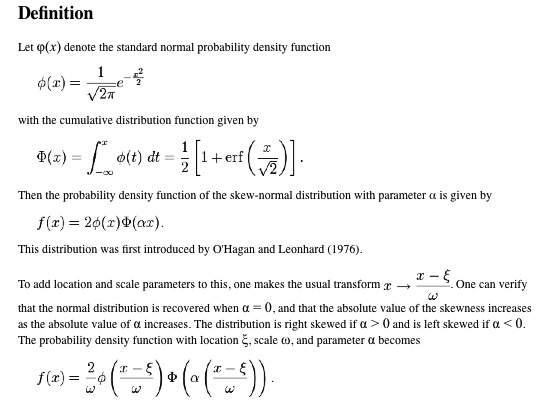

.. _model.small_angle_diffraction:

.. index::
     model; small-angle diffraction

Small-angle diffraction tool
============================

**Small-angle diffraction tool models data using :**

**Flat background**

**One Unified level (Guinier + Power law)**

**Up to 6 peaks**

Each peak can have one of many different shapes – Gauss, Lorenz, Pseudo-Voigt, Gumbel, Pearson-VII, modified Gauss, Lorenz-Squared, or Skewed Normal. Peaks can also represent Percus-Yevick S(q) structure factor and Percus-Yevic S(\ *q*) multiplied by Sphere F(\ *q*). Please note, that you should use **only** the shapes which are meaningful for your problem and you can justify. For example the S(q) and S(q)F(q) may be real challenge to justify inmost cases. I needed them for *very* specific case.

Some first have 3 parameters – prefactor (~intensity), position (NOTE: using Q units) and width (in Q units). Some have one more parameter which controls the tail height or some other shape features. Note, that for Pseudo-Voigt when eta = 0 the shape is Gauss and eta=1 the shape is Lorenzian.

The tool will manage slit-smeared data (USAXS data). There are few more details *very* important for slit-smeared data:

It is very useful to use experimental data which extend significantly beyond to slit length. If the data to less than slit length are used, it is important to model peaks which extend to Q positions smaller than slit length. If you see ripples (caused by slit smearing very narrow peaks), you can use “Oversample” checkbox – but that will increase the calculation time by about 5x.

The structure peak position ratios are collected from:

*Block copolymers: synthetic strategies, Physical properties and applications*, Hadjichrististidis, Pispas, Floudas, Willey & sons, 2003, chapter 19, pg 347.

Use of the tool:

Select “Small-angle diffraction” from the menu

Select Data in the data selection controls and click graph button… Data
are graphed.

**Function of controls**

“auto recalculate” will cause data to be recalculated after most
parameter changes. If calculations take long time, you may want to
uncheck this and recalculate data using button “Recalculate”.

**VERY IMPORTANT**

*“Peak SAS rel.” – this is very important checkbox*. In case this
checkbox is NOT selected, the following is the formula to calculate
intensity:

.. math::

    I(Q)=I_{UnifiedFit}(Q)+ \sum_{i}I_{UnifiedFit}(Q)K_iF_i(Q)

While when it is checked, then the formula is:

.. math::

    I(Q)=I_{UnifiedFit}(Q)+ \sum_{i}K_iF_i(Q)

Where K\ :sub:`i` is scaling factor for each diffraction peak.

Where :math:`\Psi (Q)` is function of the three or four peak parameters – scaling factor, peak position, width, and for some also “tail” parameter. The exact formulas vary depending on peak profile selected.

**What does this mean? If the checkbox is NOT selected, the calculation is based on assumption, that the SAS scattering and diffraction peaks are from one population and loosely one can see it as F(Q)\*S(Q) assumption in small-angle scattering.**

**If the checkbox IS selected, the assumption is loosely that the peaks are independent of small-angle scattering and are produced by some other features than what produces the SAS itself.**

I suspect, that right selection is based on experience and what really fits right. Note, that the parameters are always evaluated for Ψ(Q) only… This is *VERY* important to understand and if you see cases, when these assumptions are wrong, please, let me know…

Following are formulas for peak profiles Ψ(x) used for the peak profiles:

1. Gaussian Function

.. math::

    \Psi(x)=M * exp(-\frac{(x-\mu)^2}{2\sigma^2})

where :math:`\sigma` is the Gaussian width, and :math:`\mu` is the center of the peak, and M is scaling factor.

2. Modified Gaussian Function

.. math::

    \Psi(x)=M * exp(-\frac{(x-\mu)^d}{2\sigma^d})

where d >=1 is the exponent that decides the falloff rate.

3. Lorentz Function, Lorenz-squared (is just the same function squared)

.. math::

    \Psi(x)=M *\frac{a}{\pi(a^2+(x-\mu)^2)}

where *a* is the Lorentzian width.

4. Pseudo-Voigt Function

.. math::

      \Psi(x)=M *(\eta\frac{1}{1+x^2}+(1-\eta)exp(-(ln2)x^2)))

      x= \frac{2(x-x_0)}{w}

where :math:`x_0` is the peak center, w is the FWHM, and :math:`0\leq \eta \leq 1`  is a weight parameter.

5. Pearson type VII Function

.. math::

    \Psi(x)=M *\left [ 1+\frac{(x-\mu)^2)}{ma^2} \right ]^{-m}

where a is proportional to the FWHM, and m decides the rate at which the
tail of the peak profile falls.

6. Gumbel Function

.. math::

    \Psi(x)=\frac{1}{\beta}exp(\frac{x-\mu}{\beta})exp(-exp(\frac{x-\mu}{\beta})))

where :math:`\beta` is the width and :math:`\mu` is the center of the peak.

7. Skew normal function

8. Percus-Yevick S(q) and Percus-Yevick S(q) multipled by Sphere F(q) are described in some detail in Form factor and Structure factor description (pdf file which you can open from SAS menu in Igor Pro). The code for P-Y S(q) is NIST code from NIST SANS data analysis
   macros.

“Display peaks” will display individual peaks. Note, data for individual peaks are never smeared.

“Oversample” – for sit smeared data only. Will oversample Q range with 5x as many point to reduce artifacts caused by slit smearing very narrow
peaks.

Tab SAS:

G – prefactor for power law slope

P – power law slope

Bckg – flat backgroud

Tabs for Peaks:

“Use” – use the peak. No need to use peaks in order, can be mixed-and-matched

“Distribution type” – peak shape

“Prefactor” – scaling factor for the peaks (~hight)

“Position” – peak position in Q units

“width” – peak width in Q units

“Link Position to other peak?” – you can link peak position to position of another peak with scaling constant.

Lower set of parameters are peak parameters calculated numerically, so they may be slightly different than the numbers above.

Final controls:

“Use genetic optimization?” – uses genetic optimization… Very slow fitting routine unlikely needed for this application. If needed, read explanation of the method in previous chapters.

“Fit” – fits

“Revert back” – reloads stored parameters from before fitting.

“Add tags to graph” – adds tags with parameters into the graph…

“Remove tags” – removes tags from the graph.

“Structure?” – sets ratios of positions for some known structures. Peak positions will be fixed with respect to Peak1. Note, user must set correct widths and prefactors for each peak manually…

“Save in Fldr.” Saves results (including peak profiles if selected) back into data folder.

“Paste to Notebook” – opens notebook for results and pastes in there graph and summary of results.

“Recalculate” – forces model recalculation if user needs to do it.

You can attach also residuals or normalized residuals into the graph, see example below.

Useful comments:

Make sure the fitting parameters ranges are set appropriately. This is IMPORTANT and not obvious problem in fitting (experience speaks)… Results of fitting are also automatically recorded to into usual “SAS logbook” these tools keep… All is recorded there in more or less useful form. Your notes I keep for you....
