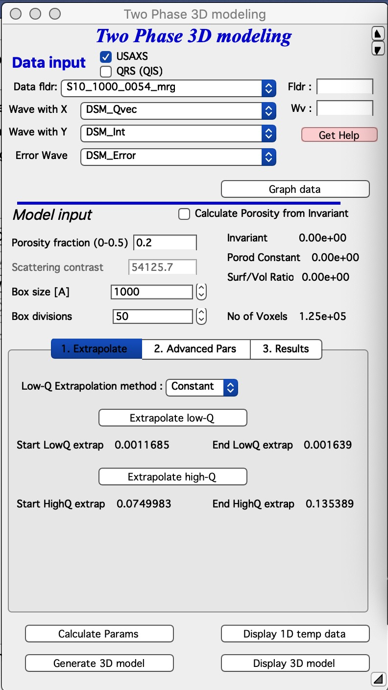
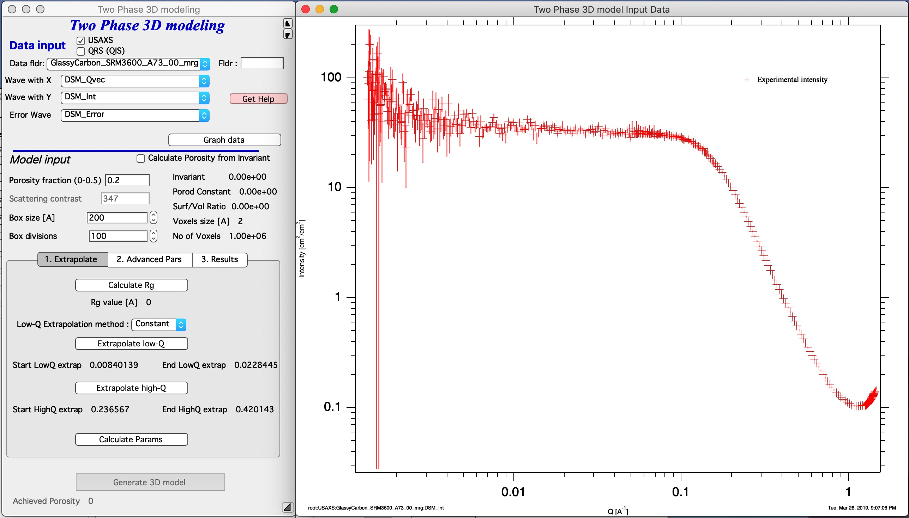
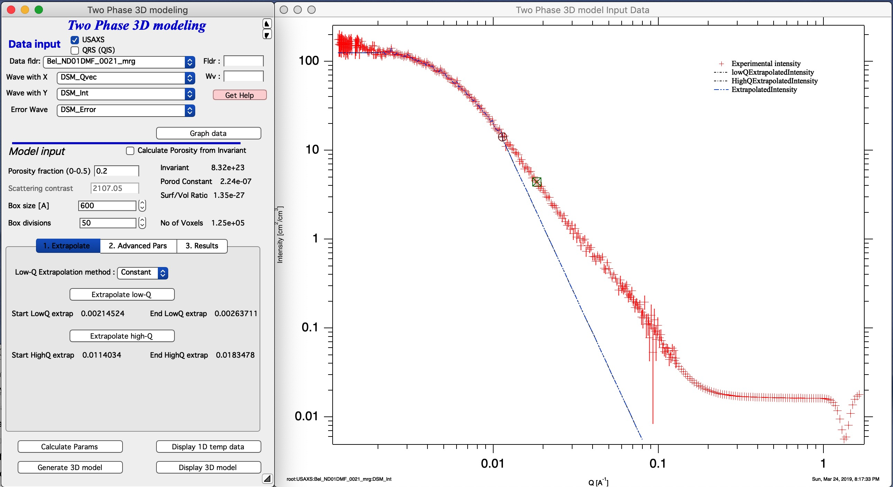
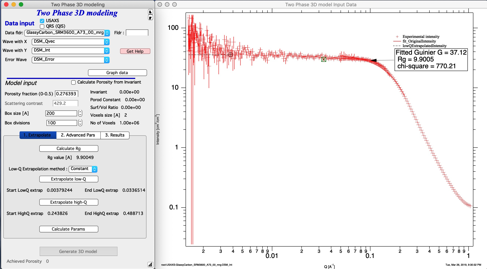
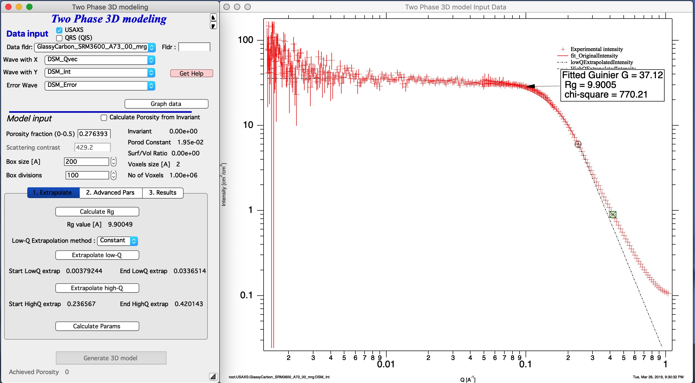
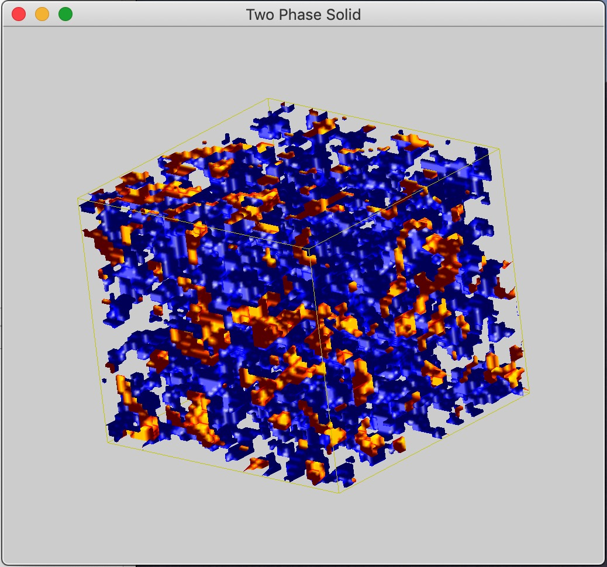
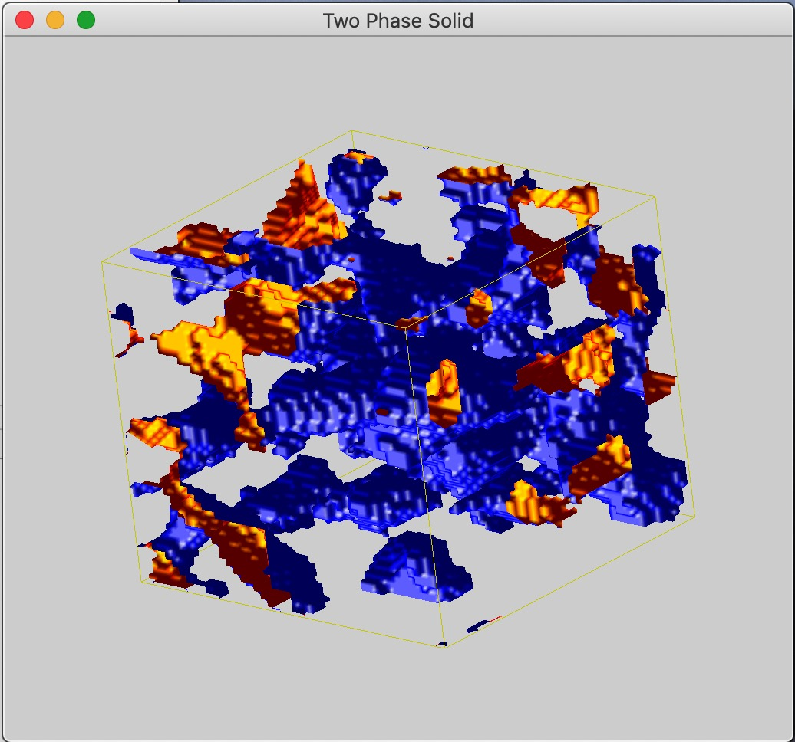

.. _TwoPhaseSolid:

.. index::
   Two Phase Solid

Two Phase Solid model
=====================

**This tool generates 3D RANDOM representation (voxelgram) of Two Phase Solid material, current version uses method used in SAXSMorph, I plan to add  similar methods (e.g., Quintanilla cited below) when I can. For details on the science behind it see paper : B. Ingham, et.al., SAXSMorph: a program for generating representative morphologies for two-phase materials from small-angle X-ray and neutron scattering data, J. Appl. Cryst. 44 (2011) 221-224, and J. Quintanilla, Versatility and robustness of Gaussian random fields for modeling random media, Modeling Simul. Mater. Sci. Eng. 15 (2007) S337–S351, and other papers on this subject**

*Links to papers from above*

https://doi.org/10.1107/S0021889810048557

https://iopscience.iop.org/article/10.1088/0965-0393/15/4/S02/meta

This model is applicable **ONLY to TWO PHASE SOLID MATERIALS** It is critical users understand its limitations and use this model appropriately. Further, it is critical to understand, that this model represents scattering system in a box with specific (user defined) size with some (user defined) resolution. Practical limit on resolution (size/voxel size) seems to be about 100, if you have high end desktop/notebook and enough memory and time, may be 150 or even 200. This means, that the range of scatterer sizes, which can be measured is probably something like 20-40. This limits the q range which this model can fit to something like 1 to 1.5 decades in q.

This is random "visualization tool" = this tool will generate one of MANY possible shapes of the arrangement of material, which will have same or similar scattering curve. Intensity which the two phase structure should scatter is back calculated.

This is the main screen:

In the top part are :ref:`standard data selection tools <DataSelection>` . Please note, that this tool requires desmeared data, if you are using USAXS data.

This is how the screen looks like with data selected. Button “\ **Graph Data**\ ” loads data into the tool and creates the graph.

*Input some model values* - *Porosity* needs to be known or you can use scattering contrast and calculate Porosity from invariant. Invariant is calculated after extrapolations steps below, when Button *Calculate Params* is pressed. *Box size* is model volume size in Angstroms. For now this is cube, future versions should be able to have sides with different sizes. Select *Box divisions* - this is resolution you plan to use. 50 is reasonably fast on my machine, 100 is slower (still, may be minute or so). Above 100 you probably run out of memory and patience. Note: I have really *fast* notebook computer.

*Next step is to extrapolate data to Q=0 and Q=inf.* this is done by selecting q range at low end of data you want to model with cursors and using button “\ **Extrapolate low-Q**\ ”. Then select range of data at high q (data should follow Porod's law, power law should be -4). Using button “\ **Extrapolate high-Q**\ ” extrapolate data to high q values (Q=50).

Push button *Calculate Params*, it will calculate some internal parameters and Invariant. If you do not push this button, you get garbage in generating 3D structure. When you push this button, Irena will also generate extrapolated intensity data to very small and very large q values to enable approximate integrations from 0 to infinity (the "Extrapolated intensity" curve in the graph).

Note that the data needs to start with intensity flat (very much preferred)= no low-q power law slope, or data can be extended with low-q power law slope, but such data make not much sense. Also, high-q data are approximated by Porod's slope - it makes no sense to have different slope as this model assume this is solid phase and voids with smooth interfaces. This also tells you, that my example data are not suitable fro this model and this is pure abuse of those data... Need better example data soon.

Now, back to size of the Box. In order to model properly the data you selected, you should have size of the box larger than size related to q\ :sub:`min`. These sizes are actually calculated on the second Tab - “\ **2. Advanced Pars**\ ”. In my case, the R\ :sub:`max` on that Tab is 16000A, which means I box size should be 30000A, may be? Now, it is not totally necessary as the solution can be found snesibly with much smaller boxes - but users will get simply tiny fraction fo space which si not meaningful representation of teh porous material.

Push Button “\ **Calculate Params**\ ” which will calculate extrapolated intensity and other internal parameters. This is critically important.

*This MAY BE SLOW* Push Button “\ **Generate 3D Model**\ ” which will generate the 3D Model and append intensity calculated from this model to the graph:

As you can see, the fit is good at low-q (in extrapolation to q=0) and for about 1 decade in Q. With resolution of 50-100 that is probably the best one can expect. Note, that the model data are truncated - and there can still artifacts at high-q of the fitted range. Artifacts at higher q values are related to numerical integrations and for now I am unable to find them.

*This MAY BE SLOW* Push Button “\ **Display 3D Model**\ ” which will display the 3D Model in Gizmo.

Now, this is when you have large enough box size (30 000 A), you can make box size smaller and get higher magnification view (1500A) or even very high magnification (last 3D image, 600A):

But representative value of these higher magnifications are questionable. Note: you see the interface between solid and void, I have not yet figured out how to fill the solid phase in Gizmo. Working on it...

*Display 1D temp data* will display various intermediate data (G(r) etc) same as SAXSMorph will do. Value of these curves is questionable and I will work on this more to make it more useful, if I can.

.. _Display3DData:

.. index::
   Display 3D data

Display 3D data
===============

This can display 3D data using Igor Gizmo. Unfinished for now. Ignore or use at your own peril.

.. _ImportPOVPDBFIles:

.. index::
   Import POV or PDB files

Import POV or PDB files
=======================

Import for POV files (generated by SAXSMorph) or PDB files (generated by ATSAS and many other sources). Unfinished for now. Ignore or use at your own peril.
