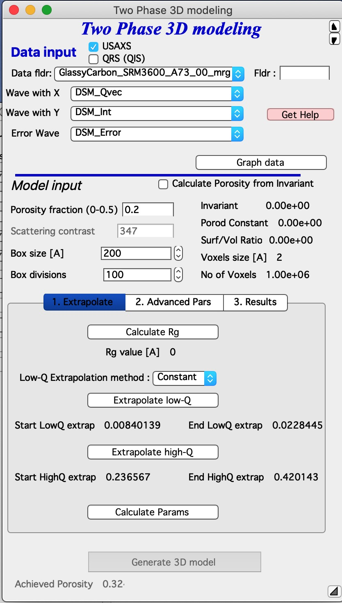
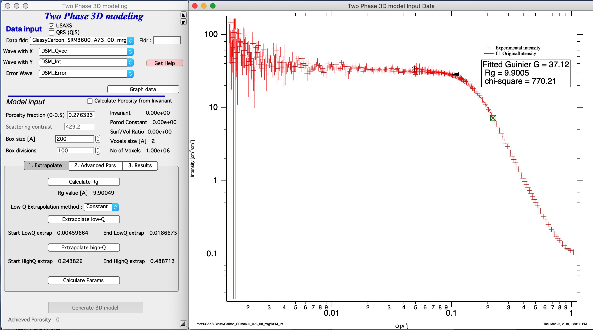
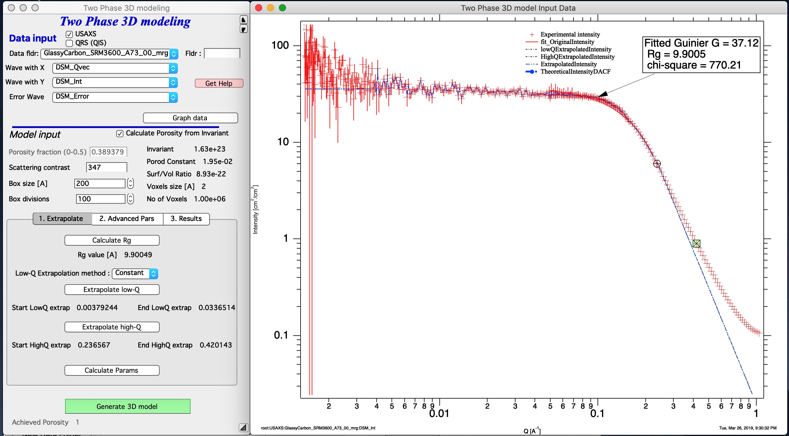
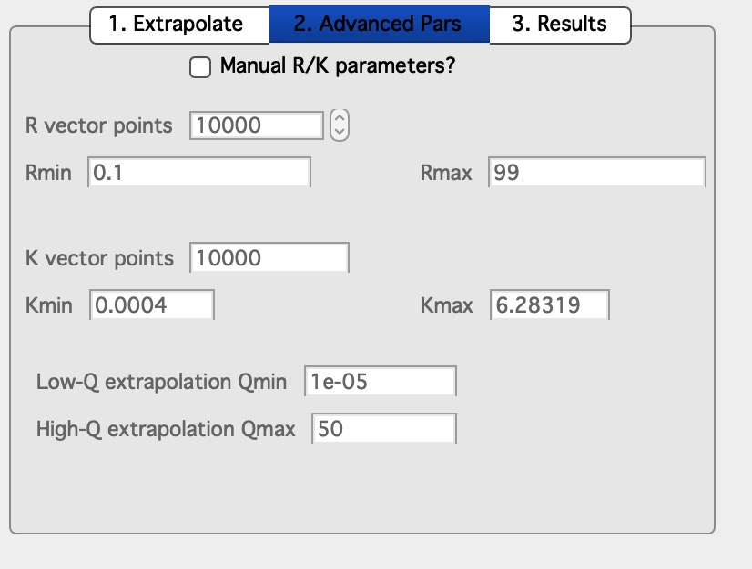

.. _TwoPhaseSolid:

.. index::
   Two Phase Solid

Two Phase Solid model
=====================

**This tool generates 3D RANDOM representation (voxelgram) of Two Phase Solid material, current version uses method used in SAXSMorph, I plan to add  similar methods (e.g., Quintanilla cited below) when I can. For details on the science behind it see paper : B. Ingham, et.al., SAXSMorph: a program for generating representative morphologies for two-phase materials from small-angle X-ray and neutron scattering data, J. Appl. Cryst. 44 (2011) 221-224, and J. Quintanilla, Versatility and robustness of Gaussian random fields for modeling random media, Modeling Simul. Mater. Sci. Eng. 15 (2007) S337–S351, and other papers on this subject**

*Links to papers from above*

https://doi.org/10.1107/S0021889810048557

https://iopscience.iop.org/article/10.1088/0965-0393/15/4/S02/meta

This model is applicable **ONLY to TWO PHASE SOLID MATERIALS** It is critical users understand its limitations and use this model appropriately. Further, it is critical to understand, that this model represents scattering system in a box with specific (user defined) size with some (user defined) resolution. Practical limit on resolution (size/voxel size) seems to be about 100, if you have high end desktop/notebook and enough memory and time, may be 150 or even 200. This means, that the range of scatterer sizes, which can be measured is probably something like 20-40. This limits the q range which this model can fit to something like 1 to 1.5 decades in q.

This is random "visualization tool" = this tool will generate one of MANY possible shapes of the arrangement of material, which will have same or similar scattering curve. Intensity which the two phase structure should scatter is back calculated.

This is the main screen:

In the top part are :ref:`standard data selection tools <DataSelection>` . Please note, that this tool requires desmeared data, if you are using USAXS data.

This is how the screen looks like with data selected. Button “\ **Graph Data**\ ” loads data into the tool and creates the graph.

*Input model values* :
----------------------

*Porosity* needs to be known or you can use scattering contrast and calculate Porosity from invariant. Invariant is calculated after extrapolations steps below, when Button *Calculate Params* is pressed.

*Scattering contrast* if known and data are on absolute scale, code can calculate the porosity. Check the *Calculate Porosity from Invariant* and set contrast here. Invariant and Porosity is calculated after extrapolations steps below, when Button *Calculate Params* is pressed.

*Box size* is model 3D volume size in Angstroms. For now this is cube, future versions should be able to have sides with different sizes. Note, that this is real physical size in Angstroms. You can make it large or small independent of size of your scatterers, but neither extreme seems that useful...

*Box divisions* - this is resolution you plan to use. 50 is reasonably fast on my machine, 100 is slower (still, below one minute on my computer). Above 100 you may run out of memory and patience. Note: I have really *fast* notebook computer.

On right hand side are some calculated values: *Invariant*, *Porod constant*, *Surface/Volume ratio*, *Voxel size of the model* and *Number of voxels in model*. Keep in mind, that calculation time is proportional to number of voxels in the model.

Fitting procedure
_________________

*Calcualte Rg* - select with cursors the knee area where you want to fit the model. Push this button. This will calculate the Rg of the scatterers. This Rg is used in Tab 2 "Advanced Parameters" for maximum radius (it is set to 10x Rg).

*Next step is to extrapolate data to Q=0 and Q=inf.* this is done by selecting q range at low end of data you want to model with cursors and using button “\ **Extrapolate low-Q**\ ”. Then select range of data at high q (data should follow Porod's law, power law should be -4). Using button “\ **Extrapolate high-Q**\ ” extrapolate data to high q values (Q=50).

Push button *Calculate Params*, it will calculate all of internal parameters, Invariant, porosity (if selected) and other parameters. If you do not push this button, you cannot push button "Generate 3D model" as it is disabled. This is to prevent you from garbage generation of 3D structure. When you push this button, Irena will also generate extrapolated intensity data to very small and very large q values to enable approximate integrations from 0 to infinity (the "Extrapolated intensity" curve in the graph).

Note that the data needs to start with intensity flat (very much preferred) = no low-q power law slope, or data can be extended with low-q power law slope, but such data make little sense. Also, high-q data are approximated by Porod's slope - it makes no sense to have different slope as this model assume this is solid phase and voids with smooth interfaces.

Advanced Parameters
___________________

Internal parameters can be manually changed on the second tab.

Select *Manual R/K parameters?* and you can change them. I am not sure how much that can help anything.

3D data generation
__________________

Now you can push button *Generate 3D model*. It will take time, this test case about 45 seconds, most of it generating the Gaussian random fields. AT teh eend code back calculated from GRF function intensity and appends it to the graph. It is the blue line "TheoreticalIntensityDACF".
As you can see, the fit is good at low-q (in extrapolation to q=0) and for about 1 decade in Q around Rg. With resolution of 50-100 that is probably the best one can expect. Note, that the model data are truncated - and there can still artifacts at high-q of the fitted range. Artifacts at higher q values are related to numerical integrations and for now I am unable to find them.

*Achieved Porosity* value is calculated from fraction of the filled voxelgram. This value can be higher or lower than porosity calculated. Smaller the display volume is, more fluctuations there are, you are selecting smaller representative volume for the infinite space and so the volume you see will vary randomly. 

Results display
_______________

Third tab *Results* has few buttons which can show users the results.

*Display 1D temp data* this button shows graphs for internal functions, they are described in SAXSMorph paper and manual and are not really helpful for most readers.

*Display 3D view* this will generate image of the Gaussian Random fields in 3D Gizmo plot. Users can choose to make filled phase either solid or voids using the checkbox.

.. image:: media/TwoPhaseSolid9.jpg
   :align: center
   :width: 380px

*Display 2D view* this will generate 23D cut through the 3D volume with slider at the top which enables users to skim through the slices. Since this is isotropic random field, any cut is as representative of the volume as other.

Model resolution
________________

Now, back to size of the Box. In order to model properly the data you selected, you should have size of the box larger than size related to sizes of your scatterers - the code sets Rmax of modeled space to 10 x Rg value fitted. . These sizes are actually displayed on the second Tab - “\ **2. Advanced Pars**\ ”. In my case, the R\ :sub:`max` on that Tab is ~ 100A, which means I box size should be 300A or so. Now, it is not totally necessary as the solution can be found sensibly with much smaller boxes - but users will get simply tiny fraction fo space which is not meaningful representation of the porous material.

OK, so here is the 3D image with 200A size for system with Rg of about 10A :

.. image:: media/TwoPhaseSolid9.jpg
   :align: center
   :width: 380px

Here is example with size of 100A, you can see more details, but less representative volume.

And now, large box size (1000 A), it is representative, but little details. Of course, in this case the voxel size is approximately value of Rg which is basically loosing meaning.

But representative value of these higher magnifications are questionable.

.. _Display3DData:

.. index::
   Display 3D data

Display 3D data
===============

This can display 3D data using Igor Gizmo. Unfinished for now. Ignore or use at your own peril.

.. _ImportPOVPDBFIles:

.. index::
   Import POV or PDB files

Import POV or PDB files
=======================

Import for POV files (generated by SAXSMorph) or PDB files (generated by ATSAS and many other sources). Unfinished for now. Ignore or use at your own peril.
