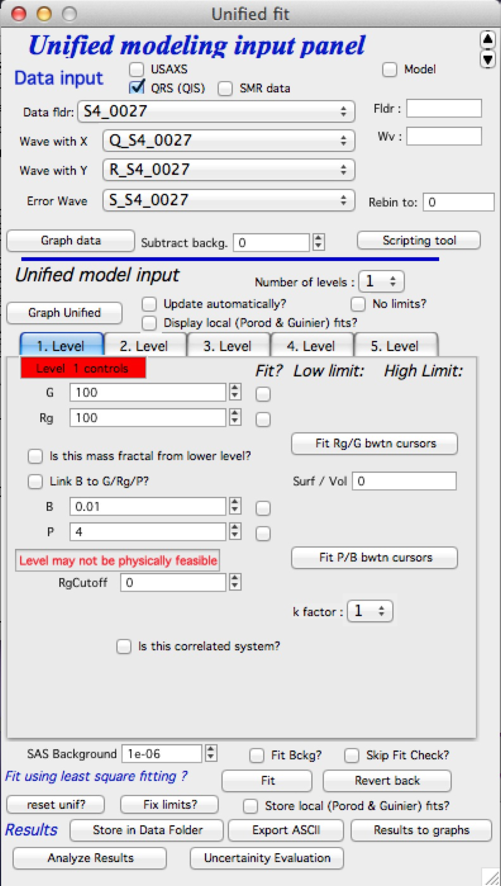
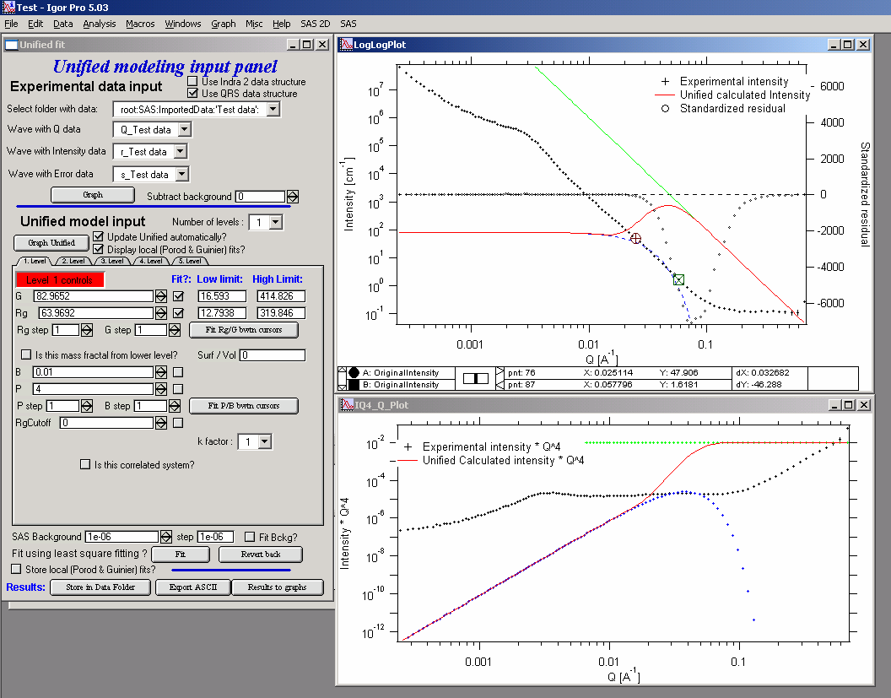
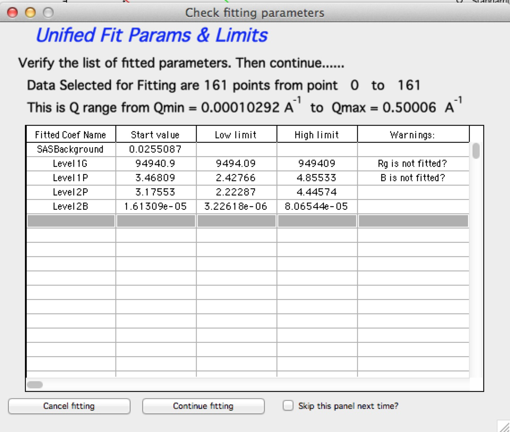

Unified Fit
===========

**Introduction**

The Unified fit uses code developed by Greg Beuacage to fit SAS data with levels composed of a Guinier part and a power law tail. The code handles various data for which the development of an exact scatterer model is difficult or impossible. The fitting code can handle some interparticle interference, fractal scatterers *etc*. For details, please see papers written by Greg Beuacage or, hopefully, in the future an included description.

**This is introduction written by Greg for this code**:

*This fit uses the function described in*

http://www.eng.uc.edu/~gbeaucag/PDFPapers/Beaucage2.pdf

http://www.eng.uc.edu/~gbeaucag/PDFPapers/Beaucage1.pdf

http://www.eng.uc.edu/~gbeaucag/PDFPapers/ma970373t.pdf

The basic function is composed of a series of structural levels, each with the possibility to be

a) associated with the previous smaller size level :math:`R_{gcutoff2} = Rg_1`

b) to follow mass fractal restrictions (calculate B for the mass fractal power law :math:`I = B q^{-p}`

c) to display spherical Correlations (Interference) as described by  :math:`I(q) = I(q)/(1+p f(q \eta))` where p is a packing factor :math:`p = v_{H}/v_{O}` for v\ :sub:`H` = hard sphere volume and v\ :sub:`O` is occupied volume and :math:`f(q\eta)` is the sphere amplitude function for spherical Correlations (Interference)

The intensity from each level is summed and the intensity from one level, i, is given by:

.. math::

    I_{i}\left( q \right) = G_{i}e^{- \frac{q^{2}R_{g}^{2}}{3}} + e^{- \frac{q^{2}R_{\text{gco}}^{2}}{3}}B_{i}\left\{ \frac{{(\operatorname{erf}\left( \frac{qR_{g}}{\sqrt{6}} \right))}^{3}}{q} \right\}^{P_{i}}

This equation includes a) above if R\ :sub:`gco` = Rg\ :sub:`(i-1)` is the previous smaller Rg e.g. the primary particles from a mass fractal level. If there is no such dependence R\ :sub:`gco` = Rg\ :sub:`(i-1)` is set to 0 or it could be set to an independent size under unusual circumstances

This equation can include b) if B\ :sub:`i` is calculated using B\ :sub:`i` = (G df/Rg^df) GammaFun(df/2) and the erf argument includes kqRg\ :sub:`i`/sqrt(6) where k is 1.06. The latter can be included or ignored for high dimension mass fractals but becomes more important for dimensions less than 2.

The equation can include c) by multiplying the entire level I\ :sub:`i`\ (q) by a function that follows the Born-Green approximation for Correlations (multiple particle Correlations) and this works well for weak Correlations of any type but becomes more restricted to spherical Correlations as the Correlations become stronger. The measure of the strength of the Correlations is the packing factor p = 8 v\ :sub:`H`/v\ :sub:`O` as described above and for spherical particles this value can be 0 (no Correlations) to about 5.92 (calculated for FCC or HCP packing).

The packing factor for FCC is p=8\*v\ :sub:`H`/v\ :sub:`O` = 8\*(pi\*sqrt(2)/6)=5.92 - this is basically the total volume of lattice points in FCC divided by the volume of the lattice (provided to me by one nice Irena user).

If particles are asymmetric, *e.g.,* rods or sheets the packing the
number can be much higher and the spherical function becomes less
appropriate although it can be used in a pinch for weak Correlations.
The interpretation of p and :math:`\eta` become complicated in these
cases. As a general rule :math:`\eta` has to be larger than Rg\ :sub:`i` as
common sense would dictate. The correlation function follows closely the
development of Fournet in Guinier and Fournet and in Fournet's PhD
dissertation where it is better described but is in French...

So the Unified needs to accommodate multiple levels each of which can potentially have 8 parameters (including spherical Correlations):

* Rg\ :sub:`i`
* G\ :sub:`i`
* P\ :sub:`i`
* B\ :sub:`i`
* :math:`\eta` :sub:`i`
* pack\ :sub:`i`
* Rgco\ :sub:`i`
* k

where Rgco\ :sub:`i` is usually Rg\ :sub:`(i-1)`, as shown above, for hierarchical structures (k is 1.06 for mass fractals and 1 for others)

Each level must also have the answer to at least three questions:

* Are there Correlations: qCor\ :sub:`i`
* Is this a Mass Fractal: qMF\ :sub:`i`
* Does this level terminate at high-q in the next lower level Rg: q\ :sub:`PL` (PowerLimit) That is, is this a hierarchical structure build from the previous smaller level. A third option is to let the power law limit float as a free parameter although this is rarely appropriate.

As Gregg wrote me: “We have several options for coding the Unified function.

a) Write a dedicated code for a specific morphological model where all of the parameters are defined in terms of the model. We have done this for correlated lamellae, rods, mass-fractals, spheres, correlated spheres, RPA based polymer blends of arbitrary fractal dimension, polymer gels among others.

b) Write a generic unified code that allows a high degree of flexibility but which is naturally complex.

For cases where you deal with a fairly complex and limited structural model option a) is most appropriate and is easiest to understand. We can't however write such code for each and every case. Several of our publications indicate how to go about calculating the unified parameters, for instance for a sheet structure 8 parameters in the unified equation (for 2 levels) reduce to 3 free parameters, the contrast, thickness and diameter of the sheets. Similarly rods can be described by 3 parameters the length, diameter and contrast. Correlations in both systems add 2 other parameters although the spherical correlation function can not be rigorously used except at extremely weak levels of correlation.”

This code deals with approach b) where only spherical correlations are dealt with but including an optional mass fractal limitation (strictly limited to linear chains but useful for branched structures in application).

**Invariant:**

The invariant :math:`Q_v` is:

.. math::

  Q_v = 2\pi^{2} \phi(1-\phi)\Delta\rho^{2}

To use correctly, one needs to convert the Unified provided invariant to cm\ :sup:`-4` by multiplying by 10\ :sup:`24` (from cm\ :sup:`-1`\ A\ :sup:`-3` to cm\ :sup:`-4`)….

**Porod law:**

The specific surface area S\ :sub:`v` is:

.. math::

  S_v = \frac{B}{2\pi\Delta\rho^2}

Where B is Porods constant – it is the value you get from Unified fit when P=4. To use correctly, one needs to convert the Unified provided B to cm\ :sup:`-5` by multiplying by 10\ :sup:`32` (from cm\ :sup:`-1`\ A\ :sup:`-4` to cm\ :sup:`-5`)….

.. math::

    \text{Surface/Volume ratio} = \pi B / Q_v

Until Irena release 2.55 this value was called “Surface/Volume” ratio as
Greg Beaucage had in his original code. One of the users has
investigated and got in touch with Dale Schaefer and result is, that
this value has been renamed. It si now called “pi \* B /Q” and in help
it is also termed :math:`S/(V * \phi * (1- \phi )))`  Here is what it should be in
formulas (note: Q\ :sub:`v` is invariant) :

.. math::

  S_v = \frac{B}{2\pi\Delta\rho^2} = \frac{\pi B_v \phi (1-\phi) }{Q_v}

  \frac{\pi B_v}{Q_v} = \frac{S_v}{\phi (1-\phi)}

**Link B to G/Rg:**

One of the problems of Unified fit is bit too high flexibility in some cases and if the data are less then perfect, one can easily create situation in which the volume part (G/Rg) and surface part (P/B) of the curve are physically impossible. Basically there may be too much or too little surface for given volume. The tool in this case raises red flag "**Level may not be physically possible**" message. This has been addressed in Guinier-Porod model by Hammouda (see its own chapter), which calculates profile of SAS using just three parameters. However, this takes away some flexibility needed for systems with, for example, high polydispersity.

To help in some cases I added "*Link B to G/Rg/P*" checkbox. If this is checked, the B is calculated under assumption of Guinier-Porod model. This is useful when one cannot fit some parameters, as there is no part of the curve, which would be dominated by that specific parameter.

From version 1.37 Unified has “Analyze results” tool, which can analyze also Invariant, Porod’s law and some other specific cases. Use it!

Constructing Unified fit
------------------------

Select “SAS” – “Unified fit”. Following is the screen you should see after initialization:

In the top part  select “Use Indra 2 data”, or “Use QRS data” or none checkbox and then select data as seen below and push button graph.

The two graphs which appear show selected data in two different views – top graph is log-log Intensity vs Q vector, bottom part is (Intensity \* Q\ :sup:`4`) vs Q vector.

**ALL USER INPUT IS IN THE TOP WINDOW (log-log plot)**

Controls above the tabs:

 * *Graph Unified* button recalculates model and puts it into the graphs
 * *Update automatically* checkbox if any change to model parameters is made, automatically recalculates (i.e., automatically pushes the button Graph Unified). Uncheck on slow computers.
 * *Display local fits* displays local Guinier and Porod fits in the graphs for active tab level
 * *Number of levels* selects number of levels displayed. Note, that at no time parameters for not displayed levels are reset, so user can switch between number of displayed (=used) levels freely…

Now, when we have the data we will start building the structures **from high Qs** Note, this is **IMPORTANT**, always build the Unified fit modxel from high-q area = start from small size scatterers.

Select the number of level 1, check Update Unified automatically (if used computer is fast enough, else push the button Graph Unified)… Click on the Tab “1. level”. What appears is the screen shot:

**Description of the Tab area in the panel:**

This area changes according to parameter selection etc. I have tried to put in this as much “smarts” as possible to help user make right choices, so parameters, which are not applicable at any given time should be invisible… Anyway, each parameter has most controls grouped on one line – that is current parameter value, checkbox *Fit* and (if Fit is selected) limits – low and high fitting limits. Further more underneath the parameters is the parameter step variable. This allows the user to select the magnitude that a parameters changes by pushing the arrows at the end of it’s field. This allows user to “walk” the parameters into their starting condition as best as possible. There are also buttons for local fits. If the checkbox “Is it correlated system” is selected, new parameters appear. Also the screen changes, if the checkbox “Is it mass fractal from lower level” is selected….

The new red line in the graphs represents the results f the model for default values of level 1. Now, we need to make this level fit the smaller particles Guinier and Power at Q ~ 0.025 A\ :sup:`-1`. This shoulder is better visible in the bottom graph. Also we need to include appropriate background…

Change background (under the tabs field) into the 0.1

Select point 76 – 87 on the top graph using cursors and check “Fit” checkboxes next to G and Rg. These parameters will be fitted in between the cursors. Push button “Fit Rg/G bwtn cursors”. The following should be result:

The blue line in the graphs now is the Guinier fit. Next select points 84 to 92 with cursors, check boxes “Fit” next to B and P and push button “Fit P/B btwn cursors”. Now we get the power-law fit on this area:

The green line is local fit for the power law dependence. Notice, that the fit to the data in the modeled q range is now reasonably good, including our background estimate.

You can also guess flat background, or check the checkbox “Fit Bckg?” and let the least square fitting (next below) to estimate the best guess for the flat background.

Now we can fit the whole Level 1 dependence. Select large range of data (points 77 – 109) and check “Fit” next to background parameter. Then push the fit button. This runs least square fitting on the data.

From *Irena* version 2.52 be default you get "*Check fitting* parameters" panel, which presents for user review the range of points/Qs selected for fitting, parameters selected for fitting, starting values and, if used, limits. It also presents some warning when parameters usually fitted together are not selected both. See below.

Note, that this panel can be skipped using checkbox - checkbox "*Skip this panel next time?*" is on this information panel in lower right corner and same function checkbox "*Skip Fit Check?*" is on the main panel above the "*Revert back*" button):

You can either "*Continue fitting*" or "*Cancel fitting*". Note, that changing the parameters in the panel is not allowed and so if you need to make changes, use button "*Cancel fitting*" fix problems and fit again.

**Comment:**

If the least square fit fails, it should automatically return all values where they were before fitting. If the fit “walks away” to a solution, which is not right, the user can push the “Revert Fit” button and the parameters are returned back to where they were before fitting.

Only parameters selected to fit (checkbox “Fit” next to them) are fitted – **BUT FROM ALL ACTIVE TABS**. Therefore if using more than one level make sure you have selected only the appropriate parameters from all levels that you want to vary in this fit. **These fits can be highly unstable, if starting conditions are not right** ….

Ok, level 1 looks fine and the background also. Uncheck all fit boxes in the panel and then select Number of levels as 2. Click on tab with “2. level”.

The green and blue lines in at this time represent default values for level 2. If you click now on tab of 1. level, the blue and green lines will be set for local fits for level 1, if on tab with level 2, they represent local fits for level2., etc…

Let’s do local fits for level 2. Set cursors between points 31 and 48. Push “Fit Rg/G bwtn cursors” button. Fit should converge to following solution:

Now we need to do something similar for power law dependence. Select points 47 to 63, reduce B to about 0.00001, select “fit” checkboxes there and do local fit. Following should be the result:

Now we can select area with this level only and optimize the parameters of Both Guinier part and Power law part together:

Select point 31 to 63, make sure that other levels (in the current case the level 1) parameters have deselected checkboxes Fit, and push fit button. If you get error message that limits are incorrectly selected, check, that starting conditions for that parameter are between the limits. This is very important…

In this case the reason for error message is the fact, that power law slope starting value is 4.2, which is not physical. Change that to 4 and fix it by deselecting the Fit checkbox. The do the fit:

And now is the time to broaden the data range and fit both levels together. It is not necessary to fit background, but should not hurt… Select points 31 to 103, check all parameters for level 1 and level 2 to fit and then fit.

Note, that in this case (this was mixture of two powders) the right setting for the Level 2 (large particles) RgCutoff (R:sub:`GCO`) parameter is 0, since the scattering from these large particles extends to even largest qs. Therefore, to get good fit one needs to set RGCO to 0 and rerun the fit. Some modification of starting conditions may be necessary (I had to set B for level 2 to lower number to get stable solution). But one can get really good solution:

Last part, which may need to be solved, is the power law tail at smallest Qs from something large. To do so, we can use trick of this method – create level, which has really large Rg, but G is 0, This removes effectively Guinier area from the calculations. Then we are left with power-law only. To do so, create level 3 and select the tab with level 3. Set G to 0 and Rg is automatically set to 10\ :sup:`10`. Now we need to fix only the power-law part. Modifying the B and P manually is the best method in this case… A good guess clearly is about 3\*10\ :sup:`-7` for B and P roughly 4.

Now select wide range of Q’s – points 103, select parameters to fit (possibly all, but that will take longer) and make sure the limits (especially for level 3!!!) are set correctly. Note, that Level 3 Guinier parameters should not be fitted! Then push button fit.

And we receive nice solution:

Notice the standardized residuals in the top graphs are reasonable for all Q’s suggesting that we have right number of levels. It may be possible to improve the fit by including some correlations – the powder could have been compacted quite a bit, but I leave that to user to image out more…

**Correlations**

If inter-particle interference is not negligible, then for reasonably weak interferences the code has built in simple model for modeling those. This is simple model, which is realistically valid only for gasses and is only approximation. For details see publications by Beaucage.

**User should be aware of the crudeness of these calculations.**

The code used for calculations involves correcting intensity from a level using this formula:

Intensity\ :sub:`with interfernce`\ (Q, R) =Intensity\ :sub:`without interference` \* (1+*pack*\ \* SphereAmplitude(Q, *Eta*))

Where the *pack* and *Eta* are the two parameters of this model. Note, that this is supposed to be valid for spheres.

**Remember**: this method accounts in very crude way ONLY for interaction for particles in the particular population. If there are interactions among particles from different populations – which is very likely – these calculations have NO WAY to account for it.

When checkbox is selected for correlations, new windows appear – :math:`\eta` (distance between the layers) and Pack (fill of the first layer). Smaller the Pack, less interference. The :math:`\eta` should not ever be smaller than size of particles, and actually should be larger…

**Rg**\ :sub:`CO` **again –  warning**

My experience has shown, that one of the least understood parameters of the whole Unified fit seems to be Rg\ :sub:`CO` parameter. Here is more details on this parameter:

If you look in the formulas and what this parameter actually does, you will see, that it terminates very steeply scattering form given population by the time the one reaches Q ~ Rgco. Therefore the level becomes unimportant at q higher than equivalent of Rgco.

There are two cases when one needs this parameter and both relate to case when higher level and next lower level represent scattering from the same volume of materials.

1. Scattering from particles having two main dimensions – such as rods, disks etc. In this case the form factor (see the pdf list of form factors) exhibits two Guinier regions connected by relatively shallow power law slope. After the higher-q Guinier are the terminal slope is Q\ :sup:`-4`. In order to be able to describe this type of behavior the higher level power law scattering MUST be terminated by the time we reach the lower level Rg.

2. Scattering from fractals which exhibit more than one characteristic dimension in the measured Q range. The argument here is VERY similar. Imagine fractal measured over such q range, that one can see the fractal behavior (higher level) but also time when you can see the primary particles. This very much resembles the case 1, except it is less clear.

My general simplistic rule is, that if the two levels represent scattering **FROM ONE POPULATION (VOLUME) OF PARTICLES** then the Rg\ :sub:`CO` must be set, if these are different populations (having their own volumes) then the scattering is additive and Rg\ :sub:`CO` should be set to 0 for both of the levels.

**Output from Unified**

Result scan be either copied back to folder where the data came from, exported as ASCII, or little macro will include for each level text box in both of the graphs. User than can modify fonts/size etc and print. I need to make this later more user friendly to give more flexibility…

Further the data can be exported into Excel table using “Export to XLS file panel”. This macro was written by Greg Beaucage and I need to learn myself little bit better what it does. But it allows output results into spreadsheet for publication.

Use the buttons at the bottom of the panel.

**Copy to Data folder**

If checkbox “Store Local (Porod & Guinier) fits?” is selected, then saved are not only final fits but also all local fits too.. This creates large number of waves, but provides separated outputs for various levels – allowing to use these data for further separate analysis…

After pushing the button user gets input dialog:

In which any useful comment can be inserted (modify default). Note the quotes. They have to be there…

Then program saves following waves in the folder with original data:

UnifiedFitIntensity\_0

UnifiedFitQvector\_0

The \_0 is generation number. User can save large number of solutions, with increasing \_XX where XX is number. When Unified is run on data in folder, where Unified solution exists, user can recover any present solution – all parameters are put back in the panel, this allows user to quickly return back to previously saved solution, whit out need for recording the results.

All Unified fit parameters are saved in the wave notes of the above listed waves. This list is quite extensive and hopefully the names are descriptive enough. User can interrogate them either in data browser or using Igor built in tools (read functions “note”, and “StringByKey” resp “NumberByKey” manual)…

This is the example of the list in this case:

IgorExperimentName=Test case example;DataFolderinIgor=root:'Test data':;DistributionTypeModelled=Number distribution;NumberOfModelledDistributions=2;SASBackground=0.12257; Dist1ShapeModel=sphere;Dist1ScatShapeParam1=1;Dist1ScatShapeParam2=1; Dist1ScatShapeParam3=1;Dist1DistributionType=LogNormal; Dist1Formula=P(x)=(1/((x-loc)\*scale\*sqrt(2\*pi))*exp(-ln((x-loc)/scale)^2/(2\* shape^2)); Dist1NegligibleFraction=0.01;Dist1VolFraction=0.0024333;Dist1Location=21.79; Dist1Scale=87.731;Dist1Shape=0.5;Dist1VolFractionError=8.698e-05; Dist1LocationError=16.734;Dist1ScaleError=5.8733;Dist1ShapeError=0; Dist2ShapeModel=sphere;Dist2ScatShapeParam1=1;Dist2ScatShapeParam2=1; Dist2ScatShapeParam3=1;Dist2DistributionType=LogNormal; Dist2Formula=P(x)=(1/((x-loc)\*scale\*sqrt(2\*pi))\* exp(-ln((x-loc)/scale)^2/(2\*shape^2));Dist2NegligibleFraction=0.01; Dist2VolFraction=0.047415;Dist2Location=608.88;Dist2Scale=538.71; Dist2Shape=0.5;Dist2VolFractionError=0.00026279; Dist2LocationError=13.656;Dist2ScaleError=7.249;Dist2ShapeError=0;UsersComment=Result from Modeling Thu, Sep 12, 2002 1:20:06 PM;Wname=ModelingQvector\_0;Units=A-1;

Uncertainty evaluation
-----------------------

This script enables to analyze uncertainties of parameters of the Unified fit model. There are two different types of analysis one can imagine:

1. Effect of input data uncertainties on the results. This analysis is done by running same fitting analysis (with all parameters fitted) on variations of data. These variations are created by adding Gaussian noise on input data. The Gaussian noise is scaled to have same standard deviation as input data uncertainties ("errors"). Analysis on these randomly modified data is run multiple times and statistical analysis on the results for each parameter is performed.

2. Stability of each parameter separately. This is bit more complicated - analyzed parameter is fixed, step wise, in range of values user specifies. Other user-selected parameters are fitted and chi-square values are recorded. After the analysis, this dependence is analyzed and based on statistical analysis (number of fitted points and free parameters) the uncertainty of the parameter is estimated.

Here is example of results:

\*\*\*\*\*\*\*\*\*\*

Unified fit evaluation of parameter Level2Rg

Method used to evaluate parameter stability: Sequential, fix param

Minimum chi-squared found = 18.723 for Level2Rg = 81.189

Range of Level2Rg in which the chi-squared < 1.05\*18.723 is from 78.446
to 82.62

\*\*\*\*\*\*\*\*\*\*\*\*\*\*\*\*\*\*\*\*\*\*\*\*\*\*\*\*\*\*\*\*\*\*\*\*\*\*\*\*\*\*\*\*\*\*\*\*\*\*

"Simplistic presentation" for publications: >>>> Level2Rg = 81.2 +/- 2.1

\*\*\*\*\*\*\*\*\*\*\*\*\*\*\*\*\*\*\*\*\*\*\*\*\*\*\*\*\*\*\*\*\*\*\*\*\*\*\*\*\*\*\*\*\*\*\*\*\*\*

NOTE: you need to make sure the fitting limits are set widely enough as the fit may abruptly stop when these are violated. The Help in the panel provides many more details.

**Export ASCII**

This exports ASCII file with all the fitting parameters from Unified model (whole wave note from the results waves) and Q and Measured intensity, Error estimates and Unified fit intensity.

**Results to graph**

This includes results in the graphs in text boxes:

Note, that only selected, applicable parameters for each level are included in the text boxes… The text boxes can be formatted (double click on the text box) to suit user output. But note, that the text boxes get redrawn (and therefore reset to default) next time user pushes the “Results to graph” button.

**Export to XLS file panel**

This macro should output data in the table which can be loaded by spread sheet type program (Excel). Macro creates panel with buttons and walks user through steps needed to add data to the notebook in Igor, which then can be saves as text file and imported to other programs.

Analyze results
---------------

Some specific cases can be analyzed further using Unified method. These are:

**Invariant**

**Porod’s law**

Special cases published by Greg Beaucage : **Size distribution and Branched polymers**.

**Two Phase system** using methods published by Dale Schaefer (Naiping Hu, Neha Borkar, Doug Kohls and Dale W. Schaefer, “Characterization of Porous Materials Using Combined Small-Angle X-ray and Neutron Scattering Techniques”, Journal of Membrane Science 379 (2011) 138–145.

All of these can be analyzed by using “Analyze results” tool. It can be called from the bottom of the Unified main panel.

**Usage:**

Open the tool from the Unified panel (at the bottom):

There are two options which data can be analyzed…

Current Unified data in the Unified fit tool. This is selected in the left image above.

Unified results saved to any folder in the Igor experiment. This is selected in the right image above. Note, that in this case user needs to select folder which contains unified results as well as UnifiedFitIntensity\_X, where X is number of the Unified results “generation” (remember, there may be many generations of results there). Note that this can be quite messy, if you do not know which generation to pick… The data for analysis are picked from the wave note of the selected wave.

Then one can pick models:

**Invariant**

You need to pick also level for which to calculate the invariant. The invariant value is in the top field, user can input contrast value (if known) and if the data were absolutely calibrated and the contrast is known, the tool calculates the volume fraction of the phase.

**Porod law**

This will provide results ONLY, if the P for selected level is close to 4 (3.96 – 4.04). In that case, the tool provides Porod constant, P and calculates specific surface area – if the scattering contrast is provided. You need to have data absolutely calibrated.

**Branched mass fractal**

Ok, this tool requires users to read the references. The code was provided by Greg Beaucage and provides results as expected. But I am not clear on what these numbers really mean. Any way, the references are on the panel itself.

Note, that when the calculations fail, the tool beeps and prints error message in the red box.

Note, to calculate all of the parameters, you need two levels – so there are choices like 2/1 (1 would be primary particles, 2 would be the mass fractal). But you can also calculate some parameters from only one level (dmin and c) and if you select only one level, parameters, which cannot be calculated, will be set to NaN.

**Size distribution**

In this case, parameters from one level can be used to calculate log-normal size distribution for the particles – which assumes the P is close to 4 (Porods law). The details are in the manuscript referenced on the panel. Please, read it.

**Outputs of this tool:**

User can get following outputs, using the buttons:

*Print results to history area in Igor experiment*. For example here is the results from the above Size distribution tool:

\*\*\*\*\*\*\*\*\*\*\*\*\*\*\*\*\*\*
Results for Size dsitribution
analysis from Unified fit
\*\*\*\*\*\*\*\*\*\*\*\*\*\*\*\*\*\*\*\*\*\*\*\*\*\*\*

User Data Name : 'S12\_Am6 PCP-W A'

Date/time : Analyzed using Unified Fit results from Sun, Feb 21, 2010 7:19:12 PM

Folder name : root:USAXS:'11\_05\_Amanda':'S12\_Am6 PCP-W A':

Intensity name : UnifiedFitIntensity\_0

Q vector name : UnifiedFitQvector\_0

Error name : ---

Selected level : 1

G/Rg/B/P 2.5107 45.307 4.7235e-06 4

Geom. sigma : 0.36376

Geom mean : 23.164

Polydispersity index : 4.8935

Sauter mean diameter : NaN

Reference : Beaucage, Kammler and Pratsinis, J.Appl.Crystal. (2004) 37
p523

\*\*\*\*\*\*\*\*\*\*\*\*\*\*\*\*\*\*\*\*\*\*\*\*\*\*\*\*\*\*\*\*\*\*\*\*\*\*\*\*\*\*\*\*\*\*\*\*\*\*\*\*\*\*\*\*\*\*\*\*\*\*\*\*\*\*\*\*\*\*\*\*\*\*\*\*\*\*\*\*\*\*\*\*\*\*\*\*\*\*\*\*\*\*\*\*\*\*\*\*\*\*

*Print the same results into the Irena log*. Remember, this is the log book (Igor “notebook” which many Irena tools save record of what is happening to.

*Print textbox with the results to top (or Unified) graph*. This is example of record for the Size distribution:

And for size distribution ONLY… Display distribution. This will calculate the log normal distribution for the parameters obtained.

User may need to change the Radius min and Max values (my code to guess these seems to fail miserably in some cases). The graphs shows which level was analyzed and enables user input of volume of the total volume of the particles in this size distribution. This is basically absolute scaling, as it looks like Greg Beaucage never worked out details of using absolute calibration of the data themselves. If this becomes important, I may be able to develop the math myself. You can use for now for example value from invariant (which would be my choice for code anyway).

You can also save size distribution as waves for future use (these waves are recognized as “results” in irena package now. You will get report in history area:

\*\*\*\*\*\*

Saved Unified size analysis data to :

root:USAXS:'11\_05\_Amanda':'S12\_Am6 PCP-W A':

waves :

UnifSizeDistRadius\_1

UnifSizeDistVolumeDist\_1

UnifSizeDistNumberDist\_1

**Two Phase media (aka: Porous system):**

This is copied from the manuscript by Dale Schaefer … For details, please, check the manuscript… It is applicable for two-phase systems which at high-Q satisfy Porod’s law (power law slope = -4, Porod’s law is valid).

Before I start with the methods… Here is some more description of input:

Top part (above lines with reference and Comments on validity) is for input. All numbers here should be known and provided by user. Anything below the two text lines are fields with calculated values. Note, that the results vary depending on what can be calculated from the input data provided. Make sure that assumptions about validity of data (calibration, quality of G and Rg, Power law slope = - 4 (Porod’s law valid) when needed) are satisfied.

Note, these models can be evaluated also for combination of Unified levels… Only single level or “All” is allowed. If “All” is used, Porod constant from level 1 is used, but invariant is calculated from all levels together…

**IMPORTANT**: this tool uses scattering length density per gram of materials. This is kind of unique, I have extended the Scattering contrast calculator to calculate these values. Please, NOTE this…

**TwoPhaseSys1:** :math:`\rho_s` ,  :math:`\rho_{sam}`, :math:`B/Q` known,  :math:`\phi_p` calculated

This approach can be applied when the data are not measured on an absolute scale, but sample densities are known and the data cover a sufficient *q* range to determine the ratio *B/Q*. In this case, the porosity is calculated from :math:`I_{v}(q)=\frac{I(q)}{V} \propto \frac{2 \pi(\Delta \rho)^2 S_v}{q^4}=B_v q^{-4}`, and :math:`S_v` is calculated from :math:`S_v=\frac{\pi B \phi_p (1-\phi_p)}{Q}`. In our realization of this approach *B* and *Q* used are obtained from a Unified fit (see above) to the scattering data. Normally the relevant *Q* is for level-1 only. The chord lengths are calculated from:

.. math::
      \langle l_s \rangle = \frac{4j_s}{S_v}

      \langle l_p \rangle = \frac{4j_p}{S_v}

      \langle l \rangle = \frac{4j_s \phi_p}{S_v}

**TwoPhaseSys2.** :math:`\rho_s` , :math:`\rho_{sam}`, :math:`\Delta r`, :math:`B_v` known, :math:`\phi_p` calculated

This approach applies where the data are on an absolute intensity but the low *q* data are lacking so *Q* is not known. The sample density must be known so that :math:`\phi_p` can be calculated by :math:`\phi_p=\frac{\rho_s - \rho_{sam}}{\rho_s - \rho_p}=\frac{\rho_s - \rho_{sam}}{\rho_s}`. :math:`S_{v}=\frac{B_v}{\left ( 2\pi \Delta SLD \right )^{2}}` is used to compute :math:`S_v`. Then  :math:`\Delta \rho` is calculated from

.. math::
      \Delta SLD = SLD_1 - SLD_2 = \rho_s \Delta r_s - \rho_p \Delta r_p

where

.. math::
      SLD_i = \rho_i N_A (\frac{\Sigma b_j}{\Sigma M_j})_i \equiv \rho_i (\Delta r)_i

using known chemical composition of the struts.

**TwoPhaseSys3** :math:`\rho_{sam}`, :math:`\Delta r`, :math:`B_v` and :math:`Q_v` known, :math:`\rho_{s}` is calculated

This approach is similar to approach 2 but the data cover a sufficient *q* range to calculate *Q\ :sub:`v`*. For porous materials where one of the two phases is air, *rho\ :sub:`s`* is calculated from

.. math::
      Q_v = \frac{Q}{V}=\int q^2 I_v (q) dq=2 \pi^2(\Delta SLD)^2 \phi_p(1-\phi_p)

and

.. math::
      j_p=\frac{r_s - r_{sam}}{r_s - r_p}=\frac{r_s - r_{sam}}{\rho_s}

      r_s = r_{sam} + \frac{Q_v}{2\pi^2(\Delta r_s)^2 \rho_{sam}}

If the SLD of the pore material is not zero, an iterative process is applied to calculate :math:`\rho_s ` by forcing :math:`\phi_p` in :math:`j_p=\frac{r_s - r_{sam}}{r_s - r_p}=\frac{r_s - r_{sam}}{\rho_s}` to equal :math:`\phi_p` calculated from :math:`Q_v` in :math:`S_v=\frac{pBj_p(1-\phi_p)}{Q}`. The calculated :math:`\rho_s` is then plugged in :math:`j_p=\frac{r_s - r_{sam}}{r_s - r_p}=\frac{r_s - r_{sam}}{\rho_s}` to calculate :math:`S_v`.

**TwoPhaseSys4** :math:`\rho_s`, :math:`\Delta r`, :math:`B_v` and :math:`Q_v`  known

This approach requires valid scattering data on absolute scale. By
equating :math:`S_v = \frac{\pi B \phi_p(1-\phi_p)}{Q}` and :math:`\phi_p=\frac{\rho_s-\rho_\text{sam}}{\rho_s-\rho_p}=\frac{\rho_s-\rho_\text{sam}}{\rho_s}`, :math:`\phi_p` is solved using :math:`B_v` and :math:`Q_v` obtained from the scattering data. The scattering data must be valid over a sufficient *q* range to assure that :math:`Q_v` is accurate. After solving for :math:`\phi_p`, :math:`S_v` can be calculated using :math:`S_v = \frac{\pi B \phi (1-\phi) }{Q}` . This approach does not require the sample density, but the chemical composition of the struts :math:`\Delta r` must be known. In addition this approach does require the complete scattering profile on an absolute scale.

There are two more methods : **TwoPhaseSys5** and **TwoPhaseSys6** provided to me by Dale Schaefer, which are not published in the manuscript. They assume we can model the material as systems of particles and take two different methods to calculate particle density.

Note, that there are differences in what needs to be known. Method 6 requires knowledge of contrast, while the method 5 does not, while method 5 requires knowledge of sample bulk density…
