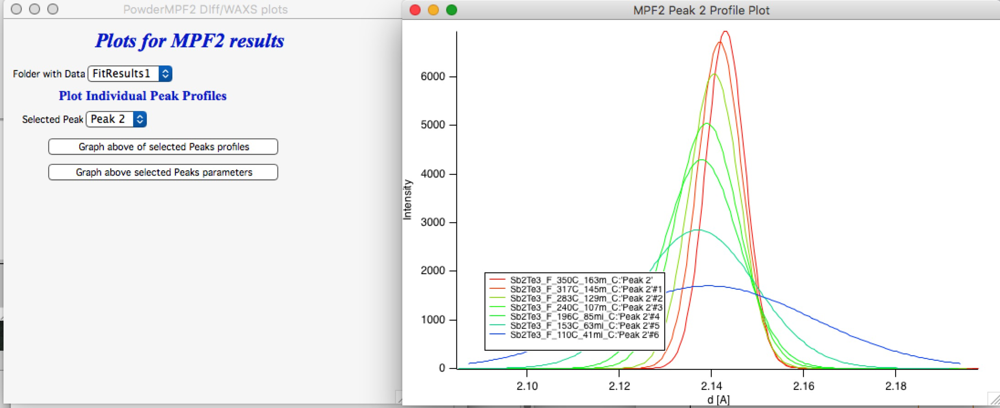
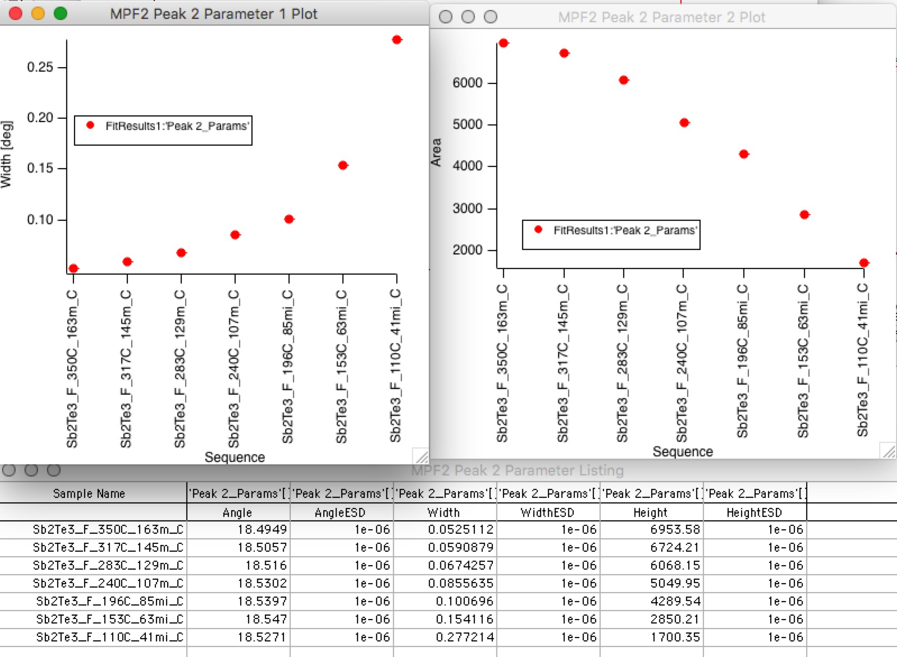

.. _model.waxs:

.. index::
   model; WAXS
   WAXS
   Powder diffraction

Powder diffraction (WAXS) fitting
=================================

**Purpose and description**

This tool is developed to enable simple analysis of powder diffraction data. Note the "simple" in the description. It's purpose is limited to:

#. Display WAXS data. One data set at a time. Multiple data sets can be displayed by Plotting tool.

#. Append to the displayed data one or more diffraction lines sets (PDF2/4 d-hkl-Intensity data). Few of these PDF cards are available for download from the Irena (calculated from model assumptions), new can be imported from xml JCPDS cards, which you can save from JCPDS PDF2/4. Previous attempt to script LaueGo to calculate the diffraction profile was unstable, as any change in LaueGo has caused the functionality to fail. I have removed this in version 2.62, but if someone would really need it, I can try to revive this in the future. Let me know*.

#. Fit diffraction peaks. One data set at a time or as sequence. This is accomplished by using Wavemetrics maintained Multi Peak Fitting 2.0. Fitted results can be stored (in tabular format, each peak profile,...) and plotted.

**What do you need for this tool**

This tool can use "qrs" or "USAXS" data (slit smearing is not supported at this time). The qrs system handles :

Q [1/A] - Intensity - Uncertainity (“qrs”)

d [A] - Intensity - Uncertainity (“drs”) or

TwoTheta [degrees] - Intensity - Uncertainity (“trs”) data.

Any of these data types will be converted to Two Theta [degrees] - Intensity - uncertainty for plotting and analysis. This was done based on suggestion by leading diffraction data analysis experts.

**Basic GUI and operations**

In the SAS menu select “Powder Diffraction fitting = WAXS”.

This opens GUI:

At the top select Data type (most likely QRS), folder where folders with your data are, you can use Regex to select subset of folders to be displayed and select how the folders are to be ordered. This is important if data are going to be processed sequentially for in-situ like experiments. In this case order is important both for model fitting as well as for proper order when results are "mined" for graphs and parameter changes later. Do yourself a favor and find here the proper ordering of the processing...

Double click on a data set creates graph. If the wavenote contains energy (or wavelength) information, it will be used and displayed below. It is critical reasonable number is there, if your data do not contain this information, put it there. It does not have to be exact, but needs to be sensible. If you have already Two Theta data, you need EXACT X-ray energy/wavelength or results will be wrong.

Use cursors to select fitting range or define manually fitting 2Theta min/max values at the top. Ignore the background choices, except if you have measured background ("empty") exposure and it is significant part of your data - and you intend to use it later in peak fitting. That will be obvious later.

**The graph**

Here is example of the graph in default way. Displays the Intensity vs TwoTheta (TTH) in degrees. Weird units, I know.

**Adding Diffraction lines (PDF2/4-type)**

For basic phase analysis and orientation we usually use JCPDS PDF data or alternative is free database of Amercian Mineralogist Crystal Strucutre Database (AMS) in http://rruff.geo.arizona.edu/AMS/amcsd.php. Irena has no way of hooking into the JCPDS or AMS database and this may be developed later, if there is simple way. But the access to the database seems pretty expensive anyway and I assume most users will not have this access. There are ways to avoid the need at least somehow. Read further.

On right had side of the Powder Diffraction/WAXS fits click on the "Diff. lines" tab. Most likely your Diffraction Lines listbox will be empty or contain some cards I distribute with Irena. There are not real JCPDS cards, these are calculated based on models as described below.

.. image:: media/WAXS4.png
      :width: 48%

**We need to fill it up. There are few choices**

1.  Import from the set I distribute with Irena. Pick “Export/Import/Delete PDF cards” and you get another GUI: >>>>

Here you can select card “outside” of Igor (distributed with Irena) and the “Copy IN” or if you create your own cards and want to have them stored, you can “COPY OUT”. You can also delete cards inside this experiment or in outside the Igor experiment (on your hard drive). If you make changes to the content outside or inside of Igor you need to refresh to see changes. Note that “Download Irena Cards” is not doing anything yet.

2. Import PDF-4+ xml cards

Click button and locate the xml card. I have as example Cu card. Card is read and needed information is parsed from the card, dialog:

.. image:: media/WAXS5.png
      :align: center
      :width: 300px

Allows you to select card to overwrite or create anew card with name you want. If you select card to overwrite, the new card name is not used. If Existing card is not selected, new name is used and card is create in current Igor experiment. You may want to export the card to computer in Irena location for future use.

3. Import AMS txt cards

The procedure is same as JCPDS card, except you point the file selector to the AMS_DATA.txt cards. Make sure you download from their database "diffraction data" and not crystal structures of other data.

4. Manualy adding data

This method creates empty table which you need to fill in with values manually - either type in or copy/paste from other programs, like Excel. You neeed at least d-spacing and Intensity, hkl are helpful. Do not bother with 2Theta values,they get created for wavelength you are using automatically.

Now you can add it to the graph.

If you choose the checkbox "Display HKL tags" you will also get tags to each peak with HKL. Here is example:

Note, that you can change the color of these lines if you right click on the name of the card in the Listbox and select new color for that card. It should remember it.

*Distance correction* - tweak Stick positions - from beta version 2.692 (05/2020) I added new control below the buttons, "Correct distance" value. This is to enable tweaking of sticks angular positions in case the transmission geometry has slightly incorrect calibration. This value should be 1 but in case the detector was slightly further or closer to sample than standard, user can tweak the value up/down. This will shit *sticks* for the JPCDS/AMS cards ONLY. One can therefore improve the match between the sticks and peak positions. Note: it shifts (logically) all sticks the same amount. It has no impact on the data, only on sticks ANGULAR positions (not the d-spacing which is ion the tables). Reopening of the WAXS tool resets this value to 1.

**Peak fitting**

The Tab "Peak Fit" on the panel contains tools to do peak fitting. Important note : *Currently the only two peak shapes, which are properly processed and recorded by Irena WAXS code are Gaussian and Lorenz.* While other shapes can be fitted, when recorded by WAXS tool, some parameters cannot be properly saved and processed later. Limit your use to Gaussian and Lorenz peak shapes, please.

*Peak fitting* uses Multipeak Fit 2.0 ("MPF2") package from Wavemetrics, which actually has nice help and demo Igor experiment. The demo experiment can be found in

File>Example Experiments>Curve Fitting>Multi-peak Fit 2 demo

Please, run this experiment to learn how to use this beast. It is **IMPORTANT**. I will not be explaining the details, except where is needed.

Start Multipeak Fit when you have the graph with data you want to fit. It will throw error if there is no graph. Note the "Initialize: Start Fresh" option - when MPF2 is run, it saves current state in run folders. These do not get deleted when finished and you can start it from previous state by selecting "Initialize" folder here. When you are closing MPF2 panel, it will ask for some comment. If you add it (not required) you will see this comment (make it short) in the popup so you can remember what that folder with MPF2 data was for.

When you Start the MPF2 with the button "Start Multipeak Fitting 2.0" you will populate the tab more and get MPF2 panel:

.. image:: media/WAXS8.png
      :align: center
      :width: 100%

The process is to setup MPF2 now - select range of data using cursors which you want to fit, do autolocate.

You can zoom in, change fit parameters etc. Check the demo. You can add/edit peak if you select range of data with marquee (like for zoom) and right click there and select "Add or edit peaks".

You can select Baseline function - MPF2 has constant, linear, cubic etc, I added two more - polynomial (up to 10th power, fit only as many parameters as you need, hold others at 0) and one, which combines measured background (select on panel in "Background if needed for fitting) and constant. In this case the background is scaled by fitted parameters - "transmission" and constant is another "flat" background.

If data are not selected (or do not exist), it becomes seamlessly simple constant and background data gets ignored.

To fit you can use either "Do Fit" button on the MPF2 panel or "Do MPF2 Fit" on the Powder Diffraction/WAXS Fits" panel. They do the same thing.

Here is a fit:

Now, when you have a good fit, you can use "Record Current MPDF2 Fit results".

This will copy lots of interesting results data into the folder in "results are stored here" root\:WAXSFitResults\: XYZST..... whatever you give here - XYZST - will be cleaned up to be acceptable folder name and such folder will be created for your results data.

Each sample gets folder in there which will contain tables of results, each peak profile, etc.

Note, that if you save results for the same sample here, the folder is overwritten, so save in different folder if needed.

Note, that tables with results also get created and presented to you.

To plot/extract data from the saved results, use button "Plot/Evaluate results" which will pop up another panel from which you can create plot of selected peak. If there are more folders with results, specific peak from all of the folders will be plotted.

I saved few fits of some other data and here are the results:

This is Peak profile (Int vs d) for the Peak 2 from sample which was annealed and had multiple peaks changing.

I selected and graphed by use of "Graph above of selected Peaks profile" (yes, that language here obviously fails me). And below is what you get if you push "Graph above selected Peaks parameters".

This is end of the help file for now. I will record movie soon and once changes are done to the tool, I will improve the manual.
