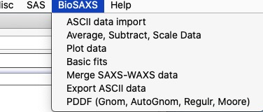

.. _bioSAXS:

Bio SAXS support
================

List of Tools
----------------

1.  :ref:`Import bioSAXS ASCII data <import_bioSAXS_ASCII>`
2.  :ref:`BioSAXS data manipulation - Average, Subtract, Scale  <average_subtract_scale>`
3.  :ref:`Basic Fits <basic_fits>`

.. _import_bioSAXS_ASCII:

.. index:: Import bioSAXS ASCII data

Import bioSAXS ASCII Data
-------------------------

This chapter describes how to import bio SAXS 1D SAS in Irena. Irena has other importers - for ASCII, HDF5 canSAS Nexus, & canSAS XML - suitable for most non-bio type data. These are described here :ref:`Import Data <import_data>`

*Users of Indra 2 or Nika produced data can skip this chapter.*

**Function description:**

This ASCII 1D data loader is custom made for specific ASCII data type. Please check that your data are compatible with these requirements.

- ASCII with two or three columns of data. Optional text block separated by separator (many different supported) will be skipped and ignored.
- First column Q vector in [1/Angstrom], optionally in [1/nm] which can be converted into [1/Angstrom] which Irena uses.
- Second column Intensity (ideally absolute, but relative is fine)
- Third column (optional) is uncertainty (error) for intensity. If there is no uncertainty, it will be created as 4% of intensity value.
- Typically (optional) more files per one sample, files are designated by "_00001" number at the end of the name (number length does not matter, separator _ is required). All characters before this last number are considered sample name.
- Sample names are unique and not excessively long. Suggested limit is 20-25 characters or less. This is GUI limit, not Igor 8 limit.
- Default extension expected is dat, but can be changed in the GUI.

**Example of valid names**

::

  Buffer_01 measurements:
      Buffer_01_00001.dat, Buffer_01_00002.dat, Buffer_01_00003.dat, etc...
  Sample1_035 measurements:
      Sample1_035_000001.dat, Sample1_035_000002.dat, Sample1_035_000003.dat, etc.

**Example of valid data file content**

::

 % Filename : Sbuf1_00033_00003.tif
 % Date & Time : 19-Feb-2020 15:24:09
 % X-ray Energy (keV) : 13.300
 % Exposure Time (s) : 0.500
 % Beam Center : 741.50700, 216.72300
 % Sample to Detector Distance (SDD) (mm) : 2007.410
 % Detector Pixel Size (mm) : 0.172
 % Photodiode Value : 15670.500
 % I0 of Sample : 1.244850e+04
 % I0 of Standard : 1
 %
 % q(A^-1)   I(q)    sqrt(I(q))
 3.50000000e-03	0.00000000e+00	0.00000000e+00
 3.62054899e-03	1.76072986e+00	1.28270598e+00
 3.74524999e-03	1.27342930e+00	6.58838643e-01
 3.87424601e-03	1.59209666e+00	1.10772011e+00
 etc.

Importing ASCII SAS data
------------------------

Select ASCII data import from “BioSAS” menu. You get GUI, which presents various options described below.

.. Figure:: media/ImportDataBio2.jpg
        :align: left
        :width: 300px
        :Figwidth: 320px

Explanation of control available here:

“\ *Select data path”* browse to the folder on the computer drive where the data for import are located.

“\ *Data path”* this shows the path selected above. Cannot be edited in this window, use button *Select data path* to change the path if needed.

"\ *Match name"* enables to use string to show in the listbox only subset of files.

“\ *List of available files”* lists all files in the current folder on the computer, unless masked by *Data extension*. One or more files here can be selected for import. Use shift - click to select multiple files (on Windows) or cmd – click on Macs (to pick one file at time), shift-click to pick range of files. Double click on file runs "Test" and "Preview" commands on that file.

“\ *Data extension”* if extension is put in this filed (e.g., “dat”) only files with the “dat” extension will be shown in the *List of available files*.

“\ *Preview”* Test import of first selected file. Not really necessary, but very useful. Will display graph, if it looks OK, you should have no problems reading the files.

”\ *Select all”* or “\ *Deselect all”* modifies which files are selected in “\ *List of available files”*.

”\ *SAXS data?”* or *WAXS data?* select if you are importing SAXS or WAXS data. All this does is it places data folders in either root\:SAXS or root\:WAXS folders for easy orientation. It also enables you to have same file names for SAXS and WAXS data. NOTE: You can merge SAXS and WAXS using Irena Merge data tool.

\ *“Convert Q from [1/nm]”* select if units used in file for Q are [1/nm]. Units will be converted to A\ :sup:`-1` if nm\ :sup:`-1` data are imported. Irena uses A\ :sup:`-1`.

“\ *Note on errors”* if the data imported do not contain error bars, this tool will generate 4% Intensity errors.

NOTE: If the data contain header of data (typically number of lines with special character, such as #, $, ... at the start of the line and some spaces before useful information, this ASCII importer will simply ignore them.

**Use of the ASCII Import tool:**

Locate data using “\ *Select data path”* button. This will populate the listbox on the left hand side. Double click any file to generate preview graph (or select file and push button “\ *Preview”* which will do the same thing). If the graph looks OK - check the Q units at this moment - the tool will import the data without issues. If there are weird things and something does not look right, you can try using Irena ASCII importer in menu SAS>Data Import Export>Import ASCII SAS Data. It has lot more functionality and you can probably import the data that way. read the manual on this tool...

.. Figure:: media/ImportDataBio3.jpg
        :align: left
        :width: 500px
        :Figwidth: 420px

So, lets assume the graph looks OK. **Check the Q scale - in case the Q values are 10x larger than you expect, you have Q in 1/nm and need to check the checkbox "Convert Q from [1/nm]"** Select files which you want to import - or just select all using button "Select all".

.. Figure:: media/ImportDataBio4.jpg
        :align: left
        :width: 300px
        :Figwidth: 320px

Next decide, if you have many files per one sample - typically multiple measurements you want to average first - or if you have one file per sample. If you have many files (our example) you should check "Group by Samples?" option. If you have one file per sample, you should uncheck this checkbox or your data structure will be too complicated.

If the "Group by Sample?" is checked, code will assume that string before the last number separated by "_" - that is before "_00023.dat" is the name and create subfolder for that sample. That is **VERY convenient** in this case, you'll see it later. See in the figure below, how the data structure looks like: your data were imported in root\:SAXS. In there, for each sample name code created folder with name based on the file name (without the last "_000xx" number). It placed all individual data inside its own folders with names which now2 include that last number to make sure the names match the file names. Inside each individual folder code placed your q values in wave called "q_sampleName", intensity in "r_samplename" and errors in "s_samplename". This is what is knowns as QRS naming system Irena uses :ref:`QRS naming system <important.QRS>`.

However, if you have only one measurement per sample, using this grouping just buries your data to deeper folder structure. In that case, do NOT do it, it will just keep annoying you.

-----

.. _average_subtract_scale:

.. index:: bioSAXS Average, Subtract, Scale

BioSAXS Data manipulation - Average, Subtract, Scale
----------------------------------------------------

This chapter describes how to use Average, Subtract, Scale tool for bioSAXS data. Irena has other Data manipulation tools. These are described here :ref:`Data Manipulation 1 <data_manipulation_1>` and :ref:`Data Manipulation 2 <data_manipulation_2>`

This tool is used to :

* *Average* multiple measurements on single sample to get averaged data set. This is used to obtain better statistics. If you have just one measurement on a sample, skip *Average* step.
* *Subtract* buffer measurement from sample measurement. Buffer can be scaled if needed for transmission.
* *Scale* data if needed. This simply scales intensity and Error (uncertainty) by value provided by user. For example, if data need to be placed on absolute intensity scales and calibration constant has not been yet applied.

**Using default naming of data sets here is important** Naming folders with data is critically important to keep user sanity. You can get easily in situation, that you have no clue what data are where and result is mess and errors. Try to use default names and you have chance to keep your sanity.

Naming of files
---------------
After import, you should have one or more data files imported. If you have multiple measurements for each sample, your data should be in:

root\:SAXS\:SampleName

and inside this folder should be multiple folders named similarly to:
SampleName_0001, SampleName_00012, SampleName_0003, SampleName_0004, ...  These are multiple measurements which now need to be averaged.

* After *Averaging*, the code will create a new folder with data called **SampleName_ave** inside the root\:SAXS\:SampleName folder.

* After *Subtracting buffer* the code will create a new folder with data called **SampleName_sub** inside the root\:SAXS\:SampleName folder.

* After *Scaling data* the code will create a new folder with data called **SampleName_sub_scaled** inside the root\:SAXS\:SampleName folder.

The main GUI is here:

.. Figure:: media/AverageBioSAXS1.jpg
        :align: left
        :width: 500px
        :Figwidth: 420px

The tool can do three things quickly and easily... It is not meant for more complicated processing. It also assumes, that you follow the procedure in order - Average - Subtract - and optionally Scale. Any other order may cause major troubles.

Average
-------

The purpose is to add all measurements in the graph, evaluate if all measured data should be averaged, remove any which for whatever reason should not be included and then average those which user approves.

**Selecting data** Understanding data selection tools makes user life easier.

.. Figure:: media/AverageBioSAXS2.jpg
        :align: left
        :width: 500px
        :Figwidth: 420px

*Start Fldr.* Here you can select at which location in data tree code will start looking for the data. In this case we look fro data from root:
*Folder Match (RegEx)* this allows us to look for only some of the folders. A short summary on regular expressions is at the bottom of the page, below the Listbox with folder. Google it, understanding regular expressions will be very helpful.
*Invert?* this checkbox inverts the Regular expression meaning.
*Sort Folders* This sorts the folders using one of many methods implemented. As result, this will group folders in order which may be helpful for processing.

*HOW TO USE* Pick a good starting folder. If you select root\:SAXS\: folder, it will show you all data inside this one folder - inside all subfolders. I now have 7 folders inside this folder, each with 45 measurements for each sample. That is a lot of names to deal with. But if I choose for example root\:SAXS\:Sbuf1_00033\: as starting folder, only 45 data sets which I want to see will be shown.

Also, note that code automatically puts "ave|sub" and checks the "Invert?" checkbox. This will prevent, if they would happen to exist, folders generated by this averaging and by subsequent subtracting of buffer from showing up and being accidentally averaged. This is useful when you are reprocessing the data.

**Adding data**

To add data, we have tow options.

**Add by double click** if you double (left) click on a name of data set, it will be added to the graph. Note: each data set can be in the graph only once and subsequent attempt to add it again will simply be skipped.

.. Figure:: media/AverageBioSAXS3.jpg
        :align: left
        :width: 500px
        :Figwidth: 420px

In this graph I simply double clicked on the Sbuf1_00033_00005: and it was added to the graph. You can add all data sets you want, but it may get tedious after few data sets.

**Add as group** This is more likely expected use. In the listbox now we have ONLY measurements related to one sample. This is because the start folder is set to root\:SAXS\:Sbuf1_00033\: and two other types of data sets there (ave and sub) are hidden using the Folder Match controls. We can therefore follow the buttons and their order to get more productive. Here is correct easy to follow procedure:

* Select the Start folder to point to one sample set of measurements.
* Hit button *1. Select All Data*, this will select all data in the listbox. You can deselect the data you know you do not want now - hold down control/command key and click on names you do not want.
* Hit button *2. Plot Selected Data*. This will add all selected data into the graph and create legend.
* Now you can decide if any are outliers which need to be removed. Remove the data sets by right click and "Remove XYZ_wave_name". If needed, zoom in using Igor graph tools (left click-drag create Marquee and right click inside, select Expand). To autoscale back use *Autoscale Graph* button at the bottom of the panel. Once you removed all data sets which you do not want to include, continue...
* Hit *4. Average & save Data* button. This will average all data together and create a new data set with SampleName_ave name inside the SampleName folder.
* (Optional) Hit *5. Clear graph* this will remove all data from the graph. It is optional if next you would use buttons from the start of this procedure, button *2. Plot Selected data* does remove the old data first anyway.

.. Figure:: media/AverageBioSAXS4.jpg
        :align: left
        :width: 500px
        :Figwidth: 420px

In the graph code adds the black averaged data set and saves the data.

Now, to process all of the imported data all I have to do is to follow the above routine for each imported set of 45 measurements per sample. Note, that the code is writing report in the history area of Igor (just above command line input):
  Created averaged data set in\:root\:SAXS\:SltWT_00039\:SltWT_00039_ave\:
Averaged following data
sets:r_SltWT_00039_00001;r_SltWT_00039_00002;r_SltWT_00039_00003;r_SltWT_00039_00004;r_SltWT_00039_00005;r_SltWT_00039_00006;r_SltWT_00039_00007;r_SltWT_00039_00008;r_SltWT_00039_00009;r_SltWT_00039_00010;r_SltWT_00039_00011;r_SltWT_00039_00012;r_SltWT_00039_00013;r_SltWT_00039_00014;r_SltWT_00039_00015;r_SltWT_00039_00016;r_SltWT_00039_00017;r_SltWT_00039_00018;r_SltWT_00039_00019;r_SltWT_00039_00020;r_SltWT_00039_00021;r_SltWT_00039_00022;r_SltWT_00039_00023;r_SltWT_00039_00024;r_SltWT_00039_00025;r_SltWT_00039_00026;r_SltWT_00039_00027;r_SltWT_00039_00028;r_SltWT_00039_00029;r_SltWT_00039_00030;r_SltWT_00039_00031;r_SltWT_00039_00032;r_SltWT_00039_00033;r_SltWT_00039_00034;r_SltWT_00039_00035;r_SltWT_00039_00036;r_SltWT_00039_00037;r_SltWT_00039_00038;r_SltWT_00039_00039;r_SltWT_00039_00040;r_SltWT_00039_00041;r_SltWT_00039_00042;r_SltWT_00039_00043;r_SltWT_00039_00044;r_SltWT_00039_00045;

**Controls at the bottom**
There are few common controls at the bottom of the panel. They are important:

* *Sleep between data set* This is useful for processing multiple data sets - for Subtract and Scale operations. It delays processing between the samples so user has chance to review the result and if needed, record which data to look back at. Time is in seconds.
* *Overwrite Output?* NOT checking this checkbox will prevent user from overwriting existing data of the output file. If you want to overwrite the data because you improved on them or are training, check it and old data will be replaced with new version.
* *Display Error Bars* Error bars make graphs difficult to read, but this shows them so user can evaluate their size etc.
* *Autoscale Graph* Graphs embedded in panels do not understand regular shortcuts to autoscale them (ctrl/cmd-A). You can right click in the graph and select "Autoscale" or use this button to scale up to show all data.

Subtract
--------

The purpose is to subtract buffer (averaged) data from all averaged measurements for samples.

In this case it is better to set starting folder as root\:SAXS\: (or whatever the name of starting folder is). The tool be default looks for sample names which have "ave" in the name, see the "Folder Match (RegEx)" and the checkbox next to it.

.. Figure:: media/SubtractBioSAXS1.jpg
        :align: left
        :width: 500px
        :Figwidth: 420px

To process a data set, follow the instructions on the panel.

* In the figure select root\:SAXS\: and code is showing only names containing "ave" in the name.
* In the controls next to selection Listbox select buffer name.
* Double click sample name (e.g., second name in the listbox). The code has added the buffer and sample in the graph.
* (Optional) tweak Scale Buffer value, if needed. Normally should be 1.
* Hit *4. Subtract Buffer and Save* button. Subtracted data (green line) will be added to the graph and data will be selected with _sub in name.

.. Figure:: media/SubtractBioSAXS2.jpg
        :align: left
        :width: 500px
        :Figwidth: 420px

Now, if you have many data sets from which you need to subtract same buffer, with same scaling, you can run this in sequence. Select all data sets you want to process (Careful *DO NOT* select buffer measurement). Then use *Sub. Buffer On Selected* button and all data sets selected in the listbox will be processed in sequence.

Delay between the processing, which serves to let user review if the subtraction was OK, is controlled by *Sleep  between data set* variable.

If you need to, you can check *Overwrite Output?* to prevent dialog if output data already exist.

NOTE: Code makes records in the history area:

  Subtracted buffer from root\:SAXS\:SltWT_00039\:SltWT_00039_ave\:

  Subtracted buffer from root\:SAXS\:Sst288p326_00036\:Sst288p326_00036_ave\:

Scale
-----

If needed, user can scale more or less any data (Int-Q-Error) using Scale operation. It is useful for applying scaling factor (like absolute intensity scaling) to either averaged or subtracted data.

.. Figure:: media/ScaleBioSAXS1.jpg
        :align: left
        :width: 500px
        :Figwidth: 420px

In the figure I displayed only data which are subtracted ("sub" in the Folder match (RegEx)). I added data set into the graph and scaled by factor of 10. Code created a note in the history area:

  Scaled data from root\:SAXS\:Sst288p326_00036\:Sst288p326_00036_sub\:   and saved into new folder :    root\:SAXS\:Sst288p326_00036\:Sst288p326_00036_sub_scaled

Note, that the name changes by adding _scaled but leaves the _sub in there. From future use, these are subtracted_scaled data...

-----

.. _basic_fits:

.. index:: Basic Fits

Basic Fits
-----------

This tool is used to do simple fits on many data sets quickly. Ideally, one setups the Q range and fitting conditions on one or two data sets and runs the tool on all of the data selected in the listbox. Assuming q range and model are suitable for all, user gets quickly table or graph of results.

Implemented models:

* Guinier
* Porod
* Sphere
* Spheroid
* Guinier Rod
* Guinier Sheet

.. Figure:: media/SimpleFitsBioSAXS1.jpg
        :align: left
        :width: 500px
        :Figwidth: 420px

**Data selection** This tool can use two types of data - USAXS and QRS. All data which DO NOT come from APS USAXS instrument use QRS naming system. Only if you have our USAXS data, you should use USAXS data type. For everyone else, use *QRS* naming system that is how your data came through ASCII importer or through Nika.

Again, you can select *Start fldr* (e.g., "root\:SAXS\:") and data type using *Folder Match* (e\.g., "sub").

**Add data using double click** Add data using double click. Data are always added to the top graph as log-Intensity vs log-Q. For some (Guinier, Porod,...) the lower graph presents linearization plot. For some (Sphere) no linearization plot is presented.

Select Q range to fit a specific model and push button *Fit Current (One) Dataset*. Results are presented, see figure with really ugly Guinier fit or much better fit for spheroid...

.. Figure:: media/SimpleFitsBioSAXS2.jpg
        :align: left
        :width: 500px
        :Figwidth: 420px

.. Figure:: media/SimpleFitsBioSAXS3.jpg
        :align: left
        :width: 500px
        :Figwidth: 420px

Note value for chi-square for goodness of fit.

Now, user can save the fitted results. Results can be saved in three ways suing the three checkboxes on the panel:

* Results can be recorded in Notebook. This can be opened using *Get Notebook With Results* button.

* Waves containing resulting values - and text wave with folder name - in Igor folder (root\:NameDependingOnMethod). User can create table with those results using button *Get Table With results*. Also, user can manually graph any of those values as needed.

* Results can be saved in the folder where the data came from. In this case waves with fitted Int-Q are created and results are placed in wave notes. User can plot these using Irena plotting tools (these are Irena results type) and look through the wave note values later using *Metadata Browser*.

**Run as sequence**

User can select multiple data sets in the listbox, method to use, Q range to use, and way to store results and run same analysis method on sequence of the data. Note, that data are processed in the order (from top to bottom) they are displayed in the Listbox. It is really useful to order the processing in meaningful order (time, temperature, etc.) which then results in the tables being in suitable order.

.. Figure:: media/SimpleFitsBioSAXS4.jpg
        :align: left
        :width: 700px
        :Figwidth: 420px

In the Figure one can see results of run of Spheroid model on sequence of data sets. Code run 5 data sets, created new folder in Igor experiment root\:SpheroidFitResults and stored there many waves with results of the model. It then created a table with these values and displayed for user. User can now go and manually utilize the model results in their own graphs or subsequence processing. I also stored data in notebook, but that is not shown here - it contains summary of resulting values and  graph for each sample which was run.

*Delete Existing results* This button will close  table with results and delete the folder  root\:SpheroidFitResults (or similarly named folder with results from different fitting model). Be careful, there is no recovery for this.
