.. index:: Beam center, Sample detector distance, Geometry refinement, Distacne calibration, Standard calibration

Beam Center and Geometry refinement
===================================

Included tool for finding beam center and refining geometry parameters allows at this time to:

1. Locate beam center when image with attenuated beam is collected by fitting 2D Gaussian profile

2. Locate beam center with help of graphical tools when diffraction lines are available

3. Refine beam center using least square fitting when diffraction lines are available

4. Refine Sample to detector distance, wavelength and beam centers when calibrant image is available (Silver behenate for example for SAXS
   and CeO standard for diffraction, but user defined is available.

5. Refine tilts for tilted detectors. See notes later. It is NOT that easy.

Main tool is located in the menu under name: “Beam center and geometry cor.”

This tool creates control panel:

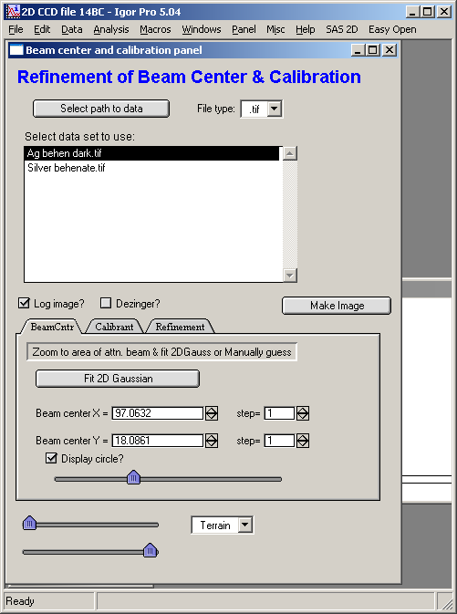

First select path to data, as using the other tools… Select appropriate type of data. Select “dezinger” if needed and number of passes of this process. Check log image if you wish to see log of intensity, but all calculations are done with original intensity… Create image by pushimg “Make Image” button.

If needed (high background samples) you can select “\ *Subtr. Blank*\ **”** checkbox – and need to load Empty measurements (“Blank image”, image without sample but with X-rays on) through the main panel. This is used to subtract that from measured data. It is sometimes needed to have better diffraction peaks.

Other options: “Use mask?” and “Use Geom Corrs?. Use mask – uses mask used in the main panel, so it needs to be first created (suggestion: create mask first before doing anything else) or loaded using main panel. Geometry corrections to intensity may be important for really high angle scattering, but unlikely…

The first tab is for locating (at least roughly) the beam center.

Beam center using attenuated beam
---------------------------------

Load in the image containing attenuated beam :

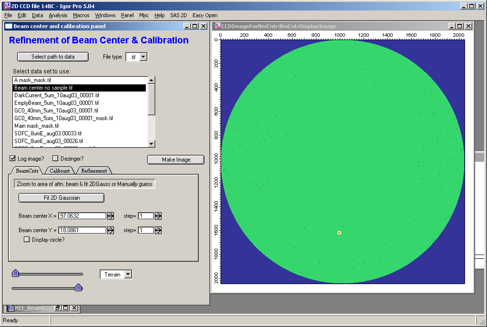

Zoom in the area with the beam using Igor controls (select the area and right-click on Windows, select Expand. Select reasonably small area, fitting over large areas takes a long time.

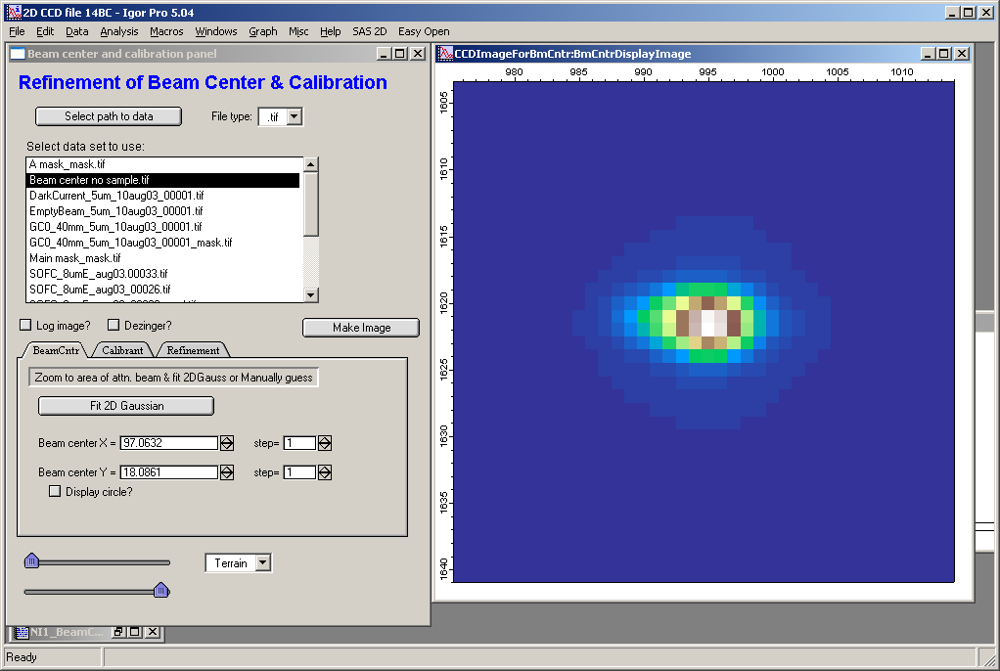

Push “Fit 2D Gaussian” button:

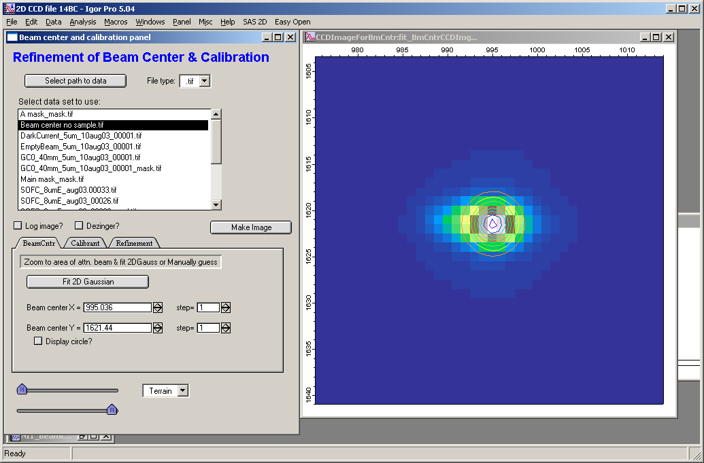

Note, that Contours are appended to the image showing how the Gaussina fit looks like. Results from fitting with beam center values are pushed into right variables.

Beam center using “help circle”
-------------------------------

If image with attenuated beam is not available, following method may help to get relatively good estimate for beam center. Needed is image with material which has diffraction rings – this is usually no problem for diffraction, where number of standard exists. For SAXS usual material is silver behenate.

This is image with CeO powder standard collected on 2D area detector:

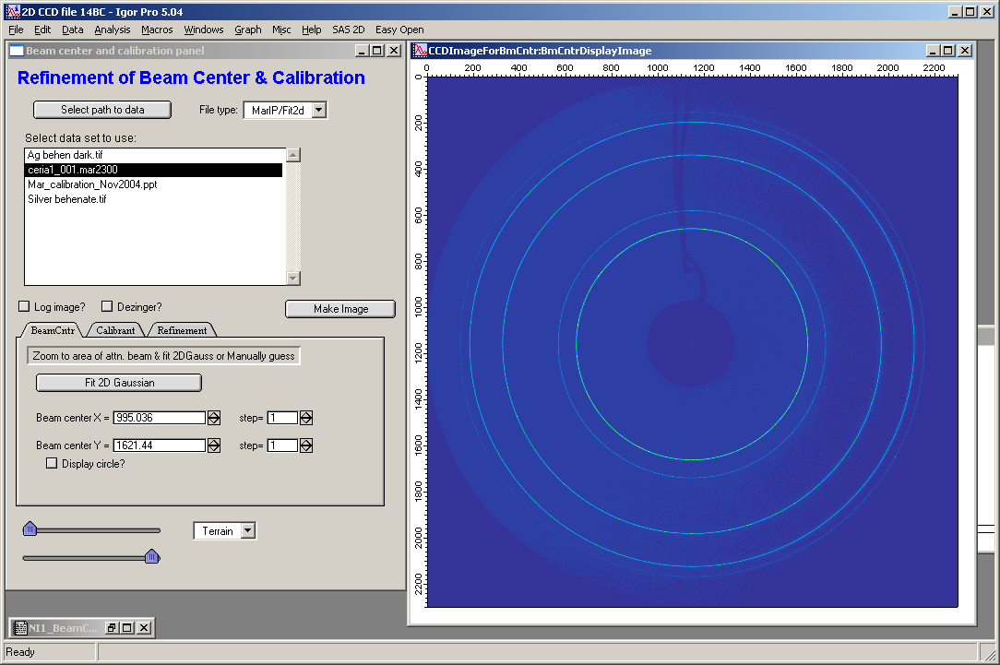

Check the “Display circle” checkbox and use slider to scale the circle to size close to one of the rings. Then change beam center (set useful step size using the “step” variables) to match the circles as good as possible:

So from this:

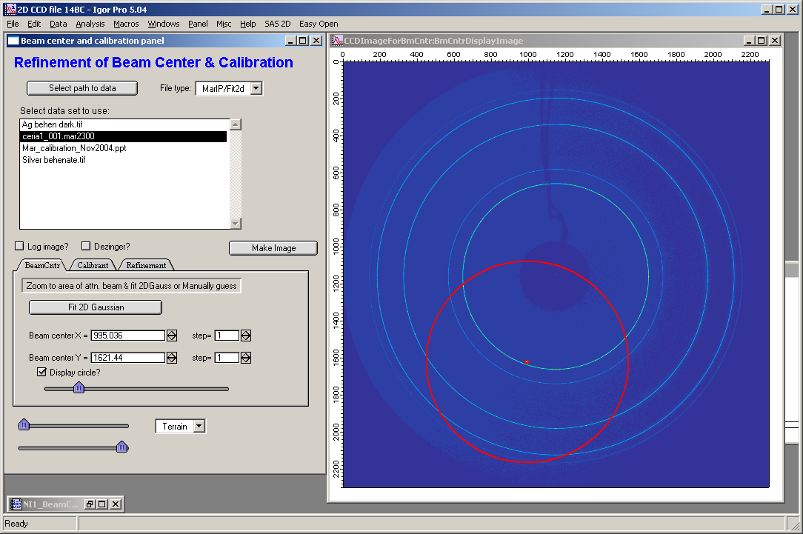

Get to this:

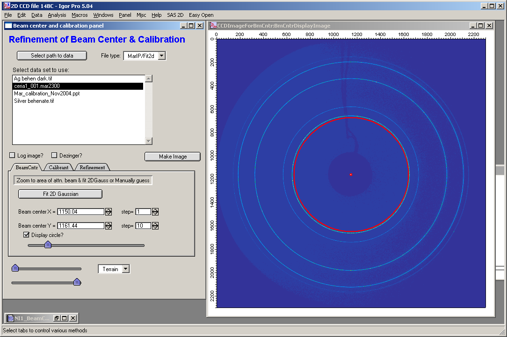

This is already a good estimate of the beam center…

.. index::
    Calibration, Sample to detector distacne

Calibrant & refinement
----------------------

On the next tab pick the calibrant to use and in tab refinement insert reasonably good estimates of the sample-to-detector distance and wavelength. Pick the predefined calibrant (I have now only CeO and Ag behenate, but can add any number of others). The list of d spacings is filled in… The code can use up to 5 lines for any calibrant material – just overwrite the d spacings on the “Calibrant tab” with own values. User needs to know the d spacing for this material. D spacing cannot be optimized!

**Note, that you have to have also appropriate size of the pixels set in the main panel**:

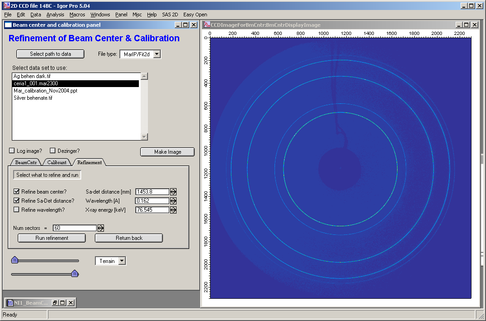

In the tab “Calibrant” now select “Display?” Checkbox. This will add circles where using current parameters should be the lines and two lines around each of this line.

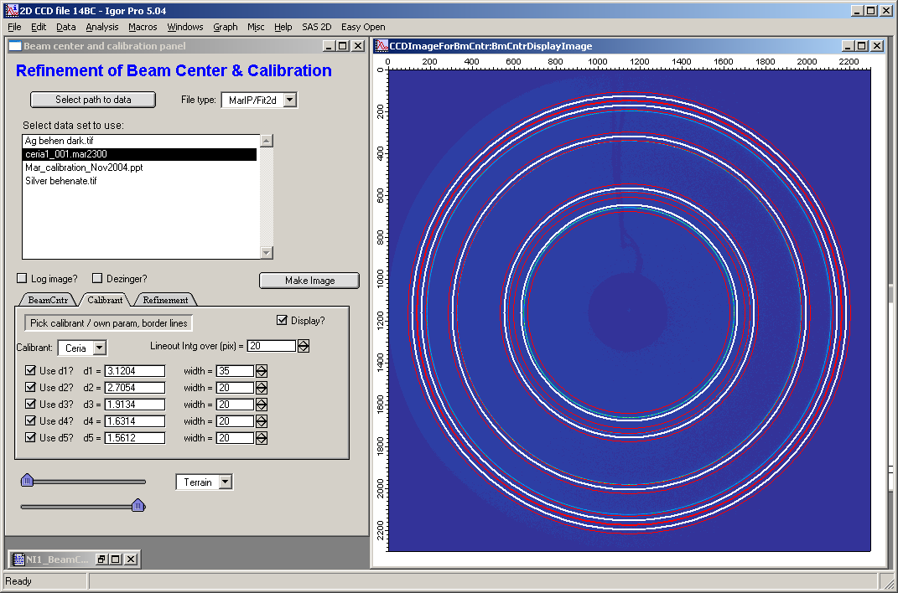

Note detail here:

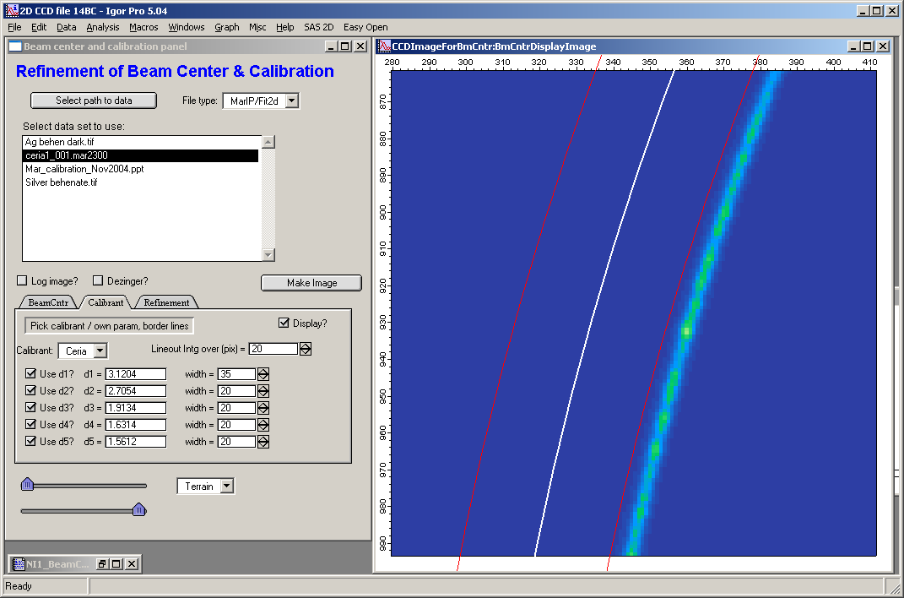

The white line is calculated position of the diffraction from current parameters, greenish fuzzy line below is the diffraction line and red lines indicate the width, which will be used by the code to search for the line positions. In order for the code to work, the diffraction line has to be within the two red lines all way around the circle. It has to be single line within this area – therefore no overlapping lines are possible here…. To do this, change wavelength and sample to detector distance, possibly beam center positions.

See here:

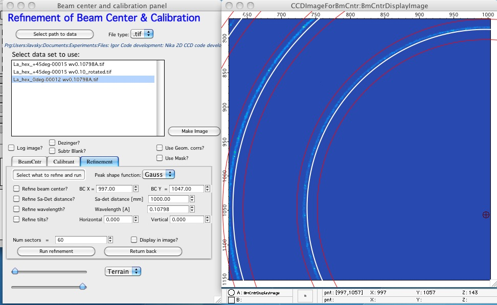

If needed make the width between the two red lines wider as necessary – it is line specific, so each diffraction line can have different width. Note, that the peak position is found by fitting Gaussien profile on intensity profile in the radial direction between the two red lines, so they need to contain some flat background around the diffraction line, but now too much.

The line profile is taken over width (number of pixels on image) perpendicular to the radial direction as set in “Lineout Intg. Over (pix)” on “Calibrant” tab. This value is ONLY one for all diffraction lines. Depending on quality of the lines this may be narrow or broad. If the lines are broken up, with spots, wider will help, but too wide will reduce precision.

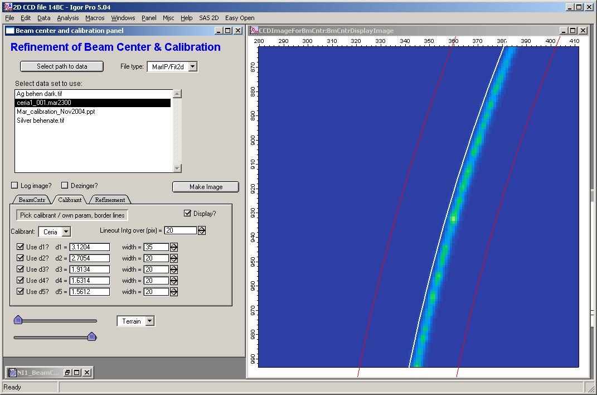

In the “Refinement” tab select which parameters to refine – beam center, Sample-to-detector distance and/or wavelength. Note, that to refine wavelength AND sample-to-detector distance together you need at least 2 diffraction lines.

Select number of “sectors’ to use (see below is set to 60). This how many direction away from beam center are evaluated. For 60 sectors the code analyzes every 12 degrees (360/60=12) lineout in radial direction between the red lines, finds maximum by fitting peak profile and tries to fit to these positions of the diffraction peak.

NOTE: Even, if the image covers only small part of the 360 degrees (when beam stop is or beyond the edge of the detector) the analysis is done only every 360/number\_of\_sectors (in example 360/60=12) degrees. Therefore you may need to increase this number of sectors significantly to make sure you have enough points in which the positions of diffraction ring are analyzed.

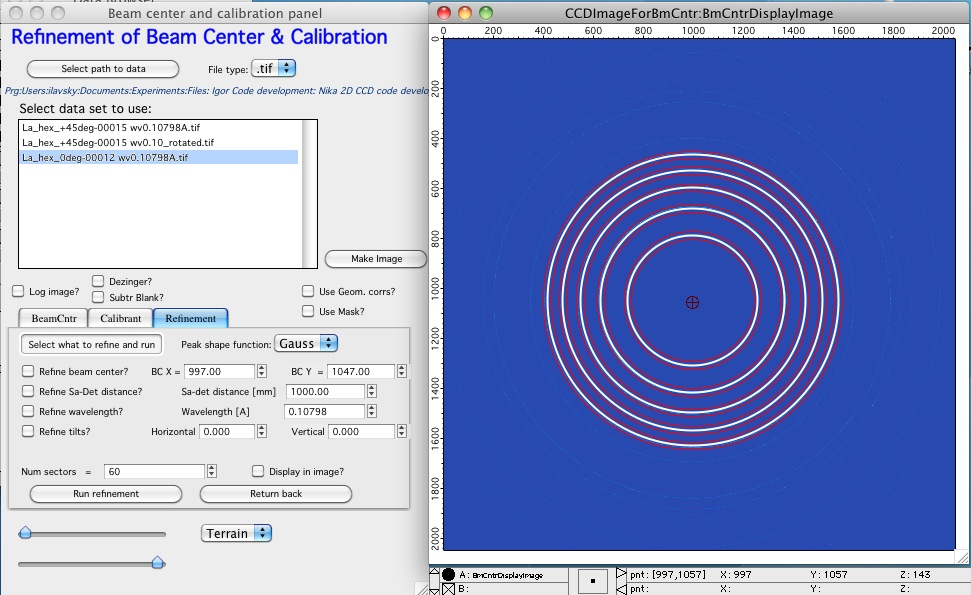

This is how many directions for each ring will be evaluated. If the direction falls out of image, it is skipped. Note, too many may take lot of time…

Note: if you select “\ *Display in image”* the code will show on the image which line is being evaluated at any time. This slows down significantly the fitting as the display part is kind of slow…

Note the other controls:

BC X, BC Y beam center values which can be changed here

Peak shape profile: Guass, Lorenz, and Gauus with sloped background. Most of the time Gauss is fine and most stable. Other shapes are really for cases when Gauss fails.

Tilts… You can change them and fit them here. There is separate chapter later on fitting tilts.

When ready, push “Run refinement” and observe:

As refinement progresses, dotted red line on the image indicates which direction/line are being evaluated and “Profile fit window” graph shows the intensity vs pixel data there and fitted Gaussien profile. Observe and judge quality. If the quality is poor and data are misfit, it is likely that results of refinement will be bad…

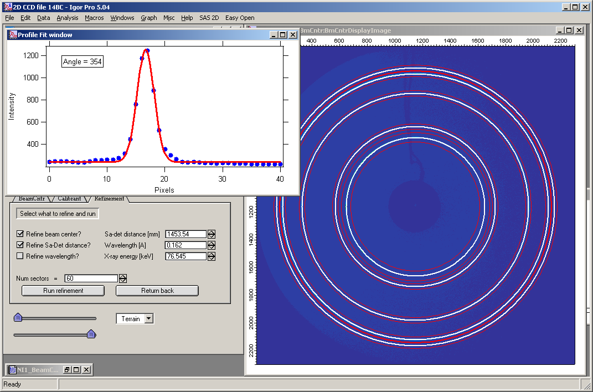

If the refinement at the end fails, you get error message and no change to original parameters is made. If refinement is successful but you still do not like the result, you can recover the previous parameters by pushing button “Return back”.

Otherwise, if successful, the results are pushed into the right variables in the main panel and all is done.

Note, with Silver behenate for SAXS, there is only one line, so the processes is easier. But one cannot refine wavelength AND sample-to-detector distance. Note, the line width for Silver behenate needs to be significantly larger and also it is likely that the “Lineout Intg over “ needs to be larger…

.. index::
    Detector tilts

Fitting data with tilts
-----------------------

Finally version 1.49 adds good code to fit tilts and deal with them – both in data reduction and in the fitting here. Prior versions (1.48 and before) had slow code which handled small tilts ONLY. Current code, as documented below, handles high tilts quite well and is much faster. Test data I’ll be showing were provided by dr. von Dreele. Many thanks to him.

The following data were collected with about 45 degree tilt in one direction:

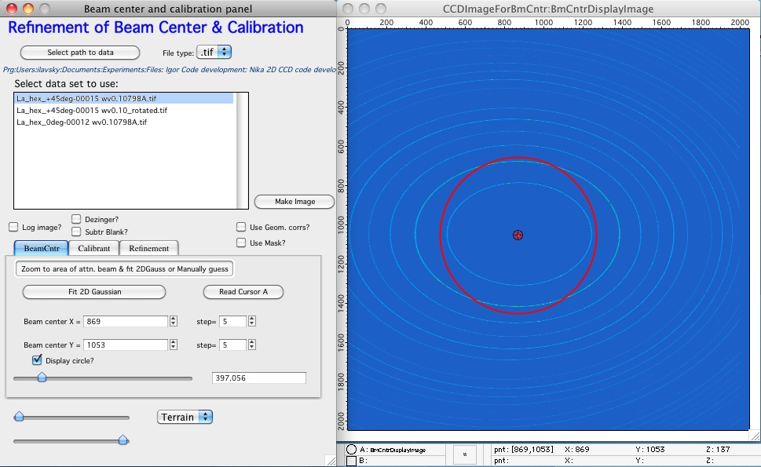

Note the deformed diffraction profiles which resemble (but are NOT) ellipses.

Above is the best guess of beam center using the circle. Other parameters are reasonable well known, so one can choose LaBr6 as calibrant:

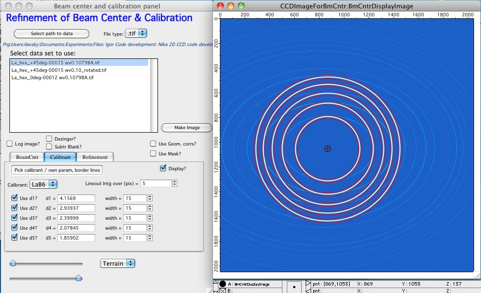

You can see that circles are not a good fit.

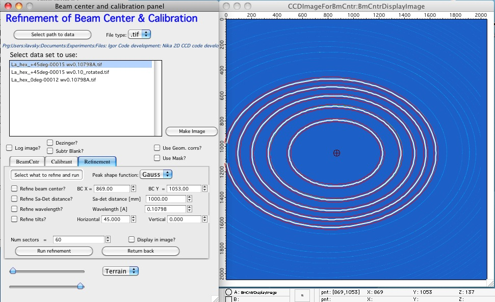

However, selecting horizontal tilt of 45 degrees makes this a good guess.

Now we can run refinement for Beam center, Sa-Det distance, and tilts and we should get very good fit:

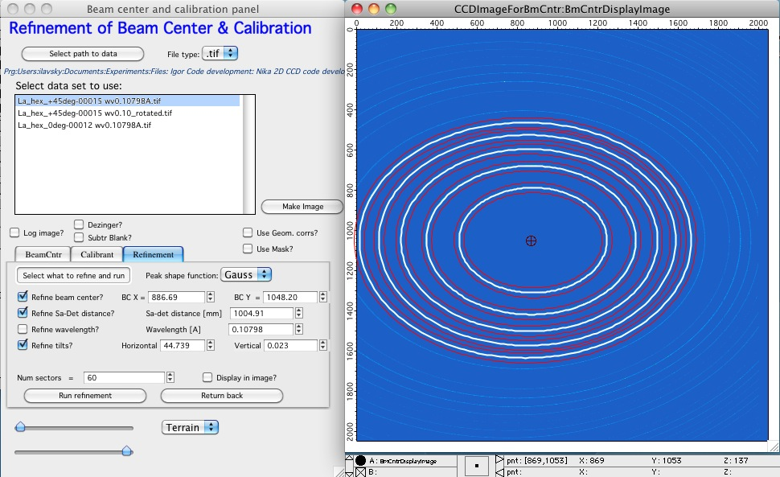

I should note few things:

Make sure the peak fitting does not miss the peak. I try to catch it, but the code is not the most robust. Making the width for each diffraction ring large enough helps a lot. Also, you may want to run the fitting few times. Costs little time and helps often.

Also: Warning – getting tilts requires significant amount of solid angle of data. Basically, you need to see large fraction of the ring to fit tilts. With limited fraction of the diffraction ring my attempts to fit were nearly futile. But you can dial numbers measured by other means in to eyeball the tilts in.

Note that 45 degrees and -45 degrees are NOT the same tilt. There is 90 degrees difference between them, so if you have tilt measured by other means, try using it both positive and negative. Easier to check the effect than try to work out the geometries and convey it here.

Here is example of above data reduced with correctly fitted tilt and with tilt 5 degrees off:

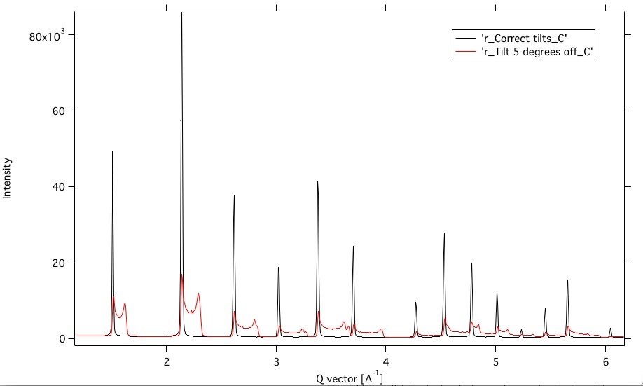

**The tilts are important!**
