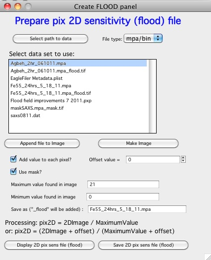
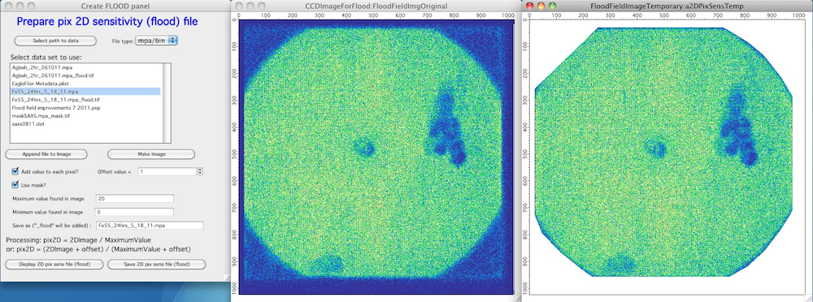

Flood field
===========

This simple routine will help user to create “Flood field” – or as NIKA
is calling Pix2D sensitivity field. This routine was revamped and
upgraded in version 1.51 with more functionality.

Definition: This field is matrix of real values such, that when
intensity measured in any given pixel is DIVIDED of its pix2D value, the
intensity is scaled to correct intensity.

Corrected value = Measured value / pix2D sensitivity value

To create this pixel sensitivity map one has to expose all pixels to the
same incoming flux of photons (neutrons) – aka flood field, flat field
etc… With enough counts measured for each pixel – and assuming the
incoming field is really “flat” – the intensity measured for each pixel
is now inversely proportional to pixel sensitivity.

If you have such image, this routine can help to convert this image into
NIKA-type pix2D sensitivity image. Note, that this image is saved as
tiff file with single precision real number in each pixel – this image
may not be readable by other packages!!!!

To create this pix2D sensitivity map, one needs to load in image and for
each pixel divide measured value for that pixel by the maximum intensity
measured in the image. If any pixel has intensity = 0 (WRONG… You need
to collect at least 1 count in each point) it is possible to add 1 to
each point intensity to avoid having 0 as corrections in the pix2D
sensitivity file, which would cause dividing by 0 and therefore would
remove this pixel from any calculations in the future….

**GUI**

The GUI is very similar to Mask GUI:

“\ *select path to data”* Select path, where measured flood field is
located. Note, resulting pix2D sensitivity file will also be there.

“\ *File type*\ ” well, select type of data you have. Note, resulting
pix2D sensitivity file is tiff file.

Note, at this time this tool can read ONLY one file at time. If you have
multiple files to process, you can append the images with the button
“\ *Append file to image*\ ” and the intensities will be added to
existing image. If the 2D image does not exist, new image is created.
However, if you need to start fresh you need to use button “\ *Make
Image”* which will create new 2DF image to work on.

“\ *Select data set to use”* select the image to use

“\ *Make Image*\ ” Loads data in and Creates image

“\ *Add value to each point”* – select, if you need to add some number
of counts to each point in image. This will open new control “\ *Offset
to add to each point”*.

Note, the offset will be selected automatically, if during loading the
data this tool detects, that there are points with 0 intensity in them.
Conversely, this option will be deselected, if minimum intensity in the
image is more than 0….

“\ *Use Mask”*- mask loaded in the main tool is used for Pix sensitivity
development. See below.

Further controls will be populated during loading of the data set:

“\ *Maximum value found in image*\ ” and “\ *Minimum value found in
image*\ ”. These are here mainly for information.

**However**, note, that it is possible to overwrite the “\ *Maximum
value found in image”* and this new value will be used instead of the
original maximum value for correction described above. It is therefore
possible to create pix2D sensitivity file with different range of
values. Note, that the code does not check for range of pix2D
sensitivity values…

***Warning***

The code really does not check for values here, and it is possible to
set offset negative, for example, and generate negative pix2D
sensitivity map… This will cause all sorts of problems later on – **you
were warned!**

Here is case of loaded image:

Left is panel, middle is image loaded in for creating the pix
sensitivity map and right is calculated pix sensitivity map – after
masking and scaling by max intensity found (or user input in the panel).
Note, that as you change the values in the panel the imegase should
change to reflect them. In case they do not, “\ *Display …”* button will
update these images and recreate, if necessary.

“\ *Save 2D pix sensitivity file (flood)”* will process the file as
described above and save it. It will be saved in place where original
file came from and \_flood.tif will be added to text in the “\ *Save as
(“\_flood” will be added)”* control. The text will be first checked to
be acceptable name for OS.
