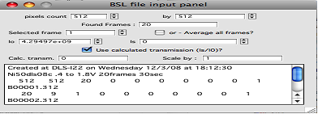
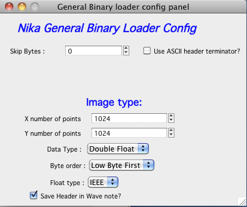
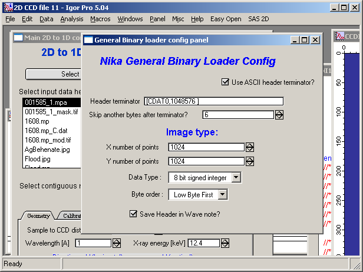
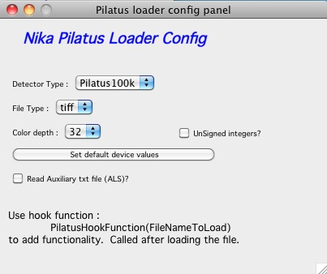

.. index:: Input 2D data types Nika

Supported Data Types
--------------------

**Igor native loaders**

These are file types, which Nika can load natively. These can be loaded on any platforms:

.. index:: input image; tiff

*tif*    .... tif file, assumed scientific (one layer) tif, not colored.

.. index:: input image; binary

*GeneralBinary* .... flexible binary data loader :ref:`see description <import.data.Binary>`.

.. index:: input image; Pilatus

*Pilatus* .... should load NON COMPRESSED Pilatus data. Opens new screen with options. As of 1.66 can also handle compressed (BYTE\_OFFSET) Cbf files. :ref:`See description. <import.data.Pilatus>`

.. index::
    input image; Nexus
    input image; NxSAS

*Nexus* .... HDF5 based format used at APS, Diamond, … Used at 9ID SAXS/WAXS, 15ID SAXS etc. Contains a lot of extra information, which is stored in wave note for user use. See discussion earlier in the manual.

.. index:: input image; HDF5

*HDF5* .... under development at this time. Major headache as it is so flexible, that it is nearly useless. I have capabilities but no clear example of hdf5 file being used in practice, so if you have such data, send me example so I can support it.

.. index::
      input image; Bruker CCD
      input image; SMART

*BrukerCCD* .... Bruker SMART software for CCD

.. index:: input image; mpa

*mpa* .... The software is MPA-NT (or just MPANT), version 1.48. It is from FAST ComTec, a German company that supplies multi-channel, multiparameter data collection and analysis tools. The hardware is the MPA-3 Dual-parameter multichannel analyzer (from FAST ComTec). That hardware provides the interface to multiwire 2D gas-filled X-ray detector from Molecular Metrology (recently purchased by Rigaku/Osmic).

.. index:: input image; DND

*DND/txt* .... This is loader specifically for data from DND CAT and APS. The data are tif files, but Nika will read text processing record, extract appropriate parameters and use those for reprocessing of the data. There is specific chapter in the manual on use of data from DND CAT.

.. index:: input image; mp/bin

*mp/bin* .... mp binary format. for software above, Has header and binary data behind it.

.. index:: input image; mp/ascii

*mp/asc* .... mp format, ASCII column of data. Assumes squared shape ( N x N pixels).

.. index:: input image; BSRC

*BSRC/Gold* .... BESSERC 1536x1536 Gold detector binary format. It has header and 16 bit binary data

.. index::
    input image; Rigaku
    input image; Raxis

*RIGK/Raxis* .... This is for Rigaku file “86” format. The code should be able to handle any size images, but tested was on 1k x 1k and 1.5k x 1.5 sizes. I tested the code against Fit2D and based the code on Rigaku C-code…. NOTE: known issue is with newer Raxis file format “100”. Need to rewrite this reader.

.. index:: input image; ADSC

*ADSC* .... binary file with header. Header contains “HEADER\_BYTES” as first element.

.. index:: input image; WinView

*WinView* .... spe Princeton WinView file format.

.. index:: input image; ASCII

*ASCII* .... ASCII matrix file format. If the file has extension “mtx” the code assumes there is accompanying file with extension “prm” which is read and parameters from that file are placed in the right Nika variables.

*ASCII* .... 512 x 512 one column ASCII data, present for 512 x 512 pixels.

.. index:: input image; Igor binary wave

*Ibw* .... Igor binary wave format. This may be useful if the data are produced by Igor.

.. index:: input image; BSL

*BSL/SAXS* and *BSL/WAXS* .... BSL/OTOKO file format. See http://srs.dl.ac.uk/ncd/computing/manual.bsl.html for description. Note: you need at least 3 files – file with name Xnn000.mdd which is header file, Xnn001.mdd contains one or more SAXS image4s with Xnn002.mdd calibration file, and/or Xnn003.mdd file with one or more WAXS images with Xnn004.mdd calibration file. The set is listed only one – with “proper” file name in the list of samples. Note, that without the inf file the loader fails and gives error. Read details below, please…

.. index:: input image; Fuji image plate

*Fuji/imp* .... Fuji image plate reader (BAS2000 and BAS2500). Nightmare. Anyway, this image plate reader should be able to read 8 bit and 16 bit data from these two readers. There is a lot of variability of this code and I was unable to get test data for 16 bit images. Only 8 bits are tested to work at this time. If you have data from other settings, please, send them for testing to me.

.. index:: input image; edf

*ESRF/edf* .... ESRF ID2 “edf” file format. Should read also other edf formats but has not been tested. Reads ONLY files with ONE image per file – principally the format enables multiple frames (images) in one file, but this is really difficult to support. What to do with all those images???

.. index:: input image; FITS

*FITS* .... This is one case of use of Flexible Image Transport System (FITS), R. J. Hanisch et al.: FITS standard, Astronomy & Astrophysics 376, 359–380 (2001)). It is likely going to fail on other files, but it is not clear how this is used in SAXS community at this time.

.. index:: input image; mpa/Univ of Cincinnati

*Mpa/UC* .... University of Cincinnati mpa file format.

.. index:: input image; SSRL

*SSRLmat* ..... SAXS Format used at SSRL materials science SAXS beamline. Note, this instrument is supported under "Instrument support" where more helpful tool is.

.. index:: input image; TPA

*TPA/XML* ..... Tool used by Quokka, ANSTO, Australia SANS instrument. More support is in Instrument support.

.. index:: input image; GE binary

*GE binary* ..... Used by GE area detectors.

*BSL/SAXS and BSL/WAXS data format* : note, that this “container” with up to 5 files has more information, which can be extracted. Therefore more controls are needed and separate panel opens up, see below:

**Following are loader details:**

At the top are sixes of pixels for selected images, in this case the BSL/SAXS container contained images with 512 x 512 pixels. It contained 20 images, as indicated by “Found Frames” value. User can select to evaluate average of all 20 images (select checkbox “Average”) or individual frames.

I0 and Is are extracted from the associated calibration file. In this case I0 has some value but there are no numbers for Is. I0 is ion chamber before the sample (incoming flux, monitor…) and Is are after the sample. Principally, when present, the ratio should be transmission, which is calculated for user and placed in “Calc. transm.” value – note, this value is *always* Is/I0. Here it is 0, since Is is = 0.

In case the ion chambers had different sensitivity or Is is actually different detector type, user can also scale the Is/I0 by some ScalingFactor to correct for sensitivity.

*Some of these values can be transferred to Nika variables:*

Always the I0 is transferred to Nika calibration value for I0. User can use it by selecting the “Use Monitor?”.

On the BSL panel is checkbox “Use calculated transmission”? – when selected, value of (ScalingFactor\*Is/Io) is transferred to Nika’s “Sample transmission” value for calibration purposes. It is used when checkbox “Use sample Transmission” is selected, see later Calibration discussion in this manual.

.. _import.data.Binary:

**General Binary data loader**

This is basically interface to Igor GBLoadWave function, customized for this application. Most parameters are copied from the GBLoadWave and so it is suggested user looks up this function in the manual for details.

Selecting GeneralBinary type on any window will pull up control screen. The configuration is same for all NIKA! The window can be safely dismissed (closed) and reopened by reselecting the GeneralBinary data type.

Top part:

Select number of bytes to skip – or check the “Use ASCII header terminator” if there is ASCII header with known ASCII separator before binary data. The known terminator (separator) in ASCII header- very useful, if the header bytes vary - input search term to look for. NOTE: Only first 40kbytes of data are searched, so the header cannot be longer than 40kbytes. For longer headers use the “Skip Bytes” option. Sometimes, you may need to skip few more bytes behind the terminator. Add those in the field below.

Image type part:

Size of image (rows x columns), type of data, for integer types byte order, and for floats type (IEEE or VAX), check the manual what this means… Save Header in Wave Note will add the skipped ASCII header to wave note, which gets propagated through the package into the final data… Very useful…

**Other loaders with panels…**

Some other loaders need user parameters to be included. There are two options, which are possible:

Panel. This is for example BSL/SAXS or BSL/WAXS format, where one file can contain multiple images. The panel enables selection of one or average of these images and provides some more information.

Function. Fuji image plate readers (BAS2000 or BAS2500) may be attached to hardware which saves data with varying “endiness”. A note is printed in history area which instructs user how to change endiness of the reader, if needed. This is set for the particular Igor experiment.

.. _import.data.Pilatus:

**Pilatus**

Can read: “tiff”, “edf”, “img”, “cbf”, and “tiff with floating numbers” (used for background subtracted images. Should manage 100k, 300k, 300k-w, 1M, 2M, and 6M files, but tested mostly 100k files (send files for testing, please). Can read Auxiliary txt files from ALS.

“\ *Set default device values”* sets pixel size to 0.172 mm which is at this time only pixel size available on this line of detectors.

NOTE: You can design function, called “PilatusHookFunction(“FileNameToLoad”)” which is run after each image is loaded and which can customize behavior of the reader. For example, the function can read the wave note - which contains the header from the Pilatus file – and extract usable information. Or it can read auxiliary text file and extract information there. It is called with the name of file currently loaded as string for parameter.

.. _import.data.Calibrated2DData:

**Calibrated 2D data files**

*EQSANS* (ORNL) – text file with four columns – Qx, Qy, Intensity, Uncertainty, map of 400x400 points. Generated by EQ SANS instrument at ORNL (provided ~ 5/2014). In version 2.75 this feature may have been broken. Please, do NOT use at this time. If you have files, please, provide me with test samples…*
