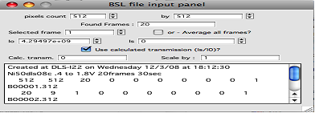
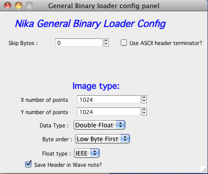
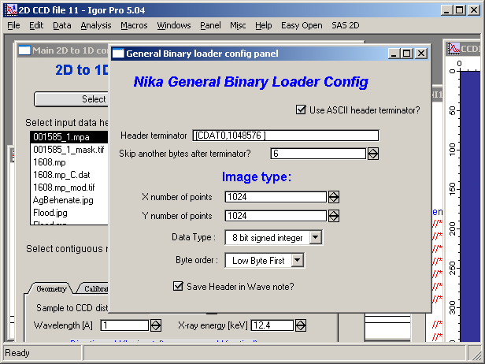

.. _nika-import-data-types:

.. index:: Nika; Input 2D data types

Supported data types
=====================

Igor native loaders
--------------------

These file types are loaded natively by Nika and are available on all platforms:

.. index:: input image; tiff

*tif* — TIFF file; assumed to be a single-layer scientific TIFF (not color).

.. index:: input image; binary

*GeneralBinary* — Flexible binary data loader. :ref:`See description. <import.data.Binary>`

.. index:: input image; Pilatus

*Pilatus* — Loads non-compressed Pilatus data. Opens an additional panel with
options. As of version 1.66, also handles compressed (BYTE_OFFSET) CBF files.
:ref:`See description. <import.data.Pilatus>`

.. index::
    input image; Nexus
    input image; NxSAS

*Nexus* — HDF5-based format used at APS, Diamond, and other facilities.
Used at 9ID SAXS/WAXS, 15ID SAXS, and others. Stores extensive metadata
accessible via wave notes. See the NeXus chapter in this manual.

.. index:: input image; HDF5

*HDF5* — Under development. The HDF5 format is highly flexible, which makes
writing a generic loader difficult. If you have HDF5 data from a specific
instrument that Nika does not yet support, please send an example file for
testing.

.. index::
      input image; Bruker CCD
      input image; SMART

*BrukerCCD* — Bruker SMART CCD software format.

.. index:: input image; mpa

*mpa* — MPA-NT (MPANT) version 1.48 format from FAST ComTec. Used with the
MPA-3 dual-parameter multichannel analyzer and Molecular Metrology
(Rigaku/Osmic) multiwire 2D gas-filled X-ray detectors.

.. index:: input image; DND

*DND/txt* — Loader for DND CAT (APS) data. Raw data are TIFF files, but Nika
reads an associated text processing record to extract reduction parameters and
reprocesses the 2D data. See the DND CAT section in the Instrument Support
chapter.

.. index:: input image; mp/bin

*mp/bin* — MP binary format. Contains a header followed by binary data.

.. index:: input image; mp/ascii

*mp/asc* — MP ASCII format. A single column of data; assumes square images
(N × N pixels).

.. index:: input image; BSRC

*BSRC/Gold* — BESSRC 1536×1536 Gold detector binary format. Contains a header
and 16-bit binary data.

.. index::
    input image; Rigaku
    input image; Raxis

*RIGK/Raxis* — Rigaku file format "86". Handles arbitrary image sizes; tested
on 1k×1k and 1.5k×1.5k images. Based on the Rigaku C-code reference
implementation and verified against Fit2D output. Note: the newer Raxis format
"100" is not yet supported.

.. index:: input image; ADSC

*ADSC* — Binary file with header. Header begins with ``HEADER_BYTES``.

.. index:: input image; WinView

*WinView* — SPE Princeton WinView file format.

.. index:: input image; ASCII

*ASCII* — ASCII matrix format. If the file extension is ``.mtx``, the code
looks for an accompanying ``.prm`` file and reads parameters from it into the
appropriate Nika variables.

*ASCII* (512×512) — Single-column ASCII data for 512×512 pixel images.

.. index:: input image; Igor binary wave

*Ibw* — Igor binary wave format. Useful when data are produced by Igor Pro.

.. index:: input image; BSL

*BSL/SAXS* and *BSL/WAXS* — BSL/OTOKO file format. See
http://srs.dl.ac.uk/ncd/computing/manual.bsl.html for format details. Requires
at least three files: ``Xnn000.mdd`` (header), ``Xnn001.mdd`` (SAXS images)
with ``Xnn002.mdd`` (calibration), and optionally ``Xnn003.mdd`` (WAXS images)
with ``Xnn004.mdd`` (calibration). The set appears as a single entry in the
file list. Without the header file, the loader fails with an error.

.. index:: input image; Fuji image plate

*Fuji/imp* — Fuji image plate reader (BAS2000 and BAS2500). Supports 8-bit and
16-bit data. Only 8-bit data have been fully tested. If you have 16-bit data
from a non-default configuration, send a sample file for testing.

.. index:: input image; edf

*ESRF/edf* — ESRF ID2 "edf" file format. Should read other edf formats as well,
but this has not been verified. Reads only files containing a single image per
file — the format allows multiple frames per file, but multi-frame support is not
implemented.

.. index:: input image; FITS

*FITS* — Flexible Image Transport System format (Hanisch et al., Astronomy &
Astrophysics, 376, 359–380, 2001). May fail with files that do not follow the
specific FITS variant tested. Usage in the SAXS community is unclear.

.. index:: input image; mpa/Univ of Cincinnati

*Mpa/UC* — University of Cincinnati MPA file format.

.. index:: input image; SSRL

*SSRLmat* — SAXS format used at the SSRL Materials Science SAXS beamline. For
full support, use the dedicated SSRL Mat SAXS entry under Instrument Support.

.. index:: input image; TPA

*TPA/XML* — Format used by the Quokka SANS instrument at ANSTO (Australia).
Additional support is available under Instrument Support.

.. index:: input image; GE binary

*GE binary* — Used by GE area detectors.

BSL/SAXS and BSL/WAXS detail
------------------------------

The BSL container format can hold up to 5 associated files and contains
additional information accessible through a dedicated panel:

The top section shows the pixel dimensions of images in the container. In this
example the container holds 512×512 images; 20 frames were found. You can
process the average of all frames (check "*Average*") or individual frames.

I₀ and Is are extracted from the associated calibration file. I₀ is the
upstream ion chamber reading (incident flux / monitor); Is is the downstream
reading. When both are present, the transmission Is/I₀ is calculated and
displayed in "*Calc. transm.*". If Is is not recorded, the calculated
transmission will be zero.

If the two ion chambers have different sensitivities, or if Is comes from a
different detector type, apply a *ScalingFactor* to correct the Is/I₀ ratio.

I₀ is always transferred to Nika's I₀ calibration value (used when "*Use
Monitor?*" is selected). The "*Use calculated transmission?*" checkbox transfers
the value of (ScalingFactor × Is / I₀) to Nika's sample transmission field
(used when "*Use sample Transmission*" is selected).

.. _import.data.Binary:

General Binary data loader
---------------------------

This is an interface to Igor Pro's ``GBLoadWave`` function, customized for use
with Nika. Most parameters correspond directly to ``GBLoadWave`` arguments —
consult the Igor Pro manual for full details.

Selecting "*GeneralBinary*" as the image type opens the configuration panel.
The configuration is shared across all Nika windows. The panel can be dismissed
and reopened by reselecting the GeneralBinary type.

**Top section:** Enter the number of bytes to skip (fixed-length header), or
check "*Use ASCII header terminator*" if the header ends with a known ASCII
delimiter. Enter the delimiter string in the provided field. Only the first 40 KB
of the file are searched for the terminator; for longer headers, use the byte-
skip option instead. Additional bytes after the terminator can be skipped using
the follow-on field.

**Image type section:** Set image dimensions (rows × columns), data type,
byte order (for integer types), and floating-point format (IEEE or VAX). Refer
to the Igor Pro manual for descriptions of these options. "*Save Header in Wave
Note*" appends the skipped ASCII header to the wave note, which is propagated
through Nika into the final output — useful for preserving instrument metadata.

Other loaders with panels
--------------------------

Some loaders require additional user input:

**Panel-based** (e.g., BSL/SAXS, BSL/WAXS) — Opens a control panel for
selecting individual frames or computing averages when a file contains multiple
images, and for accessing additional metadata.

**Function-based** (e.g., Fuji BAS2000/BAS2500) — For readers where data
endianness may vary with hardware configuration, a note is printed in the history
area with instructions for changing the endianness setting. This setting persists
within the Igor experiment.

.. _import.data.Pilatus:

Pilatus
--------

.. Figure:: media/ImportDataTypes4.png
   :align: center
   :width: 380px

Supported formats: TIFF, EDF, IMG, CBF, and floating-point TIFF (used for
background-subtracted images). Tested primarily with 100K images; 300K, 300K-W,
1M, 2M, and 6M formats are supported but less thoroughly tested. Also reads
auxiliary TXT files from ALS.

"*Set default device values*" — Sets the pixel size to 0.172 mm (the pixel size
for all current Pilatus detectors).

.. note::

   A hook function named ``PilatusHookFunction("FileNameToLoad")`` can be
   defined to run after each image is loaded. This function can read the wave
   note (which contains the Pilatus file header) and extract instrument
   parameters, or read an auxiliary text file. The function receives the
   currently loaded filename as a string argument.

.. _import.data.Calibrated2DData:

Calibrated 2D data files
--------------------------

*EQSANS* (ORNL) — Text file with four columns (Qx, Qy, Intensity, Uncertainty),
400×400 point map, generated by the EQ-SANS instrument at ORNL. This feature
may be broken in version 2.75. Do not use until further notice — send sample
files if you need this support restored.
