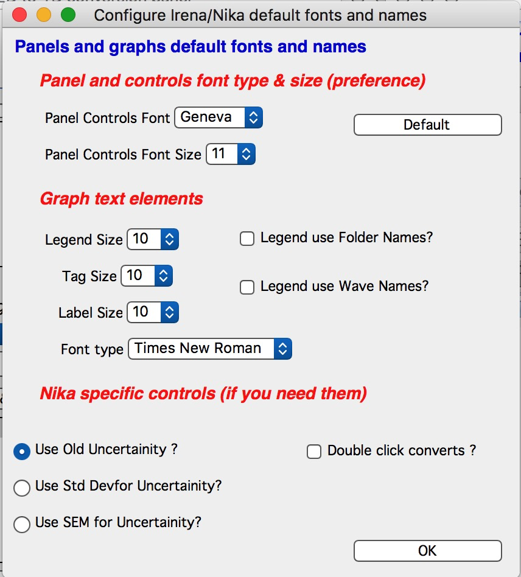

Important Information
=====================

.. index:: Units Nika

The code uses for all size related parameters Angstroems (10\ :sup:`-10` m) or for Q vector (A\ :sup:`-1`). In the case of scattering contrast, number distribution and any other volume contents centimeters (10\ :sup:`-2` m).

.. index:: Load packages Nika

Loading the macros
------------------

:ref:`Install macros <installation>`

Start Igor Pro

In menu “Macros” select “Load Nika 2D SAS macros”.

New menu “SAS 2D” appears. This is where all the Nika macros are
controlled from.

.. index:: Unload packages Nika

Unload the macros
-----------------

There are two items on may wish to do to unload the macros from any experiment. First to remove the large lookup tables associated with the methods Nika is using to convert 2D to 1D data. This is done by selecting “HouseKeeping” from “SAS 2D” menu. This will make the Igor experiment much smaller (often by 60 Mb or even more).

Then removing the macros itself is achieved by selecting “Remove Nika 1 macros” in the “SAS 2D” menu. This will unload macros and put back in the “Macros” menu command to load Nika macros, if necessary.

.. index:: Configure defaults Nika

Configure default fonts and names & Errors
------------------------------------------

“\ **GUI uncertainty config**\ ” in the SAS menu will create panel with some controls common for all tools, like font type & size and how legend names are handled. NOTE: Panel controls are applied immediately to all existing panels, graph controls are applied ONLY to the newly created graphs (and only those which were upgraded to this behavior).

**Panels font and font sizes**

These controls enable user to customize font used on control panels therefore this enables customization for a given platform. This is necessary as more and more control is provided on each platform to user and therefore default fonts and font sizes may not be appropriate any more for the panels I design. These settings are actually saved on a given machine as well as the experiment. This has some interesting features, so please, read carefully:

When these controls are run (and user is forced to run them if the Irena is loaded and preferences are not found), they save preferences in special folder Igor maintains for users. At the same time, the settings are applied to the current experiment.

When this experiment is opened on another computer, the preferences from that computer are not reloaded, so the experiment will use preferences from the original computer. When the “Configure GUI and Graph defaults” is run, it will reload the computer defaults and apply them to the given experiment. Then user can change the fonts and font sizes as they wish. The new settings are saved on the computer – and within the experiment.

*Note*, that Panel font and font size are platform specific, so same experiment may present differently looking panels on Mac and PC.

*Note*, not all controls actually follow these settings, I have been changing some buttons to specific font and font size and those are not affected by these settings.

If there are any issues with the behavior, please, let me know and I’ll see if I can make it more logical.

Since version 1.70 these controls are shared with *Irena* package, so they do not fight with each other (which was possible previously). The whole philosophy of this GUI control system is bit convoluted, so if you see some issues, let me know when and how the logic fails.

Note the choice of GUI and Graph defaults panels when different fonts are used can mess things us really well… You can mess up the panels really well by wrong choices!

Defaults button returns the panel font choices to platform specific default state (Mac: Geneva size 9 and PC Tahoma size 12). Note, that there is no guarantee that these were your choices before. But these should be reasonable choices for most setups.

.. index:: Uncertainty Nika

Error (uncertainty) estimates for points
----------------------------------------

Up to version 1.42 Nika used “error” calculation, which seemed to produce reasonable numbers in most cases. But one of the users realized, that it has error in it (bug) and fails in cases of really low intensities, which can be assumed to be Poisson distribution. Therefore, from version 1.43 Nika has three options for this calculation.

1. Old method (default for compatibility reasons). As I said, it has a bug, but seem to work most of the time well enough.

2. Standard deviation

3. Standard error of mean

Please note, that Standard error of mean (SEM) is miserably small for high-intensity instruments and generally is too small. At least in my experience. However, it seems to work fine for Pilatus detectors. Standard deviation was what I was trying to get with the old method – there should not be much difference between them most of the time.

.. index:: Multiple configurations Nika

Configuration manager
---------------------

From version 1.70 Nika contains “\ **Configuration manager**\ ” . This tool enables one to configure multiple “versions” on Nika inside one igor experiment and switch among them. The main purpose is to handle cases when user needs to reduce data from multiple distances of the same instrument, multiple detectors on the same instrument, optionally from multiple instruments. We have such case on APS 9ID USAXS/SAXS/WAXS instrument where we need to reduce data from SAXS and WAXS.

How is this done?

To achieve this purpose the Configuration manager will copy whole Nika working folder – create snapshot - (root:Packages:Convert2Dto1D) into specific location (root:Packages:NikaGeometries) with user selected (cleaned up!) name. This contains everything in that folder and it is all Nika needs to operate. This therefore includes mask, lookup tables, Empty image, Dark image - everything… Of course, it is a snapshot of the status at that given time. User can then reconfigure Nika to have another distance, detector – whatever – and save this as second configuration. Then user can switch between the geometries as needed.

NOTE:

***Only one configuration can be run at given time.***

***All windows will be closed when switching. ***

***The Igor files are likely to get very large (this is space expensive process).***

*The save is done at a specific moment in time, so later changes in configuration are not reflected and user needs to save the configuration again.*

Here is the GUI:

“\ **Create New Configuration**\ ” button will create new default Nika “Configuration” – it will DELETE the current one and restart Nika. Use this button carefully. But it will guarantee that user starts with “clean slate”.

“\ **Save Current Configuration**\ ” button will save the currently configured Nika folder into the location explained above and make it available as “Stored configuration” User can give it their own name – it will be cleaned up and if necessary (with dialog) also unique.

Note, if the Configuration already exists, you will get dialog:

Choosing YES (= overwrite) will delete the existing Configuration of this name and save the existing one under that name. Choosing No will create unique name by adding order number at the end (from WAXS will create WAXS0, WAXS1, etc…). bCancel will cancel of course.

“\ **Clean up folder before saving**?” checkbox – This will run the “housekeeping” function before storing the Current configuration. This will remove the temporary lookup tables and other stuff, which can be easily recalculated when needed (at cost of CPU). This may make the Igor files much smaller - but when restored the first image processing will take longer.

“\ **Last Saved/Loaded Config name**\ ” this shows what was the last name under which this Configuration was saved or loaded. This is bit dangerous name – it can become stale really quickly as it has no idea what user has done and what therefore may have changed on the configuration. Imagine you have two detector distances. You create Nika configuration for one of them (Short distance) and save it. That will show now “Short distance” as the name of current configuration… But then you proceed to change the distance (and other parameters). This string will not change – it has no idea you changed the parameters. So keep this in mind. It is simply how you called the last configuration when it was saved or loaded.

“\ **Load Stored Configuration**\ ” – popup which lists saved Configurations. If you select configuration from this popup, dialog will come up which will enable you to : 1. Cancel if you do not want to do anything, 2. Save current configuration and load the one you selected, 3. Not save the current configuration and load the selected one. In any case, you can cancel before anything is done.

When loading saved configuration all Nika windows should be closed and after restoring the configuration, the main Nika panel reopens.

“\ **Delete Saved Configuration**\ ” This will open dialog where you can select saved configuration and delete it. This way user can remove stored configurations when they are no more needed to save space (or confusion) in Igor experiment (file).

There is no way at this time to rename saved configurations, except manually renaming the folder in the location (root:Packages:NikaGeometries). The Configuration manager needs to be restarted after this to figure out the new names.

.. index:: Update check Nika

Check for updates
-----------------

.. image:: media/ImportantUpdateCheck.jpg
   :align: center
   :height: 250px

Nika will perform once-per month check for updates every 30 days. It checks installed versions of the packages and web available versions. It also reminds you about need to cite manuscripts related to the Nika. Please, cite those manuscripts as necessary.

You can get this panel opened any time from SAS 2D> Check for updates

The buttons open appropriate web pages in your web browser.

.. index:: Extend Nika functionality

Modifying Nika functionality
----------------------------

Basic method of modifying Nika functionality is to use “hook” functions – functions, which are called when they exist. In order to use them one needs to be proficient Igor programmer, so the description here is limited. You will need to read the code anyway.

Note: if you need more “hook” functions, ask and I’ll add them. Better then forking your code and then not being able to update your code in the future.

List of hook functions:

+-------------------------------------------------+------------------------------------------------------+------------------------------------------------------------------------------------------+
| Name of hook function                           | Called where                                         | Why?                                                                                     |
+=================================================+======================================================+==========================================================================================+
| Nika\_Hook\_ModifyMainPanel()                   | NI1A\_Convert2Dto1DPanelFnct()                       | After the main panel is created, so user can change the panel as needed.                 |
+-------------------------------------------------+------------------------------------------------------+------------------------------------------------------------------------------------------+
| Nika\_Hook\_AfterDisplayLineout(int,Qvec,Err)   | NI1A\_DisplayLineoutAfterProc                        | After lineout is displayed so user can change it as needed                               |
+-------------------------------------------------+------------------------------------------------------+------------------------------------------------------------------------------------------+
| ModifyImportedImageHook(ImageName)              | NI1BC\_BmCntrCreateImage                             | Modifies image after import. E.g., enables user to trim image to ROI only etc.           |
|                                                 | NI1A\_ImportThisOneFile                              |                                                                                          |
|                                                 | NI1A\_LoadEmptyOrDark                                |                                                                                          |
|                                                 | NI1M\_MaskCreateImage                                |                                                                                          |
|                                                 | NI1\_FloodCreateAppendImage                          |                                                                                          |
+-------------------------------------------------+------------------------------------------------------+------------------------------------------------------------------------------------------+
| PilatusHookFunction(ImageName)                  | NI1A\_UniversalLoader                                | After Piltus image is loaded so one can modify it as needed.                             |
+-------------------------------------------------+------------------------------------------------------+------------------------------------------------------------------------------------------+
| ImportedImageHookFunction(ImageName)            | NI1A\_UniversalLoader                                | After loading any image just at the end. Can be used to modify loaded image as needed.   |
+-------------------------------------------------+------------------------------------------------------+------------------------------------------------------------------------------------------+
| AfterDisplayImageHook()                         | Various places after Nika displays detector image.   | Can be used to modify displayed image. Note – works on top image.                        |
+-------------------------------------------------+------------------------------------------------------+------------------------------------------------------------------------------------------+
| Movie\_UserHookFunction()                       | NI1A\_MovieCallUserHookFunction                      | In movie tool – create or modify image used for movie. See GUI.                          |
+-------------------------------------------------+------------------------------------------------------+------------------------------------------------------------------------------------------+
| *Need more?*                                    | Let me know here…                                    |                                                                                          |
+-------------------------------------------------+------------------------------------------------------+------------------------------------------------------------------------------------------+

*Example:*

Following function is called after any image is loaded (if it exists)
and simply prints in history area image statistics.

.. code::

    Function ImportedImageHookFunction(NewWaveName)
       wave NewWaveName
       wavestats NewWaveName
     end

Following function, if present, will zoom in top 50 pixels on the
detector image

.. code::

    Function AfterDisplayImageHook()
        SetAxis/R left 50,0
     end
