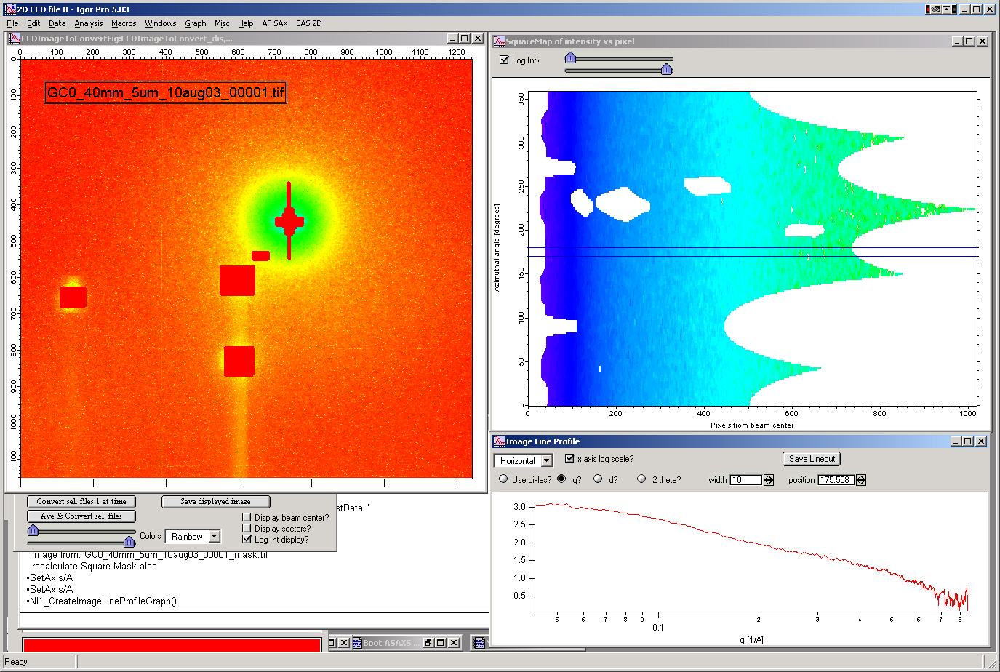
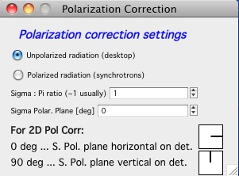

.. _nika-main:

.. index::
    Nika; Main panel

Main Panel
==========

.. Figure:: media/Main1.jpg
   :align: left
   :width: 340px
   :figwidth: 360px

Select "*Main panel*" from the SAS 2D menu. The panel has three major areas:

**Top** — 2D data selection. Select the image to process.

**Middle** (*tabbed area*) — processing controls. Each tab is described below.

**Bottom** — main action buttons and 2D image display controls.

.. index::
    Nika; Selecting data

Selecting data
--------------

Nika supports many image types (file formats). Select the appropriate type from
the "*image type*" popup menu in the top-right corner. If your format is not
listed, contact the developer — most formats are binary files with a header,
and the General Binary reader often works when a format description is
available.

Click "*Select data path*" and navigate to the folder containing the 2D images.
Once a valid path is selected, all files of the appropriate type are listed in
the ListBox below.

Select one file, or multiple files using Shift-click (contiguous) or
Ctrl-click (non-contiguous), using the pull-down menus below the list box.

From Nika version 1.66, ListBoxes support right-click actions for refreshing
and other functions.

Use the "*Match*" field to filter file names using regular expressions.

.. note::

   Files ending with ``_mask`` are mask files created by Nika (previously TIFF,
   now HDF5). See the Mask chapter for details.

.. Figure:: media/Main3.png
   :align: left
   :width: 380px

.. note::

   The "*Calibrated 2D data?*" checkbox tells Nika to expect fully normalized
   and corrected 2D data (Q vector + intensity + uncertainty) rather than raw
   detector images. Supported formats include EQSANS (ORNL) and canSAS/NeXus.
   This capability is under active development.

Invert 0,0 corner
------------------

By default, Igor displays image position (0,0) at the top-left corner. When
this checkbox is selected, (0,0) appears at the bottom-left. This is a cosmetic
change only — data processing and sector orientations are unaffected.

Sort order
----------

Controls how files are listed in the ListBox:

- *None* — order as returned by the OS.
- *Sort* — alphabetical (may sort numbers incorrectly for multi-digit indices).
- *Sort2* — alphabetical with correct numeric ordering.
- *\_001.* — sorts by the trailing number before the file extension, assuming
  the pattern ``Name_NNN.ext``.
- *Invert \_001*, *Invert Sort*, *Invert Sort2* — reversed versions of the above.

Match
-----

Uses regular expressions (grep syntax) to filter the file list. Examples:

- ``test`` — matches filenames containing "test" anywhere.
- ``^test`` — matches filenames starting with "test".
- ``tif$`` — matches filenames ending with "tif".

See https://www.cheatography.com/davechild/cheat-sheets/regular-expressions/
for a quick reference.

Side buttons
------------

The Refresh button was removed in version 1.66. Refresh functionality was
moved to the right-click menu on most ListBoxes.

Save/Load Config
~~~~~~~~~~~~~~~~

.. Figure:: media/Main9.png
   :align: center
   :width: 580px

"*Save & recall config*" saves or loads the current settings in the tabbed area
as a named configuration file. Configuration files can be saved anywhere on disk
— ideally alongside the data.

Controls in the dialog:

- "*Select data path*" — choose the folder containing configuration files.
- Left panel — lists configuration files in the selected folder.
- Right panel — shows the content (comment on line 1) of the selected file.
- "*New Conf file name*" — enter a name for the new configuration file.
- "*New Conf file comment*" — enter a description of the configuration.
- "*Save configuration*" — saves current tabbed-area settings.
- "*Load configuration*" — loads settings from the selected file, overwriting
  the current configuration with no undo.

.. note::

   Dark field, empty beam, mask, and pixel sensitivity file names are not saved
   or reloaded with configuration files.

Export image
~~~~~~~~~~~~

Exports the main 2D graph as a TIFF image from Igor.

Store image
~~~~~~~~~~~

Stores the current 2D image in the Igor experiment for reference. Stored images
can be large — avoid storing many of them, as the experiment file can become
unmanageably large. There is no way to reload stored images back into Nika.
Use standard Igor tools to work with them.

.. index::
    Nika; Create movie

Create Movie
~~~~~~~~~~~~

Opens a panel for creating movies from 2D images or 1D lineouts.

Frames are added each time a Convert button is clicked. When using the
"*Ave & Display sel. files*" button, add frames manually using "*Append
current Frame*" — automatic frame appending is not available with that button.
To use automatic appending while displaying RAW data, use a Convert button with
all processing options unchecked in the Main, Sectors, Prev, and LineProf tabs.

.. Figure:: media/Main10.png
   :align: left
   :width: 320px
   :figwidth: 350px

Steps for creating a movie:

1. **Load and process one dataset** to establish display options and verify
   settings.

2. **Select what to add to the movie** using the checkboxes. Click
   "*Create Img/Graph*" to create or restore the relevant image or graph.
   Options:

   a. *2D RAW data image* — a separate copy of the raw data. The display
      (zoom, color range, etc.) is under user control and remains stable as
      new frames are added.

   b. *2D Corrected data image* — a separate copy of the fully corrected 2D
      image. Behaves like the RAW option but shows calibrated data.

   c. *1D data* — a graph of the lineouts produced by the code. If multiple
      sectors are configured, all resulting lineouts may be included in the
      movie. Use a hook function to select specific sectors.

   d. *Use main 2D image* — uses the main 2D image directly. This image is
      recreated from scratch for each frame, so user zoom and other settings
      cannot be preserved. Use the main panel controls (RAW/Processed, sectors,
      beam center, colors, Q axes) to configure its appearance.

   e. *Use user Hook function* — advanced option. Define
      ``Movie_UserHookFunction()`` in your Igor experiment. This function must
      generate the desired graph/image and leave it as the top window. Example:

      .. code::

          Function Movie_UserHookFunction()
              DoWindow CCDimageToConvertFig
              if(V_Flag)
                 DoWIndow/F CCDimageToConvertFig
                 AutoPositionWindow /M=1 /R=NI1A_CreateMoviesPanel CCDimageToConvertFig
              else
                 Abort "Main 2D windows does not exist"
              endif
          end

3. **Modify the image/graph** appearance. For the first two options, select
   log intensity display here if needed. A filename legend can be appended and
   its appearance edited manually.

4. **Click** "*Open movie file*" to create and open the movie file. Set an
   appropriate frame rate (1 = 1 frame/second). Only one movie file can be open
   at a time.

   .. Figure:: media/Main11.png
      :align: center
      :width: 480px

5. **Append frames** using one of:

   a. "*Append current Frame*" — manually appends the current image/graph.
   b. "*Append Frames Automatically*" checkbox — appends a frame automatically
      after each image is loaded and processed.

6. **Click** "*Close Movie file*" before playing the movie.

.. warning::

   Close movie files before closing the Igor experiment. If Igor closes with a
   movie file open, Nika will not be aware of this on the next session and
   attempting to add frames may fail.

The movie creation dialog:

   .. Figure:: media/Main12.png
      :align: center
      :width: 380px

On Windows, both MOV (QuickTime) and AVI files can be created. AVI files may
not play on Mac. QuickTime MOV files offer better cross-platform compatibility
but may require QuickTime to be installed.

Each time Nika adds a frame, it prints in the history area:
``Added frame with data : xxxxxxxxxxxx.tif to movie``.

.. index::
    Nika; Live processing

Live processing
~~~~~~~~~~~~~~~

Live processing automates display or reduction of data as it arrives from an
instrument. Clicking the button opens a new panel:

.. Figure:: media/Main13.png
   :align: center
   :width: 380px

A background process wakes up at the configured "*Update time*" interval. If
Igor is idle at that moment, the process runs a refresh and, if a new file is
found (after applying all Match and data-type filters), automatically processes
it using the current Nika settings.

User interactions may delay or prevent processing. Pause the background process
before working interactively with files.

Checkboxes "*Display new image*" and "*Convert new images*" control which button
is triggered: the first activates "*Ave & Display sel. file(s)*"; the second
activates "*Convert sel. files 1 at time*".

Intensity calibration
~~~~~~~~~~~~~~~~~~~~~

Most small-angle scattering data are normalized but not calibrated on an
absolute scale. Absolute calibration enables quantitative analysis of scatterer
volumes, specific surface areas, and other physical quantities in packages such
as Irena. Using a calibration standard such as Glassy Carbon (Zhang, F., et al.,
*Metallurgical and Materials Transactions A*, 2010, 41(5): 1151–1158) places
data on an absolute scale in either cm\ :sup:`-1` sr\ :sup:`-1` (volumetric)
or cm\ :sup:`2`/g (weight-based).

.. Figure:: media/Main14.png
   :align: center
   :width: 180px

The popup selects which units are written to the wave note. Downstream packages
(e.g., Irena) may use this field — select the correct units.

.. index::
    Nika; image Statistics

Calc. Stats.
~~~~~~~~~~~~

When checked, Nika calculates image statistics. Raw image statistics are always
computed; if the image is processed, corrected/calibrated statistics are
calculated as well. A notebook with the statistics is displayed beside the image:

.. Figure:: media/ImageStatistics1.png
   :align: center
   :width: 100%

.. index::
    Nika; Sample name

Sample Name
~~~~~~~~~~~

Added in version 1.75. Used with data formats that can store a sample name
different from the file name — currently, only NeXus NXsas files use this when
a sample name is configured in the cross-reference table. All other formats set
this field to the file name (without extension).

.. note::

   Due to space constraints on the main panel, the controls for this setting
   are on the SAVE tab alongside other export options.

.. index::
   Folder name length (Nika)
   Sample name length (Nika)
   Name trimming (Nika)

Name trimming
~~~~~~~~~~~~~

*These controls are at the bottom of the Sect. and LineProf tabs.*

Igor Pro has a 32-character limit for wave names, but most operating systems
allow much longer filenames. Nika reserves some characters for its own suffixes
(e.g., ``_C`` for circular average, ``_270_30`` for a sector average), leaving
28 or fewer characters for the user portion of the name.

Nika calculates the maximum allowed name length based on the active processing
type and trims longer names automatically.

.. Figure:: media/Main15.png
   :align: center
   :width: 380px

Controls allow selecting which part of a long name to keep if trimming is
needed (remove a fixed substring, then trim from the start or end). Example:

Name: ``My_Name_is_SIMPLYTOO_long_for_comfort_even_with_removal.tif`` (55 chars)

- Trim end: ``My_Name_is_SIMPLYTOO``
- Trim start: ``comfort_even_with_removal``
- Remove "SIMPLYTOO_long_for" then trim end: ``My_Name_is__long_for``

.. index::
    Nika; Batch processing

Batch processing (no images)
-----------------------------

*Batch processing can significantly speed up large data reductions.*

Testing showed that up to 75% of processing time can be spent on image display,
graph updates, and history area output. The "*Batch Proc. (no images)*" checkbox
suppresses all image and graph updates during processing. While batch mode is
active, only the red *Sample Name* field on the main panel updates. When the
selected batch completes, a "*Nika is batch Processing data*" panel disappears
automatically.

.. Figure:: media/Main_BatchProcessing1.jpg
   :align: center
   :width: 480px

The history area records progress at the start and end of the batch:

.. Figure:: media/Main_BatchProcessing2.jpg
   :align: center
   :width: 580px

.. note::

   Process one or two images first to verify all settings before running a
   large batch. If batch processing encounters an error and stops, close the
   "*Nika is batch Processing data*" panel manually, fix the problem, and
   restart from where processing stopped.

Controls in tabs
----------------

.. note::

   When images are averaged, averaging occurs during loading. All tab
   parameters below apply to the single (possibly pre-averaged) image.

.. Figure:: media/Main17.png
   :align: center
   :width: 400px

.. index::
    Nika Main parameters

Main
~~~~

Camera geometry parameters: sample-to-detector distance (mm), wavelength/X-ray
energy (linked fields), CCD pixel size in X and Y (mm), and beam center
position.

Below these are checkboxes selecting the calibration method. The formula used
for calibration is shown below the checkboxes for clarity.

.. Figure:: media/Main18.png
   :align: center
   :width: 400px

.. note::

   "*Use of Dark field*" and "*Subtract constant from Data*" cannot both be
   selected simultaneously — they apply the same type of correction.

   Only controls relevant to the selected calibration method are shown, so
   seeing all controls simultaneously is not expected under normal use.

**Solid Angle Correction:** When selected, intensity data are divided by the
solid angle of the central pixel (a constant for all pixels). This accounts for
the variation in solid angle with scattering angle when combining data from
different sample-to-detector distances. When using a secondary calibration
standard (Glassy Carbon, water), this correction is already absorbed into the
calibration constant and does not need to be applied separately.

.. index::
    Nika Processing parameters

Par
~~~

.. Figure:: media/Main19.jpg
   :align: center
   :width: 400px

"*Geometry correction*" — Corrects for the variation in solid angle of pixels
on a planar detector as a function of scattering angle. Each pixel intensity
is divided by (cos 2θ)\ :sup:`3`. One factor corrects for change in pixel
solid angle in the radial direction, one for change in detector-sample distance
in the radial direction, and one for the same in the tangential direction.
Negligible for SAXS data; may be relevant at very high angles.

"*Polarization Correction*" — Correction for unpolarized or linearly polarized
radiation. Opens an additional panel:

.. Figure:: media/Main20.png
   :align: center
   :width: 380px

For unpolarized radiation (e.g., desktop X-ray tube sources):

    Intensity\ :sub:`corrected` = Intensity\ :sub:`measured` / (0.5 × (1 + cos(2θ)\ :sup:`2`))

For linearly polarized radiation (synchrotrons), see the Polarization correction
section below.

.. note::

   Both polarization corrections are negligible for small-angle scattering.

"*Dezingering*" — Sample, empty, and dark field images can be dezingered on
load. Each pixel is compared to its neighbors; if it exceeds them by more than
the dezinger ratio (e.g., 2× the average of surrounding pixels), it is replaced
by that average. Multiple dezinger passes can be applied for zingers larger than
one pixel.

Calibration/processing parameters
^^^^^^^^^^^^^^^^^^^^^^^^^^^^^^^^^^

**Sample thickness** (mm)

.. note::

   Nika versions prior to 1.75 had a bug where thickness was used in mm rather
   than being converted to cm before calibration. This was fixed in version
   1.75. Calibration constants obtained with earlier versions must be scaled by
   a factor of 10. When a new Nika version detects a panel created by an older
   version, it displays a warning. Under typical conditions (where the standard
   was also reduced in Nika), the bug cancelled out, which is why it went
   undetected for so long.

**Transmission** as a fraction.

For semi-transparent beamstops, enable the "*Transp. Beamstop*" checkbox and
enter the beamstop radius in pixels. Nika creates a circular mask around the
beam center and calculates sample/empty intensity ratios within that circle to
determine transmission. If the beam center is changed, uncheck and recheck
"*Transp. Beamstop*" to regenerate the mask.

**Correction factor** — Secondary calibration factor.

**Measurement times** (seconds). Correcting for different exposure times is
possible but not recommended.

**Monitor counts** — Scale data by monitor counts for incoming intensity
normalization.

**Fixed offset for CCD images** — A single value subtracted from each pixel.

Each parameter value can be entered as a number or provided by a lookup
function. Lookup functions are called with the image filename as argument and
must return a single real number.

.. Figure:: media/Main21.png
   :align: center
   :width: 400px

The above example uses the DND CAT instrument lookup functions. See the
:ref:`Extending Nika <ExtendingNika>` chapter for how to write custom lookup
functions.

.. index::
    Nika Mask

Mask
~~~~

.. Figure:: media/Main22.jpg
   :align: center
   :width: 380px

Enable or disable mask use with the first checkbox, then select the folder
containing mask files with the path button. Mask files created by Nika were
previously TIFF files named ``UserName_mask.tif``; since version 1.49, they
are HDF5 files.

Buttons:

1. *Create New mask* — opens the mask creation tool.
2. *Load mask* — loads the file selected in the list box.
3. *Add mask to image* — overlays the mask on the 2D image.
4. *Remove mask from image* — removes the mask overlay.

*Mask color* — selects the overlay color (red, green, blue, or black).

*Current mask name* — displays the name of the most recently loaded mask file.

.. index::
    Nika Empty/Blank, Nika dark

Emp/Dark
~~~~~~~~

.. Figure:: media/Main23.jpg
   :align: center
   :width: 380px

Controls for loading empty beam, dark field, and pixel sensitivity (flood field)
images.

"*Select path to mask, dark & pix sens. files*" — Select the folder containing
these files (must be the same type as the data files).

Buttons load the empty, dark, and pixel sensitivity images and apply dezingering
if selected. File names of currently loaded files are shown at the bottom.

.. index::
    Nika Fix background Oversubtraction

"*Fix Background Oversubtraction*" — When checked, Nika prevents negative
intensities in processed data by shifting the entire 1D output upward after all
corrections. Specifically, it finds the most negative intensity value (I₁ < 0)
and adds 1.5 × |I₁| to all points.

.. note::

   This correction shifts the absolute intensity scale. For samples with weak
   high-Q scattering and noisy backgrounds, it can work well. For well-
   calibrated data, the shift may be significant — use with care.

.. index::
    Nika Sector lineouts; Nika Circular lineout

Sectors
~~~~~~~

.. Figure:: media/Main24.jpg
   :align: center
   :width: 380px

Controls for circular and sector averages using reverse lookup tables (the
recommended method for routine data processing). Nika caches the lookup table
for a given geometry and processes subsequent images much faster.

**Controls:**

- **Q/d/2θ space** — Output x-axis type.
- **Min/Max** — Range of Q, d, or 2θ. Set to 0 for automatic (first/last bin
  with non-zero intensity).
- "*Log binning*" — Logarithmic binning in Q, d, or 2θ.
- "*Number of points*" — Number of output bins.
- **Do circular average** — Calculate and store a circular average.
- **Make sector averages** — Calculate sector averages. Controls below set
  orientation and angular width. Check the checkbox at the bottom of the panel
  to preview sector positions.
- **Create 1D graph** — Creates a graph and appends data to it.
- **Store data in Igor experiment** — Saves Q-R-S triplets in the experiment.
- *Overwrite existing data if exist* — Overwrite without prompting if
  same-name data exist.
- **Export data** — Export ASCII data automatically.
- **Select output path** — Choose the export folder.
- **Use input data name for output** — Name output data using the input
  filename plus sector descriptor (e.g., ``DataName_Angle_width``).
- **ASCII data name** — Manual output filename (used when the above is off).

.. index::
    Nika Polar transformation

PolTrans
~~~~~~~~

"PolTrans" (Polar Transformation) was called "Preview" in versions before 1.68,
reflecting its intended use as a quick visualization tool.

.. warning::

   This tool uses calibrated or raw data (depending on the checkbox setting)
   but is less precise than the Sectors tool and does NOT produce reliable
   errors. Use for quick inspection only, not for final data.

.. Figure:: media/Main25.png
   :align: center
   :width: 380px

This tool converts intensity from polar coordinates around the beam center into
a rectangular display with azimuthal angle on the vertical axis and pixel
distance on the horizontal axis:

.. Figure:: media/Main26.png
   :align: center
   :width: 100%

The vertical axis shows angle from 0° (horizontally right of beam center); the
horizontal axis shows pixel distance from the beam center. This creates a set of
lineouts at all azimuthal angles. The code works well for narrow sectors (1–5°
width); precision degrades for wider sectors.

These data can be further analyzed with the "*image line profile*" tool. If that
tool does not update, close and reopen it.

The "SquareMap" graph (top right) shows intensity as a function of pixel and
azimuthal angle. The lineout plot (bottom right) shows intensity from that map
as a function of pixel/Q/d/2θ.

Controls:

- **Number of sectors**
- **Width of each sector** — sectors can overlap, touch, or leave gaps;
  default is touching.
- **Start angle** (0 = right, horizontally from beam center)
- **End angle** (typically 360° for full circle, or 180° for top half)
- **Mask data** — masking is applied only if selected here.
- **Use RAW data** / **Use Processed data** — select which image to use.
  Processed data are unavailable if the last image was loaded with
  "*Ave & display sel. files(s)*".

Line profile tool controls:

- Orientation (horizontal/vertical)
- X-axis scaling (linear/log)
- X-axis units (pixels/Q/d/2θ)
- Width and position
- Save lineout — saves QRS data to the SAS folder.

.. index::
    Nika Line profile

.. _LineProfileTool:

LineProf
~~~~~~~~

Calculates intensity profiles along curves on the detector. Uses a different
method from the Sectors tool, with important differences:

**Sectors** uses inverse lookup tables, caches them for speed, and can evaluate
multiple sectors simultaneously. However, it cannot be used interactively —
parameters must be set before running, and no preview is available. Lookup
tables increase experiment file size.

**LineProf** uses Igor's built-in line profile tool. Only one profile at a time
is supported; no caching occurs, so processing time is constant per image.
It can be used interactively on a converted image, either automatically
(via Convert buttons) or manually (loading an image, then adjusting parameters
and saving the profile from the Line Profile Preview window).

Controls:

.. Figure:: media/Main28.jpg
   :align: center
   :width: 380px

.. Figure:: media/Main29.png
   :align: center
   :width: 100%

"*Use?*" — enables the LineProf tool.

"*Use Raw?*" / "*Use Processed?*" — selects the source image. Processed data
are unavailable if the last image was loaded with "*Ave & Display..*". When a
Convert button is clicked with LineProf enabled, it automatically switches to
"*Use Processed*".

"*Distance from Center [in pixels]*" — positions the profile at the specified
pixel distance from the beam center. The corresponding Q value (Q\ :sub:`y` or
Q\ :sub:`z` depending on profile type) is shown beside this control. Positive
direction is to the right (horizontal) or up (vertical) from the beam center.

"*Width [in pixels]*" — integration width perpendicular to the profile
direction. The Q-space width is shown beside it. Intensity is averaged over
this width; for widths > 1 pixel, the error is the standard deviation of the
average; for 1 pixel, the error is the square root of intensity (which may be
inaccurate at low intensities).

The tool outputs intensity, uncertainty, and Q, Q\ :sub:`y`, Q\ :sub:`z`
values. GI profiles additionally output Q\ :sub:`x`.

.. note::

   The GISAXS community uses a different convention for Q\ :sub:`x`, Q\ :sub:`y`,
   Q\ :sub:`z` than Nika's internal convention. In Nika, the horizontal (x)
   direction maps to Q\ :sub:`y` and the vertical (y) direction maps to Q\ :sub:`z`.
   Keep this in mind when comparing with GISAXS literature.

Available profile types:

***Vertical/Horizontal line:***

.. Figure:: media/Main30.png
   :align: center
   :width: 380px

.. Figure:: media/Main31.png
   :align: center
   :width: 380px

The "*include mirror*" control (above the popup) includes the mirror line across
the beam center. For transmission geometry.

**Angle line:**

.. Figure:: media/Main32.png
   :align: center
   :width: 380px

.. Figure:: media/Main33.png
   :align: center
   :width: 380px

For transmission geometry.

.. index::
    Nika Grazing incidence geometry

***GI\_Vertical line and GI\_Horizontal line:***

For grazing-incidence geometry. Require input of the grazing-incidence angle:

.. Figure:: media/Main34.png
   :align: center
   :width: 380px

Both can include the mirror line across the beam center. The Q values are
corrected for grazing-incidence geometry following Renaud, Lazzari, and Leroy,
*Surface Science Reports* 64 (2009) 255–380, formula (1).

Two common GISAXS geometries are supported from version 1.68:

.. Figure:: media/Main35.png
   :align: center
   :width: 380px

.. Figure:: media/Main36.png
   :align: center
   :width: 380px

- **GEO\_SOL** (sample tilted, beam and detector fixed — Fig. 2 in Lazzari
  et al.): set the y-position of the reflected beam to 0.
- **GEO\_LSS** (beam tilted, detector perpendicular to sample surface — Fig. 1):
  enter the y-pixel coordinate of the reflected beam.

.. Figure:: media/Main37.jpeg
   :align: center
   :width: 380px

Nika uses GEO\_SOL if the reflected-beam y-value is < 1, and GEO\_LSS if ≥ 1.

When GI geometry is selected, a geometry selection panel appears:

.. Figure:: media/Main38.png
   :align: center
   :width: 380px

Note: +45° and −45° tilts are not equivalent (90° apart). If the tilt is known
from an external measurement, try both signs.

**Ellipse profile:**

.. Figure:: media/Main39.png
   :align: center
   :width: 380px

The aspect ratio control sets the ellipse shape. "*Distance from center*" is the
horizontal distance (Q\ :sub:`y`). When AR = 1, the ellipse is a circle.

.. Figure:: media/Main40.png
   :align: center
   :width: 380px

AR > 1:

.. Figure:: media/Main41.png
   :align: center
   :width: 380px

AR < 1:

.. Figure:: media/Main42.png
   :align: center
   :width: 380px

.. note::

   The ellipse profile tool does not currently produce a natural output
   x-axis — neither Q, Q\ :sub:`z`, nor Q\ :sub:`y` provides a clean
   parameterization for an ellipse. Contact the developer if you use this
   tool and have specific requirements.

Data saving controls for LineProf (same as in the Sectors tab):

- **Create 1D graph** — append to a 1D graph.
- **Store data in Igor experiment** — save QRS data.
- *Overwrite existing data if exist* — overwrite without prompting.
- **Export data** — export ASCII.
- **Select output path** — export folder.
- **Use input data name for output** — auto-name using input filename.
- **ASCII data name** — manual name.

.. Figure:: media/Main43.png
   :align: center
   :width: 380px

The "*Line Profile Preview*" window under the main image updates live as
parameters change, providing instant feedback. Display the data as Q, Q\ :sub:`y`,
or Q\ :sub:`z` on linear or logarithmic scales. Note that negative Q values
cannot be displayed on log scale.

Data can be saved from this preview window; save parameters are taken from the
tab controls. If "*Overwrite existing data*" is checked and names are not
changed, previously saved profiles may be overwritten.

Wave name example for a GI Vertical line profile at Q\ :sub:`y` = 0.0077
Å\ :sup:`-1`:

::

    gc_saxs_395__GI_VLp_0.0077

where ``gc_saxs_395_`` is part of the source image name, ``GI_VLp_`` is the
profile type indicator, and ``0.0077`` is the Q\ :sub:`y` value.

.. index::
    Nika SAVE tab
    Nika Export data
    Nika Export Nexus
    Nika Export ASCII
    Nika data name

Save tab
~~~~~~~~

.. Figure:: media/Main49.jpg
   :align: center
   :width: 380px

**Store data controls:** Choose whether to store data in Igor, whether to create
a 1D graph, and whether to overwrite existing data with the same name.

**Name data controls:** Select how output wave names are generated — from the
input image name (with optional trimming), from a user-supplied Igor function,
or manually.

**Export data controls:** Automatically export data as they are processed.
Options:

- *Export to ASCII* — 4-column text files (Q, Intensity, Uncertainty,
  Q-resolution).
- *GSAS* — GSAS-compatible ASCII format for diffraction analysis.
- *Export to Nexus* — NXcanSAS 1D data to NeXus format. As of version 1.80,
  compatible with SasView.

.. Figure:: media/Main50.jpg
   :align: center
   :width: 380px

Checking "*Export Nexus*" opens the NeXus export dialog. The recommended option
is "*Save data in canSAS Nexus File*" — one file per dataset. The "*Append
processed 1D data to Nexus*" option appends multiple datasets to a single file,
which can cause performance problems in downstream software for large collections.

"*Append processed 2D data to Nexus*" appends calibrated 2D data. Downstream
software support for this format is limited.

"*Create NEW Nexus (NXsas) file with RAW data*" converts the input file (TIFF
or other formats) to a raw NeXus file with the metadata known to Nika. Useful
for making data readable by other NeXus-capable reduction software.

.. index::
     Nika; Bottom Controls

Bottom controls
---------------

.. Figure:: media/Main16.jpg
   :align: center
   :width: 70%

"*Display only checkbox*" — Loads and displays the selected image(s) with
basic processing (dezingering) but no calibration. If multiple files are
selected, they are averaged pixel-by-pixel before display.

"*Process sel. files individually*" — Loads and processes each selected file
independently according to the current tab settings.

"*Average all selected and process*" — Averages all selected files (pixel-by-
pixel sum divided by count), then processes the result as a single image.

"*Average N of selected and process*" — Averages sequentially in groups of N,
processing each group as one image.

Additional controls appear for this mode:

.. Figure:: media/Main16a.jpg
   :align: center
   :width: 70%

- "*N =*" — group size for sequential averaging.
- "*Skip Bad files*" — skips images with intensity below the minimum (e.g.,
  unexposed frames from shutter failures). A minimum intensity control appears
  when this is checked. Note that skipped images still count toward N.

"*Display RAW data*" — Shows uncorrected detector counts in the image window.

"*Display Processed*" — Shows fully corrected and calibrated data. Not available
if the last image was loaded with "*Ave & Display sel. Files(s)*".

"*Colors*" — Color scale selection. The last selection is remembered per
computer. Default is Terrain.

"*Scale Img x*" — Scales the image display size. Reduce for large images that
do not fit on screen; increase for small images.

"*Display beam center*" — Overlays circles showing the beam center position.

"*Display sectors/Lines*" — Overlays the configured sectors or line profiles.

"*Log Int display*" — Toggles between log and linear intensity display.

"*image with Q axes*" — Appends Q\ :sub:`x`/Q\ :sub:`y` (or Q\ :sub:`z`/Q\ :sub:`y`)
axes to the image. Unchecking forces image recreation (axes cannot be removed
otherwise).

"*image w/ Q axes with grid*" — Same as above with grid lines.

"*Display Color Scale?*" — Appends a color scale bar to the image.

"*User def. Min/Max?*" — Opens controls to manually set the intensity display
range. Range is not reset when a new image is loaded.

"*Sliders*" — Set minimum and maximum display intensity. Reset when a new image
is loaded.

.. index::
    Nika polarization correction

Polarization correction
-----------------------

Two types are available.

**Unpolarized radiation:**

The standard formula::

    Intensity_corrected = Intensity_measured / (0.5 × (1 + cos(2θ)²))

For desktop instruments with X-ray tube sources.

**Linearly polarized radiation:**

For double-crystal monochromators on synchrotrons. Two polarization orientations
exist: sigma (linear fraction) and pi. Most synchrotrons are predominantly sigma
polarized (fraction ~0.99).

The panel (opened by selecting "*Polarization correction*" on the main panel)
allows setting the sigma fraction and the orientation of the polarization plane
relative to the detector:

.. Figure:: media/Main44.png
   :align: center
   :width: 380px

If the sigma polarization plane is horizontal in the Nika image (0°):

.. Figure:: media/Main45.png
   :align: center
   :width: 380px

If the sigma polarization plane is vertical (90°):

The polarization correction is applied by scaling the 2D data after all other
corrections (background subtraction, dark current, etc.), from version 1.42.

All polarization corrections are negligible for small-angle scattering.

.. index::
    Nika uncertainties

Uncertainties
-------------

Uncertainty estimation in 2D data reduction is difficult, and no fully rigorous
method is currently implemented.

Prior to version 1.43 (versions 1.42 and earlier), the uncertainty calculation
contained a bug causing overestimated values. From version 1.43, three methods
are available (selectable in the Configuration panel from the menu):

1. **Standard deviation** (default) — the intended quantity.
2. **Old method** — the pre-1.43 implementation; retained for compatibility.
3. **Standard error of mean (SEM)** — standard deviation / √N. Very small for
   high-intensity instruments; suitable for Pilatus detectors.

Line profile calculations always use standard deviation or SEM (not the old
method), as the line profile tool uses Igor's internal standard deviation
calculation.

.. Figure:: media/Main47.png
   :align: center
   :width: 380px

.. index::
    Nika; Q-resolution

Q-resolution calculations
--------------------------

From version 1.69, Nika estimates Q-resolution for each data point. This is
an approximation — Q-resolution calculations for generic 2D detectors are
inherently instrument-specific and approximate.

Q-resolution contributions considered:

1. **Wavelength resolution** — ignored. Negligible for monochromatic
   instruments. Contact the developer if you need it for polychromatic (pink
   beam) data.

2. **Q-binning width** — each Q-bin has a minimum and maximum Q. Nika reports
   the bin width (Q\ :sub:`max` − Q\ :sub:`min`) as the binning contribution
   to Q-resolution.

3. **Finite pixel size** — pixels near bin boundaries contain intensity from
   neighboring Q bins. The contribution is calculated from the pixel angular
   subtense.

4. **Finite beam size** — each pixel integrates intensity over a range of Q
   values corresponding to different beam positions. Proportional to beam size
   on the detector (not the sample).

5. **Detector pixel bleeding** — not modeled. Modern photon-counting detectors
   (Pilatus) have negligible bleeding.

Nika convolves contributions 2–4. The beam size is entered in the main GUI;
if set to 0, only Q-binning and pixel-size contributions are included.

.. Figure:: media/Main48.png
   :align: center
   :width: 380px

The Q-resolution is expressed differently depending on its magnitude:

* At small Q (where binning is the minor contribution): expressed as FWHM of
  an assumed Gaussian sensitivity function — consistent with what most analysis
  software expects.
* At large Q with log-Q binning (where bin width dominates): expressed as a
  rectangular smearing function, analogous to slit smearing.

Irena Modeling II has been updated to handle both types of Q-smearing.

Q-resolution accounting is most important for scattering with sharp features
(monodisperse systems, diffraction peaks). Without it, fitting such systems
may fail even with a correct model. It also provides a meaningful estimate
of the true Q\ :sub:`min` of an instrument — a detector pixel quoted as having
Q\ :sub:`min` = 0.0006 Å\ :sup:`-1` may have a Q-resolution of
0.002 Å\ :sup:`-1` at that position, making the bin practically useless.
