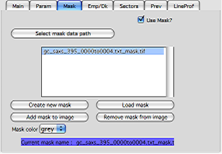
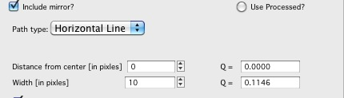
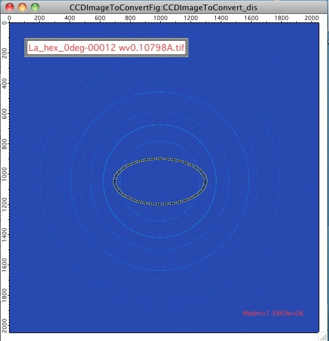

Main Panel
==========

Select “Main panel” from the “SAS 2D” menu. This will present the following panel:

.. figure:: media/Main1.png
   :align: center
   :width: 380px

The panel has three major parts:

1. Top is designed for 2D data selection. Here user selects which 2D
   image will be processed.

2. Middle (tabbed area) is designed for controls of processing. This is
   the busiest area of the panel and each tab will be explained later.

3. Bottom contains buttons for main controls and 2D image controls.

Selecting data
---------------

The macros can load selected data types. If appropriate file type is not
found in the “Image type” popup menu at the top right corner, you will
have to contact me so I add appropriate loader for your data.

Select appropriate type of data you have and then push “Select data
path” button, dialog is presented, in which path to folder on the hard
drive containing 2D images is selected:

NOTE the “\ ***Calibrated 2D data***?” checkbox. If selected, Niak
expects 2D calibrated data – fully normalized and corrected data
provided as one of the 2D formats, basically 2D image of Intensity, Q
(vector), and uncertainity. Number of options is being current
developed, the code currently handles EQSAXS (ORNL) and canSAS/Nexus.
This part is under heavy development at this time, expect changes…

When valid path is selected, the Igor will check the folder and list all
files of appropriate type (assuming the files have extensions) in the
ListBox below the button:

Here user can select one files, more files (by holding down shift key on
Windows) and continuing selection (using the two pull down menus below
the list Box)…

Note, that from Nika ver. 1.66 Listoboxes have right click actions and
users can refresh content and perform some functions from right click.

Use the “Match” field to mask the file names with Regular expression. To
match part of the name, just use the string needed - so matching samples
with \_15s in name, just add \_15s in the field. Regular expressions are
very powerful, read on line how to use them.

Note, the files ending with “\_mask”. These are mask files created by
Nika package, these were used to be tiff files, now they are hdf5 files…
Separate chapter explains how mask is created.

Invert 0,0 corner
------------------

As default Igor displays 0,0 of the image in the top left corner. This
seems to be distressing for some users, so if checked, images will have
0,0 in the left bottom corner. Nothing else is changed, so the
orientation of sectors WRT original image is preserved and reduced data
are the same as without this checkbox checked. Simply, the processing of
Nika package is independent of this checkbox, it is ONLY cosmetic…

Sort order
-----------

Decides how the data are listed in the listbox.

Four options:

*None* – list as provided by OS.

*Sort* – the old method. Alphabetical (but numerical order may get
wrong)

*Sort2* – alphabetical, but taking care of sorting out smaller number
before larger ones.

*\_001.* – this one assumes, that end of file name, before extension, is
number. Before number you need to have “\_” and after number must be “.”
Followed by extension.

*Invert \_001*

*Invert Sort*

*Invert Sort2*

All inverted sorting simply reverses the sorting logic.

Try them and see, which works best for you.

Match
------

Using RegEx now. This is Grep language using regular expressions, very
powerful. For simplicity: match names containing (anywhere) test, just
type in this field test. To match names starting with test type in
^test. Names ending with tif can be matched by tif$ and so on. Note that
to match any single character you need to use .

Side controls
-------------

There are few controls next to the Listbox where user can select the
data:

Refresh:
 This button was removed in 1.66. The refresh and some other functionality was added to right click for most Listoboxes in Nika.

Save/Load Config
~~~~~~~~~~~~~~~~

“\ **Save & recall config**\ ” will allow user to save
current settings – or load saved settings- in the tabbed area as
“configuration”. User can save the configuration file in any place on
the hard drive he/she wishes – ideally with the data!

Following dialog is presented:

Explanation of controls:

“Select data path” – select path to folder with the configuration files

Path is displayed below

Left window – shows the names of configuration files found in this
location

Right window – shows content (note, first line is user comment) in the
selected configuration file. If new configuration file is selected,
content of the first one is shown.

New Conf file name – User input for new configuration file to be created

New Conf file comment – place to store info about what this conf file
contains!

Save configuration button – save current setting of the tabbed area

Load configuration button – load stuff from config file into the
program. Note, your current configuration will be overwritten and there
is no way back, if you did not save your configuration…

**Note**: names of dark field, empty beam, mask, and pix2D sensitivity
are not saved and are not reloaded, when configuration is reloaded. This
would really be very complicated…

Note, that the config file has name and Comment string. If you get lost
altogether, you can also see on the right hand side what values are
stored in that configuration file. It is really good idea to use
meaningful names and comments – especially if you have a lot of
configuration files

Export image
~~~~~~~~~~~~

Enables user to export the main 2D graph as tiff image from Igor.

Store Image
~~~~~~~~~~~~

Enables user to store the current main 2D image in Igor Experiment for
reference… Remember, they can be large and so do not store too many or
the Igor experiment may become unmanageably large. Also, there is not
much support for dealing with these images (it is not really clear what
user would want to do with them to me), so you are on your own and use
Igor tools to handle these images…

There is NO WAY to load these images back into Nika at this time. It can
be done manually, but not through Nika menus & functions.

Create Movie
~~~~~~~~~~~~

This opens panel, which is interface for ability to create movie from
either 2D images or 1D lineouts…

Note: The way this tool is designed, image is added every time any of
the Convert butons is called. It is possible to use this tool to create
movie from RAW data only manually (by manually adding each frame) when
user wants to load the data inusing the “Ave & Display sel. files”
button. Using this button you cannot use Automatic add function.

But the same result you can achieve by using convert buttons and simply
not converting the data any way (not checking anything on “Main” tab and
any of the “Sectors”, “Prev” and “LineProf” tabs. In this case you can
add frames automatically, which is probably more useful…

.. figure:: media/Main10.png
   :align: center
   :width: 380px

The panel walks user through the steps necessary…

1. **Load and process one data set.** In order to use this feature, user
   needs to first load some test data set (image) to have test case to
   try the display options. This test case needs to be processed all the
   way needed…

2. **User needs to decide what to actually add into the movie**\ …
   Selecting the checkboxes creates the image, if you need to you can
   recreate (or pull up if it is hidden) the image by the button “Create
   Img/Graph”. There are various options:

   a. 2D RAW data image. This image is using separate image, copy of the
      RAW data. The graph can be customized by user (zoom, range
      scaling,…). Since the code for subsequent images replaces this
      separate copy of the image with newly loaded the wave, this does
      not modify the image itself. Therefore the display should be
      relatively stable and under user control – it should stay as user
      zoomed/set color range/etc...

   b. 2D Corrected data image. Same as above, but the image used is a
      copy of the fully corrected 2D images (empty/background
      subtracted, calibrated…). Again, the controls are left to user
      present ones since the code overwrites the separate copy of the
      data and therefore swaps the new data into the image without major
      recreation. Should be relatively stable without major changes to
      the way the data are displayed.

   c. | 1D data. This is graph of the lineouts created by the code.
        NOTE: if you are creating more than one lineout from each image
        (like when using multiple sectors), all of these may be
        subsequently used! This may be good (movie of sequence of
        sectors on one image) or bad (for movies from many images).
        There is no way of skipping and using only specific sectors. Use
        Hook function to create that…
      | You have relatively lot of controls of the graph, same as in the
        above options 1 and 2, as the data for this graph are a separate
        copy of your last data. When the old ones are overwritten, the
        new ones are “swapped” into the graph and replaced without
        modifications to the graph. So the graph should stay without
        major changes, unless set that way. For example, if Axis are set
        to auto scale, they may change. But if they are set to fixed
        start/end, they will stay fixed. At least I hope .

   d. Use main 2D image. This one simply uses the Main 2D image. Seems
      very good choice - BUT: that image is recreated every time from
      scratch so there are very few controls available to user – you
      either like it and then use it, or you cannot use this method. You
      should, of course, use the controls on main panel to modify the
      image – like use RAwor Processed data, display sectors, beam
      center, colors, or Image with Q axes… That works, but you cannot
      control other things, such as zoom range etc.

   e. Use user Hook function… This is advanced method. Here you can do
      whatever you want to create the image you want to append, just
      call the function: Movie\_UserHookFunction and if it exists, it
      will be called. This function MUST generate graph/image and leave
      it as the top image. This top image is added to the movie when
      called… Note: while this is advanced programming, this is way to
      get really what you want into the movie… Below is commented out
      example (present in the code also) which pulls up the main 2 D
      image and prints a note. You can add here any other formatting
      which you want to do or use…

.. code::

    Function Movie_UserHookFunction()
        DoWindow CCDImageToConvertFig
        if(V_Flag)
           DoWIndow/F CCDImageToConvertFig
           AutoPositionWindow /M=1 /R=NI1A_CreateMoviesPanel CCDImageToConvertFig
        else
           Abort "Main 2D windows does not exist"
        endif
        // print "called Movie\_UserHookFunction function"
    end

1. **Modify the Image/graph**. Here you can modify some of the
   appearance of the image/graph. If you want to display log of
   intensity in the images, here is your only chance (for first two
   options). You can append also file name – and edit the appearance of
   the legend manually – as long as you do not change the reference to
   global string, which contains this name, you can change font, size,
   location…

2. | “\ ***Open movie file”*** button. You here create movie file and
     open it for writing – external file for Igor experiment. Remember
     to set proper frame rate. Frame rate of 1 is 1frame/second, 10 is
     10 frames/second. So if you have 100 images to add, at
     10frames/second the whole movie will play for 10 seconds.
   | You can have ONLY one movie file opened at one time (Igor
     limitation). The button greys out when movie file is opened.
   | Also note that the button on main panel changes

3. | **Append Images to movie file**:
   | You have two options:

   a. “\ *Append current Frame*\ ” button. – Works always, appends
      current image/graph per selection (see above item 2) manually to
      the movie. Use when you want to control the appending of the
      frames really well.

   b. Checkbox “\ *Append Frames Automatically*\ ” – if set, after
      loading & processing every image a frame is appended
      automatically.

4. “\ *Close Movie file*\ ” button. Well, before you can play it,
   you need to close it…

    **Warnings**: It is very likely all hell breaks loose if you close
    Igor experiment and reopen it later with Movie file opened for
    writing. I suspect Igor will close the movie file on file close, but
    Nika will NOT know about it. While it is principally possible to fix
    this in the code, there are good reasons why not to do it. So keep
    this in mind and do not leave the Movie files opened when closing
    the Igor experiment. At least close the Movie file before you try to
    add any frames to it.

    Following dialog on Movie file control:

    Is Igor panel and here are your last chances to control what and how
    it gets created… I have limited information on what works best, so
    try this your self… Keep in mind, that while on PC you can create
    either mov file (Quicktime) or AVI file, it may be challenge to get
    avi files play on Mac. I suspect that considering the avi mess in
    video formats, you may have much better chance to play QUicktime
    movies (mov)… But there is no guarantee on unknown machines, that
    they will have Apple quicktime.

    Note, that every time Nika adds frame to the movie, it prints in the
    history area:

“Added frame with data : xxxxxxxxxxxx.tif to movie”. This tells you what
you added…

Live processing
~~~~~~~~~~~~~~~

Live processing is attempt to make automatics display or processing data
for instruments at synchrotrons or neutron sources. When pushed, it
opens new panel:

The description is hopefully clear. You can start background process,
which is sleeping for the "Update time". If Igor Pro is not busy at the
time when woken up, the background process will basically run "refresh"
command and if new file is found (after applying all Match RegEx and
Data type matching, this new image is automatically processed using the
settings in Nika.

Note, that user interactions may delay this processing, so if user is
using Igor, this may not happen. However, if user is using sporadically
this update may happen at inconvenient time, so make sure if you want to
"Play" with the file you stop this background process.

Note checkboxes: "Display new image" or "Convert new images", which
control, which button is pushed by this tool when new image is found.
The first pushes "Ave & Display sel. file(s)" while later pushes
"Convert sel. files 1 at time".

Intensity calibration
~~~~~~~~~~~~~~~~~~~~~

Most of the time the data in Small-angle scattering are normalized and
not calibrated. This prevents users from obtaining quantitative
information about volumes of scatterers and specific surface areas
(etc…) using data analysis packages (such as *Irena*). If users collect
standard sample (e.g., Glassy carbon: ***Zhang, F., et al., Glassy
Carbon as an Absolute Intensity Calibration Standard for Small-Angle
Scattering. Metallurgical and Materials Transactions A, 2010. 41(5): p.
1151-1158.***) the data can be put on absolute scale – either
cm\ :sup:`-1`\ sr\ :sup:`-1` (volumetric calibration, also
cm\ :sup:`2`/cm:sup:`3`/sr – typically shortened as
cm\ :sup:`2`/cm:sup:`3`) or cm\ :sup:`2`/g for weight calibration. The
popup :

enables users to select which units of absolute intensity calibration
they want to write in wave note of the data. Other packages (Irena) may
use this information and then it may be critical to have the right one
in there.

Sample Name
~~~~~~~~~~~

This field has been added in version 1.75 and it is used with data
formats which can contain sample name different, that the file name
loaded in. Example of such format is Nexus NXsas. Actually, at this time
it is the only file format which read, if set in cross-reference table –
the sample name from metadata and does not use file name. Every else
file format sets this field to file name (without extension). I hope to
get more creative later.

Name trimming
~~~~~~~~~~~~~

*Following controls are on Sect. and LineProf tabs at the bottom. Obviously, Nika needs larger panels in the future. May be next releases…*

Igor Pro has 32 character limit for names but many operating systems
allow much longer names. Also, users are notorious for using file names
as abstract.

If Nika is suppose to save the data in Igor experiment, it needs to cut
the name down to smaller size – and since it is using part of the name
to describe how the data were reduced, it limits user useable length of
the string to 20 characters…

In these controls user can select how to handle too long file names –
remove part of the name (string) – and if still too long, trim start or
end of the remaining string…

Here is example:

Name
My\_Name\_is\_SIMPLYTOO\_long\_for\_comfort\_even\_with\_removal.tif

55 characters. Perfect.

Trim end would result in name: My\_Name\_is\_SIMPLYTOO

Trim start: comfort\_even\_with\_removal

And remove “SIMPLYTOO\_long\_for” and trim end :
My\_Name\_is\_\_long\_for

Etc…

Controls in tabs
----------------

**Note, that if images are averaged, they are first averaged during
loading, and then – during processing to create lineouts / square matrix
are corrected as described below. Therefore all parameters here related
to single (if possibly averaged) image!**

These are controls in the tabbed area.

We will now go through each tab separately

Main
~~~~

Here are some very clear parameters, related to SAXS camera geometry:

Sample to CCD distance in millimeters, Wavelength/Xray energy (these
windows are linked), CCD image pixel size in mm (in X and Y directions).
Note, X direction is horizontally, Y direction vertically. And Beam
center position. Note, one can display beam center (to check it) in the
graph by checkbox below the tab area.

And further there is pile of checkboxes, which describe method how to
calibrate the data. Note, that formula used for calibration appears
below to avoid any misunderstanding of the method. Select method needed
for processing – and following tabs will have the appropriate controls
available.

Note, that “\ **Use of Dark field**\ ” and “\ **Subtract constant from
Data**\ ” cannot be used at the same time (they are effectively the same
type correction)…

Note, only the appropriate controls will appear, so seeing all of these
at the same time should be VERY unusual…

Comment for Use of **Solid Angle Correction**: When selected, the data
are divided by solid angle of the central pixel (same value for all
pixels). To correct for change in pixel solid angle as function of
scattering angle, use Geometrical correction. Most of the time we do not
bother with this option – if you use secondary calibration standard
(like Glassy carbon or water) solid angle correction is included in the
Calibration constant. If you do not use calibration and have relative
data, you do not care also. The real need for this option is when you
use data obtained in different sample to detector distances and want to
combine the data together. Then this is necessary option.

Just remember, if you have obtained calibration constant, it is linked
with the choice of the Solid angle correction.

Param
~~~~~

Here are standard controls (self explaining I hope):

“\ **Geometry correction**\ ” – fixes the **VARIATION** of solid angle
projection of the pixels on planar CCD detector. Mostly negligible for
SAXS data… Just for completes, this divides the intensity at each pixel
by (cos(2Theta))^3. And for those, who do not understand this formula,
it took me may be 3 weeks to check it (I stole it from NIST data
reduction). Very simplified, one cos(2theta) corrects for change of
pixel radial direction as function of scattering angle, second
cos(2theta) comes from change in distance between sample and detector as
function of scattering angle in radial direction, third cos(2theta)
comes from the same correction for tangential direction. Tangential size
of pixel does not change as function of scattering angle.

“\ **Polarization Correction”** – Correction for either unpolarized
radiation (desktop instruments with tube sources for example) or for
Linearly polarized X-ray sources (synchrotrons). Opens up a new panel.

For unpolarized radiation use “Unpolarized radiation”. This is
applicable ONLY to unpolarized radiation, the intensity data are
corrected by formula:

Intensity\_corrected = Intensity\_measured / (0.5\*(1+cos((2theta))^2))

For linearly polarized radiation use “Polarization radiation”, see
separate chapter on Polarization correction little bit further in this
manual.

By the way, for small-angle scattering each of these corrections is
negligible.

**“Dezinering”** - Data, Empty, and Dark field images can be
“dezingered” during loading. In this procedure each point is compared to
surrounding pixels and if it is significantly larger (that is the
dezinger ratio, if 2 then if the pixel is 2x larger than average of
surrounding pixels) it is replaced with the average of the surrounding
pixels. This is to remove spurious very high intensity points, which
occur on some instruments.

It is possible to dezinger each image multiple times, in case the
“zingers” are larger than single pixel.

***Calibration/processing parameters: ***

**Sample thickness** in millimeters, **transmission** as fraction.

***Important note**: Nika versions prior 1.75 had a bug in the code,
which caused the thicknesss to be used in mm and not converted into cm,
as appropriate for SAXS data calibration. This was fixed in Nika version
1.75. BUT, this means, that calibration constants obtained on prior
versions of Nika need to be also scaled by factor of 10 to account for
this. I suggest carefully revising calibrations when upgrading to new
version of Nika. This message will be also provided to users when new
Nika version finds panel created by old Nika version. My apologies for
this issue.
Note: Under usual conditions when measurement of standard was reduced in
Nika and then calibration constant was obtained this bug have cancelled
out. This is also the reason why this bug was not found for so long.
Thanks to a user, who actually read the code and found the bug. *

**Correction factor** is for secondary calibration factor.

**Measurements times** in seconds, for each image.

Sometime one wants to use measurement time to correct images collected
at different time exposures. While not suggested, it is possible to do
here. I strongly discourage this.

Monitor counts allow scaling data by using monitor on incoming
intensity.

**“Fixed offset for CCD images”** this is single value to be
**subtracted** from each pixel of image to be processed.

***“Monitor counts”*** use monitor counts to scale images
(Sample/Empty)… This makes no sense for dark field…

Each of these values can be inserted by user as number, or using
function:

These function need to be “look up” functions, which are called with
image name as parameter (FunctionName(“ImageName”)) and must return
single real number. The real use is to provide automatic look up of
parameters from some records written by instrument. Above example is
from included special support for DND CAT instrument.

*Let me point out once more here, that using some of these corrections
together makes no sense… Choose wisely.*

Mask
~~~~

First checkbox, if Mask should be used (did not fit on the front tab…),
button to select path to files with masks. Note, mask files created by
Nika used to be always tiff files, with name in following manner:
UserName\_mask.tif Starting with version 1.49 they are now hdf5 files.
These can be loaded in same as tiff files, but have anb advantage that
these can be later modified in the mask tool…

Following are function of the buttons:

1. Create New mask – calls tool to create mask (see later in the manual)

2. Load mask – load file selected above in the list box as mask

3. Add mask to image – adds mask into the 2D image from the image

4. Remove mask from image – removes the mask from the image

Mask color – allows to change color (red, green, blue, black) of the
displayed mask…

Current mask name – shows name of last loaded mask file

Emp/Dark
~~~~~~~~

Here are controls for Empty/Dark field/pixel sensitivity (aka flood)
images.

Button “Select path to mask, dark & pix sens, files” Selects path to
data with the Empty, Dark field etc. I believe the files need to be the
same type as data file (I need to check this).

Further buttons load the Empty/Dark/Pixel sensitivity, allow Dezingering
of these (same method as the sample dezingering as selected above). And
at the bottom are listed the file names of the files loaded…

Sectors
~~~~~~~

This tab controls how data are processed when method using “ reverse
Lookup tables” is used. This is the more suggested method for regular
data processing. In this method Nika creates first lookup table for each
sector defined and then can process much faster subsequent data files
with the same geometry…

**Controls**:

**Q space/d space/ 2 theta space** – Output as function of Q, d, or 2
theta…

Min/Max (Q, d, 1 theta) range of evaluated Q, d, 2 theta. Set to 0 for
automatic – automatic means, that the min/max is set for first q/d/2
theta which has non zero intensity

“\ **Log binning**\ ” – check yes if Q/d/2 theta binning should be in
logarithmic.

“\ **Number of points**\ ” – number of points in Q/d/2 theta which
should be created.

**Do circular average** – self-explanatory.

**Make sector averages** – do sector averages. Controls below control
orientation and sizes of sectors. To see how the sectors are places,
check the checkbox at the bottom of the control panel.

**Create 1D graph** – if checked, 1d graph with output is created (if
necessary) and data added. Note, the graph may be crowded very fast,
since data are added, and added…

**Store data in Igor experiment** – keep data (as qrs triplets) in
current Igor experiment.

Overwrite existing data if exist – if data with the same name exist,
overwrite without asking. Otherwise, you will be asked.

**Export data** – export ASCII data

**Select output path** – select where data are to be placed.

**Use input data name for output** – automatically name 1D data (with
sector information added as DataName\_Angle\_width) by input data name.

**ASCII data name** – if the above is not selected, this is place to
place name for output file. Note, if there is nothing available for the
code as sample name, it will ask for some…

PolTrans
~~~~~~~~~

This means: ”Polar transformation” – prior (pre 1.68) name was “Preview”
which is the intended use of this tool…

**First:**

*This tool can use the calibrated data set (as well as RAW data set,
depending on checkbox setting) so same calibration procedure is used as
for the other processing. This tool is, however, less precise and does
NOT produce useable errors. Be warned, this tool is meant as quick look
on the data in different directions and not for final data processing…*

This method is used to convert Intensity vs azimuthal angle from “polar
coordinates” around beam center to plot where azimuthal angle is on
vertical axis, pixel coordinate is on horizontal axis and intensity is
expressed as color map. In here, one can produce rectangular graph:

.. figure:: media/Main26.png
   :align: center
   :width: 780px

On vertical axis is angle from 0 degrees axis (horizontally right from
the beam center) and on horizontal axis is pixels distance from beam
center. This is effectively set of lineouts in all azimuthal angles. It
should be noted, that the code works very well for relatively small
widths – may be up to 5 degrees, then the code becomes less precise, so
keep angles small. Suggested is 1 -5 degrees.

These data then can be processed further by use of “Image line profile”
tool. This tool for now has it’s own “mindset” and does not properly
update always. The dependencies are quite complex. If it does not
update, close the tool and reopen…

The “SquareMap of Intensity vs pixel” graph on the top right above shows
the intensity in linear/log (checkbox left top corner) as function of
pixel (bottom axis) and azimuthal angle (left axis). The lineout plot at
the right bottom shows the intensity from this plot (note, the log/lin
scaling in the image translates here!) as function of pixels/q/d/2
theta. Note, that this produces “natural” binning with every step in
pixel is assigned single q/d/2theta position.

Note, the controls:

**Number of sectors**

**Width of each sector** - it is possible to have width such, that bins
overlap, touch or do not touch… Default here is to have them touching.

**Start Angle** (0 = right horizontally from beam center)

**End angle** (wrt to start angle, most likely 360 degrees, or 180
degrees for only top half).

**Mask data** this tool does not mask, unless selected here…

Note, that by selecting larger width here, one can get very good and
reliable sector average and manually move this average through the
different azimuthal angles. Very useful, when hunting for particular
azimuthal orientation…

**Use RAW data** if selected unprocessed image is used.

**Use Processed data** if selected processed image is used, available
ONLY if the last image was loaded using one of the “\ **Convert…**\ ”
buttons, unavailable if the last image was loaded using “\ **Ave &
display sel. files(s)**. If the data were loaded using “\ **Ave &
display…**\ ” button, processed data do not exist.

**Controls on Lineout tool:**

Orientation of line profile (Horizontal/vertical)

X axis linear/log scale

Use: pixels/q/d/2 theta

Width and position

Save lineout – this saves “qrs” data in SAS folder in current Igor
experiment. Suggested folder/data name is offered through dialog and
user can modify as needed. Note, that errors are simple sqrt(intensity)
– another words, these errors are not very useful.

LineProf
~~~~~~~~

This tool calculates Intensity profile along curve on the detector. It
uses different method than **Sectors** tool. Therefore, there are some
important differences in how to use this tool…

*The differences:*

“\ **Sectors**\ ” use inverse lookup method and can be set to create
multiple different sectors on one image at once. Since this tool caches
the lookup tables, it is slower first time, but much faster on
subsequent images. This tool can be used ONLY by setting the data
reduction parameters and then using buttons “\ **Convert…**\ ”. You
cannot manually evaluate any sector and no preview is provided. This
tool causes high memory sizes of the Igor experiments with Nika package
– the lookup tables are large. But it is fast for what it does.

And you can setup multiple sectors to be evaluated at once.

“\ **LineProf**\ ” uses built in Igor Line Profile tool. It can be set
ONLY to process one line profile at a time. This tool does not cache
anything, so it takes the same time to process for each image. However,
it is relative fast and can be used manually on Converted image. So,
there are two methods to use it:

a. Set one line profile parameters, choose how to save data and push one
   of buttons “\ **Convert..**\ ”

b. Do not set any conversion parameters, but use one of the buttons
   “\ **Convert..**\ ”, set the **LineProf** tool to use Processed data
   and then set parameters for the

You can only set one line profile at a time, unless you manually create
multiple profiles on each converted image.

**Controls:**

New controls here:

“\ **Use?**\ ” – switches on this tool.

“\ **Use Raw**?” – and “\ **Use Processed**?” – choices which image the
tool will be used on. User Processed is not available if the last data
set was loaded using “\ **Ave & Display..**\ ” button (no Processed data
are created in this case). NOTE: if you hit any button
“\ **Convert..**\ ” and this tool is enabled, it is set to “\ **Use
Processed**\ ” automatically.

“\ **Distance from Center [in pixels]**\ ” – user control to move the
object to specific *q* . The *q* where the data will be calculated is
displayed next to this control and is the appropriate *q* (*q\ :sub:`y`*
or *q\ :sub:`z`*) for give shape. See Ellipse definition for specific
there. NOTE: you must control the pixel position. Positive direction is
to the right of the beam center (horizontally) or up from the beam
center (vertically). Lines are drawn to help user figure this out.

“\ **Width [in pixels]**\ ” – width of the profile (minimum used one is
1 even if 0 is set by user) in pixels. This is the control to use to
change how wide stripe is averaged. Next to it is control which shows
this in *q* units. NOTE: the *q* width is calculated simply by
subtracting Q values for the sides of the stripe. Intensity is averaged
at each point perpendicularly to the direction of the line (curve). If
more than 1 pixel is used for averaging, standard deviation of average
is provided as error, if only 1 pixel is used, square root is used
(which may be seriously WRONG)… You were warned.

This tool calculate intensity, intensity uncertainty and *q,
q\ :sub:`y`*, and *q\ :sub:`z`* values. If one of GI profiles is used,
it will calculate *q*, *q\ :sub:`y`, q\ :sub:`z`*, and *q\ :sub:`x`*
values. See below.

**IMPORTANT:**

Of course, GISAXS community had to adopt different definition of Qx,
Qy,a nd Qz than I did years ago, and therefore, this tool uses somehow
different definitions than rest of Nika. So the horizontal direction
(x-direction for Nika) is the Qy direction. Vertical direction on the
detector is “y” direction for Nika, but it is direction of Qz. Please,
keep this in mind… For those adventurous souls, who actually read my
code, keep in mind at some point the code switches on your the x-y image
coordinates to y-z-(x) GISAXS coordinates… Sorry. No other fix I would
know about.

*For now these are the available profiles:*

***Vertical/Horizontal line**:*

There is one more control available – “\ **include mirror**\ ” (above
the popup). If this is selected, mirror line over the beam center is
included in calculations, see above.

This is line profile for transmission geometry.

**Angle line:**

.. figure:: media/Main32.png
   :align: center
   :width: 380px

.. figure:: media/Main33.png
   :align: center
   :width: 380px

This is also for transmission geometry.

***GI\_Vertical line & GI\_Horizontal line***

These profiles are for Grazing incidence geometry. They need Grazing
incidence angle:

Both can include mirror image line across the beam center.

Note, that the position is defined in pixels as before, but the Q values
are corrected according to the Grazing incidence geometry corrections,
see Gilles Renaud, Remi Lazzari, and Frederic Leroy, Probing surface and
interface morphology with GISAXS, Surface Science Reports 64(2009)
255-380, formula (1).

Note: before version 1.68 there was bug in the code for calculation of
one of these angles. It hopefully had negligible impact for higher
angles, but for small angles the Q calculation was wrong. The fix is,
unluckily, complicated – as far as I know, there are two common GISAXS
geometries being used. This requires additional user choice here.

Here is the explanation; following pictures are from Lazzari, J. Appl.
Cryst. (2002). 35, 406-421 and G. Renaud et al. / Surface Science
Reports 64 (2009) 255–380):

Here are the q components calculations based on this geometry. Note,
Nika assumes Theta-I = 0.

However, another geometry, which is also used, is slightly different:

(Fig2. - http://www.physics.queensu.ca/~saxs/GISAXS.html)

Note the difference here is, that in the first image the sample is
horizontal and beam is tilted, as it is commonly used for liquid surface
scattering (“GEO\_LSS”). For solid samples it may be more convenient to
tilt the sample itself and rest of instrument stays fixed (“GEO\_SOL”).
In my rare encounters with GISAXS technique, this is what I have used.

These two geometries differ in the calculation of alfa-f needed for
calculation of q in vertical direction. For GEO\_SOL the detector is
perpendicular to the original (incoming) beam direction and the alfa-f
calculation does not require any more input from user as the calculation
is simply the angle of the outgoing triangle – alfa-I as shown in Fig 2
here.

For the GEO\_LSS as in Fig 1 the detector is perpendicular to the sample
surface, and principally user should provide one more input parameter,
as the triangles are not right angle any more. In this case users need
to input another value – y position of the reflected beam.

Therefore if user selects GI geometry, from version 1.68 he/she should
get new panel:

As instructed, for GISAXS\_SOL where sample is tilted, just put (or
leave) 0 in this field, close the panel and all is OK.

If you are using GISAXS\_LSS geometry, you need to read (in pixels)
position of the reflected beam and provide here the y coordinate of this
beam. Close the panel and all should be set. Nika will use GISAXS\_SOL
calculation if this value is set to 0 (actually, if it is smaller than
1), and GISAXS\_LSS if this value is larger than 0 (actually, >=1).

I do not have chance to test this, so if someone can test this and
verify this all works, I would be really grateful.

And interestingly, there are instruments, which move their area
detectors around much more, and orient them in much more complex way –
and Nika has simply no chance to handle those systems. More complex
instruments will require dedicated data reduction software.

The bug in this angle calculation was found by one of the users (Thank
you!) in version 1.67 of Nika – the correction for alfa-I was missing.

**
Ellipse profile**

Note, that there is aspect ratio control here and the Distance from
center here is horizontal distance (in q\ :sub:`y`) direction. When set
to AR=1, the ellipse becomes circle.

For AR>1, the ellipse is this way:

For AR<1, the ellipse is this way:

Note, that this tool has one major problem – it is practically
impossible to display the data in any sensible way. Neither q,
q\ :sub:`z`, or q\ :sub:`y` makes any sense here. In some way one needs
to get angle of the intensity position. At this moment I do not produce
such data within Nika. User can produce them by himself (the step is
0.25 degree, starting from 0 degrees azimuthal angle on the
detector[note: I hope, I got turned around so many times, that this
requires some data to test on]).

The other option is to use q\ :sub:`y` and q\ :sub:`z` to generate this
angle. **If anyone will ever use this tool, please, contact me and tell
me, how you want to use it and I will modify the tool to suit needs of
users.**

***Finally : More shapes…. I can imagine broadening capabilities of this
tool with other shapes. If you have such need, talk with me and I’ll add
line profile shape for your needs. ***

Controls for saving data are the same (really, these are the same
controls, showing on second screen also) as in the **Sectors** tab:

**Create 1D graph** – if checked, 1d graph with output is created (if
necessary) and data added. Note, the graph may be crowded very fast,
since data are added, and added…

**Store data in Igor experiment** – keep data (as qrs triplets) in
current Igor experiment.

Overwrite existing data if exist – if data with the same name exist,
overwrite without asking. Otherwise, you will be asked.

**Export data** – export ASCII data

**Select output path** – select where data are to be placed.

**Use input data name for output** – automatically name 1D data (with
sector information added as DataName\_Angle\_width) by input data name.

**ASCII data name** – if the above is not selected, this is place to put
name for output file. Note, if there is nothing available for the code
as sample name, it will ask for some…

Note, that the LineProf tool uses another “graph” window (“Line Profile
Preview”) under the main image. This window contains some controls that
are very useful.

The data are automatically updated as the parameters for the profile are
changed. This gives user live update (but can take time, if it takes too
much time for anyone, let me know and I’ll add controls to avoid the
updates “live”).

User can display the data as function of *q,* *q\ :sub:`y`* or
*q\ :sub:`z`* and on lin-lin, log-lin, lin-log and log-log scales. Note,
that negative values cannot be displayed on log scale, so since q values
for lower part of detector (below beam center) are defined as negative,
you may not see them if you choose log scale. Also the *q* values look
sometimes really weird, but generally they should be correct. If there
are any issues with definitions of negative directions, let me know.

User can also save the data displayed in this window, which enables user
to create multiple line profiles from existing image – this is manual
method. NOTE that save parameters are taken from the setting of the
controls for this purpose in the tab in the main panel (“Create 1D
graph”, “Store data in Igor experiment”…). If you choose “Overwrite
existing data” and do not change the name, you may get in troubles.

When data are being saved some cryptic description to indicate what
profile was used and which *q* was used will be attached to the name
used. More full description is attached to wave note.

For example for GI\_Vertical line in my test case, this was the name:

gc\_saxs\_395\_\_GI\_VLp\_0.0077

“gc\_saxs\_395\_”…. Part of the name of used image

GI\_VLp\_.... GI\_Vertical Line

0.0077 …. *q\ :sub:`y`* value at which the data were calculated.

Exported data are Int, error, Q, qx, qy, qz columns with header and
column names

Saved data in Igor are

r\_gc\_saxs\_395\_\_GI\_VLp\_0.0077 intensity

q\_gc\_saxs\_395\_\_GI\_VLp\_0.0077 q

s\_gc\_saxs\_395\_\_GI\_VLp\_0.0077 error

qy\_gc\_saxs\_395\_\_GI\_VLp\_0.0077 qy

qz\_gc\_saxs\_395\_\_GI\_VLp\_0.0077 qz

qx\_gc\_saxs\_395\_\_GI\_VLp\_0.0077 qx (generated ONLY if GI… profile
is used)

Note: next release of Irena package will have capabilities to use not
only qrs data , but also q\ :sub:`x`\ rs, q\ :sub:`y`\ rs, and
q\ :sub:`z`\ rs data.

Bottom controls
---------------

.. figure:: media/Main16.png
   :align: center
   :width: 580px

These controls have following functions:

“\ **Ave & Display selected file**\ ” will average all selected files,
which are selected in the list box, and display them as one figure. The
program will just load and display the CCD images, including some
processing (dezinging), if selected.

Note, if more than 1 image is selected, the images are first AVERAGED –
that is intensities for each pixel as summed together and then divided
by number of images.

“\ **Convert selected files 1 at time**\ ” will load one after another
the files selected in the list box and process them according to
selection in the tabbed area.

“\ **Ave & Convert selected files**\ ” will average all selected files
in the list box and process them according to selection in the tabbed
area.

Note, if more than 1 image is selected, the images are first AVERAGED –
that is intensities for each pixel as summed together and then divided
by number of images.

“\ **Save displayed image**\ ” will save displayed image into tiff file
for future use. This is method, how to for example average number of
images and save them for single empty or blank image.

“\ **Skip Bad files**\ ” Enables to skip automatically processing of
files, which have too low intensity (SetVariable control with limiting
value appears when selected). Used to skip files which were accidentally
NOT exposed in case of failing shutters or other issues.

“\ **Display RAW data**\ ” will display in the image right of the panel
the UNCORRECTED data file as loaded in. Values for the pixles are raw
counts from the detector.

“\ **Display Processed**\ ” will display in the image right of the panel
the fully CORRECTED and CALIBRATED data. The values for the pixles
should be directly absolute intensity in this case. This choice is not
available, if image was loaded through using “\ **Ave & Display sel.
Files(s)**\ ”. In this case no processing of the image was done. Use
button “\ **Convert sel. Files 1 at time**\ ” or the other buttons….
Just remember, that only the last image is available for display.

“\ **Display beam center**\ ” will add circles in the image showing
where beam center is set

“\ **Display sectors/Lines**\ ” will add lines showing sectors or lines,
which are selected for data analysis (if any)

“\ **Log Int display**\ ” will switch displayed image into log
(intensity) or linear (Intensity).

“\ **Image with Q axes**\ ” Appends Qx/Qy (or Qz/Qy) axes to displayed
image. Note, when unchecked, it has to recreate the image, since these Q
axes cannot be removed any other way.

“\ **Image w/ Q axes with grid**\ ” Appends Qx/Qy (or Qz/Qy) axes to
displayed image – with grid lines. Note, when unchecked, it has to
recreate the image, since these Q axes cannot be removed any other way.

Polarization correction
-----------------------

Two types are available.

Unpolarized radiation

This is generally accepted formula.

Linearly polarized radiation

This is polarization correction for linearly polarized radiation, such
as produced by double-crystal monochromators on synchrotrons.

There are two polarization orientations, sigma (linear part) and pi.
Most synchrotrons will be linearly sigma polarized, with sigma fraction
may be 0.99 or so. Depending on the way the detector is read, the sigma
polarization plane may be horizontal or vertical. The panel enables
setting the sigma polarization plane orientation.

The final formula is:

where *f*\ :sub:`s` is fraction of sigma polarization, 2q is 2 theta
angle, and a is azimuthal angle from the plane of polarization plane.

**Implementation**

All of the Polarization corrections (from version 1.42) in Nika are
applied by scaling the 2D data by the formulas above after all of the
corrections (including background and dark current subtraction).

In the following panel which shows after selecting “Polarization
correction” on the main panel:

After selecting Polarized radiation you need to make further choice…

If the Sigma Polarization Plane is 0 degrees, then the detector
orientation is such, that the polarization plane is horizontal in the
Nika image of the detector. Note that horizontal is Nika’s definition of
0 degrees on the detector.

**This has nothing to do with the orientation of polarization in real
World, this is an orientation between the polarization plane and the way
detector is read. In this case the correction looks like this:**

with largest correction (increase of intensity) where the color is blue.

For case, when polarization plane is vertical in Igor image
(perpendicular to Nika’s definition of 0 degrees on detector) , the
correction looks like this:

with maximum correction (blue color).

Uncertainties (“Errors”)
------------------------

Uncertainty estimate in 2D data reduction is sore point and I have not
yet found correct solution for it. As far as I know there is really no
good way to get meaningful estimates.

To complicate the matter is, that prior version 1.43 (1.42 and before)
there is bug in the uncertainty (error) calculation, which results in
overestimate of the values. My intention was to provide standard
deviation of the values averaged into the pixel, but simply, I made
typo, which resulted in somehow higher values.

Therefore for version 1.43 I provide now three different methods for
uncertainity calculations, Standard deviation is default. For
compatibility purposes user can choose old (incorrect) version and also
standard error of mean – SEM - (standard deviation / sqrt(number of
points)).

Please note, that the line profile calculations provide ONLY standard
deviation or SEM, since they never used the old method (they use Igor
internal method for standard deviation). They default to standard
deviation if old method is selected.

The Uncertainty method can be changed in the “Configuration panel”
available from menu.

Q-resolution calculations
-------------------------

From Nika version 1.69 the code can estimate q-resolution of the data.
This is highly approximate calculation, which can be probably, similar
to Uncertainties calculations considered voodoo calculations. I have
reviewed some manuscripts which deal with this , such as Barker, J.
Appl. Cryst (1995) 28, 105-114. I have looked in some of the codes and
realized, that while this is challenge to do for a specific instrument
(USAXS code handles this as correctly as anyone probably ever will
need), for generic tool this will be challenge. And to some degree, for
X-ray instruments this is mostly (not always!) OK as the resolutions are
kind of higher than what neutron system need to deal with.

Here is description of what Nika does to calculate q resolution for each
point.

1. **Wavelength resolution** is ignored. For regular monochromatic
   instruments this is reliably ignorable value. For pink beam, well, if
   you need it I can add it in the future, but I am not sure if anyone
   needs it (and this would require yet another GUI control value few
   people would ever use). So if you need it, let me know and we will
   deal with it then.

2. **Effect of q-binning**. When Nika calculates intensity, it
   calculates q value for center of each pixel and then generates q
   binning (linear or logarithmic) – this means, each q-bin has
   q\ :sub:`min` and q\ :sub:`max`. All pixels with q\ :sub:`center`
   between q\ :sub:`min` and q\ :sub:`max` are counted for each bin.
   Nika provides this q-width (distance between q\ :sub:`min` and
   q\ :sub:`max`) as q resolution given by nature of averaging.

3. **Effect of pixel size**. Note, that above the q is placed into the
   bin based on center q value. Of course, this means, that some pixels
   with center near qmin or qmax contain intensity from q values
   belonging to other q bins due to finite pixel size. This is q
   resolution due to pixel size.

4. **Effect of beam size**. Now one needs to realize, that beam has
   finite size and often is really large. Therefore each pixel will see
   range of q values (angles) from different places on the beam spot. At
   the end, this is very similar to pixel size smearing but with beam
   size values. This is q resolution given by beam size.

5. **Effect of detector pixel bleeding**. This is caused by detectors
   not being able to separate the intensity in one pixel from the next
   pixel. This is highly detector technology dependent and Nika simply
   ignores it. Luckily, newer generations of detectors (Pilatus) are
   pretty good in this.

Note, that adding the Beam size q-resolution required adding of controls
for the beam size into the main GUI. If beam size is left as 0, the only
thing affected is the q-resolution calculation. This is beam size **ON
DETECTOR!** not on the sample. If there is focusing, that can cause
differences.

OK, so in the table above (and that is not exhaustive table) are some of
the sources of the q resolution we need to account for. Nika convolutes
together Effect of q-binning, effect of pixel size and effect of beam
size. It ignores others.

There are bit more details in how the calculations are handled and in
case of real interest, read the code (the function is
NI1A\_CalculateQresolution in NI1\_ConvProc.ipf). It gets bit messy in
the way these things get expressed:

1. For “small” q-resolution values caused mainly by pixel size and beam
   size – and where the q-binning is smallish (or at least comparable)
   component, the correct is expressing q-resolution as FWHM (full width
   of half maximum) of assumed Gaussian sensitivity of the q bin across
   of range of q values. This is what most software assumes. This is
   what you get always at small qs in Nika.

2. For “large” q widths generated at high-q by log-q binning in Nika
   (and in USAXS using flyscans etc.) the correct representation is more
   as rectangular slit smearing effect (similar to slit smeared USAXS
   instrument itself). This is what you get if you use Nika with log-q
   binning at higher qs.

Irena Modeling II has been recently updated to handle this type of
q-smearing. It is bit mess for number of options

**Summary:**

Accounting for q-resolution can be helpful for scattering with sharp
features (monodispered systems etc…). It may be critical for fitting
such systems as I was unable to fit some of these systems without
accounting for q-resolution. Keep that in mind when fitting is not going
well.

It can also be very useful to look at to decide what is the real q
minimum value of any instrument. I have seen cases when device is quoted
to have q\ :sub:`min` – 0.0006 A\ :sup:`-1` but the q resolution at that
pixel is about 0.002 A\ :sup:`-1`, which really makes that pixel useless
for practical purposes. I think this is more common than we dare to
accept…

Recently updated Modeling II tool in Irena can handle different types of
q-smearing.
