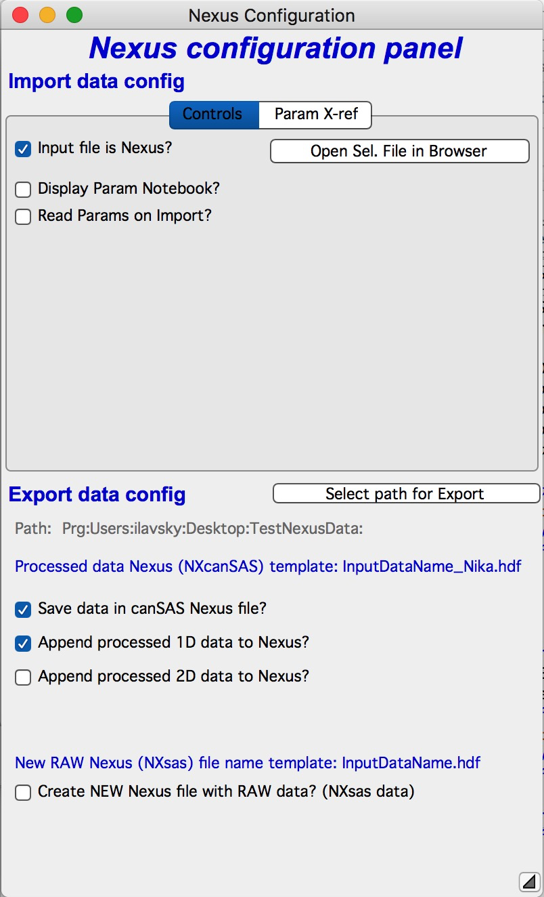
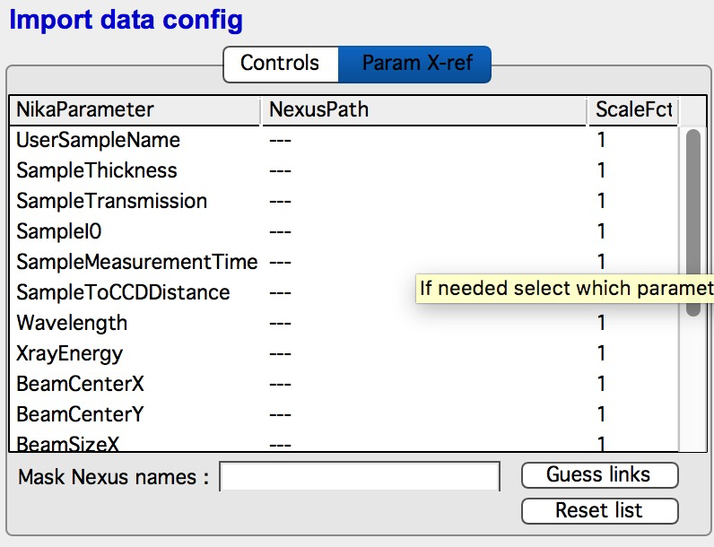
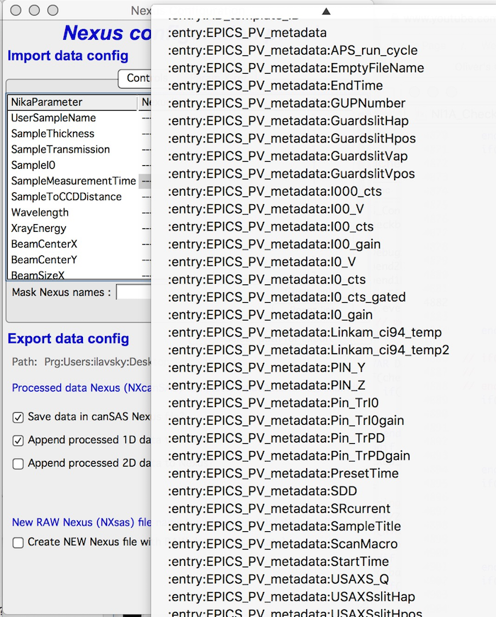
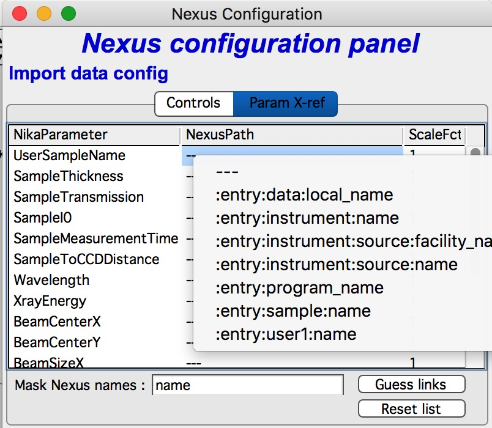
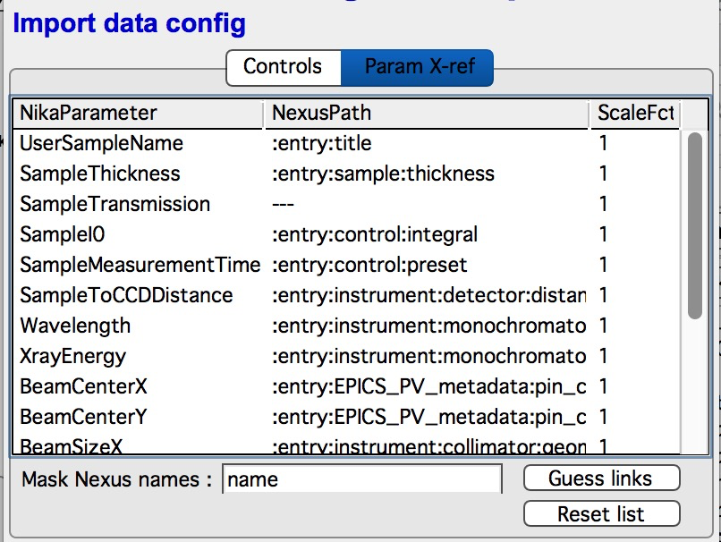
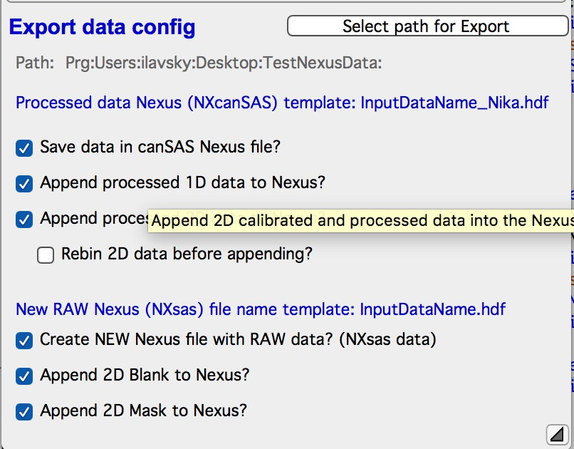

.. _Nexus:

.. index::
    Nexus standard
    Nexus file format

NEXUS data
----------

Nika has supported Nexus files for some time now, actually my own instrument is using Nexus files for raw data since about 2013 or so… Version 1.75 brings much better and complete support of Nexus files.

What is Nexus
~~~~~~~~~~~~~

**What is Nexus and why do I care???**

Nexus is attempt of X-ray and Neutron (or likely Neutron and X-ray) communities to develop file format, which can be used to share and store data from X-ray and Neutron instrument in such way, that they are generally readable and usable. The file system uses HDF5 file format – this is binary container for data (similar to xls Excel format, pxp Igor format etc.) HDF5 is supported by many commercial packages and it support is available for most programming environments. It is free to use and well maintained. Simply put, HDF5 is useful form of storing data.

Nexus provides description of how to store data and what to store – how to call various data (e.g., use “wavelength”) etc. For most of you this is useless information.

**Why you want to use it**? – By having definition of what and where to expect, any program supporting specific Nexus class should be able to read your data. This should enable our user community to exchange data easily between instrument, data reduction package, and data analysis package.

Where are details?

http://www.nexusformat.org

http://download.nexusformat.org/doc/html/index.html

**More to know:**

Nika supports two “classes” or “Application definitions”:

1. input of raw data from instruments, follows “\ **NXsas**\ ” application definition.

2. Output of reduced (1D or 2D) data for analysis software (“**NXcanSAS**\ ”)

Theoretically it is possible to store both in the same Nexus file. Nika for now (version 1.75) creates two files. Single file can be implemented easily, if anyone needs it.

.. index::
    NXsas

Raw data Nexus – Nxsas – import/export
~~~~~~~~~~~~~~~~~~~~~~~~~~~~~~~~~~~~~~

Many large facilities at this time (1/2017) are using Nexus files to store RAW data for their instruments. To my knowledge it is at least some instruments at the APS, Diamond, Soleil, etc. There are also some desktop instruments, which support Nexus files. Nexus is now supported even by detector software itself, so even home made instruments now have a chance to use Nexus files.

RAW data use of Nexus has advantage of including large amount of metadata in a way that Nika or any other Nexus capable software can, at least theoretically, import relatively easily without custom made importer.

Nika has had Nexus file import for long time now, since it is used by APS USAXS/SAXS/WAXS instrument (=my own) and is available at any other instruments at the APS which are using epics AreaDetector software.

Version 1.75 adds ability to also export RAW data Nexus file. It may be bit unexpected to have Nika create RAW data output, but in case users have data from instrument which produces only other types of data (tiff for example), you can tell Nika to export the tiff file to separate Nexus file with all metadata known to Nika. Such output file may be used as input to another Nexus capable data reduction software package. While I expect little use of this capability, it seemed like a good investment for user community.

.. index::
    canSAS, NXcanSAS

Calibrated data Nexus – NXcanSAS – export
~~~~~~~~~~~~~~~~~~~~~~~~~~~~~~~~~~~~~~~~~

OK, export of processed 1D or 2D data into a Nexus file is obvious need for Nika – we can save the 1D corrected/normalized/calibrated and reduced – or 2D corrected/normalized/calibrated data (let’s call them together “\ **processed**\ ”) to separate Nexus file and then load those into “downstream” packages, such as *Irena*. We could even save the same data into Nexus file containing raw NXsas data set already, the only reason why I have not implemented this is that those files get kind of large and that may be inconvenient. But if anyone actually needs it, let me know and I’ll add the option, it is simple at this time…

Nexus file is better way to save processed data than to export them to ASCII files – unless you intend to keep them in Igor experiment for Igor packages (*Irena*, NIST package…). We can include easy to read metadata, we can save more than one type of processing in the same file,… Imagine you need to generate and save 36 different sectors or lines over the area detector. Exporting to ASCII will produce 36 different files, while we can store all of these in one Nexus file.

And, assuming the “downstream” software can read properly the Nexus NXcanSAS data, it should **simply** import the resulting file and it **should** all be easy and convenient for users…

**Note**: *Should*\ … The Nexus standard is under development and it is committee work, in my experience things can complicated and confusing sometimes. I have tried to write the most standard file I can. There is bit too much flexibility in the Nexus NXcanSAS format to guarantee reliable data exchange under all conditions.

.. index::
    Nexus GUI Nika

Nexus GUI description
~~~~~~~~~~~~~~~~~~~~~

Version 1.75 adds new interface for handling Nexus data. You will get this interface by two different methods:

1. Select Nexus as import file in “Image type” on main panel

2. Select “Export to Nexus” on either Sectors tab or Line profile tab.

In each case you get following Panel related to both Import and Export Nexus components of Nika. Set the controls which relate to your needs, ignore the others. Controls should sync between main panel and Nexus control panel, even though there may be some rough edges in this synchronization – or some may even be impossible. You cannot Change Image input type from Nexus panel as that requires choice of different defined type. You can get in situation, that import of Nexus file will not work if it is selected as file type in Main Nika panel while it is unselected in Nexus panel, for example. Nika has no clue what to do in this case… I am sure there are other settings, which fail to make sense and work – if you find a combination, let me know and I will try to fix it.

    **This part conimages NXsas raw data import.**

The checkbox “\ *Input file is Nexus*\ ” should be selected.

If you want o see, what is inside the file in Igor HDF5Browser, select a file and push button “\ *Open Sel. file in Browser*\ ”. When done, Close the file using the button and then close the HDF5 browser window. Note, that if you select multiple files and then push this button, multiple files open. Not the best idea, gets crowded.

“\ *Display Param Notebook*?” will open notebook with all Nexus parameters listed as text, after you import a file. Good if you need to read something manually from the parameters, but slows down the import and crowds the screen.

“\ *Read Params on Import*? – this will enable automatic reading of a Nika parameter from Nexus file. This will enable table in the tab “\ *Param X-ref*\ ” which you need to first fill correctly.

Filling the table:

Note, that this requires reading at least one Nexus file in Nika so it has the list of parameters available in the file. So read one file in Nika if you have not done so yet.

Table contains Nika parameters in column 1, NexusPath in column 2 - this is “address” or “location” of a parameter, which you want the Nika to read in its parameter to the left. Numerical parameters can be scaled by scaling factor (think conversion from unit A to unit B – like cm, m, inches to mm etc.).

To fill manually, right click on the NexusPath field and you will get choices:

You can use “\ *Mask Nexus name*\ ” – insert string and push enter - which will use Regular expressions to limit number of choices in right click popup. Compare left and right picture above.

You can try “\ *Guess links*\ ” button which will check if proper standard best fits to the Nika values are present, and if yes, it will fill that parameter to that line.

Unluckily, some parameters can be in many different locations and there is no guarantee that the most standard one is actually used. So you may need to do little research on this.

If you need to resent the list, push button “\ *Reset list*\ ”.

**This part conimages NXcanSAS or NXsas data export.**

This part relates to export of either processed data (1D or 2D) into NXcanSAS nexus file to be used by downstream software, such as plotting or modeling packages (*Irena* for example). And to export of existing RAW data into separate NXsas nexus file for use elsewhere.

Select path where to put the new files using “\ *Select path for Export*\ ” button.

**Export of processed data:**

“\ *Save data in canSAS Nexus file*? – well, this is main switch on/off. If you want to export, it needs to be on.

“\ *Append processed 1D data to Nexus*?” will append each processed sector, circular average or line profile to a Nexus file which is named as noted above. You cannot change the name template at this time. Note, that if you try to save same sector to existing file, that sector in that file sis overwritten and replaced with new content. Make sure you do not loose data this way.

“\ *Append processed 2D data to Nexus*?” will append 2D (area) data to the Nexus file. These will be fully reduced, normalized and if done also absolutely calibrated data – perfect data for 2D modeling software. It is the same image as you see when you use “Display processed” on the main Nika panel – fully corrected 2D data before reduction to 1D.

“Rebin 2D data before appending” – this is not working right in version 2.75 and since no one can likely use it downstream, do not use it at this time. It will be fixed later and hopefully 2D fitting program will be also created later.

“Create NEW Nexus file with RAW data?” check if you have input file different than Nexus and want to create Nexus NXsas (RAW data) file. You can include also Blank and Mask images in the same file. I do not believe there is much need for this, but it is simple functionality. Not sure if there is program which can read these data better than the read (Tiff/whatever) images you have. Note, the name template cannot be changed and the new Nexus file will be stored in Export path location same as Nika 1D/2D processed (NXcanSAS) Nexus files. Note, that the processed data Nexus file will have \_Nika in name to clearly show what they are.
