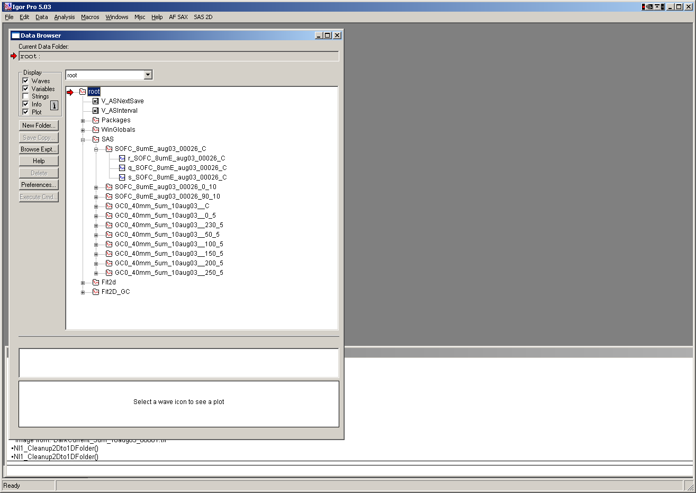

Output data
===========

QRS - Internal in Igor
----------------------

Data are internally stored (if selected) within Igor experiment in
folder root:SAS: in folders with

nameOfSample\_C being the circular average

nameOfSample\_Angle\_halfWidth being sector average around direction
Angle with sector half-width.

**The wave names**

*X-axis data*

**q\_NameOfSample\_C (or \_Angle\_halfWidth) q vector in A\ :sup:`-1`**

**t\_ NameOfSample\_C (or \_Angle\_halfWidth) 2 theta, if output with
respect to 2 theta**

**d\_ NameOfSample\_C (or \_Angle\_halfWidth) d for output wrt d**

*y axis data*

**r\_ NameOfSample\_C (or \_Angle\_halfWidth) intensity (if calibrated
in whatever units – thickness is converted to cm, so it should be
cm\ :sup:`-1`)**

*error*

**s\_ NameOfSample\_C (or \_Angle\_halfWidth) error for intensity**

*other*

**w\_ NameOfSample\_C (or \_Angle\_halfWidth) width of each bin of Q/d.2
theta.** This is for LUT output, and provides data for bin-width
smearing. Smaller number of bins, larger width of each. For linear
binning, this is same number and is (Max-Min/numOfPoits), but for log
binning this is varying function of bin position.

**For Line profile data:**

For example for GI\_Vertical line in my test case, this was the name:

gc\_saxs\_395\_\_GI\_VLp\_0.0077

“gc\_saxs\_395\_”…. Part of the name of used image

GI\_VLp\_.... GI\_Vertical Line

0.0077 …. *q\ :sub:`y`* value at which the data were calculated.

Exported data are Int, error, Q, qx, qy, qz columns with header and
column names

Saved data in Igor are

**r\_NameOfSample\_ProfileIndicator\_Qvalue** intensity

**q\_NameOfSample\_ProfileIndicator\_Qvalue** q [A:sup:`-1`]

**s\_NameOfSample\_ProfileIndicator\_Qvalue** error

**qy\_NameOfSample\_ProfileIndicator\_Qvalue** qy [A:sup:`-1`]

**qz\_NameOfSample\_ProfileIndicator\_Qvalue** qz [A:sup:`-1`]

**qx\_NameOfSample\_ProfileIndicator\_Qvalue** qx [A:sup:`-1`]
(generated ONLY if GI… profile is used)

Note, intensity wave has attached wave note, containing some useful
information:

CalibrationFormula=1\*((Sa2D));CurrentMaskFileName=A
mask\_mask;QvectorNumberPoints=300;CircularAverage=1;

ASCII export
------------

ASCII files with following data are stored in the selected folder:

# CalibrationFormula=1\*((Sa2D))

# CurrentMaskFileName=A mask\_mask

# QvectorNumberPoints=300

# AngularSector=150

# AngularHalfWidth=5

0.01601654 0 0

0.0163735 1537 39.20459

0.01655496 1467 38.30144

0.01673842 1416 999.0073

0.01692392 1505 38.79433

The columns contain first q, second intensity and third error…
